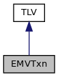
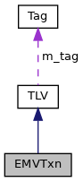

[Data Structures](#nested-classes) \| [Public Types](#pub-types) \| [Public Member Functions](#pub-methods) \| [Protected Member Functions](#pro-methods)

`#include <`<a href="sdiapi_2src_2sdiapi_2sdi__emv_8h_source.md">sdi_emv.h</a>`>`

Inheritance diagram for EMVTxn:

\[<a href="graph_legend.md">legend</a>\]

Collaboration diagram for EMVTxn:

\[<a href="graph_legend.md">legend</a>\]

|  |  |
|----|----|
| Data Structures |  |
| struct   | [Candidate](#structvfisdi_1_1_e_m_v_txn_1_1_candidate) |
| struct   | [CandidateExt](#structvfisdi_1_1_e_m_v_txn_1_1_candidate_ext) |
| struct   | [DomesticApp](#structvfisdi_1_1_e_m_v_txn_1_1_domestic_app) |
| struct   | [FallbackMSR](#structvfisdi_1_1_e_m_v_txn_1_1_fallback_m_s_r) |

|  |  |
|----|----|
| Public Types |  |
| typedef std::vector\< unsigned char \>  | [bytevector](#a64b5be62be31dcda165d2c6c3c262fb5) |

|  |  |
|----|----|
| Public Member Functions |  |
| bool  | [getIssuerID](#aefa82473aa949ff4b84b49636e15268b) (<a href="structvfisdi_1_1_array.md">Array</a>\< 4 \> &id) const |
| bool  | [setAID](#afa6ca2d77399d2db1c12d1ff7eeda01f) (const [bytevector](#a64b5be62be31dcda165d2c6c3c262fb5) &aid) |
| template\<unsigned N\> |  |
| bool  | [setAID](#a8f3822d556d2dc65cc8ebde4a87124f5) (const unsigned char(&v)\[N\]) |
| bool  | [getAID](#a23c0f9cbcb8eac7af6d7ef6a9701f2de) ([bytevector](#a64b5be62be31dcda165d2c6c3c262fb5) &aid) const |
| bool  | [getAppName](#a182e23eeefddc5125d3ce3b63a825815) (std::string &label) const |
| bool  | [getAgreedAppName](#a3e2e667cc1620a9e590dc9317a57bfc0) (std::string &name) const |
| bool  | [getPAN](#af197754c5472b1f365a0ff6b14191c90) (<a href="structvfisdi_1_1_array.md">Array</a>\< 10 \> &pan) const |
| bool  | [getAIP](#a22fb2842fa8fb5125f27e0ab61a4916f) (<a href="structvfisdi_1_1_array.md">Array</a>\< 2 \> &aip) const |
| bool  | [getDFName](#a0c3eb9c659b94c3c83d6fa52ee045f38) ([bytevector](#a64b5be62be31dcda165d2c6c3c262fb5) &name) const |
| bool  | [getApplicationPriorityID](#aa3822824c808b30140c9f88394839427) (unsigned char &id) const |
| bool  | [setAuthCode](#ab1ee5613275eaffc5e18e65f42d350ef) (const <a href="structvfisdi_1_1_array.md">Array</a>\< 6 \> &code) |
| bool  | [getAuthCode](#ab5e9d49d4a61b323c0718808dab185d3) (<a href="structvfisdi_1_1_array.md">Array</a>\< 6 \> &code) const |
| bool  | [setAuthResponseCode](#abfab8f80dd77da0a34452beb87450f77) (const <a href="structvfisdi_1_1_array.md">Array</a>\< 2 \> &auth) |
| bool  | [getAuthResponseCode](#acb7af559de0f1913e64b619b7b8bf0a9) (<a href="structvfisdi_1_1_array.md">Array</a>\< 2 \> &auth) const |
| bool  | [getCVMList](#a54d72993a2cac07bdb1b05cc10abb4fc) (<a href="structvfisdi_1_1_array.md">Array</a>\< 28 \> &list) const |
| bool  | [getTVR](#a86c9ddd3f7fceea21cd0dc5f0b48b4da) (<a href="structvfisdi_1_1_array.md">Array</a>\< 5 \> &tvr) const |
| bool  | [setTransactionDate](#a4d3fd172bf9b9f584c48367ee98f98e7) (const <a href="structvfisdi_1_1_array.md">Array</a>\< 3 \> &date) |
| bool  | [setTransactionDate](#a916a12d7c7b15f0b84dfbe1c77bfa1f8) (const std::string &date) |
| bool  | [getTransactionDate](#af73759646ee087fda4a944647c75bd1e) (<a href="structvfisdi_1_1_array.md">Array</a>\< 3 \> &date) const |
| bool  | [getTransactionDate](#a24da4d5f9d3575e0cefa69f2ff86dea6) (std::string &date) const |
| bool  | [getTransactionStatusInfo](#aae9a5ddf1de643b2eaffc7abe7df4b20) (<a href="structvfisdi_1_1_array.md">Array</a>\< 2 \> &status) const |
| bool  | [setTransactionType](#ad38f45424b98294f97b9246dd37d9bbf) (unsigned char type) |
| bool  | [getTransactionType](#a103b9c2fa2c6075082ed0fe02496164c) (unsigned char &type) const |
| bool  | [setCtlsLEDState](#a25867e91d5e2d73f8673548c41cfce91) (unsigned char state) |
| bool  | [getCtlsLEDState](#af3a8a6ee3b1c667e4ab5b7be3749699f) (unsigned char &state) const |
| bool  | [setServerPollTimeout](#a6f4eb4aaf10f0708dde18271fcf0e8de) (unsigned char tout) |
| bool  | [getServerPollTimeout](#a05b24e2f23267e4ba665e21d60ae4fd3) (unsigned char &tout) const |
| bool  | [setBeepScenario](#a2293f21102af94e846adb15491807f91) (unsigned char bs) |
| bool  | [getBeepScenario](#a8f463c85de1a0ca552942ed68167f508) (unsigned char &bs) const |
| bool  | [getCardholderName](#a7e2e8088a66943208867d9bb95f22114) (std::string &name) const |
| bool  | [setExpirationDate](#a78378a9ad813ee879281f0cb1a5c22d2) (const <a href="structvfisdi_1_1_array.md">Array</a>\< 3 \> &date) |
| bool  | [getExpirationDate](#ae16935dc1e17bbaa1de7aaf93e1aa200) (<a href="structvfisdi_1_1_array.md">Array</a>\< 3 \> &date) const |
| bool  | [getEffectiveDate](#aab6007b9544521c765ee365f4e3e4297) (<a href="structvfisdi_1_1_array.md">Array</a>\< 3 \> &date) const |
| bool  | [getEffectiveDate](#a2c12d3f69ef23adb6bff6191b80c3fe0) (std::string &date) const |
| bool  | [setIssuerCountryCode](#a212164fd96c64f4e81e11d101ec1dd2f) (unsigned short country) |
| bool  | [getIssuerCountryCode](#a5680b103f0e5a6ddf6635a307bd9ef16) (unsigned short &country) const |
| bool  | [setTransactionCurrency](#a4de424306b728dc26ef8e9bd286b3869) (<a href="namespacevfisdi.md#a59f74bf9ae55ffd390b8806b2559021c">Currency</a> currency) |
| bool  | [getTransactionCurrency](#a7034b34fd69701b07a04477dd8a05c7d) (<a href="namespacevfisdi.md#a59f74bf9ae55ffd390b8806b2559021c">Currency</a> &currency) const |
| bool  | [setTransactionCurrency](#a249190029aeeb1d5dfe563a730cee322) (int currency) |
| bool  | [getTransactionCurrency](#ad79f4105407ee8e94477b65584b185f9) (int &currency) const |
| bool  | [getLanguagePreference](#a531768c4057ce865f80a5d10b9f30dc9) (std::string &lang) const |
| bool  | [getServiceCode](#ac3bc9df20cc108a48a815bb3ac12d12c) (<a href="structvfisdi_1_1_array.md">Array</a>\< 2 \> &code) const |
| bool  | [getPANSequenceNumber](#a0d39362259bf38a77deed79a2859051b) (<a href="classvfisdi_1_1_b_c_d.md">BCD</a>\< 1 \> &num) const |
| bool  | [getPANSequenceNumber](#a9ddb30e5c8449ac956c5fb23332c7ce7) (int &num) const |
| bool  | [setTransactionCurrencyExp](#a14b479242c47c4fb95ba179b4ffc1fd0) (unsigned char exp) |
| bool  | [getTransactionCurrencyExp](#a6067411ff4ac08ed983b918f83910a80) (unsigned char &exp) const |
| bool  | [setAccountType](#ad75e8a88a01622379a242d0e0f629350) (unsigned char type) |
| bool  | [getAccountType](#a3999a26395349ca33d1fed1027edd1b7) (unsigned char &type) const |
| bool  | [setAmount](#a29ea8e420c17b5aec59fe58ab2953063) (const <a href="classvfisdi_1_1_b_c_d.md">BCD</a>\< 6 \> &amount) |
| bool  | [setAmount](#af9a5a22e4c5e805a981c96611ba66a84) (int64_t amount) |
| bool  | [getAmount](#a22c01e4c5ed7df6d063634951268e4e8) (<a href="classvfisdi_1_1_b_c_d.md">BCD</a>\< 6 \> &amount) const |
| bool  | [getAmount](#a9c8f1c907166321d13b1ba4edf3d7db2) (int64_t &amount) const |
| bool  | [setCashbackAmount](#a43a41c9ee1f9ff39f8bfe7a602cbc93d) (const <a href="classvfisdi_1_1_b_c_d.md">BCD</a>\< 6 \> &amount) |
| bool  | [setCashbackAmount](#ad03314c9e1a1a1f0604ac9379ff8e01f) (int64_t amount) |
| bool  | [getCashbackAmount](#adce2b48499554625d4a5d0d312ea4dd0) (<a href="classvfisdi_1_1_b_c_d.md">BCD</a>\< 6 \> &amount) const |
| bool  | [getCashbackAmount](#a9f203b05014b9d3d05670a8c0d940cc6) (int64_t &amount) const |
| bool  | [getTerminalAID](#a1954efebbe554d727777b029942e18e8) ([bytevector](#a64b5be62be31dcda165d2c6c3c262fb5) &aid) const |
| bool  | [getKernelAppVersionNumber](#ae1df5edafde84d7d286df2ee99e80b43) (<a href="structvfisdi_1_1_array.md">Array</a>\< 2 \> &version) const |
| bool  | [getChipAppVersionNumber](#a2bb11f40972b297942652292237ca595) (<a href="structvfisdi_1_1_array.md">Array</a>\< 2 \> &version) const |
| bool  | [getASRPD](#a5e26345283b02364b4f2ad5b55500e3d) ([bytevector](#a64b5be62be31dcda165d2c6c3c262fb5) &asrpd) const |
| bool  | [getCardholderNameExt](#a1bc527fc41230f941d0b5d864622fa0a) (std::string &name) const |
| bool  | [getIACDefault](#ac353b92a5cb3c0f609a39938154cea9c) (<a href="structvfisdi_1_1_array.md">Array</a>\< 5 \> &iac) const |
| bool  | [getIACDenial](#a713b329b9095d82fb9b2a9f5570700ad) (<a href="structvfisdi_1_1_array.md">Array</a>\< 5 \> &iac) const |
| bool  | [getIACOnline](#aff7585557f19d64883a64d324b515cd3) (<a href="structvfisdi_1_1_array.md">Array</a>\< 5 \> &iac) const |
| bool  | [getIssuerAppData](#a39dedefcccb5eba27709d4940a87ad3c) ([bytevector](#a64b5be62be31dcda165d2c6c3c262fb5) &idata) const |
| bool  | [getIssuerCodeTableID](#a9604daa5bfb0224c833ecfc8ab908268) (unsigned char &id) const |
| bool  | [getPreferredName](#a7ae5f1582eaa174218ec309ff2c64b2c) (std::string &label) const |
| bool  | [getMerchantID](#a292dea077b233ee2dbc2dc679951cef3) (std::string &mid) const |
| bool  | [getTerminalCountryCode](#a7fdcd205b403d55f1c70e60b77d4b4c7) (unsigned short &country) const |
| bool  | [setFloorLimit](#ab595e9743cf110f2b3f50171ebc00d01) (const <a href="classvfisdi_1_1_b_c_d.md">BCD</a>\< 6 \> &limit) |
| bool  | [setFloorLimit](#aa515b4e613db7aadde9b59ca6a4d6e1b) (int64_t limit) |
| bool  | [getFloorLimit](#aa4ca8e0f280cf96e95ebaaa7144896ee) (<a href="classvfisdi_1_1_b_c_d.md">BCD</a>\< 6 \> &limit) const |
| bool  | [getFloorLimit](#a80a7761ccbbe9d48abe26a9bb845c590) (int64_t &limit) const |
| bool  | [getIFDSerial](#a32be7437a7f7ac177dd68832ea31f0f7) (<a href="structvfisdi_1_1_array.md">Array</a>\< 8 \> &serial) const |
| bool  | [setTransactionTime](#af69bcffc5b953e56fcb5e4753859fd6a) (const <a href="structvfisdi_1_1_array.md">Array</a>\< 3 \> &time) |
| bool  | [setTransactionTime](#a75ce81e3dc70a7e166fffcc59de9173d) (const std::string &time) |
| bool  | [getTransactionTime](#a8179180d62d99c64643fa0fdc4f8a996) (<a href="structvfisdi_1_1_array.md">Array</a>\< 3 \> &time) const |
| bool  | [getTransactionTime](#a48481357d16a0e96af1c0c90c2761cf0) (std::string &time) const |
| bool  | [setCryptogram](#a16554128021353039e14db07f15a2ddc) (const <a href="structvfisdi_1_1_array.md">Array</a>\< 8 \> &crypt) |
| bool  | [getCryptogram](#a20aa9f38f4f2ab80a2d3c699435722d3) (<a href="structvfisdi_1_1_array.md">Array</a>\< 8 \> &crypt) const |
| bool  | [getCryptogramInfo](#a52d2d97a72ddcddc9f6ff252dbe15da0) (unsigned char &info) const |
| bool  | [getTerminalCapabilities](#a69f4d7f026f4298506088e080dbc332d) (<a href="structvfisdi_1_1_array.md">Array</a>\< 3 \> &caps) const |
| bool  | [getCVMResults](#ac3a6ba6bc1ae0675ed42e05ed60bc8a5) (<a href="structvfisdi_1_1_array.md">Array</a>\< 3 \> &cvmr) const |
| bool  | [getTerminalType](#a41858348eb0babcc5e7ee61aaa31fcb4) (unsigned char &type) const |
| bool  | [getATC](#af5a86e852a3fc9ebf21c5b6354643b24) (<a href="structvfisdi_1_1_array.md">Array</a>\< 2 \> &atc) const |
| bool  | [setUnpredictableNumber](#a3869e44318fae7a974d076eadf1acd18) (unsigned num) |
| bool  | [getUnpredictableNumber](#a4cf2ff328e95fda0733f01f09412c971) (unsigned &num) const |
| bool  | [getPOSEntryMode](#af0a7d48a059d253f4595690d55f38a35) (unsigned char &mode) const |
| bool  | [getAdditionalCapabilities](#a2742ef7d2429c0fe340bc29c046cae3c) (<a href="structvfisdi_1_1_array.md">Array</a>\< 5 \> &caps) const |
| bool  | [setTransactionCounter](#acca2b99537fec06f0d1803c3a1702306) (const <a href="classvfisdi_1_1_b_c_d.md">BCD</a>\< 4 \> &counter) |
| bool  | [setTransactionCounter](#a9f25e3917ff526c226ce8650220e3e8f) (int counter) |
| bool  | [getTransactionCounter](#aa760cfd80c28476a0678c6ab4a0f9b33) (<a href="classvfisdi_1_1_b_c_d.md">BCD</a>\< 4 \> &counter) const |
| bool  | [getTransactionCounter](#aa43b13b1b74b3db4ac007843fe015a52) (int &counter) const |
| bool  | [setApplicationCurrency](#a855c849eaf29dfbaa486b9c88926f900) (<a href="namespacevfisdi.md#a59f74bf9ae55ffd390b8806b2559021c">Currency</a> currency) |
| bool  | [getApplicationCurrency](#abb508a1ad820ae3ab9c3dab443a395c0) (<a href="namespacevfisdi.md#a59f74bf9ae55ffd390b8806b2559021c">Currency</a> &currency) const |
| bool  | [getDataAuthCode](#a470a51213e4f7d39f5083c8c1b45242d) (<a href="structvfisdi_1_1_array.md">Array</a>\< 2 \> &code) const |
| bool  | [getICCDynamicNumber](#a85904ca2d6cdfa3d52a94d56ab209c20) ([bytevector](#a64b5be62be31dcda165d2c6c3c262fb5) &dn) const |
| bool  | [getTransactionCategory](#a11e7e5dc1f9dc1cb95a86ee7b25f841f) (unsigned char &cat) const |
| bool  | [getAvailableOfflineAmount](#a12edb21c2efea9b114daecba99dfd37d) (<a href="classvfisdi_1_1_b_c_d.md">BCD</a>\< 6 \> &amount) const |
| bool  | [getAvailableOfflineAmount](#ac8ff2f6f3f188487a3ff986c59931405) (int64_t &amount) const |
| bool  | [getTransactionQualifier](#a963ccd93741c4a44bd2a26a4cd3eecab) (<a href="structvfisdi_1_1_array.md">Array</a>\< 4 \> &q) const |
| bool  | [setVisaCTQ](#a61443ab6abf864d689c07d9919bcd83d) (const <a href="structvfisdi_1_1_array.md">Array</a>\< 2 \> &ctq) |
| bool  | [getVisaCTQ](#add4de43f37019b053e243bc8579fafce) (<a href="structvfisdi_1_1_array.md">Array</a>\< 2 \> &ctq) const |
| bool  | [setMasterAID](#a73c791c477ee3e571afad9c694719f0d) (const [bytevector](#a64b5be62be31dcda165d2c6c3c262fb5) &aid) |
| template\<unsigned N\> |  |
| bool  | [setMasterAID](#a0681983bab260a5f6ee31a0d6fa75d2f) (const unsigned char(&v)\[N\]) |
| bool  | [getMasterAID](#a9a9dea71749282886ef2471bcd3cc30a) ([bytevector](#a64b5be62be31dcda165d2c6c3c262fb5) &aid) const |
| bool  | [setBuildAppList](#a1e2c6e556b7fd4f9a0289e694836dcd3) (unsigned char opt) |
| bool  | [getBuildAppList](#a4e9557a4bf135beea3f0b9d2271bc3e6) (unsigned char &opt) const |
| bool  | [getReaderNumber](#ad108c15acfc6f0cff9b96b8c9f8962f3) (unsigned char &num) const |
| bool  | [getNonCriticalScriptResults](#a1a2856b4efea60b64e96bfdd994f975e) (std::vector\< <a href="structvfisdi_1_1_array.md">Array</a>\< 5 \> \> &results) const |
| bool  | [getCriticalScriptResults](#a500861c36527d46c22afd197ec0ab4c5) (std::vector\< <a href="structvfisdi_1_1_array.md">Array</a>\< 5 \> \> &results) const |
| bool  | [setFallbackMIDs](#aa873c4ba7490d4a915015730720cab44) (const <a href="structvfisdi_1_1_array.md">Array</a>\< 3 \> &mid) |
| bool  | [getFallbackMIDs](#a575a64e54ab99e140150e09888007bc2) (<a href="structvfisdi_1_1_array.md">Array</a>\< 3 \> &mid) const |
| bool  | [setEMVFallback](#a7a402df3400009a6e11f0a2e21a4d81f) (unsigned char fb) |
| bool  | [getEMVFallback](#ae9a523919303b0a5213bbea4f8035e5c) (unsigned char &fb) const |
| bool  | [getObfuscatedPAN](#afaa7438c803c0819b686b5b1ec148f75) ([bytevector](#a64b5be62be31dcda165d2c6c3c262fb5) &pan) const |
| bool  | [getObfuscatedTrack2](#a62e8644ecc2855893c70d0ebb09d4e8c) ([bytevector](#a64b5be62be31dcda165d2c6c3c262fb5) &track) const |
| bool  | [setTACDenial](#a1fbe09894edee9a9defb6392bf9b0d4c) (const <a href="structvfisdi_1_1_array.md">Array</a>\< 5 \> &tac) |
| bool  | [getTACDenial](#ac315853ec5525af2be4c64f080aeb387) (<a href="structvfisdi_1_1_array.md">Array</a>\< 5 \> &tac) const |
| bool  | [setTACOnline](#a54adce7113b725b91b03bc4196f373e5) (const <a href="structvfisdi_1_1_array.md">Array</a>\< 5 \> &tac) |
| bool  | [getTACOnline](#aafd3a4332acc0a0d47f268fff2d58e51) (<a href="structvfisdi_1_1_array.md">Array</a>\< 5 \> &tac) const |
| bool  | [setTACDefault](#aa16dc8da02807d622670272a08e83180) (const <a href="structvfisdi_1_1_array.md">Array</a>\< 5 \> &tac) |
| bool  | [getTACDefault](#ac7fc5757e37d02f050b8ac83eb859195) (<a href="structvfisdi_1_1_array.md">Array</a>\< 5 \> &tac) const |
| bool  | [setThreshold](#a2dec606c02b9ae63632f58cc782f1f6d) (unsigned th) |
| bool  | [getThreshold](#ac262cb7820834aff81225314a6c86ad0) (unsigned &th) const |
| bool  | [setSpecialTransactions](#ae4fd867a3e4118251e40456cc288d972) (const <a href="classvfisdi_1_1_e_m_v_special_transactions.md">EMVSpecialTransactions</a> &tx) |
| bool  | [getSpecialTransactions](#a0e4a0afe63161c7252abc9d7bfc3b559) (<a href="classvfisdi_1_1_e_m_v_special_transactions.md">EMVSpecialTransactions</a> &tx) const |
| bool  | [setLanguage](#a45a58c1db43de5b3cbdea58c7a5436f8) (unsigned char info) |
| bool  | [getLanguage](#acb82c044458a9d0e4bd55948ab942085) (unsigned char &info) const |
| bool  | [setTextID](#af69b45fb4b708150223c6d9776ce224b) (unsigned char id) |
| bool  | [getTextID](#afeeeb276905b1880e5b4b9d429cd2d01) (unsigned char &id) const |
| bool  | [getBalanceBefore](#a06f9976eaa34a0387333a64f9b095a94) (<a href="classvfisdi_1_1_b_c_d.md">BCD</a>\< 6 \> &amount) const |
| bool  | [getBalanceBefore](#aa1c9d570b0dcdb37369eb69afae8a066) (int64_t &amount) const |
| bool  | [getDefaultAppName](#a27002271f09298ae87fa9b98ae710198) (std::string &appname) const |
| bool  | [getApplicationLabel](#aef3494c3a118d2b57bdc4a7315230d01) (std::string &appname) const |
| bool  | [setAmountConfirmation](#ae44d6104806e03e6822b52c1cb629364) (unsigned char when) |
| bool  | [getAmountConfirmation](#a132e52525a1aa036d991705bacc45349) (unsigned char &when) const |
| bool  | [setTransactionOptions](#a09223f88e07551e197d6abdb5c6eb132) (const <a href="structvfisdi_1_1_array.md">Array</a>\< 5 \> &opt) |
| bool  | [setTransactionOptions](#a1b9fabcd648e4482c4ff80cdf4e063dc) (const <a href="namespacevfisdi.md#aa3b8e383f2f4b4a88300bbeb10f423bb">EMVTransactionOptions</a> &opt) |
| bool  | [getTransactionOptions](#a6be085e07dfd7589eb3f0804cb7cac55) (<a href="structvfisdi_1_1_array.md">Array</a>\< 5 \> &opt) const |
| bool  | [getTransactionOptions](#a5b6922659bb65ad81fbc1d70fb2dd147) (<a href="namespacevfisdi.md#aa3b8e383f2f4b4a88300bbeb10f423bb">EMVTransactionOptions</a> &opt) const |
| bool  | [setTransactionSteps](#aba1b8f48adf11970673a546a9b55e59d) (const <a href="structvfisdi_1_1_array.md">Array</a>\< 3 \> &step) |
| bool  | [setTransactionSteps](#ab2cb0d3128b548d52a436f83b170a337) (const <a href="namespacevfisdi.md#ab48783102ea080d5f86d54616950c195">EMVTransactionSteps</a> &step) |
| bool  | [getTransactionSteps](#ae54c5207a3697f4de625ef511533d2a7) (<a href="structvfisdi_1_1_array.md">Array</a>\< 3 \> &step) const |
| bool  | [getTransactionSteps](#a46dc90ec3e077f136c0159f89e6a6ce0) (<a href="namespacevfisdi.md#ab48783102ea080d5f86d54616950c195">EMVTransactionSteps</a> &step) const |
| bool  | [getBalanceAfter](#a3c63786f906e758de9a94a0ed53865d3) (<a href="classvfisdi_1_1_b_c_d.md">BCD</a>\< 6 \> &amount) const |
| bool  | [getBalanceAfter](#a484ed2999de2327fa55ce83300531e4a) (int64_t &amount) const |
| bool  | [setDCCInfo](#ae7e98270a763d0d13dd7a4b6a48caee3) (const <a href="structvfisdi_1_1_array.md">Array</a>\< 3 \> &info) |
| bool  | [getDCCInfo](#a205a0948d9094865e35128eeda5b54e1) (<a href="structvfisdi_1_1_array.md">Array</a>\< 3 \> &info) const |
| bool  | [setFallbackMSROptions](#a1035db5058ce4118849df434f192c91b) (unsigned char opt) |
| bool  | [getFallbackMSROptions](#abf9bbb55fa6526c53e801c0e0e3d4857) (unsigned char &opt) const |
| bool  | [setForceOnline](#a2c7ffcfb5edcf7c4d7d31f50e7ff83a2) (unsigned char force) |
| bool  | [getForceOnline](#af46be7c7b03dd7b59a73998e96325522) (unsigned char &force) const |
| bool  | [setPINBypass](#a405b374ab2d4175d087053332d6671a5) (bool bypass) |
| bool  | [getPINBypass](#a311265f562ab91000db77f8952991a89) (bool &bypass) const |
| bool  | [getEMVStatus](#af478ef9501e0eb25ef20935166934fe2) (unsigned &status) const |
| bool  | [setForceAccept](#ac1c4bda81cb538548ff1ef4ad84f2549) (unsigned char force) |
| bool  | [getForceAccept](#a12943982462ac554ae9b2f7b4d7d1b93) (unsigned char &force) const |
| bool  | [setNoDirectorySelect](#a9ca508c1a8ffe02d64199ae7cb6f8c85) (unsigned char nodir) |
| bool  | [getNoDirectorySelect](#a1fb6358d25dc629af023f05b75b1d32b) (unsigned char &nodir) const |
| bool  | [setPreselectedLanguage](#a92c3055d5b39bf82ab545eba378e0ef0) (unsigned char lang) |
| bool  | [getPreselectedLanguage](#a2c0cc0ad0faaa17a338bc3680025b040) (unsigned char &lang) const |
| bool  | [setOnlineSwitch](#a05eb50321cac8cd0d99642cf6da75310) (unsigned char online) |
| bool  | [getOnlineSwitch](#a86b9ca681d4d202029fe93bd037d3a6e) (unsigned char &online) const |
| bool  | [setNoCardholderConfirm](#a7e1e62a0180a27669cdd811035869d32) (unsigned char conf) |
| bool  | [getNoCardholderConfirm](#af13541a4a2218804363a6ef228644644) (unsigned char &conf) const |
| bool  | [setEMVPassthrough](#a7ae0d3ed2397780899cfc5faf7ef8abd) (unsigned char ep) |
| bool  | [getEMVPassthrough](#a1121f832e91848d76d6055ea16af5252) (unsigned char &ep) const |
| bool  | [getPDOLInfo](#abdf58ceaf36c76d5b0ea1bdfa37ce330) (unsigned char &info) const |
| bool  | [getCardType](#a44cb3616647b6bc5f62353bf4eb0abb9) (unsigned char &type) const |
| bool  | [setOnlineResult](#aca7bd5476ce3431b939cb0cea83e4c57) (bool result) |
| bool  | [getOnlineResult](#a6abfaed15e3e3c15ee1bc892145df49f) (bool &result) const |
| bool  | [setVoiceReferral](#ab0ff0ac5ad94d7742c1fd2349aac571f) (bool result) |
| bool  | [getVoiceReferral](#af82273b369d92d066a458c559d43bbba) (bool &result) const |
| bool  | [setAuthData](#ac8331d2f06776b97f255ed2f4890eed3) (const [bytevector](#a64b5be62be31dcda165d2c6c3c262fb5) &data) |
| template\<unsigned N\> |  |
| bool  | [setAuthData](#a053bd18427ce543edba85a662f22f060) (const unsigned char(&v)\[N\]) |
| bool  | [getAuthData](#a436cd8b24a0185a8132b08dfa820ca53) ([bytevector](#a64b5be62be31dcda165d2c6c3c262fb5) &data) const |
| bool  | [setCriticalScript](#ac41876dbd49f59fd423332a3a0c7d077) (const [bytevector](#a64b5be62be31dcda165d2c6c3c262fb5) &script) |
| template\<unsigned N\> |  |
| bool  | [setCriticalScript](#a835336e6f07e02510f68fe21b2ab3107) (const unsigned char(&v)\[N\]) |
| bool  | [getCriticalScript](#a7ec119f656ae474e27640949fa83c2e6) ([bytevector](#a64b5be62be31dcda165d2c6c3c262fb5) &script) const |
| bool  | [setNonCriticalScript](#af2edf9d69099e0fa4779724b2459c217) (const [bytevector](#a64b5be62be31dcda165d2c6c3c262fb5) &script) |
| template\<unsigned N\> |  |
| bool  | [setNonCriticalScript](#a7d2b6e37f9793a888faab0fbbecf9e99) (const unsigned char(&v)\[N\]) |
| bool  | [getNonCriticalScript](#a6c1426d9f6a529c4e86e333c6342652f) ([bytevector](#a64b5be62be31dcda165d2c6c3c262fb5) &script) const |
| bool  | [setAuthResponseReferral](#a52fecf0643155872da0c0236c89d453f) (const <a href="structvfisdi_1_1_array.md">Array</a>\< 2 \> &ac) |
| bool  | [getAuthResponseReferral](#a3efe3a14d848339e0b0d45f130d20eef) (<a href="structvfisdi_1_1_array.md">Array</a>\< 2 \> &ac) const |
| bool  | [setAuthResponseSwitch](#ac86ebed11e6840694b67f56dad02010e) (const <a href="structvfisdi_1_1_array.md">Array</a>\< 2 \> &resp) |
| bool  | [getAuthResponseSwitch](#adb1133473b905ea63ebac64001f21507) (<a href="structvfisdi_1_1_array.md">Array</a>\< 2 \> &resp) const |
| bool  | [setAuthResponseWrongPIN](#ae2de2d2de85e052447537fc2d9c64d0c) (const <a href="structvfisdi_1_1_array.md">Array</a>\< 2 \> &ac) |
| bool  | [getAuthResponseWrongPIN](#ab5bf99b7d794044cf2c7a26c4780b6c8) (<a href="structvfisdi_1_1_array.md">Array</a>\< 2 \> &ac) const |
| bool  | [setAuthResponseOnlinePIN](#afcaa99513fcfbc7ee10a4f020670cc88) (const <a href="structvfisdi_1_1_array.md">Array</a>\< 2 \> &resp) |
| bool  | [getAuthResponseOnlinePIN](#a22fbd08d67c102a8cf8d40d9d91724c3) (<a href="structvfisdi_1_1_array.md">Array</a>\< 2 \> &resp) const |
| bool  | [setAdditionalResponseOK](#a53260cf3f6a6f515a87ac768aaabd84b) (const <a href="structvfisdi_1_1_array.md">Array</a>\< 2 \> &ac) |
| bool  | [getAdditionalResponseOK](#a5ac63ddb2ab3cd5578212be03df2be77) (<a href="structvfisdi_1_1_array.md">Array</a>\< 2 \> &ac) const |
| bool  | [setWriteDSData](#a744b89076d4b8d940366949be7eb9305) (const [bytevector](#a64b5be62be31dcda165d2c6c3c262fb5) &dsdata) |
| bool  | [getWriteDSData](#af34b96d0cf583e31954dc1f29b0cad06) ([bytevector](#a64b5be62be31dcda165d2c6c3c262fb5) &dsdata) const |
| bool  | [setOfflinePINErrors](#ac0e3bbabeb6b7d22202f60a4c1b40d6c) (unsigned char errors) |
| bool  | [getOfflinePINErrors](#a032a8c4116be90bbf3f5bbf719b826d1) (unsigned char &errors) const |
| bool  | [setWriteDataStoragedData](#a90947c3c3dc3aa0414356665b8d0b779) (const [bytevector](#a64b5be62be31dcda165d2c6c3c262fb5) &data) |
| bool  | [getWriteDataStoragedData](#a77f6627d8006dba36b1257cb573da0f1) ([bytevector](#a64b5be62be31dcda165d2c6c3c262fb5) &data) const |
| bool  | [setDCCForbidden](#ab979f0229fa56d8f129bf460ddd829d3) (unsigned char dcc) |
| bool  | [getDCCForbidden](#a144090e0b69e080ede7c81f0daea9db6) (unsigned char &dcc) const |
| bool  | [setDomesticInfo](#a7d3b373115ea12cdb46e12d92948ace9) (const <a href="structvfisdi_1_1_array.md">Array</a>\< 3 \> &info) |
| bool  | [getDomesticInfo](#a5e60496d442d9d7033705ae88135adfc) (<a href="structvfisdi_1_1_array.md">Array</a>\< 3 \> &info) const |
| bool  | [setDomesticOptions](#adde548042475cc7703d3bad11e31f7ae) (const <a href="structvfisdi_1_1_array.md">Array</a>\< 3 \> &opt) |
| bool  | [setDomesticOptions](#aecdedce81adcf0d06dbafa6aa016af7b) (const <a href="namespacevfisdi.md#a7fcca20a9f7822f498e8019bb6418bd9">EMVDomesticOptions</a> &opt) |
| bool  | [getDomesticOptions](#ab0c5b96907eb40cde7b21dd2ea3e4a0b) (<a href="structvfisdi_1_1_array.md">Array</a>\< 3 \> &opt) const |
| bool  | [getDomesticOptions](#a1e17455340cacff127821b5ef54d9e81) (<a href="namespacevfisdi.md#a7fcca20a9f7822f498e8019bb6418bd9">EMVDomesticOptions</a> &opt) const |
| bool  | [setVelocityOriginalIndex](#a9f5db021c26e6e09c9c4f28af2fb8dae) (unsigned char idx) |
| bool  | [getVelocityOriginalIndex](#a2079cfba6d4c7d14f622b289834c8b15) (unsigned char &idx) const |
| bool  | [getErrorData](#ad6e06a14b08a30d6f666af7c7c4e9685) (<a href="structvfisdi_1_1_array.md">Array</a>\< 15 \> &error) const |
| bool  | [getDisplayTextIndex](#ab0ec6694cb4d96a12749a7b5fbb3c21e) (unsigned char &id) const |
| bool  | [setVelocityProcessingResultBitmap](#a07edd1a4c2600dd60cf56915fdc072af) (const <a href="structvfisdi_1_1_array.md">Array</a>\< 3 \> &bm) |
| bool  | [getVelocityProcessingResultBitmap](#a749bdbbf03f56f76c09eda7a27971eca) (<a href="structvfisdi_1_1_array.md">Array</a>\< 3 \> &bm) const |
| bool  | [getKernelDebug](#a4686bc70b512e3915065ac1028ba9b5d) ([bytevector](#a64b5be62be31dcda165d2c6c3c262fb5) &debug) const |
| bool  | [setExcludeAID](#a94799e03509a55a5bd304a62a7158786) (const std::vector\< [bytevector](#a64b5be62be31dcda165d2c6c3c262fb5) \> &aid) |
| bool  | [getExcludeAID](#a47d09026694a2553f0eccafe64a94aff) (std::vector\< [bytevector](#a64b5be62be31dcda165d2c6c3c262fb5) \> &aid) const |
| bool  | [setExcludeCombos](#a8e7526e928d48fee13f86d3f751bada8) (const std::vector\< std::pair\< [bytevector](#a64b5be62be31dcda165d2c6c3c262fb5), <a href="structvfisdi_1_1_array.md">Array</a>\< 3 \> \> \> &combos) |
| bool  | [setCardholderInfo](#a405d6b2d43254a924ce064f59bb734a7) (unsigned char info) |
| bool  | [getCardholderInfo](#a9b97f6a2b9fe084931177cf7f03f3774) (unsigned char &info) const |
| bool  | [setMerchantInfo](#aed97b31ce5e56786f1c987fc2dd1ff4b) (unsigned char info) |
| bool  | [getMerchantInfo](#a5fa1cf34f3661c1175ccf34fe6d7f460) (unsigned char &info) const |
| bool  | [setConfirmAmount](#a0bede37c87ca5f34358dbda81df2c479) (bool confirm) |
| bool  | [getConfirmAmount](#a98560d083a184e5b1900ae3c73a79f05) (bool &confirm) const |
| bool  | [setPANInBlacklist](#a0413bb0ee5e86390630af1939fd43c67) (unsigned char contained) |
| bool  | [getPANInBlacklist](#aee901538b215c198a6e2998bcc566597) (unsigned char &contained) const |
| bool  | [setStoredAmount](#a8f016343f4e695efd1709454240cd64b) (const <a href="classvfisdi_1_1_b_c_d.md">BCD</a>\< 6 \> &amount) |
| bool  | [setStoredAmount](#a1f6a2eb5d4146eeeeb5eb56dba4e5673) (int64_t amount) |
| bool  | [getStoredAmount](#a32f6b02c313ee2f22ca1e8716589323b) (<a href="classvfisdi_1_1_b_c_d.md">BCD</a>\< 6 \> &amount) const |
| bool  | [getStoredAmount](#ac621377f84d887f97e5ae692303432ff) (int64_t &amount) const |
| bool  | [setSelector](#a8124deb63208158d872bfafb2bd9ef67) (unsigned char sel) |
| bool  | [getSelector](#aa2b3afdd4d652d7657a240966390dc98) (unsigned char &sel) const |
| bool  | [setReducedCanditateList](#adb0a839b6188b5ff12f1f448950210e2) (const [bytevector](#a64b5be62be31dcda165d2c6c3c262fb5) &cl) |
| template\<unsigned N\> |  |
| bool  | [setReducedCanditateList](#af100bad77dfdbf440cbc73d33b94b22f) (const unsigned char(&v)\[N\]) |
| bool  | [getReducedCanditateList](#a5a0c9f62d152119b0214ab09e8e2d6bc) ([bytevector](#a64b5be62be31dcda165d2c6c3c262fb5) &cl) const |
| bool  | [setModifyTransaction](#a80430a5a50816b94951f1986d1561a11) (unsigned char m) |
| bool  | [getModifyTransaction](#aaf5186dbe316fa7c96b5be1e1a7ac787) (unsigned char &m) const |
| bool  | [setSkipPostprocessing](#a1438ef92103dc7875a844702f0e6ec4b) (unsigned char skip) |
| bool  | [getSkipPostprocessing](#a7bc54c742de0706deb34587b1731e188) (unsigned char &skip) const |
| bool  | [setPINInfo](#ad66faf15b1d87e92ba62865a79a6435a) (unsigned char info) |
| bool  | [getPINInfo](#a34de756e5e70e2d2198e436fbcb6e393) (unsigned char &info) const |
| bool  | [setPINPublicModulus](#abcf48233212282df3f1c1f642c4a2a16) (const [bytevector](#a64b5be62be31dcda165d2c6c3c262fb5) &modulus) |
| template\<unsigned N\> |  |
| bool  | [setPINPublicModulus](#a2e10866f123a7e525c912954376c1e02) (const unsigned char(&v)\[N\]) |
| bool  | [getPINPublicModulus](#a2173a5991bbcf3fc80d79b48687d74eb) ([bytevector](#a64b5be62be31dcda165d2c6c3c262fb5) &modulus) const |
| bool  | [setPINPublicExponent](#a482ffd050a25650047e38d921e6dd9b8) (unsigned modulus) |
| bool  | [getPINPublicExponent](#a917c8600fe72e809e0ca9882633fd62b) (unsigned &modulus) const |
| bool  | [setDCCMode](#a84692cb17a083a269110eeb9a0896ba2) (unsigned char mode) |
| bool  | [getDCCMode](#aa1cfb658afb96b40857d4a2c7c09fb51) (unsigned char &mode) const |
| bool  | [setDomesticAppResult](#a7e2b1c600b0523e43fbc275234240be5) (unsigned char res) |
| bool  | [getDomesticAppResult](#ae28be2bd10580f80921c7e043224eeb8) (unsigned char &res) const |
| bool  | [setKernelToUse](#a37d22986e07ddd7797f7e32aac36d819) (const <a href="structvfisdi_1_1_array.md">Array</a>\< 3 \> &kernel) |
| bool  | [getKernelToUse](#ab5b07272f42a1358d8148094fb642782) (<a href="structvfisdi_1_1_array.md">Array</a>\< 3 \> &kernel) const |
| bool  | [setCommunicationError](#ab4a2a0c5a7c0a11a315bdf3e66b60f9f) (unsigned char err) |
| bool  | [getCommunicationError](#ada86b988154ec921f2c490d3f27bdf74) (unsigned char &err) const |
| bool  | [getDestination](#a169b4e5d8a9f7d5bf5d949a89eba16b9) (int &dest) const |
| bool  | [setDataExchangeRequest](#a48a2af9e2722714d5547b22d2ecd6f2c) (unsigned char req) |
| bool  | [getDataExchangeRequest](#afc52e2d634005fe7a73a279b01132e13) (unsigned char &req) const |
| bool  | [setDataExchangeState](#a1ab64a7c79082a5b1325de6879ae8a7e) (unsigned char state) |
| bool  | [getDataExchangeState](#a97008084cf99268fc203c8559debe86f) (unsigned char &state) const |
| bool  | [setDataExchangeMode](#a7a1496238583825b8edc305e9a546d5d) (unsigned char state) |
| bool  | [getDataExchangeMode](#a62681ec8b6d35b0d4d0bd534c05a99b2) (unsigned char &state) const |
| bool  | [setDataExchangeDataNeeded](#a77f41dc63f292bc2a3db17668d4a2e4d) (const [bytevector](#a64b5be62be31dcda165d2c6c3c262fb5) &dn) |
| template\<unsigned N\> |  |
| bool  | [setDataExchangeDataNeeded](#a8c003f308feae67c5101f596aeffdb1c) (const unsigned char(&v)\[N\]) |
| bool  | [getDataExchangeDataNeeded](#ab3905706a0e0838442335571a8aab794) ([bytevector](#a64b5be62be31dcda165d2c6c3c262fb5) &dn) const |
| bool  | [setModifiedCandidates](#af74ac98d87d6290dcb604cd8662578a1) (const [bytevector](#a64b5be62be31dcda165d2c6c3c262fb5) &cand) |
| template\<unsigned N\> |  |
| bool  | [setModifiedCandidates](#abb1ccb9c8d4d13cb724627ce087ee711) (const unsigned char(&v)\[N\]) |
| bool  | [getModifiedCandidates](#a236a19c333f73e5f8cfb81993f6df322) ([bytevector](#a64b5be62be31dcda165d2c6c3c262fb5) &cand) const |
| bool  | [getSetupResult](#ad937c0206bdf3f8b1980e8fc332efde3) (<a href="structvfisdi_1_1_array.md">Array</a>\< 5 \> &result) const |
| bool  | [setCBDisplayTextIndex](#a559ac16ef8a00d3ff4b46f0626fd109f) (unsigned char idx) |
| bool  | [getCBDisplayTextIndex](#adb3c3e0069fa51478554d67600434954) (unsigned char &idx) const |
| bool  | [getCardID](#a6b2eaa0e9a96552d35260f396be28d30) (<a href="structvfisdi_1_1_array.md">Array</a>\< 20 \> &id) const |
| bool  | [getTrackStatus](#a7c550da026b7f5c7eb7fcfcc31f52ab3) (<a href="structvfisdi_1_1_array.md">Array</a>\< 3 \> &track_status) const |
| bool  | [getObfuscatedTrack1String](#a76310bdd150c0eadd15b4eb2282acc6f) (std::string &track) const |
| bool  | [getTecselData](#a828ec738e81e93debedbcba587eca203) ([bytevector](#a64b5be62be31dcda165d2c6c3c262fb5) &data) const |
| bool  | [setKernelID](#acf57e5f023c2eb15ec9553b1a5eeac5a) (const <a href="structvfisdi_1_1_array.md">Array</a>\< 3 \> &id) |
| bool  | [setKernelID](#a401e0c9ca0cf63771b81faec6e853411) (unsigned id) |
| bool  | [getKernelID](#ac124e485e36a770c4ee9d7006e746f69) (<a href="structvfisdi_1_1_array.md">Array</a>\< 3 \> &id) const |
| bool  | [getKernelID](#a83e1f97ad3d1760c391c7e1883397b97) (unsigned &id) const |
| bool  | [setAppNameChosen](#a4c545804aced64c4bbfef52d4e4dd8f8) (const std::string &name) |
| bool  | [getAppNameChosen](#a318353908444effcc80b3e04b7174021) (std::string &name) const |
| bool  | [setApplicationKernelId](#a2212546665c7ec64ccdaaaf8a0aa9634) (const <a href="structvfisdi_1_1_array.md">Array</a>\< 3 \> &id) |
| bool  | [setApplicationKernelId](#a736b7c216068c6cccc430679b1b66ad4) (unsigned id) |
| bool  | [getApplicationKernelId](#a28b1f9363cd396cbf97d6973b9ccea39) (<a href="structvfisdi_1_1_array.md">Array</a>\< 3 \> &id) const |
| bool  | [getApplicationKernelId](#acd25498c0eba3ca82cc444d23b4f1242) (unsigned &id) const |
| bool  | [setAppNameUtf8](#afd566a5ad852fc1b6b4077c3379c6ca1) (const std::string &name) |
| bool  | [getAppNameUtf8](#a5124bb4a5a3b2edbbd74a96dc31a99e4) (std::string &name) const |
| bool  | [getKernelPrivateNonBER](#a8666525eed3adc6d09252c2068ec56c6) ([bytevector](#a64b5be62be31dcda165d2c6c3c262fb5) &nber) const |
| bool  | [setFCIIssuerDiscrData](#a24639703987bf24f5d6d648da6aa4f8f) (const <a href="classvfisdi_1_1_t_l_v.md">TLV</a> &data) |
| bool  | [getFCIIssuerDiscrData](#aa3895c84212c383b9052d3cf42de7845) (<a href="classvfisdi_1_1_t_l_v.md">TLV</a> &data) const |
| bool  | [setMemorySlotUpdateTemplate](#adce850858dc6606b8613844e0131fb80) (const <a href="classvfisdi_1_1_t_l_v.md">TLV</a> &t) |
| bool  | [getMemorySlotUpdateTemplate](#ae950094f144693c7141233f2edf0c0aa) (<a href="classvfisdi_1_1_t_l_v.md">TLV</a> &t) const |
| bool  | [setMemorySlotReadTemplate](#aba97f85963b44e4c2bd0892704093dac) (const <a href="classvfisdi_1_1_t_l_v.md">TLV</a> &t) |
| bool  | [getMemorySlotReadTemplate](#a8d6383318d480b11b7f369207ffbf335) (<a href="classvfisdi_1_1_t_l_v.md">TLV</a> &t) const |
| bool  | [setDomesticApps](#a44f4870023e923c9b968d4b126d60c33) (const std::vector\< [DomesticApp](#structvfisdi_1_1_e_m_v_txn_1_1_domestic_app) \> &app) |
| bool  | [getDomesticApps](#a620bb0cdf403312e6d720f3ac1f9e44f) (std::vector\< [DomesticApp](#structvfisdi_1_1_e_m_v_txn_1_1_domestic_app) \> &app) const |
| bool  | [setFallbackMSR](#a13d7042db2b7d1a153c1c29819f41bfc) (const std::vector\< [FallbackMSR](#structvfisdi_1_1_e_m_v_txn_1_1_fallback_m_s_r) \> &mid) |
| bool  | [getFallbackMSR](#ac93177465cd1b708cef4da23583d9b4d) (std::vector\< [FallbackMSR](#structvfisdi_1_1_e_m_v_txn_1_1_fallback_m_s_r) \> &mid) const |
| bool  | [setCandidateList](#a02a64570bd2fb70b9b74e75fd3545260) (const std::vector\< [Candidate](#structvfisdi_1_1_e_m_v_txn_1_1_candidate) \> &cand) |
| bool  | [getCandidateList](#a6eace38d95dda9bfde71c99572783f0f) (std::vector\< [Candidate](#structvfisdi_1_1_e_m_v_txn_1_1_candidate) \> &cand) const |
| bool  | [setCBCandidateList](#a72fa767909bde5a93b7d56ac62835bbd) (const std::vector\< [CandidateExt](#structvfisdi_1_1_e_m_v_txn_1_1_candidate_ext) \> &cand) |
| bool  | [getCBCandidateList](#a12b95942075f032a218819d7aca72719) (std::vector\< [CandidateExt](#structvfisdi_1_1_e_m_v_txn_1_1_candidate_ext) \> &cand) const |
| bool  | [setDataExchangeReceivedData](#a22cd5491e72ea40e86dc3456412ed65c) (const <a href="classvfisdi_1_1_t_l_v.md">TLV</a> &data) |
| bool  | [getDataExchangeReceivedData](#a83bc16793e4c1c9a5f1461eada6dd425) (<a href="classvfisdi_1_1_t_l_v.md">TLV</a> &data) const |
| bool  | [setDataExchangeSendData](#afd16a6687e77de5af051338706842545) (const <a href="classvfisdi_1_1_t_l_v.md">TLV</a> &data) |
| bool  | [getDataExchangeSendData](#a8d4ff066ff42dd8f1dfec2ad324e878e) (<a href="classvfisdi_1_1_t_l_v.md">TLV</a> &data) const |
| bool  | [getNFCVASData](#a3e9016a479213f2a262d5691c5b86b3e) (<a href="classvfisdi_1_1_t_l_v.md">TLV</a> &data) const |
|  Public Member Functions inherited from <a href="classvfisdi_1_1_t_l_v.md">TLV</a> |  |
|   | <a href="classvfisdi_1_1_t_l_v.md#adadcd6e42174d9efaf5a865af404c110">TLV</a> (const char \*t) |
|   | <a href="classvfisdi_1_1_t_l_v.md#a8a8f3aeb5d4c632ca8016ce176a21747">TLV</a> (unsigned t=0) |
|   | <a href="classvfisdi_1_1_t_l_v.md#a88bf7d93f01d3f32956a08ab6f32f73c">TLV</a> (const <a href="classvfisdi_1_1_t_l_v_1_1_tag.md">Tag</a> &t) |
|   | <a href="classvfisdi_1_1_t_l_v.md#aed2b08b3df2ad75ba400b3bf8dd774db">TLV</a> (const <a href="classvfisdi_1_1_t_l_v.md">TLV</a> &o) |
| <a href="classvfisdi_1_1_t_l_v.md">TLV</a> &  | <a href="classvfisdi_1_1_t_l_v.md#a75d46eee22a46308f285eb71cae10157">operator=</a> (const <a href="classvfisdi_1_1_t_l_v.md">TLV</a> &o) |
| void  | <a href="classvfisdi_1_1_t_l_v.md#ae930d8b6374a5c5ec0bfd38daf6c1419">assign</a> (const <a href="classvfisdi_1_1_t_l_v.md">TLV</a> &o) |
| void  | <a href="classvfisdi_1_1_t_l_v.md#a3eae1500a6c7de2686a8aa681ffda0f9">tag</a> (const char \*t) |
| void  | <a href="classvfisdi_1_1_t_l_v.md#ab1ec860091384b859a71b54ecb0b4981">tag</a> (unsigned t) |
| void  | <a href="classvfisdi_1_1_t_l_v.md#ad19dd4ec1fd1b22699e44b4fbb63a8cd">tag</a> (const <a href="classvfisdi_1_1_t_l_v_1_1_tag.md">Tag</a> &t) |
| const <a href="classvfisdi_1_1_t_l_v_1_1_tag.md">Tag</a> &  | <a href="classvfisdi_1_1_t_l_v.md#ab329e76e88f49dd0d203def343e78adb">tag</a> () const |
| void  | <a href="classvfisdi_1_1_t_l_v.md#a82392f1ed229723c1c7df979f4e29087">operator=</a> (const std::string &data) |
| void  | <a href="classvfisdi_1_1_t_l_v.md#a92d118aca55189a6549b6ce9c9117d97">operator=</a> (const char \*data) |
|   | <a href="classvfisdi_1_1_t_l_v.md#a3888dcd59dd5acd1ca5b9bee4c2e252a">operator std::string</a> () const |
| std::string  | <a href="classvfisdi_1_1_t_l_v.md#a23bdc20544ca28878b1ffea144ac2730">getString</a> () const |
| void  | <a href="classvfisdi_1_1_t_l_v.md#a223ecb947b6d285e46543dab8042d2c5">operator=</a> (long data) |
| void  | <a href="classvfisdi_1_1_t_l_v.md#a1a78e62dcebf1473663ab7952690f3ac">operator=</a> (int data) |
| void  | <a href="classvfisdi_1_1_t_l_v.md#a77859fa0bdc7e0f43b79a26fe0da5c23">operator=</a> (unsigned data) |
|   | <a href="classvfisdi_1_1_t_l_v.md#ad7ce59321a0dd63e7f1fab6dceabe53b">operator long</a> () const |
|   | <a href="classvfisdi_1_1_t_l_v.md#a48d27bd92e68c69527589ea65a9af69f">operator int</a> () const |
|   | <a href="classvfisdi_1_1_t_l_v.md#a7fa77e07b31af13679aa65b9cd60e548">operator unsigned</a> () const |
| long  | <a href="classvfisdi_1_1_t_l_v.md#af777e662a783ae11cf93d6b5d355277a">getNumber</a> () const |
| unsigned long  | <a href="classvfisdi_1_1_t_l_v.md#a1ea25a489f43dcbe390a609ba912cbcb">getUnsigned</a> () const |
| void  | <a href="classvfisdi_1_1_t_l_v.md#afd260029cef89db3e86258c8ac847754">operator=</a> (bool data) |
|   | <a href="classvfisdi_1_1_t_l_v.md#a67b76affb3b5d35fa419ac234144038b">operator bool</a> () const |
| bool  | <a href="classvfisdi_1_1_t_l_v.md#a56e70a2d753746f23f8bfb677a030086">getBool</a> () const |
| void  | <a href="classvfisdi_1_1_t_l_v.md#ad6daa5d828624745ba7e25921531f52f">operator=</a> (unsigned char data) |
|   | <a href="classvfisdi_1_1_t_l_v.md#a891f3d5b152d0bd0b8bc27726d45a491">operator unsigned char</a> () const |
| unsigned char  | <a href="classvfisdi_1_1_t_l_v.md#ad1a7498668250d5596044bf990ad35f5">getByte</a> () const |
| void  | <a href="classvfisdi_1_1_t_l_v.md#a4d834054339da8c3b4f06c5b38dd5d30">operator=</a> (const std::vector\< unsigned char \> &data) |
| void  | <a href="classvfisdi_1_1_t_l_v.md#a2ed0480b92a6c441073c7de9225f7b0c">operator=</a> (const std::vector\< char \> &data) |
| void  | <a href="classvfisdi_1_1_t_l_v.md#ab7fd53770bccecd3bde53277b9b53a29">assign</a> (const void \*data, unsigned size) |
| std::vector\< unsigned char \> &  | <a href="classvfisdi_1_1_t_l_v.md#a91ff9d66f21f0e4ec5fc1dc4a7f9a7e9">value</a> () |
| const std::vector\< unsigned char \> &  | <a href="classvfisdi_1_1_t_l_v.md#a275964d772537b4db3c7bdec7d53f85c">value</a> () const |
| bool  | <a href="classvfisdi_1_1_t_l_v.md#a34ae3b644043aa36d38f313a8d32217b">load</a> (const std::vector\< unsigned char \> &data, bool indefinite=false) |
| void  | <a href="classvfisdi_1_1_t_l_v.md#ab49c30c493b589a012e3f6889baee8dd">store</a> (std::vector\< unsigned char \> &data, bool use_indefinite=false) const |
| bool  | <a href="classvfisdi_1_1_t_l_v.md#adc704c269fd1ee99360afc447920358d">operator==</a> (const <a href="classvfisdi_1_1_t_l_v.md">TLV</a> &o) const |
| bool  | <a href="classvfisdi_1_1_t_l_v.md#a239917db00f9c13d7df8e323582532c8">operator!=</a> (const <a href="classvfisdi_1_1_t_l_v.md">TLV</a> &o) const |
| void  | <a href="classvfisdi_1_1_t_l_v.md#a99aee2ed96208af2ef520b3d8e9c6d97">dumptree</a> (bool use_indefinite=false, int indent=0, bool skip_toplevel_tag=true) |
| unsigned  | <a href="classvfisdi_1_1_t_l_v.md#a5b0bf194cbc6562759f877a82aa5ad28">count</a> () const |
| <a href="classvfisdi_1_1_t_l_v.md">TLV</a> &  | <a href="classvfisdi_1_1_t_l_v.md#aea4f1a4a85b385f08634a6a8c6e317fa">operator[]</a> (unsigned idx) |
| const <a href="classvfisdi_1_1_t_l_v.md">TLV</a> &  | <a href="classvfisdi_1_1_t_l_v.md#ada66e365c36d43f34151a9b7f5735c3e">operator[]</a> (unsigned idx) const |
| void  | <a href="classvfisdi_1_1_t_l_v.md#ad1030ac85b7ccb1fe5e190a2d1b40c79">erasepos</a> (unsigned idx) |
| <a href="classvfisdi_1_1_t_l_v.md">TLV</a> &  | <a href="classvfisdi_1_1_t_l_v.md#a30b22ed76f2c6745d8a9d7d075917b72">operator()</a> (const char \*t, unsigned idx=0) |
| <a href="classvfisdi_1_1_t_l_v.md">TLV</a> &  | <a href="classvfisdi_1_1_t_l_v.md#ad329e848a42ff3f39bd29a9f9c8c0b92">operator()</a> (unsigned t, unsigned idx=0) |
| <a href="classvfisdi_1_1_t_l_v.md">TLV</a> &  | <a href="classvfisdi_1_1_t_l_v.md#ad406f97de0275e34b6516777846d2c3b">operator()</a> (const <a href="classvfisdi_1_1_t_l_v_1_1_tag.md">Tag</a> &t, unsigned idx=0) |
| unsigned  | <a href="classvfisdi_1_1_t_l_v.md#a021f777c8da209f75e387bb78f1ddcbe">count</a> (const char \*t) const |
| unsigned  | <a href="classvfisdi_1_1_t_l_v.md#a60bb5fe248b02ff1ccc01aacca577bd4">count</a> (unsigned t) const |
| unsigned  | <a href="classvfisdi_1_1_t_l_v.md#a19377f556d4118d75da504a2159398e6">count</a> (const <a href="classvfisdi_1_1_t_l_v_1_1_tag.md">Tag</a> &t) const |
| unsigned  | <a href="classvfisdi_1_1_t_l_v.md#a4059a86d9d3afa2b94a53e8a7e428fd9">rename</a> (const char \*from, const char \*to) |
| unsigned  | <a href="classvfisdi_1_1_t_l_v.md#ab78b6da71aa6afd0e5a46ada612c237f">rename</a> (unsigned from, unsigned to) |
| unsigned  | <a href="classvfisdi_1_1_t_l_v.md#ad6fb714f198bc53716e9a713757076f0">rename</a> (const <a href="classvfisdi_1_1_t_l_v_1_1_tag.md">Tag</a> &from, const <a href="classvfisdi_1_1_t_l_v_1_1_tag.md">Tag</a> &to) |
| bool  | <a href="classvfisdi_1_1_t_l_v.md#a27abda24ad246b03c2244f695d7ba639">constructed</a> () const |
| <a href="classvfisdi_1_1_t_l_v.md">TLV</a> &  | <a href="classvfisdi_1_1_t_l_v.md#aea80d57ebb1a89005665d685ded70bda">add</a> (const char \*t) |
| <a href="classvfisdi_1_1_t_l_v.md">TLV</a> &  | <a href="classvfisdi_1_1_t_l_v.md#a9329215305b8bb3711fe9dbe73398aba">add</a> (unsigned t) |
| <a href="classvfisdi_1_1_t_l_v.md">TLV</a> &  | <a href="classvfisdi_1_1_t_l_v.md#a272a220c4a8e3f194e6472586c6f1b60">add</a> (const <a href="classvfisdi_1_1_t_l_v_1_1_tag.md">Tag</a> &t) |
| void  | <a href="classvfisdi_1_1_t_l_v.md#ac8bb3912a3ce86b15842e79d0b421204">clear</a> () |
| unsigned  | <a href="classvfisdi_1_1_t_l_v.md#a932be40e588c0287cb1fa38e4f3a152d">erasetag</a> (const char \*t) |
| unsigned  | <a href="classvfisdi_1_1_t_l_v.md#a11104ed545ccded52eedb452b0150b08">erasetag</a> (unsigned t) |
| unsigned  | <a href="classvfisdi_1_1_t_l_v.md#a13f15840dc0bdbf7c90020c6a4bc7ecc">erasetag</a> (const <a href="classvfisdi_1_1_t_l_v_1_1_tag.md">Tag</a> &t) |

|  |  |
|----|----|
| Protected Member Functions |  |
| bool  | [exists](#afaab4aca1d134a05fb0990b5c78a9575) (unsigned tag1) const |
| bool  | [exists](#a2e12447be1d21f68a93a6f3d62964617) (unsigned tag1, unsigned tag2) const |
|  Protected Member Functions inherited from <a href="classvfisdi_1_1_t_l_v.md">TLV</a> |  |
| void  | <a href="classvfisdi_1_1_t_l_v.md#a596d0da8a3f24918e1da061ab58e1ab3">initSize</a> (bool use_indefinite) |
| unsigned  | <a href="classvfisdi_1_1_t_l_v.md#a3cc82af912384a0099a9646cd0706815">storedSize</a> (bool use_indefinite) const |
| void  | <a href="classvfisdi_1_1_t_l_v.md#aeb3bb0b33fa1d0331fc810db5efddae0">storeAdd</a> (std::vector\< unsigned char \> &data, bool use_indefinite) const |
| bool  | <a href="classvfisdi_1_1_t_l_v.md#af502026d9727fde52b81a3a64f3c620e">load</a> (const unsigned char \*&start, const unsigned char \*end, bool indefinite=false) |

|  |  |
|----|----|
| Additional Inherited Members |  |
|  Protected Attributes inherited from <a href="classvfisdi_1_1_t_l_v.md">TLV</a> |  |
| <a href="classvfisdi_1_1_t_l_v_1_1_tag.md">Tag</a>  | <a href="classvfisdi_1_1_t_l_v.md#a48ed14e787b1be6dd92a2782d11a4ff4">m_tag</a> |
| std::vector\< unsigned char \>  | <a href="classvfisdi_1_1_t_l_v.md#a4252108bbe731880b31e853b01cd16d0">m_data</a> |
| std::vector\< std::shared_ptr\< <a href="classvfisdi_1_1_t_l_v.md">TLV</a> \> \>  | <a href="classvfisdi_1_1_t_l_v.md#afcc2734e12c53b8280390e586b4daf54">m_child</a> |
| unsigned  | <a href="classvfisdi_1_1_t_l_v.md#abf78ef14b931e61d33be622a0605f454">m_contentsize</a> |

## DetailedDescription {#detailed-description}

SDI EMV transaction context, provides set/get functions for common data elements

------------------------------------------------------------------------

## DataStructure Documentation {#data-structure-documentation}

## vfisdi::EMVTxn::Candidate 

struct vfisdi::EMVTxn::Candidate

[Candidate](#structvfisdi_1_1_e_m_v_txn_1_1_candidate)

| Data Fields |  |  |
|----|----|----|
| [bytevector](#a64b5be62be31dcda165d2c6c3c262fb5) | aid | 
(DF04)
 |
| string | appName | 
(50) 
 |

## vfisdi::EMVTxn::CandidateExt 

struct vfisdi::EMVTxn::CandidateExt

[Candidate](#structvfisdi_1_1_e_m_v_txn_1_1_candidate) entry in callback

| Data Fields |  |  |
|----|----|----|
| [bytevector](#a64b5be62be31dcda165d2c6c3c262fb5) | aid | 
(DF04)
 |
| string | appName | 
(50) 
 |
| unsigned | kernelID | 
(DFD003)
 |
| string | language | 
(5F2D)
 |
| unsigned char | velocityOrigIdx | 
(DF60)
 |
| unsigned char | velocityProcResult | 
(DF63)
 |

## vfisdi::EMVTxn::DomesticApp 

struct vfisdi::EMVTxn::DomesticApp

domestic application information

| Data Fields |  |  |
|----|----|----|
| [bytevector](#a64b5be62be31dcda165d2c6c3c262fb5) | aid | 
(DF04) 
 |
| string | appLabel | 
(50) 
 |
| unsigned char | asi | 
(DFAB02)
 |
| unsigned char | noEMVConformSelect | 
(DF6A) 
 |
| unsigned char | specialTX\[8\] | 
(DF1C) 
 |

## vfisdi::EMVTxn::FallbackMSR 

struct vfisdi::EMVTxn::FallbackMSR

fallback configuration

| Data Fields   |                |                                 |
|---------------|----------------|---------------------------------|
| unsigned char | fallback       | 
(DF18)
 |
| unsigned char | mid            | 
(DF17)
 |
| unsigned char | options        | 
(DF3A)
 |
| unsigned char | specialTX\[8\] | 
(DF1C)
 |

## MemberTypedef Documentation {#member-typedef-documentation}

## bytevector 

typedef std::vector\<unsigned char\> [bytevector](#a64b5be62be31dcda165d2c6c3c262fb5)

byte vector typedef

## MemberFunction Documentation {#member-function-documentation}

## exists()\[1/2\]  {#exists-12}

bool exists

protected

## exists()\[2/2\]  {#exists-22}

bool exists

protected

## getAccountType() 

bool getAccountType

get account type

**Parameters**

\[out\] **type** account type (5F57)

### Returns

true if successful, false if not found

## getAdditionalCapabilities() 

bool getAdditionalCapabilities

get additional terminal capabilities

**Parameters**

\[out\] **caps** terminal capabilities (9F40)

### Returns

true if successful, false in case of invalid format

## getAdditionalResponseOK() 

bool getAdditionalResponseOK

get additional host AC which is considered positive

**Parameters**

\[out\] **ac** host AC (DF57)

### Returns

true if successful, false if not found or invalid format

## getAgreedAppName() 

bool getAgreedAppName

get agreed application name

**Parameters**

\[out\] **name** agreed application name (50/9F12)

### Returns

true if successful, false if not found

## getAID() 

bool getAID

get AID

**Parameters**

\[out\] **aid** AID (4F)

### Returns

true if successful, false if not found

## getAIP() 

bool getAIP

get application interchange profile

**Parameters**

\[out\] **aip** application interchange profile (82)

### Returns

true if successful, false if not found or invalid format

## getAmount()\[1/2\]  {#getamount-12}

bool getAmount

get transaction amount

**Parameters**

\[out\] **amount** transaction amount (9F02)

### Returns

true if successful, false if not found or invalid format

## getAmount()\[2/2\]  {#getamount-22}

bool getAmount

get transaction amount

**Parameters**

\[out\] **amount** transaction amount (9F02)

### Returns

true if successful, false if not found or invalid format

## getAmountConfirmation() 

bool getAmountConfirmation

get amount confirmation

**Parameters**

\[out\] **when** (DF34)

### Returns

true if successful, false if not found

## getApplicationCurrency() 

bool getApplicationCurrency

get application currency

**Parameters**

\[out\] **currency** application currency (9F42)

### Returns

true if successful, false if not found

## getApplicationKernelId()\[1/2\]  {#getapplicationkernelid-12}

bool getApplicationKernelId

get application kernel ID

**Parameters**

\[out\] **id** application kernel ID (DFD003)

### Returns

true if successful, false if not found or invalid format

## getApplicationKernelId()\[2/2\]  {#getapplicationkernelid-22}

bool getApplicationKernelId

get application kernel ID

**Parameters**

\[out\] **id** application kernel ID (DFD003)

### Returns

true if successful, false if not found or invalid format

## getApplicationLabel() 

bool getApplicationLabel

get application label

**Parameters**

\[out\] **appname** application label (DF33)

### Returns

true if successful, false if not found

## getApplicationPriorityID() 

bool getApplicationPriorityID

get application priority ID

**Parameters**

\[out\] **id** application priority ID (87)

### Returns

true if successful, false if not found

## getAppName() 

bool getAppName

get application name

**Parameters**

\[out\] **label** application name (50/DFAB22)

### Returns

true if successful, false if not found

## getAppNameChosen() 

bool getAppNameChosen

get chosen application name

**Parameters**

\[out\] **name** chosen application name (DFD002)

### Returns

true if successful, false if not found

## getAppNameUtf8() 

bool getAppNameUtf8

get application name in UTF-8

**Parameters**

\[out\] **name** application name in UTF-8 (DFD00B)

### Returns

true if successful, false if not found

## getASRPD() 

bool getASRPD

get ASRPD

**Parameters**

\[out\] **asrpd** ASRPD (9F0A)

### Returns

true if successful, false if not found

## getATC() 

bool getATC

get application transaction counter

**Parameters**

\[out\] **atc** application transaction counter (9F36)

### Returns

true if successful, false if not found or invalid format

## getAuthCode() 

bool getAuthCode

get value given by the card issuer for an accepted transaction

**Parameters**

\[out\] **code** authorization code (89)

### Returns

true if successful, false if not found or invalid format

## getAuthData() 

bool getAuthData

get issuer authentication data

**Parameters**

\[out\] **data** issuer authentication data (DF52)

### Returns

true if successful, false if not found

## getAuthResponseCode() 

bool getAuthResponseCode

get authorization response code

**Parameters**

\[out\] **auth** authorization response code (8A)

### Returns

true if successful, false if not found or invalid format

## getAuthResponseOnlinePIN() 

bool getAuthResponseOnlinePIN

get response code for online PIN

**Parameters**

\[out\] **resp** response code (DF56)

### Returns

true if successful, false if not found or invalid format

## getAuthResponseReferral() 

bool getAuthResponseReferral

get host AC for an issuer referral

**Parameters**

\[out\] **ac** host AC for an issuer referral (DF55)

### Returns

true if successful, false if not found or invalid format

## getAuthResponseSwitch() 

bool getAuthResponseSwitch

get response code for switch interface

**Parameters**

\[out\] **resp** response code (DF55)

### Returns

true if successful, false if not found or invalid format

## getAuthResponseWrongPIN() 

bool getAuthResponseWrongPIN

get host AC for a wrong online PIN

**Parameters**

\[out\] **ac** host AC for a wrong online PIN (DF56)

### Returns

true if successful, false if not found or invalid format

## getAvailableOfflineAmount()\[1/2\]  {#getavailableofflineamount-12}

bool getAvailableOfflineAmount

get available offline spending amout

**Parameters**

\[out\] **amount** available amount (9F5D)

### Returns

true if successful, false if not found or invalid format

## getAvailableOfflineAmount()\[2/2\]  {#getavailableofflineamount-22}

bool getAvailableOfflineAmount

get available offline spending amout

**Parameters**

\[out\] **amount** available amount (9F5D)

### Returns

true if successful, false if not found or invalid format

## getBalanceAfter()\[1/2\]  {#getbalanceafter-12}

bool getBalanceAfter

get balance after GenAC

**Parameters**

\[out\] **amount** balance (DF38)

### Returns

true if successful, false if not found or invalid format

## getBalanceAfter()\[2/2\]  {#getbalanceafter-22}

bool getBalanceAfter

get balance after GenAC

**Parameters**

\[out\] **amount** balance (DF38)

### Returns

true if successful, false if not found or invalid format

## getBalanceBefore()\[1/2\]  {#getbalancebefore-12}

bool getBalanceBefore

get balance before GenAC

**Parameters**

\[out\] **amount** balance (DF32)

### Returns

true if successful, false if not found or invalid format

## getBalanceBefore()\[2/2\]  {#getbalancebefore-22}

bool getBalanceBefore

get balance before GenAC

**Parameters**

\[out\] **amount** balance (DF32)

### Returns

true if successful, false if not found or invalid format

## getBeepScenario() 

bool getBeepScenario

get beep scenario

**Parameters**

\[out\] **bs** beep scenario (CB)

### Returns

true if successful, false if not found

## getBuildAppList() 

bool getBuildAppList

get build list options (see <a href="namespacevfisdi.md#a02bb8f6a423b436e4ca090da42697125">EMVBuildOptions</a>)

**Parameters**

\[out\] **opt** build list options (see EMVBuildOptions) (DF05)

### Returns

true if successful, false if not found

## getCandidateList() 

bool getCandidateList

get candidate list

**Parameters**

\[out\] **cand** candidate list (FF03)

### Returns

true if successful, false if not found

## getCardholderInfo() 

bool getCardholderInfo

get cardholder information for callback

**Parameters**

\[out\] **info** cardholder information (DF6E)

### Returns

true if successful, false if not found

## getCardholderName() 

bool getCardholderName

get cardholder name

**Parameters**

\[out\] **name** cardholder name (5F20)

### Returns

true if successful, false if not found

## getCardholderNameExt() 

bool getCardholderNameExt

get extended card holder name

**Parameters**

\[out\] **name** extended card holder name (9F0B)

### Returns

true if successful, false if not found

## getCardID() 

bool getCardID

get card ID token

**Parameters**

\[out\] **id** card ID token (DFA014)

### Returns

true if successful, false if not found or invalid format

## getCardType() 

bool getCardType

get card type

**Parameters**

\[out\] **type** card type (DF4F)

### Returns

true if successful, false if not found

## getCashbackAmount()\[1/2\]  {#getcashbackamount-12}

bool getCashbackAmount

get cashback amount

**Parameters**

\[out\] **amount** cashback amount (9F03)

### Returns

true if successful, false if not found or invalid format

## getCashbackAmount()\[2/2\]  {#getcashbackamount-22}

bool getCashbackAmount

get cashback amount

**Parameters**

\[out\] **amount** cashback amount (9F03)

### Returns

true if successful, false if not found or invalid format

## getCBCandidateList() 

bool getCBCandidateList

get candidate list (in EMV callback)

**Parameters**

\[out\] **cand** candidate list

### Returns

true if successful, false if not found

## getCBDisplayTextIndex() 

bool getCBDisplayTextIndex

get callback display text index

**Parameters**

\[out\] **idx** callback display text index (DF8F12)

### Returns

true if successful, false if not found

## getChipAppVersionNumber() 

bool getChipAppVersionNumber

get chip application version number

**Parameters**

\[out\] **version** chip version number (9F09)

### Returns

true if successful, false if not found or invalid format

## getCommunicationError() 

bool getCommunicationError

get communication error

**Parameters**

\[out\] **err** communication error (DF7F)

### Returns

true if successful, false if not found

## getConfirmAmount() 

bool getConfirmAmount

get confirm amount

**Parameters**

\[out\] **confirm** confirm amount (DF71)

### Returns

true if successful, false if not found

## getCriticalScript() 

bool getCriticalScript

get critical scripts to be performed prior to 2nd Generate AC

**Parameters**

\[out\] **script** critical script (DF53)

### Returns

true if successful, false if not found

## getCriticalScriptResults() 

bool getCriticalScriptResults

get critical script results

**Parameters**

\[out\] **results** critical script results (DF08)

### Returns

true if successful, false if not found

## getCryptogram() 

bool getCryptogram

get application cryptogram

**Parameters**

\[out\] **crypt** application cryptogram (9F26)

### Returns

true if successful, false if not found or invalid format

## getCryptogramInfo() 

bool getCryptogramInfo

get cryptogram information

**Parameters**

\[out\] **info** cryptogram information (9F27)

### Returns

true if successful, false if not found

## getCtlsLEDState() 

bool getCtlsLEDState

get LED state

**Parameters**

\[out\] **state** LED state (C8)

### Returns

true if successful, false if not found

## getCVMList() 

bool getCVMList

get CVM list

**Parameters**

\[out\] **list** CVM list (8E)

### Returns

true if successful, false if not found or invalid format

## getCVMResults() 

bool getCVMResults

get CVM results

**Parameters**

\[out\] **cvmr** CVM results (9F34)

### Returns

true if successful, false if not found or invalid format

## getDataAuthCode() 

bool getDataAuthCode

get data authentication code

**Parameters**

\[out\] **code** data authentication code (9F45)

### Returns

true if successful, false if not found or invalid format

## getDataExchangeDataNeeded() 

bool getDataExchangeDataNeeded

get data needed for data exchange

**Parameters**

\[out\] **dn** data needed (DF8106)

### Returns

true if successful, false if not found

## getDataExchangeMode() 

bool getDataExchangeMode

get data exchange mode

**Parameters**

\[out\] **state** data exchange mode (DF8012)

### Returns

true if successful, false if not found

## getDataExchangeReceivedData() 

bool getDataExchangeReceivedData

get received data exchange data

**Parameters**

\[out\] **data** received data exchange data (FF10)

### Returns

true if successful, false if not found

## getDataExchangeRequest() 

bool getDataExchangeRequest

get data exchange request

**Parameters**

\[out\] **req** data exchange request (DF8010)

### Returns

true if successful, false if not found

## getDataExchangeSendData() 

bool getDataExchangeSendData

get data exchange data to be sent

**Parameters**

\[out\] **data** data exchange data to be sent (FF8104)

### Returns

true if successful, false if not found

## getDataExchangeState() 

bool getDataExchangeState

get data exchange state

**Parameters**

\[out\] **state** data exchange state (DF8011)

### Returns

true if successful, false if not found

## getDCCForbidden() 

bool getDCCForbidden

get DCC forbidden

**Parameters**

\[out\] **dcc** DCC forbidden (DF5B)

### Returns

true if successful, false if not found

## getDCCInfo() 

bool getDCCInfo

get DCC info

**Parameters**

\[out\] **info** DCC info (DF39)

### Returns

true if successful, false if not found or invalid format

## getDCCMode() 

bool getDCCMode

get DCC mode

**Parameters**

\[out\] **mode** DCC mode (DF7D)

### Returns

true if successful, false if not found

## getDefaultAppName() 

bool getDefaultAppName

## getDestination() 

bool getDestination

get destination (or source in case of result): Countertop: 01 / EPP:02 (DFA150)

### Returns

true if successful, false if not found

## getDFName() 

bool getDFName

get dedicated file (DF) name

**Parameters**

\[out\] **name** dedicated file name (84)

### Returns

true if successful, false if not found

## getDisplayTextIndex() 

bool getDisplayTextIndex

get display text index

**Parameters**

\[out\] **id** display text index (DF63)

### Returns

true if successful, false if not found

## getDomesticAppResult() 

bool getDomesticAppResult

get domestic application result

**Parameters**

\[out\] **res** domestic application result (DF7E)

### Returns

true if successful, false if not found

## getDomesticApps() 

bool getDomesticApps

get domestic applications

**Parameters**

\[out\] **app** array of domestic applications (FF01)

### Returns

true if successful, false if not found

## getDomesticInfo() 

bool getDomesticInfo

get domestic information

**Parameters**

\[out\] **info** domestic information (DF5C)

### Returns

true if successful, false if not found or invalid format

## getDomesticOptions()\[1/2\]  {#getdomesticoptions-12}

bool getDomesticOptions

get domestic options

**Parameters**

\[out\] **opt** domestic options (DF5D)

### Returns

true if successful, false if not found or invalid format

## getDomesticOptions()\[2/2\]  {#getdomesticoptions-22}

bool getDomesticOptions

inline

get domestic options

**Parameters**

\[out\] **opt** domestic options (DF5D)

### Returns

true if successful, false if not found or invalid format

## getEffectiveDate()\[1/2\]  {#geteffectivedate-12}

bool getEffectiveDate

get effective date

**Parameters**

\[out\] **date** binary date in the format YYMMDD (5F25)

### Returns

true if successful, false if not found or invalid format

## getEffectiveDate()\[2/2\]  {#geteffectivedate-22}

bool getEffectiveDate

get effective date

**Parameters**

\[out\] **date** binary date in the format YYMMDD (5F25)

### Returns

true if successful, false if not found or invalid format

## getEMVFallback() 

bool getEMVFallback

get How to handle Fallback after Final select for the selected application

**Parameters**

\[out\] **fb** How to handle Fallback after Final select for the selected application (DF18)

### Returns

true if successful, false if not found

## getEMVPassthrough() 

bool getEMVPassthrough

get EMV passthrough

**Parameters**

\[out\] **ep** EMV passthrough (DF4E)

### Returns

true if successful, false if not found

## getEMVStatus() 

bool getEMVStatus

get EMV status

**Parameters**

\[out\] **status** EMV status, see EMVStatusInformation (DF42)

### Returns

true if successful, false if not found

## getErrorData() 

bool getErrorData

get additional error data

**Parameters**

\[out\] **error** additional error data (DF62)

### Returns

true if successful, false if not found or invalid format

## getExcludeAID() 

bool getExcludeAID

get list of excluded AIDs

**Parameters**

\[out\] **aid** array of AIDs (DF69)

### Returns

true if successful, false if not found

## getExpirationDate() 

bool getExpirationDate

get expiration date

**Parameters**

\[out\] **date** expiration date (5F24)

### Returns

true if successful, false if not found or invalid format

## getFallbackMIDs() 

bool getFallbackMIDs

get fallback MIDs

**Parameters**

\[out\] **mid** fallback MIDs (DF17)

### Returns

true if successful, false if not found or invalid format

## getFallbackMSR() 

bool getFallbackMSR

get MSR fallback configuration

**Parameters**

\[out\] **mid** fallback configuration (FF02)

### Returns

true if successful, false if not found

## getFallbackMSROptions() 

bool getFallbackMSROptions

get options for fallback decision

**Parameters**

\[out\] **opt** options (DF3A)

### Returns

true if successful, false if not found

## getFCIIssuerDiscrData() 

bool getFCIIssuerDiscrData

get FCI issuer discretionary data from final select response

**Parameters**

\[out\] **data** discretionary data (BF0C)

### Returns

true if successful, false if not found

## getFloorLimit()\[1/2\]  {#getfloorlimit-12}

bool getFloorLimit

get floor limit

**Parameters**

\[out\] **limit** floor limit (9F1B/DFAB40)

### Returns

true if successful, false if not found or invalid format

## getFloorLimit()\[2/2\]  {#getfloorlimit-22}

bool getFloorLimit

get floor limit

**Parameters**

\[out\] **limit** floor limit (9F1B/DFAB40)

### Returns

true if successful, false if not found or invalid format

## getForceAccept() 

bool getForceAccept

get force accept flag

**Parameters**

\[out\] **force** flag (DF43)

### Returns

true if successful, false if not found

## getForceOnline() 

bool getForceOnline

get force online flag

**Parameters**

\[out\] **force** flag (DF40)

### Returns

true if successful, false if not found

## getIACDefault() 

bool getIACDefault

get issuer action code default

**Parameters**

\[out\] **iac** issuer action code default (9F0D)

### Returns

true if successful, false if not found or invalid format

## getIACDenial() 

bool getIACDenial

get issuer action code denial

**Parameters**

\[out\] **iac** issuer action code denial (9F0E)

### Returns

true if successful, false if not found or invalid format

## getIACOnline() 

bool getIACOnline

get issuer action code online

**Parameters**

\[out\] **iac** issuer action code online (9F0F)

### Returns

true if successful, false if not found or invalid format

## getICCDynamicNumber() 

bool getICCDynamicNumber

get ICC dynamic number

**Parameters**

\[out\] **dn** ICC dynamic number (9F4C)

### Returns

true if successful, false if not found

## getIFDSerial() 

bool getIFDSerial

get IFD serial number

**Parameters**

\[out\] **serial** serial number (9F1E)

### Returns

true if successful, false if not found or invalid format

## getIssuerAppData() 

bool getIssuerAppData

get issuer application data

**Parameters**

\[out\] **idata** issuer application data (9F10)

### Returns

true if successful, false if not found

## getIssuerCodeTableID() 

bool getIssuerCodeTableID

get issuer code table ID

**Parameters**

\[out\] **id** issuer code table ID (9F11)

### Returns

true if successful, false if not found

## getIssuerCountryCode() 

bool getIssuerCountryCode

get issuer country code

**Parameters**

\[out\] **country** issuer country code (5F28)

### Returns

true if successful, false if not found

## getIssuerID() 

bool getIssuerID

get issuer ID

**Parameters**

\[out\] **id** issuer ID (42/9F0C)

### Returns

true if successful, false if not found or invalid format

## getKernelAppVersionNumber() 

bool getKernelAppVersionNumber

get kernel application version number

**Parameters**

\[out\] **version** ICC application version number (9F08)

### Returns

true if successful, false if not found or invalid format

## getKernelDebug() 

bool getKernelDebug

get kernel debug information

**Parameters**

\[out\] **debug** kernel debug information (DF64)

### Returns

true if successful, false if not found

## getKernelID()\[1/2\]  {#getkernelid-12}

bool getKernelID

get EMV kernel ID

**Parameters**

\[out\] **id** kernel ID (DFAB01)

### Returns

true if successful, false if not found

## getKernelID()\[2/2\]  {#getkernelid-22}

bool getKernelID

get EMV kernel ID

**Parameters**

\[out\] **id** kernel ID (DFAB01)

### Returns

true if successful, false if not found or invalid format

## getKernelPrivateNonBER() 

bool getKernelPrivateNonBER

get private non-BER kernel data

**Parameters**

\[out\] **nber** private non-BER kernel data (DFDE01)

### Returns

true if successful, false if not found

## getKernelToUse() 

bool getKernelToUse

get kernel to use

**Parameters**

\[out\] **kernel** kernel to use (DF7E)

### Returns

true if successful, false if not found or invalid format

## getLanguage() 

bool getLanguage

get language

**Parameters**

\[out\] **info** language (DF30)

### Returns

true if successful, false if not found

## getLanguagePreference() 

bool getLanguagePreference

get language preference

**Parameters**

\[out\] **lang** language preference (5F2D)

### Returns

true if successful, false if not found

## getMasterAID() 

bool getMasterAID

get master AID

**Parameters**

\[out\] **aid** AID (DF04)

### Returns

true if successful, false if not found

## getMemorySlotReadTemplate() 

bool getMemorySlotReadTemplate

get memory slot read template, list of data lements to read.

**Parameters**

\[out\] **t** read template (BF71)

### Returns

true if successful, false if not found

## getMemorySlotUpdateTemplate() 

bool getMemorySlotUpdateTemplate

get memory slot update template, list of data lements to update using the PUT DATA

**Parameters**

\[out\] **t** update template (BF70)

### Returns

true if successful, false if not found

## getMerchantID() 

bool getMerchantID

get merchant identifier

**Parameters**

\[out\] **mid** merchant identifier (9F16)

### Returns

true if successful, false if not found

## getMerchantInfo() 

bool getMerchantInfo

get merchant information

**Parameters**

\[out\] **info** merchant information (DF70)

### Returns

true if successful, false if not found

## getModifiedCandidates() 

bool getModifiedCandidates

get candidates

**Parameters**

\[out\] **cand** candidates (DF8F01)

### Returns

true if successful, false if not found

## getModifyTransaction() 

bool getModifyTransaction

get modify transaction, allowed values: 0xE1 (transaction must be performed online), 0xE4 (Transaction declined), 0xEA (transaction must be aborted

**Parameters**

\[out\] **m** modify transaction (DF76)

### Returns

true if successful, false if not found

## getNFCVASData() 

bool getNFCVASData

get NFC VAS Data (FFA102)

### Returns

true if successful, false if not found

## getNoCardholderConfirm() 

bool getNoCardholderConfirm

get no cardholder confirmation flag

**Parameters**

\[out\] **conf** (DF4D)

### Returns

true if successful, false if not found

## getNoDirectorySelect() 

bool getNoDirectorySelect

get no directory selection flag

**Parameters**

\[out\] **nodir** (DF45)

### Returns

true if successful, false if not found

## getNonCriticalScript() 

bool getNonCriticalScript

get noncritical scripts to be performed after 2nd Generate AC

**Parameters**

\[out\] **script** noncritical script (DF54)

### Returns

true if successful, false if not found

## getNonCriticalScriptResults() 

bool getNonCriticalScriptResults

get noncritical script results

**Parameters**

\[out\] **results** noncritical script results (DF07)

### Returns

true if successful, false if not found

## getObfuscatedPAN() 

bool getObfuscatedPAN

get obfuscated PAN

**Parameters**

\[out\] **pan** obfuscated PAN (DF1A)

### Returns

true if successful, false if not found

## getObfuscatedTrack1String() 

bool getObfuscatedTrack1String

get obfuscated track1

**Parameters**

\[out\] **track** obfuscated track1 (DFA040)

### Returns

true if successful, false if not found

## getObfuscatedTrack2() 

bool getObfuscatedTrack2

get obfuscated track 2 data

**Parameters**

\[out\] **track** track data (DF1B)

### Returns

true if successful, false if not found

## getOfflinePINErrors() 

bool getOfflinePINErrors

get offline PIN errors

**Parameters**

\[out\] **errors** offline PIN errors (DF59)

### Returns

true if successful, false if not found

## getOnlineResult() 

bool getOnlineResult

get online result

**Parameters**

\[out\] **result** online result (DF50)

### Returns

true if successful, false if not found

## getOnlineSwitch() 

bool getOnlineSwitch

get online switch flag

**Parameters**

\[out\] **online** flag (DF48)

### Returns

true if successful, false if not found

## getPAN() 

bool getPAN

get PAN

**Parameters**

\[out\] **pan** PAN (5A)

### Returns

true if successful, false in case of invalid format

## getPANInBlacklist() 

bool getPANInBlacklist

get PAN in blacklist (true/false)

**Parameters**

\[out\] **contained** PAN in blacklist (true/false) (DF72)

### Returns

true if successful, false if not found

## getPANSequenceNumber()\[1/2\]  {#getpansequencenumber-12}

bool getPANSequenceNumber

get PAN sequence number

**Parameters**

\[out\] **num** PAN sequence number (5F34)

### Returns

true if successful, false if not found or invalid format

## getPANSequenceNumber()\[2/2\]  {#getpansequencenumber-22}

bool getPANSequenceNumber

get PAN sequence number

**Parameters**

\[out\] **num** PAN sequence number (5F34)

### Returns

true if successful, false if not found or invalid format

## getPDOLInfo() 

bool getPDOLInfo

get PDOL tag information

**Parameters**

\[out\] **info** PDOL tag information (DF4E)

### Returns

true if successful, false if not found

## getPINBypass() 

bool getPINBypass

get PIN bypass

**Parameters**

\[out\] **bypass** PIN bypass allowed if true (DF41)

### Returns

true if successful, false if not found

## getPINInfo() 

bool getPINInfo

get PIN info, depending on context this is the PIN type or result of PIN entry (<a href="namespacevfisdi.md#a95cf5c31200663caf8179c8a7917d501">EMVPINResult</a>)

**Parameters**

\[out\] **info** PIN info (DF79)

### Returns

true if successful, false if not found

## getPINPublicExponent() 

bool getPINPublicExponent

get PIN public key exponent

**Parameters**

\[out\] **modulus** PIN public key exponent (DF7B)

### Returns

true if successful, false if not found

## getPINPublicModulus() 

bool getPINPublicModulus

get PIN public key modulus

**Parameters**

\[out\] **modulus** PIN public key modulus (DF7A)

### Returns

true if successful, false if not found

## getPOSEntryMode() 

bool getPOSEntryMode

get POS entry mode

**Parameters**

\[out\] **mode** POS entry mode (9F39)

### Returns

true if successful, false if not found

## getPreferredName() 

bool getPreferredName

get application preferred name

**Parameters**

\[out\] **label** application preferred name (9F12)

### Returns

true if successful, false if not found

## getPreselectedLanguage() 

bool getPreselectedLanguage

get preselected language

**Parameters**

\[out\] **lang** preselected language (DF47)

### Returns

true if successful, false if not found

## getReaderNumber() 

bool getReaderNumber

get card reader number

**Parameters**

\[out\] **num** card reader number (DF06)

### Returns

true if successful, false if not found

## getReducedCanditateList() 

bool getReducedCanditateList

get reduced candidate list

**Parameters**

\[out\] **cl** reduced candidate list (DF75)

### Returns

true if successful, false if not found

## getSelector() 

bool getSelector

get selector

**Parameters**

\[out\] **sel** selector (DF74)

### Returns

true if successful, false if not found

## getServerPollTimeout() 

bool getServerPollTimeout

get poll timeout

**Parameters**

\[out\] **tout** timeout (C9)

### Returns

true if successful, false if not found

## getServiceCode() 

bool getServiceCode

get service code

**Parameters**

\[out\] **code** service code (5F30)

### Returns

true if successful, false if not found or invalid format

## getSetupResult() 

bool getSetupResult

get result of setup transaction

**Parameters**

\[out\] **result** result (DF8F0D)

### Returns

true if successful, false if not found or invalid format

## getSkipPostprocessing() 

bool getSkipPostprocessing

get skip postprocessing

**Parameters**

\[out\] **skip** skip postprocessing (DF76)

### Returns

true if successful, false if not found

## getSpecialTransactions() 

bool getSpecialTransactions

get List of special allowed transactions (manual reversal, refund, reservation, tip, Referral)

**Parameters**

\[out\] **tx** list of special allowed transactions (DF1C/DFAB05)

### Returns

true if successful, false if not found or invalid format

## getStoredAmount()\[1/2\]  {#getstoredamount-12}

bool getStoredAmount

get stored amount

**Parameters**

\[out\] **amount** stored amount (DF73/DFD003)

### Returns

true if successful, false if not found or invalid format

## getStoredAmount()\[2/2\]  {#getstoredamount-22}

bool getStoredAmount

get stored amount

**Parameters**

\[out\] **amount** stored amount (DF73/DFD003)

### Returns

true if successful, false if not found or invalid format

## getTACDefault() 

bool getTACDefault

get TAC default

**Parameters**

\[out\] **tac** contact TAC default (DF23/DFAB43)

### Returns

true if successful, false if not found or invalid format

## getTACDenial() 

bool getTACDenial

get TAC denial

**Parameters**

\[out\] **tac** contact TAC denial (DF21/DFAB44)

### Returns

true if successful, false if not found or invalid format

## getTACOnline() 

bool getTACOnline

get TAC online

**Parameters**

\[out\] **tac** contact TAC online (DF22/DFAB45)

### Returns

true if successful, false if not found or invalid format

## getTecselData() 

bool getTecselData

get data buffer returned by cts_WaitSelection

**Parameters**

\[out\] **data** data buffer returned by cts_WaitSelection (DFA154)

### Returns

true if successful, false if not found

## getTerminalAID() 

bool getTerminalAID

get terminal AID

**Parameters**

\[out\] **aid** terminal AID (9F06)

### Returns

true if successful, false if not found

## getTerminalCapabilities() 

bool getTerminalCapabilities

get terminal capabilities

**Parameters**

\[out\] **caps** terminal capabilities (9F33)

### Returns

true if successful, false in case of invalid format

## getTerminalCountryCode() 

bool getTerminalCountryCode

get terminal country code

**Parameters**

\[out\] **country** terminal country code (9F1A)

### Returns

true if successful, false if not found

## getTerminalType() 

bool getTerminalType

get terminal type

**Parameters**

\[out\] **type** terminal type (9F35)

### Returns

true if successful, false if not found

## getTextID() 

bool getTextID

get text ID

**Parameters**

\[out\] **id** text ID (DF31)

### Returns

true if successful, false if not found

## getThreshold() 

bool getThreshold

get threshold value for biased random online selection during risk management

**Parameters**

\[out\] **th** threshold value (DF24)

### Returns

true if successful, false if not found

## getTrackStatus() 

bool getTrackStatus

get track status

**Parameters**

\[out\] **track_status** track status (MSRTrackStatus, one byte per track, in the order track3, track2, track1!) (DFA034)

### Returns

true if successful, false if not found or invalid format

## getTransactionCategory() 

bool getTransactionCategory

get transaction category code

**Parameters**

\[out\] **cat** transaction category code (9F53)

### Returns

true if successful, false if not found

## getTransactionCounter()\[1/2\]  {#gettransactioncounter-12}

bool getTransactionCounter

get transaction sequence counter

**Parameters**

\[out\] **counter** transaction sequence counter (9F41)

### Returns

true if successful, false if not found or invalid format

## getTransactionCounter()\[2/2\]  {#gettransactioncounter-22}

bool getTransactionCounter

get transaction sequence counter

**Parameters**

\[out\] **counter** transaction sequence counter (9F41)

### Returns

true if successful, false if not found or invalid format

## getTransactionCurrency()\[1/2\]  {#gettransactioncurrency-12}

bool getTransactionCurrency

get transaction currency

**Parameters**

\[out\] **currency** currency (5F2A)

### Returns

true if successful, false if not found

## getTransactionCurrency()\[2/2\]  {#gettransactioncurrency-22}

bool getTransactionCurrency

get transaction currency

**Parameters**

\[out\] **currency** currency (5F2A)

### Returns

true if successful, false if not found

## getTransactionCurrencyExp() 

bool getTransactionCurrencyExp

get transaction currency exponent

**Parameters**

\[out\] **exp** currency exponent (5F36)

### Returns

true if successful, false if not found

## getTransactionDate()\[1/2\]  {#gettransactiondate-12}

bool getTransactionDate

get transaction date

**Parameters**

\[out\] **date** binary date in the format YYMMDD (9A)

### Returns

true if successful, false if not found or invalid format

## getTransactionDate()\[2/2\]  {#gettransactiondate-22}

bool getTransactionDate

get transaction date

**Parameters**

\[out\] **date** binary date in the format YYMMDD (9A)

### Returns

true if successful, false if not found or invalid format

## getTransactionOptions()\[1/2\]  {#gettransactionoptions-12}

bool getTransactionOptions

get transaction options

**Parameters**

\[out\] **opt** transaction options (DF36)

### Returns

true if successful, false if not found or invalid format

## getTransactionOptions()\[2/2\]  {#gettransactionoptions-22}

bool getTransactionOptions

inline

get transaction options

**Parameters**

\[out\] **opt** transaction options (DF36)

### Returns

true if successful, false if not found or invalid format

## getTransactionQualifier() 

bool getTransactionQualifier

get transaction qualifier

**Parameters**

\[out\] **q** transaction qualifier (9F66)

### Returns

true if successful, false if not found or invalid format

## getTransactionStatusInfo() 

bool getTransactionStatusInfo

get transaction status information

**Parameters**

\[out\] **status** transaction status information (9B)

### Returns

true if successful, false if not found or invalid format

## getTransactionSteps()\[1/2\]  {#gettransactionsteps-12}

bool getTransactionSteps

get transaction steps

**Parameters**

\[out\] **step** transaction steps (DF37)

### Returns

true if successful, false if not found or invalid format

## getTransactionSteps()\[2/2\]  {#gettransactionsteps-22}

bool getTransactionSteps

inline

get transaction steps

**Parameters**

\[out\] **step** transaction steps (DF37)

### Returns

true if successful, false if not found or invalid format

## getTransactionTime()\[1/2\]  {#gettransactiontime-12}

bool getTransactionTime

get transaction time

**Parameters**

\[out\] **time** binary time in the format HHMMSS (9F21)

### Returns

true if successful, false if not found or invalid format

## getTransactionTime()\[2/2\]  {#gettransactiontime-22}

bool getTransactionTime

get transaction time

**Parameters**

\[out\] **time** binary time in the format HHMMSS (9F21)

### Returns

true if successful, false if not found or invalid format

## getTransactionType() 

bool getTransactionType

get transaction type

**Parameters**

\[out\] **type** transaction type (see EMVTransaction) (9C)

### Returns

true if successful, false if not found

## getTVR() 

bool getTVR

get terminal verification results

**Parameters**

\[out\] **tvr** terminal verification results (95)

### Returns

true if successful, false if not found or invalid format

## getUnpredictableNumber() 

bool getUnpredictableNumber

get unpredictable number

**Parameters**

\[out\] **num** unpredictable number (9F37)

### Returns

true if successful, false if not found

## getVelocityOriginalIndex() 

bool getVelocityOriginalIndex

get original index

**Parameters**

\[out\] **idx** original index (DF60)

### Returns

true if successful, false if not found

## getVelocityProcessingResultBitmap() 

bool getVelocityProcessingResultBitmap

get velocity processing result bitmap

**Parameters**

\[out\] **bm** velocity processing result bitmap (DF63)

### Returns

true if successful, false if not found or invalid format

## getVisaCTQ() 

bool getVisaCTQ

get Visa CTQ

**Parameters**

\[out\] **ctq** Visa CTQ (9F6C)

### Returns

true if successful, false if not found or invalid format

## getVoiceReferral() 

bool getVoiceReferral

get merchant response in case of voice referral

**Parameters**

\[out\] **result** referral result (DF51)

### Returns

true if successful, false if not found

## getWriteDataStoragedData() 

bool getWriteDataStoragedData

get data storage write data

**Parameters**

\[out\] **data** data storage write data (DF5A)

### Returns

true if successful, false if not found

## getWriteDSData() 

bool getWriteDSData

get write DS data

**Parameters**

\[out\] **dsdata** write DS data (DF58)

### Returns

true if successful, false if not found

## setAccountType() 

bool setAccountType

set account type

**Parameters**

\[in\] **type** account type (5F57)

### Returns

true

## setAdditionalResponseOK() 

bool setAdditionalResponseOK

set additional host AC which is considered positive

**Parameters**

\[in\] **ac** host AC (DF57)

### Returns

true

## setAID()\[1/2\]  {#setaid-12}

bool setAID

set AID

**Parameters**

\[in\] **aid** AID (4F)

### Returns

true if successful, false in case of invalid format

## setAID()\[2/2\]  {#setaid-22}

bool setAID

inline

set AID

**Parameters**

\[in\] **aid** AID (4F)

### Returns

true if successful, false in case of invalid format

## setAmount()\[1/2\]  {#setamount-12}

bool setAmount

set transaction amount

**Parameters**

\[in\] **amount** transaction amount (9F02)

### Returns

true

## setAmount()\[2/2\]  {#setamount-22}

bool setAmount

set transaction amount

**Parameters**

\[in\] **amount** transaction amount (9F02)

### Returns

true if successful, false in case of overflow

## setAmountConfirmation() 

bool setAmountConfirmation

set amount confirmation

**Parameters**

\[in\] **when** (DF34)

### Returns

true

## setApplicationCurrency() 

bool setApplicationCurrency

set application currency

**Parameters**

\[in\] **currency** application currency (9F42)

### Returns

true

## setApplicationKernelId()\[1/2\]  {#setapplicationkernelid-12}

bool setApplicationKernelId

set application kernel ID

**Parameters**

\[in\] **id** application kernel ID (DFD003)

### Returns

true

## setApplicationKernelId()\[2/2\]  {#setapplicationkernelid-22}

bool setApplicationKernelId

set application kernel ID

**Parameters**

\[in\] **id** application kernel ID (DFD003)

### Returns

true

## setAppNameChosen() 

bool setAppNameChosen

set chosen application name

**Parameters**

\[in\] **name** chosen application name (DFD002)

### Returns

true

## setAppNameUtf8() 

bool setAppNameUtf8

set application name in UTF-8

**Parameters**

\[in\] **name** application name in UTF-8 (DFD00B)

### Returns

true

## setAuthCode() 

bool setAuthCode

set value given by the card issuer for an accepted transaction

**Parameters**

\[in\] **code** authorization code (89)

### Returns

true

## setAuthData()\[1/2\]  {#setauthdata-12}

bool setAuthData

set issuer authentication data

**Parameters**

\[in\] **data** issuer authentication data (DF52)

### Returns

true

## setAuthData()\[2/2\]  {#setauthdata-22}

bool setAuthData

inline

set issuer authentication data

**Parameters**

\[in\] **data** issuer authentication data (DF52)

### Returns

true

## setAuthResponseCode() 

bool setAuthResponseCode

set authorization response code

**Parameters**

\[in\] **auth** authorization response code (8A)

### Returns

true

## setAuthResponseOnlinePIN() 

bool setAuthResponseOnlinePIN

set response code for online PIN

**Parameters**

\[in\] **resp** response code (DF56)

### Returns

true

## setAuthResponseReferral() 

bool setAuthResponseReferral

set host AC for an issuer referral

**Parameters**

\[in\] **ac** host AC for an issuer referral (DF55)

### Returns

true

## setAuthResponseSwitch() 

bool setAuthResponseSwitch

set response code for switch interface

**Parameters**

\[in\] **resp** response code (DF55)

### Returns

true

## setAuthResponseWrongPIN() 

bool setAuthResponseWrongPIN

set host AC for a wrong online PIN

**Parameters**

\[in\] **ac** host AC for a wrong online PIN (DF56)

### Returns

true

## setBeepScenario() 

bool setBeepScenario

set beep scenario

**Parameters**

\[in\] **bs** beep scenario (CB)

### Returns

true

## setBuildAppList() 

bool setBuildAppList

set build list options (see <a href="namespacevfisdi.md#a02bb8f6a423b436e4ca090da42697125">EMVBuildOptions</a>)

**Parameters**

\[in\] **opt** build list options (see EMVBuildOptions) (DF05)

### Returns

true

## setCandidateList() 

bool setCandidateList

set candidate list

**Parameters**

\[in\] **cand** candidate list (FF03)

### Returns

true

## setCardholderInfo() 

bool setCardholderInfo

set cardholder information for callback

**Parameters**

\[in\] **info** cardholder information (DF6E)

### Returns

true

## setCashbackAmount()\[1/2\]  {#setcashbackamount-12}

bool setCashbackAmount

set cashback amount

**Parameters**

\[in\] **amount** cashback amount (9F03)

### Returns

true

## setCashbackAmount()\[2/2\]  {#setcashbackamount-22}

bool setCashbackAmount

set cashback amount

**Parameters**

\[in\] **amount** cashback amount (9F03)

### Returns

true if successful, false in case of overflow

## setCBCandidateList() 

bool setCBCandidateList

set candidate list (in EMV callback)

**Parameters**

\[in\] **cand** candidate list

### Returns

true

## setCBDisplayTextIndex() 

bool setCBDisplayTextIndex

set callback display text index

**Parameters**

\[in\] **idx** callback display text index (DF8F12)

### Returns

true

## setCommunicationError() 

bool setCommunicationError

set communication error

**Parameters**

\[in\] **err** communication error (DF7F)

### Returns

true

## setConfirmAmount() 

bool setConfirmAmount

set confirm amount

**Parameters**

\[in\] **confirm** confirm amount (DF71)

### Returns

true

## setCriticalScript()\[1/2\]  {#setcriticalscript-12}

bool setCriticalScript

set critical scripts to be performed prior to 2nd Generate AC

**Parameters**

\[in\] **script** critical script (DF53)

### Returns

true

## setCriticalScript()\[2/2\]  {#setcriticalscript-22}

bool setCriticalScript

inline

set critical scripts to be performed prior to 2nd Generate AC

**Parameters**

\[in\] **script** critical script (DF53)

### Returns

true

## setCryptogram() 

bool setCryptogram

set application cryptogram

**Parameters**

\[in\] **crypt** application cryptogram (9F26)

### Returns

true

## setCtlsLEDState() 

bool setCtlsLEDState

set LED state

**Parameters**

\[in\] **state** LED state (C8)

### Returns

true

## setDataExchangeDataNeeded()\[1/2\]  {#setdataexchangedataneeded-12}

bool setDataExchangeDataNeeded

set data needed for data exchange

**Parameters**

\[in\] **dn** data needed (DF8106)

### Returns

true

## setDataExchangeDataNeeded()\[2/2\]  {#setdataexchangedataneeded-22}

bool setDataExchangeDataNeeded

inline

set data needed for data exchange

**Parameters**

\[in\] **dn** data needed (DF8106)

### Returns

true

## setDataExchangeMode() 

bool setDataExchangeMode

set data exchange mode

**Parameters**

\[in\] **state** data exchange mode (DF8012)

### Returns

true

## setDataExchangeReceivedData() 

bool setDataExchangeReceivedData

set received data exchange data

**Parameters**

\[in\] **data** received data exchange data (FF10)

### Returns

true

## setDataExchangeRequest() 

bool setDataExchangeRequest

set data exchange request

**Parameters**

\[in\] **req** data exchange request (DF8010)

### Returns

true

## setDataExchangeSendData() 

bool setDataExchangeSendData

set data exchange data to be sent

**Parameters**

\[in\] **data** data exchange data to be sent (FF8104)

### Returns

true

## setDataExchangeState() 

bool setDataExchangeState

set data exchange state

**Parameters**

\[in\] **state** data exchange state (DF8011)

### Returns

true

## setDCCForbidden() 

bool setDCCForbidden

set DCC forbidden

**Parameters**

\[in\] **dcc** DCC forbidden (DF5B)

### Returns

true

## setDCCInfo() 

bool setDCCInfo

set DCC info

**Parameters**

\[in\] **info** DCC info (DF39)

### Returns

true

## setDCCMode() 

bool setDCCMode

set DCC mode

**Parameters**

\[in\] **mode** DCC mode (DF7D)

### Returns

true

## setDomesticAppResult() 

bool setDomesticAppResult

set domestic application result

**Parameters**

\[in\] **res** domestic application result (DF7E)

### Returns

true

## setDomesticApps() 

bool setDomesticApps

set domestic applications

**Parameters**

\[in\] **app** array of domestic applications (FF01)

### Returns

true

## setDomesticInfo() 

bool setDomesticInfo

set domestic information

**Parameters**

\[in\] **info** domestic information (DF5C)

### Returns

true

## setDomesticOptions()\[1/2\]  {#setdomesticoptions-12}

bool setDomesticOptions

set domestic options

**Parameters**

\[in\] **opt** domestic options (DF5D)

### Returns

true

## setDomesticOptions()\[2/2\]  {#setdomesticoptions-22}

bool setDomesticOptions

inline

set domestic options

**Parameters**

\[in\] **opt** domestic options (DF5D)

### Returns

true

## setEMVFallback() 

bool setEMVFallback

set How to handle Fallback after Final select for the selected application

**Parameters**

\[in\] **fb** How to handle Fallback after Final select for the selected application (DF18)

### Returns

true

## setEMVPassthrough() 

bool setEMVPassthrough

set EMV passthrough

**Parameters**

\[in\] **ep** EMV passthrough (DF4E)

### Returns

true

## setExcludeAID() 

bool setExcludeAID

set list of excluded AIDs

**Parameters**

\[in\] **aid** array of AIDs (DF69)

### Returns

true

## setExcludeCombos() 

bool setExcludeCombos

set list of excluded combos

Note: If AID part is empty, all combos with that kernel id are excluded and if kernel id is zero, the result is the same as for [setExcludeAID()](#a94799e03509a55a5bd304a62a7158786).

**Parameters**

\[in\] **combos** array of AID - kernel Id pair (FF69)

### Returns

true

## setExpirationDate() 

bool setExpirationDate

set expiration date

**Parameters**

\[in\] **date** expiration date (5F24)

### Returns

true

## setFallbackMIDs() 

bool setFallbackMIDs

set fallback MIDs

**Parameters**

\[in\] **mid** fallback MIDs (DF17)

### Returns

true

## setFallbackMSR() 

bool setFallbackMSR

set MSR fallback configuration

**Parameters**

\[in\] **mid** fallback configuration (FF02)

### Returns

true

## setFallbackMSROptions() 

bool setFallbackMSROptions

set options for fallback decision

**Parameters**

\[in\] **opt** options (DF3A)

### Returns

true

## setFCIIssuerDiscrData() 

bool setFCIIssuerDiscrData

set FCI issuer discretionary data from final select response

**Parameters**

\[in\] **data** discretionary data (BF0C)

### Returns

true

## setFloorLimit()\[1/2\]  {#setfloorlimit-12}

bool setFloorLimit

set floor limit

**Parameters**

\[in\] **limit** floor limit (9F1B/DFAB40)

### Returns

true

## setFloorLimit()\[2/2\]  {#setfloorlimit-22}

bool setFloorLimit

set floor limit

**Parameters**

\[in\] **limit** floor limit (9F1B/DFAB40)

### Returns

true if successful, false in case of overflow

## setForceAccept() 

bool setForceAccept

set force accept flag

**Parameters**

\[in\] **force** flag (DF43)

### Returns

true

## setForceOnline() 

bool setForceOnline

set force online flag

**Parameters**

\[in\] **force** flag (DF40)

### Returns

true

## setIssuerCountryCode() 

bool setIssuerCountryCode

set issuer country code

**Parameters**

\[in\] **country** issuer country code (5F28)

### Returns

true

## setKernelID()\[1/2\]  {#setkernelid-12}

bool setKernelID

set EMV kernel ID

**Parameters**

\[in\] **id** kernel ID (DFAB01)

### Returns

true

## setKernelID()\[2/2\]  {#setkernelid-22}

bool setKernelID

set EMV kernel ID

**Parameters**

\[in\] **id** kernel ID (DFAB01)

### Returns

true if successful, false in case of invalid format

## setKernelToUse() 

bool setKernelToUse

set kernel to use

**Parameters**

\[in\] **kernel** kernel to use (DF7E)

### Returns

true

## setLanguage() 

bool setLanguage

set language

**Parameters**

\[in\] **info** language (DF30)

### Returns

true

## setMasterAID()\[1/2\]  {#setmasteraid-12}

bool setMasterAID

set master AID

**Parameters**

\[in\] **aid** AID (DF04)

### Returns

true

## setMasterAID()\[2/2\]  {#setmasteraid-22}

bool setMasterAID

inline

set master AID

**Parameters**

\[in\] **aid** AID (DF04)

### Returns

true

## setMemorySlotReadTemplate() 

bool setMemorySlotReadTemplate

set memory slot read template, list of data lements to read.

**Parameters**

\[in\] **t** read template (BF71)

### Returns

true

## setMemorySlotUpdateTemplate() 

bool setMemorySlotUpdateTemplate

set memory slot update template, list of data lements to update using the PUT DATA

**Parameters**

\[in\] **t** update template (BF70)

### Returns

true

## setMerchantInfo() 

bool setMerchantInfo

set merchant information

**Parameters**

\[in\] **info** merchant information (DF70)

### Returns

true

## setModifiedCandidates()\[1/2\]  {#setmodifiedcandidates-12}

bool setModifiedCandidates

set candidates

**Parameters**

\[in\] **cand** candidates (DF8F01/DFD001)

### Returns

true

## setModifiedCandidates()\[2/2\]  {#setmodifiedcandidates-22}

bool setModifiedCandidates

inline

set candidates

**Parameters**

\[in\] **cand** candidates (DF8F01/DFD001)

### Returns

true

## setModifyTransaction() 

bool setModifyTransaction

set modify transaction, allowed values: 0xE1 (transaction must be performed online), 0xE4 (Transaction declined), 0xEA (transaction must be aborted

**Parameters**

\[in\] **m** modify transaction (DF76)

### Returns

true

## setNoCardholderConfirm() 

bool setNoCardholderConfirm

set no cardholder confirmation flag

**Parameters**

\[in\] **conf** (DF4D)

### Returns

true

## setNoDirectorySelect() 

bool setNoDirectorySelect

set no directory selection flag

**Parameters**

\[in\] **nodir** (DF45)

### Returns

true

## setNonCriticalScript()\[1/2\]  {#setnoncriticalscript-12}

bool setNonCriticalScript

set noncritical scripts to be performed after 2nd Generate AC

**Parameters**

\[in\] **script** noncritical script (DF54)

### Returns

true

## setNonCriticalScript()\[2/2\]  {#setnoncriticalscript-22}

bool setNonCriticalScript

inline

set noncritical scripts to be performed after 2nd Generate AC

**Parameters**

\[in\] **script** noncritical script (DF54)

### Returns

true

## setOfflinePINErrors() 

bool setOfflinePINErrors

set offline PIN errors

**Parameters**

\[in\] **errors** offline PIN errors (DF59)

### Returns

true

## setOnlineResult() 

bool setOnlineResult

set online result

**Parameters**

\[in\] **result** online result (DF50)

### Returns

true

## setOnlineSwitch() 

bool setOnlineSwitch

set online switch flag

**Parameters**

\[in\] **online** flag (DF48)

### Returns

true

## setPANInBlacklist() 

bool setPANInBlacklist

set PAN in blacklist (true/false)

**Parameters**

\[in\] **contained** PAN in blacklist (true/false) (DF72)

### Returns

true

## setPINBypass() 

bool setPINBypass

set PIN bypass allowed

**Parameters**

\[in\] **bypass** PIN bypass allowed if true (DF41)

### Returns

true

## setPINInfo() 

bool setPINInfo

set PIN info, depending on context this is the PIN type or result of PIN entry (<a href="namespacevfisdi.md#a95cf5c31200663caf8179c8a7917d501">EMVPINResult</a>)

**Parameters**

\[in\] **info** PIN info (DF79)

### Returns

true

## setPINPublicExponent() 

bool setPINPublicExponent

set PIN public key exponent

**Parameters**

\[in\] **modulus** PIN public key exponent (DF7B)

### Returns

true

## setPINPublicModulus()\[1/2\]  {#setpinpublicmodulus-12}

bool setPINPublicModulus

set PIN public key modulus

**Parameters**

\[in\] **modulus** PIN public key modulus (DF7A)

### Returns

true

## setPINPublicModulus()\[2/2\]  {#setpinpublicmodulus-22}

bool setPINPublicModulus

inline

set PIN public key modulus

**Parameters**

\[in\] **modulus** PIN public key modulus (DF7A)

### Returns

true

## setPreselectedLanguage() 

bool setPreselectedLanguage

set preselected language

**Parameters**

\[in\] **lang** preselected language (DF47)

### Returns

true

## setReducedCanditateList()\[1/2\]  {#setreducedcanditatelist-12}

bool setReducedCanditateList

set reduced candidate list

**Parameters**

\[in\] **cl** reduced candidate list (DF75)

### Returns

true

## setReducedCanditateList()\[2/2\]  {#setreducedcanditatelist-22}

bool setReducedCanditateList

inline

set reduced candidate list

**Parameters**

\[in\] **cl** reduced candidate list (DF75)

### Returns

true

## setSelector() 

bool setSelector

set selector

**Parameters**

\[in\] **sel** selector (DF74)

### Returns

true

## setServerPollTimeout() 

bool setServerPollTimeout

set poll timeout

**Parameters**

\[in\] **tout** timeout (C9)

### Returns

true

## setSkipPostprocessing() 

bool setSkipPostprocessing

set skip postprocessing

**Parameters**

\[in\] **skip** skip postprocessing (DF76)

### Returns

true

## setSpecialTransactions() 

bool setSpecialTransactions

set List of special allowed transactions (manual reversal, refund, reservation, tip, Referral)

**Parameters**

\[in\] **tx** list of special allowed transactions (DF1C/DFAB05)

### Returns

true

## setStoredAmount()\[1/2\]  {#setstoredamount-12}

bool setStoredAmount

set stored amount

**Parameters**

\[in\] **amount** stored amount (DF73/DFD003)

### Returns

true

## setStoredAmount()\[2/2\]  {#setstoredamount-22}

bool setStoredAmount

set stored amount

**Parameters**

\[in\] **amount** stored amount (DF73/DFD003)

### Returns

true if successful, false in case of overflow

## setTACDefault() 

bool setTACDefault

set TAC default

**Parameters**

\[in\] **tac** contact TAC default (DF23/DFAB43)

### Returns

true

## setTACDenial() 

bool setTACDenial

set TAC denial

**Parameters**

\[in\] **tac** contact TAC denial (DF21/DFAB44)

### Returns

true

## setTACOnline() 

bool setTACOnline

set TAC online

**Parameters**

\[in\] **tac** contact TAC online (DF22/DFAB45)

### Returns

true

## setTextID() 

bool setTextID

set text ID

**Parameters**

\[in\] **id** text ID (DF31)

### Returns

true

## setThreshold() 

bool setThreshold

set threshold value for biased random online selection during risk management

**Parameters**

\[in\] **th** threshold value (DF24)

### Returns

true

## setTransactionCounter()\[1/2\]  {#settransactioncounter-12}

bool setTransactionCounter

set transaction sequence counter

**Parameters**

\[in\] **counter** transaction sequence counter (9F41)

### Returns

true

## setTransactionCounter()\[2/2\]  {#settransactioncounter-22}

bool setTransactionCounter

set transaction sequence counter

**Parameters**

\[in\] **counter** transaction sequence counter (9F41)

### Returns

true if successful, false in case of overflow

## setTransactionCurrency()\[1/2\]  {#settransactioncurrency-12}

bool setTransactionCurrency

set transaction currency

**Parameters**

\[in\] **currency** currency (5F2A)

### Returns

true

## setTransactionCurrency()\[2/2\]  {#settransactioncurrency-22}

bool setTransactionCurrency

set transaction currency

**Parameters**

\[in\] **currency** currency (5F2A)

### Returns

true

## setTransactionCurrencyExp() 

bool setTransactionCurrencyExp

set transaction currency exponent

**Parameters**

\[in\] **exp** currency exponent (5F36)

### Returns

true

## setTransactionDate()\[1/2\]  {#settransactiondate-12}

bool setTransactionDate

set transaction date

**Parameters**

\[in\] **date** binary date in the format YYMMDD (9A)

### Returns

true

## setTransactionDate()\[2/2\]  {#settransactiondate-22}

bool setTransactionDate

set transaction date

**Parameters**

\[in\] **date** date string in the format YYMMDD (9A)

### Returns

true, false in case of conversion error, e.g. wrong length

## setTransactionOptions()\[1/2\]  {#settransactionoptions-12}

bool setTransactionOptions

set transaction options

**Parameters**

\[in\] **opt** transaction options (DF36)

### Returns

true

## setTransactionOptions()\[2/2\]  {#settransactionoptions-22}

bool setTransactionOptions

inline

set transaction options

**Parameters**

\[in\] **opt** transaction options (DF36)

### Returns

true

## setTransactionSteps()\[1/2\]  {#settransactionsteps-12}

bool setTransactionSteps

set transaction steps

**Parameters**

\[in\] **step** transaction steps (DF37)

### Returns

true

## setTransactionSteps()\[2/2\]  {#settransactionsteps-22}

bool setTransactionSteps

inline

set transaction steps

**Parameters**

\[in\] **step** transaction steps (DF37)

### Returns

true

## setTransactionTime()\[1/2\]  {#settransactiontime-12}

bool setTransactionTime

set transaction time

**Parameters**

\[in\] **time** binary time in the format HHMMSS (9F21)

### Returns

true

## setTransactionTime()\[2/2\]  {#settransactiontime-22}

bool setTransactionTime

set transaction time

**Parameters**

\[in\] **time** time string in the format HHMMSS (9F21)

### Returns

true, false in case of conversion error, e.g. wrong length

## setTransactionType() 

bool setTransactionType

set transaction type

**Parameters**

\[in\] **type** transaction type (see EMVTransaction) (9C)

### Returns

true

## setUnpredictableNumber() 

bool setUnpredictableNumber

set unpredictable number

**Parameters**

\[in\] **num** unpredictable number (9F37)

### Returns

true

## setVelocityOriginalIndex() 

bool setVelocityOriginalIndex

set original index

**Parameters**

\[in\] **idx** original index (DF60)

### Returns

true

## setVelocityProcessingResultBitmap() 

bool setVelocityProcessingResultBitmap

set velocity processing result bitmap

**Parameters**

\[in\] **bm** velocity processing result bitmap (DF63)

### Returns

true

## setVisaCTQ() 

bool setVisaCTQ

set Visa CTQ

**Parameters**

\[in\] **ctq** Visa CTQ (9F6C)

### Returns

true

## setVoiceReferral() 

bool setVoiceReferral

set merchant response in case of voice referral

**Parameters**

\[in\] **result** referral result (DF51)

### Returns

true

## setWriteDataStoragedData() 

bool setWriteDataStoragedData

set data storage write data

**Parameters**

\[in\] **data** data storage write data (DF5A)

### Returns

true

## setWriteDSData() 

bool setWriteDSData

set write DS data

**Parameters**

\[in\] **dsdata** write DS data (DF58)

### Returns

true

------------------------------------------------------------------------

The documentation for this struct was generated from the following file:

- sdiapi/src/sdiapi/<a href="sdiapi_2src_2sdiapi_2sdi__emv_8h_source.md">sdi_emv.h</a>
