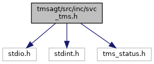
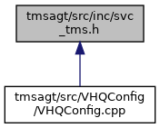
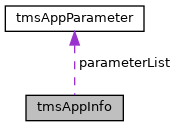
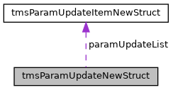
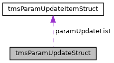

[Data Structures](#nested-classes) \| [Macros](#define-members) \| [Typedefs](#typedef-members) \| [Enumerations](#enum-members) \| [Functions](#func-members)

`#include <stdio.h>`
`#include <stdint.h>`
`#include "tms_status.h"`

Include dependency graph for svc_tms.h:

This graph shows which files directly or indirectly include this file:

<a href="svc__tms_8h_source.md">Go to the source code of this file.</a>

|  |  |
|----|----|
| Data Structures |  |
| struct   | [version_t](#structversion__t) |
| struct   | [tmsReturn](#structtms_return) |
| struct   | [tmsEventData](#structtms_event_data) |
| struct   | [tmsAppParameter](#structtms_app_parameter) |
| struct   | [tmsAppInfo](#structtms_app_info) |
| struct   | [tmsParamUpdateItemNewStruct](#structtms_param_update_item_new_struct) |
| struct   | [tmsParamUpdateNewStruct](#structtms_param_update_new_struct) |
| struct   | [tmsParamUpdateItemStruct](#structtms_param_update_item_struct) |
| struct   | [tmsParamUpdateStruct](#structtms_param_update_struct) |
| struct   | [tmsCustomAppEventStruct](#structtms_custom_app_event_struct) |
| union   | [tmsEventData.notificationData](#uniontms_event_data_8notification_data) |

|  |  |
|----|----|
| Macros |  |
| #define  | [TMS_API](#aed564c0d7f8be3217e05a223cac4921e) |
| #define  | [TMS_MAX_APP_NAME_LENGTH](#af500378e8be086c754a93d6014483955)   32 |
| #define  | [TMS_MAX_APP_PARAMETERS](#a1e3ca4dd91955d1834bd6870a8afc96e)   10000 |
| #define  | [TMS_MAX_ADDITIONAL_INFO](#a8b3aeca1174ae3cd04e06d3b9b9f232e)   256 |
| #define  | [TMS_MAX_STRING_LENGTH](#ad6392ae2815ca2e77344cfb391b13166)   128 |
| #define  | [TMS_STRING_LENGTH_64](#a34ca096675e1d15fa34af85dc3b0314c)   64 |
| #define  | [TMS_MAX_REGISTERED_APPS](#ac8d1ce1f93c7d41105b9eaa7c2eda03a)   32 |
| #define  | [TMS_REG_TIMEOUT_SECS](#acdbb28360b5227affc2749a99e2d9568)   30 |
| #define  | [TMS_STATUS_SUCCESS](#a5d46eaa0b6bcd2cf1f26428997b1d876)   0 |
| #define  | [TMS_STATUS_ERROR](#ad67eba3a524c068cb8f692887a25ef19)   5000 |
| #define  | [TMS_STATUS_UNSUPPORTED_FEATURE](#afdb4a37420d73b0d6df4ae7407d1811d)   5001 |
| #define  | [TMS_STATUS_CONTENT_AVAILABLE](#a276d0b62055e2503c34b9b7685306bc4)   5002 |
| #define  | [TMS_STATUS_NO_CONSUMER](#a5a5a48611e947173d0376a6b875d3106)   5003 |
| #define  | [TMS_STATUS_FILENAME_ERROR](#a7e2250702994f5a6234ad7f52532e529)   5004 |
| #define  | [TMS_STATUS_CONTENT_FAILURE](#a3394ef1baf5eadc7e64528d766ac9d7d)   5005 |
| #define  | [TMS_STATUS_MSGQ_FAILURE](#ab37b03d1a7f58eeb1bcad77ac6da3760)   5006 |
| #define  | [TMS_STATUS_MSGSND_FAILURE](#ad33298f089717d63c1d4d4ca200c7cd6)   5007 |
| #define  | [TMS_STATUS_MSGRCV_FAILURE](#a92f9d8cbb750bc5870deb6790c8d9e64)   5008 |
| #define  | [TMS_STATUS_APP_EVENT_AVAIL](#a1c479c9bd6f8ff46ff6ac60abc08e488)   5009 |
| #define  | [TMS_STATUS_REQUESTED](#a42f9cc5077943fa5576f3ef6e8a4b263)   5010 |
| #define  | [TMS_STATUS_REGISTER_FAIL](#ae792f572fa3d9a9fefd9e4cbc8a50d84)   5011 |
| #define  | [TMS_STATUS_REGISTER_NAME_TOO_LONG](#ac4244dca3389d0413e08c763c1f9b60e)   5012 |
| #define  | [TMS_STATUS_EINVAL](#a2b474faf9b856b3b853753ffa332ff5f)   5013 |
| #define  | [TMS_STATUS_AGENT_NOT_RUNNING](#a9fa64b0ef0b1ab93d59ceb1ef0050cc5)   5014 |
| #define  | [TMS_STATUS_SERVER_INSTANCE_ERROR](#ac01bafc32c4577e2d0f7d2303f25fc31)   5015 |
| #define  | [TMS_STATUS_SERVER_INSTANCE_LOCK_ERROR](#a65f45877c2b77ba7978c3026f43aa767)   5016 |
| #define  | [TMS_STATUS_SERVER_INSTANCE_LOCK_TIMEOUT_ERROR](#a80c3881a423feb92b887d3603b4f6826)   5017 |
| #define  | [TMS_STATUS_SERVER_INSTANCE_ALREADY_LOCKED](#a13f1f22565cd5e5ee8be22e7afdae7e9)   5018 |
| #define  | [TMS_STATUS_SERVER_INSTANCE_MAX_LOCK_REQ_EXCEEDED](#adb2ea97105e9d8b9ddaea4566989bfd1)   5019 |
| #define  | [TMS_STATUS_SERVER_INSTANCE_UNLOCK_ERROR](#a666e91243b5dfde43122a04e5e24d345)   5020 |
| #define  | [TMS_STATUS_SERVER_INSTANCE_CONFIG_LOAD_ERROR](#a1d87f4ac487a76ab044867f8699d3531)   5021 |
| #define  | [TMS_STATUS_AGENT_BUSY_ERROR](#a0367a9f0590021fb6156da785983ab47)   5022 |
| #define  | [TMS_STATUS_POSTPONED](#a62ed8dd5ef13ff21449ff150f3ba4988)   5023 |
| #define  | [TMS_STATUS_CANCELLED](#a799e83b1a52d9e023b7e035273999a13)   5024 |
| #define  | [TMS_STATUS_AGENT_CONTACTSRV_ERROR](#a4b3bf9660b575aaf067e6a70ce960e19)   5025 |
| #define  | [TMS_STATUS_API_SYNC_ERROR](#a1e99caa816802f96259cc070b88ec821)   5026 |
| #define  | [TMS_STATUS_HASH_GEN_MEMORY_ERROR](#aa167359fda01826cbc5ba49f720fded0)   5027 |
| #define  | [TMS_STATUS_HASH_GEN_VPDX_ACCESS_ERROR](#a3a71c16bf9f4be2369c8f2f175f353b9)   5028 |
| #define  | [TMS_STATUS_HASH_GEN_DATA_ACCESS_ERROR](#a23716206ba0a86110b7cb9e19682bc3a)   5029 |
| #define  | [TMS_STATUS_HASH_GEN_FILE_ACCESS_ERROR](#a97ecf0e93d11ea6de12a3d20f42f804c)   5030 |
| #define  | [TMS_STATUS_HASH_GEN_PARAM_DOESNT_EXIST](#a9c63f583ace3438d709c36bccb3f66a5)   5031 |
| #define  | [TMS_STATUS_STRING_TOO_LONG](#a0e53cda7168aecc7950ad7278b1b64c0)   5032 |
| #define  | [TMS_STATUS_APP_IPC_FAILURE](#a04993658957a880f4a35b8475900bc36)   5033 |
| #define  | [MAX_TMS_FILENAME_LENGTH](#a2e630fc88638d8cb19648853a846208b)   4096 |
| #define  | [MAX_TRANSACTION_TYPE_STR_LEN](#adf877dab92ef7fd5ebdcf1f487b72c63)   128 |
| #define  | [MAX_SERVER_INSTANCE_NAME_LEN](#ac954c1213335537d01d968c250154928)   128 |
| #define  | [MAX_SERVER_INSTANCE_LOCK_REQ](#a0cd2e54d35b218f0417a377de1f37691)   10 |
| #define  | [MAX_SERVER_INSTANCES](#a1b7722c7099fa5f5437e7bd3f5b8d2a2)   1 |
| #define  | [PRIMARY_SERVER_INSTANCE_NAME](#af9ce0cfbf24db75b72dc5696f6e0ed68)   \"primary\" |
| #define  | [TMS_EVT_REGISTER_APP_RESPONSE](#a80d6bdaf7c7a5839a135532266118533)   1 |
| #define  | [TMS_EVT_UNREGISTER_APP_RESPONSE](#a589b38fdc56edaa1c43222ff8b9a6ab8)   2 |
| #define  | [TMS_EVT_CALL_SERVER_RESPONSE](#a8eaf8fc5ec6d2b20e07438ca886fd9e3)   3 |
| #define  | [TMS_EVT_GET_TMS_CONFIG_RESPONSE](#a4e7023dbf671604649d8943dc6def024)   4 |
| #define  | [TMS_EVT_SET_TMS_CONFIG_RESPONSE](#aee65166d6e0dfe33212835aa000bb29b)   5 |
| #define  | [TMS_EVT_SET_APP_STATE](#adc6db93918eaf20ea27eac21ebb6cb74)   6 |
| #define  | [TMS_EVT_SET_APP_INFO](#af5cc86946f9e2d789c8a9fad106fcf12)   7 |
| #define  | [TMS_EVT_SET_PARM_LIST](#ae758a5424f567a9bcfb7f897c583aa2a)   8 |
| #define  | [TMS_EVT_GET_FILE](#abcaba9a047472ff5c377285da7fee48d)   9 |
| #define  | [TMS_EVT_PUT_FILE](#aeb7924bfa6bb76c8581530b33e385d8d)   10 |
| #define  | [TMS_EVT_DEL_FILE](#a9e89b94ed25268b89f286d3db27bab3b)   11 |
| #define  | [TMS_EVT_DO_TRANSACTION](#a14987582765ed6419e9dc74f9a1210d1)   12 |
| #define  | [TMS_EVT_NOTIFICATION](#aadbf0cd512a29bce15c3c2466ace3270)   13 |
| #define  | [TMS_EVT_GET_SERVER_INSTANCE](#aa79724f85b66012a0d044420d7251f82)   14 |
| #define  | [TMS_EVT_LOCK_SERVER_INSTANCE](#a7ae1a5b068c7a82c8f00af55384a4fbd)   15 |
| #define  | [TMS_EVT_RELEASE_SERVER_INSTANCE](#a478231eb52d93437a518616b6a76dead)   16 |
| #define  | [TMS_EVT_APP_ALERT_RESULT](#ac014aed9b791092ea060bbdb541940b6)   17 |
| #define  | [TMS_EVT_CLEAR_APP_INFO_RESULT](#aedadc5b0f455a7ebb583d73a84b3caf6)   18 |
| #define  | [TMS_EVT_API_ERRORS](#a10da76a0d4238eb127df59b22b7cb554)   19 |
| #define  | [TMS_EVT_DELETE_SERVER_INSTANCE](#ad191da97bf0915dfe4077c7a647b9b14)   20 |
| #define  | [TMS_EVT_APP_GENERATED_PARAM_UPDATE_RESULT](#a21646e3177e7ea03cd69916b55e08749)   21 |
| #define  | [TMS_EVT_APP_ANTI_SKIMMING_TEST_RESULT](#abdce61dbeb0644d4a2e96e680776d969)   22 |
| #define  | [TMS_EVT_APP_GET_SW_UPDATE](#a5d6204b71410515821e94b48827169bb)   23 |
| #define  | [TMS_EVT_GET_PARM_FILE](#ac55e805066483ed1a7040382b2d5dbd0)   24 |
| #define  | [TMS_PUT_FILE_TYPE_UNSIGNED_BUNDLE](#aa8048ba3a2ca50a262f1e1fc329a57b3)   1 |
| #define  | [TMS_PUT_FILE_TYPE_UNSIGNED_FILE](#a14b1db18b9ff6a22e15db2dc0b5b4cd0)   2 |
| #define  | [TMS_PUT_FILE_TYPE_MIXED_BUNDLE](#a996bb8ea569d83f47b14910dd84dfb4d)   3 |
| #define  | [TMS_PUT_FILE_TYPE_SIGNED_BUNDLE](#a796d20edc1f653893e54b265a176b88d)   4 |
| #define  | [TMS_PUT_FILE_TYPE_FULL_PARAM_FILE](#adb8eac114989de601dfc9884f142bac6)   5 |
| #define  | [TMS_PUT_FILE_TYPE_PARTIAL_PARAM_FILE_FLAT](#aa331487cbefab1b3879f9406123c61d9)   6 |
| #define  | [TMS_PUT_FILE_TYPE_PARTIAL_PARAM_FILE_HIERARCHICAL](#a292f59c7e2efd8f9e464d1bffefb5746)   7 |
| #define  | [TMS_PUT_FILE_TYPE_FULL_PARAM_FILE_CONFIG_SYS](#aafa6b178ff1387467081eb5ea329e15c)   8 |
| #define  | [TMS_POST_INSTALL_ACTION_NONE](#a0e933e86cd8a22f0fa04d142aef265aa)   0 |
| #define  | [TMS_POST_INSTALL_ACTION_REBOOT](#ae4d58055dfa4f877f43315cfd34d44b4)   1 |
| #define  | [TMS_POST_INSTALL_ACTION_RESTART_APPS](#aaf1dc60352cda5c25c62aca52b6a80be)   3 |
| #define  | [TMS_API_CALL_SERVER_UPDATE_CHECK_ONLY_FLAG](#a3e5173444d60c847613fead9de9b95be)   0x1 |
| #define  | [TMS_API_CALL_SERVER_FORCE_MAINTENANCE_FLAG](#ab11ae2987b7800eed5aa997d91038102)   0x2 |
| #define  | [TMS_EVENT_NOTIFY_REBOOT_DEVICE](#a20a62cfaaa5fcd7bc8bf861781f28e06)   0x00000001 |
| #define  | [TMS_EVENT_NOTIFY_RESTART_APPS](#a203cc0c5cf9676342d73c83be66bfb19)   0x00000002 |
| #define  | [TMS_EVENT_NOTIFY_DOWNLOAD_STARTED](#a7c65fb86818b211a9be7ef91cff90bc2)   0x00000004 |
| #define  | [TMS_EVENT_NOTIFY_DOWNLOAD_PERCENT](#a82a24a70b008a4398cd9e60b5b4e61a7)   0x00000008 |
| #define  | [TMS_EVENT_NOTIFY_DOWNLOAD_COMPLETE](#a95178c23b255d212e6198d9e83a52528)   0x00000010 |
| #define  | [TMS_EVENT_NOTIFY_INSTALL_DOWNLOAD](#ae0cdacb1d3c0716896f020615306b8e7)   0x00000020 |
| #define  | [TMS_EVENT_NOTIFY_MAINTENANCE_END](#ae3b27085a5123e469e26690db4934c06)   0x00000040 |
| #define  | [TMS_EVENT_NOTIFY_HEARTBEAT_RESULT](#abbbeb0ca332c716875ce723fcb6c8751)   0x00000080 |
| #define  | [TMS_EVENT_NOTIFY_CONTACT_SERVER_START](#af06ff086a6ce10804c2dd5e242961248)   0x00000100 |
| #define  | [TMS_EVENT_NOTIFY_CONTACT_SERVER_END](#a88e7c13320c302b841769e18b456dbbe)   0x00000200 |
| #define  | [TMS_EVENT_NOTIFY_CONTACT_SERVER_APPROVAL](#a35efd85d0d7c068568c13c46309d87b3)   0x00000400 |
| #define  | [TMS_EVENT_NOTIFY_CONTENT_UPDATES](#aa2b1dc8828225bbd3e7672afa36381b0)   0x00000800 |
| #define  | [TMS_EVENT_NOTIFY_CLOCK_UPDATE](#ae5a507f846c60be7db7af45716531831)   0x00001000 |
| #define  | [TMS_EVENT_NOTIFY_SERVER_ERRORS](#a10f49c1abf9054bb30ce5d9141d4b029)   0x00002000 |
| #define  | [TMS_EVENT_NOTIFY_INSTALL_STATUS](#a04dcf5e036a224aa142b613c377c767b)   0x00004000 |
| #define  | [TMS_EVENT_NOTIFY_PROCESSING_STATUS](#aaae3e579fdc05add1b6870924781d9c0)   0x00008000 |
| #define  | [TMS_EVENT_NOTIFY_DOWNLOAD_RETRY](#a6b8370571d0595b6dafadd4169b66bec)   0x00010000 |
| #define  | [TMS_EVENT_NOTIFY_NETWORK_ERROR](#a864538682216865a453f1934188cb940)   0x00020000 |
| #define  | [TMS_EVENT_NOTIFY_DOWNLOAD_COUNT](#af068f2fc530ea78d6d2df832bb82b1a1)   0x00040000 |
| #define  | [TMS_EVENT_NOTIFY_GET_SW_UPDATE](#a8c3af1f39eafee6cfe3d68fe93ec8207)   0x00080000 |
| #define  | [TMS_EVENT_NOTIFY_CUSTOM_APP_EVENT](#ae5ead2cf77c8bf5b643de2bcdb50d738)   0x00100000 |
| #define  | [APP_STATUS_FREE](#aa14858521210a99f2283adb671c9d529)   1 |
| #define  | [APP_STATUS_BUSY](#a113472ff594a408f71f2aca1f0d252b3)   2 |
| #define  | [APP_STATUS_POSTPONE](#ada0ca969857c9590f5e01b5108d3fc8a)   3 |
| #define  | [APP_STATUS_CANCEL](#aadcff499690e8a331ebd0e09179b2adc)   4 |
| #define  | [TMS_PARAMETER_TYPE_IDENTIFIER](#aab766abb254cef20f99294b83124c1c5)   0x01 |
| #define  | [TMS_PARAMETER_TYPE_DEVICE_PROFILE](#a658a361e715971a74182553127b46a00)   0x02 |
| #define  | [TMS_PARAMETER_TYPE_DIAGNOSTIC](#aa8a54ebd3d9fd8c26a60e7fc068bf279)   0x04 |
| #define  | [TMS_PARAMETER_TYPE_VERICENTER](#a790a620cde07ed2d404c8c05b290e573)   0x08 |
| #define  | [TMS_MAX_PARAM_UPDATE_COUNT](#ad4aada5fdef16b6836aedbcd2a332a02)   200 |
| #define  | [TMS_ALERT_SEVERITY_LOW](#a396c03a72aee1d952235d581f4a75c32)   1 |
| #define  | [TMS_ALERT_SEVERITY_MEDIUM](#a4cc988d1fea1abb5741a88842e020851)   2 |
| #define  | [TMS_ALERT_SEVERITY_HIGH](#a862e82946cd282092b9d2209ca3e34f8)   3 |

|  |  |
|----|----|
| Typedefs |  |
| typedef int(\*  | [tmsEventCallback](#a7e46e8ceb49c566a00f9861aedcea595)) (struct [tmsEventData](#structtms_event_data) eventData) |
| typedef int(\*  | [tmsEventCallback2](#ae733c68b1fd0601ae260976f887c8f70)) (struct [tmsEventData](#structtms_event_data) \*eventData, void \*data) |
| typedef enum [\_tms_apptype](#afb2687e1bbb997a41d362c43bc78ad1c)  | [tms_apptype_t](#a317e53c1d967d8bf7790a855726aab63) |
| typedef int(\*  | [tmsSetAppParamHashCB](#ac3c8fefccf99cbf698270564a752d032)) (char \*paramName, char \*paramValue, size_t paramValueLen) |

|  |  |
|----|----|
| Enumerations |  |
| enum   | [\_tms_apptype](#afb2687e1bbb997a41d362c43bc78ad1c) {   [TMS_APP_TYPE_DEFAULT](#afb2687e1bbb997a41d362c43bc78ad1cabfba202f5ab98b75ae71882b22af3ad1) = -1, [TMS_APP_TYPE_OS](#afb2687e1bbb997a41d362c43bc78ad1ca621dc36dff13296011e38c3867a22670) = 0, [TMS_APP_TYPE_APPLICATION](#afb2687e1bbb997a41d362c43bc78ad1cadfca37f133797680cc7b37054b766b21), [TMS_APP_TYPE_SCRIPT](#afb2687e1bbb997a41d362c43bc78ad1ca17ddbafa8aeee8baa4d51a4cefd806a8),   [TMS_APP_TYPE_CP_APPLICATION](#afb2687e1bbb997a41d362c43bc78ad1ca6034392747e0219bd0f1e9fa6553d257), [TMS_APP_TYPE_ADK](#afb2687e1bbb997a41d362c43bc78ad1ca64c2c9de38ad2a8c4bdd43992db68547), [TMS_APP_TYPE_PAYMENT_APP](#afb2687e1bbb997a41d362c43bc78ad1ca64173062c67413fd7738c4f030233751), [TMS_APP_TYPE_AGENT](#afb2687e1bbb997a41d362c43bc78ad1ca5947416647ee1239baf85105474ae1be),   [TMS_APP_TYPE_VALUE_ADD](#afb2687e1bbb997a41d362c43bc78ad1ca89b5f90944a37b17bd0366175d5af94d), [TMS_APP_TYPE_CUSTOM](#afb2687e1bbb997a41d362c43bc78ad1caa2ef8b46f43e0665b7d678f21ed62445) } |

|  |  |
|----|----|
| Functions |  |
| [TMS_API](#aed564c0d7f8be3217e05a223cac4921e) struct [version_t](#structversion__t)  | [tms_getVersion](#aa0311e37848cc8dcb4551ffc095a64f2) (void) |
| [TMS_API](#aed564c0d7f8be3217e05a223cac4921e) char \*  | [tms_GetVersion](#aef3fd695a6bf376370664a65c9b4dcce) (void) |
| [TMS_API](#aed564c0d7f8be3217e05a223cac4921e) struct [version_t](#structversion__t)  | [tms_getAgentVersion](#accdefe74de4de6ab0941d8194413b7fb) (void) |
| [TMS_API](#aed564c0d7f8be3217e05a223cac4921e) char \*  | [tms_GetAgentVersion](#a00c6a8f040b3f9167be0a694c2bad68f) (void) |
| [TMS_API](#aed564c0d7f8be3217e05a223cac4921e) struct [tmsReturn](#structtms_return)  | [tms_callServer](#a26d8df025d7b022be3f9bb1334d4aef5) (int secondsToWait) |
| [TMS_API](#aed564c0d7f8be3217e05a223cac4921e) struct [tmsReturn](#structtms_return)  | [tms_callServer2](#a3296d67a3fcea7f399191c69a4d29675) (int secondsToWait, unsigned int iFlags) |
| [TMS_API](#aed564c0d7f8be3217e05a223cac4921e) struct [tmsReturn](#structtms_return)  | [tms_getConfigLocation](#a3889f0d3c64ccf4c76d02c75f0a317b1) (void) |
| [TMS_API](#aed564c0d7f8be3217e05a223cac4921e) struct [tmsReturn](#structtms_return)  | [tms_setNewConfigAvailable](#a3d8613b634236bc3919b51bd2a012beb) (const char \*newTMSConfig) |
| [TMS_API](#aed564c0d7f8be3217e05a223cac4921e) struct [tmsReturn](#structtms_return)  | [tms_setNewConfigAvailableWithTimeout](#a78b45561a55532c8321f2ed92d376f52) (const char \*newTMSConfig, int timeout) |
| [TMS_API](#aed564c0d7f8be3217e05a223cac4921e) struct [tmsReturn](#structtms_return)  | [tms_registerApplication](#a80e68f6d19ff22801c4035b56e34584a) (const char \*appName, int eventNotifyMask, unsigned int tmsEvtCb) |
| [TMS_API](#aed564c0d7f8be3217e05a223cac4921e) struct [tmsReturn](#structtms_return)  | [tms_registerApplication2](#a36c1b6634e739760faa5a90d0d736c6e) (const char \*appName, int eventNotifyMask, [tmsEventCallback2](#ae733c68b1fd0601ae260976f887c8f70) tmsEvtCb, void \*cbData) |
| [TMS_API](#aed564c0d7f8be3217e05a223cac4921e) struct [tmsReturn](#structtms_return)  | [tms_registerApplication3](#ae0eef17fbaa833d545265a6be4ebab8d) (const char \*appName, const char \*appVersion, [tms_apptype_t](#a317e53c1d967d8bf7790a855726aab63) appType, const char \*appCustomType, const char \*additionalInfo, int eventNotifyMask, [tmsEventCallback2](#ae733c68b1fd0601ae260976f887c8f70) tmsEvtCb, void \*cbData) |
| [TMS_API](#aed564c0d7f8be3217e05a223cac4921e) struct [tmsReturn](#structtms_return)  | [tms_unregisterApplication](#abbf7093195d07880b5e7c897b3b1038a) (const char \*appName) |
| [TMS_API](#aed564c0d7f8be3217e05a223cac4921e) int  | [tms_setApplicationState](#a3c19eb8469c9bad6ee2ed24a8251ecc1) (int handle, int appState) |
| [TMS_API](#aed564c0d7f8be3217e05a223cac4921e) int  | [tms_setApplicationInfo](#a6d90f3cbfab83a83607d2f2f933b31f9) (int handle, struct [tmsAppInfo](#structtms_app_info) appInfo) |
| [TMS_API](#aed564c0d7f8be3217e05a223cac4921e) struct [tmsReturn](#structtms_return)  | [tms_clearApplicationInfo](#acf80be83f363195d99b03502f3afce14) (void) |
| [TMS_API](#aed564c0d7f8be3217e05a223cac4921e) int  | [tms_setApplicationParameterList](#abac6a5f355198c4120c670316a871a98) (int handle, int numParamFiles, const char \*paramInfoFile) |
| [TMS_API](#aed564c0d7f8be3217e05a223cac4921e) int  | [tms_setApplicationParameterHash](#aec879c2e664d10594fd1e980dc27ad20) (int handle, const char \*paramDefFile, [tmsSetAppParamHashCB](#ac3c8fefccf99cbf698270564a752d032) paramDataCb) |
| [TMS_API](#aed564c0d7f8be3217e05a223cac4921e) int  | [tms_sendParameterUpdateCallback](#a21bb04876b23c2af4fd540d30a1b6338) (int handle, struct [tmsParamUpdateNewStruct](#structtms_param_update_new_struct) \*parameterUpdates) |
| [TMS_API](#aed564c0d7f8be3217e05a223cac4921e) struct [tmsReturn](#structtms_return)  | [tms_sendParameterUpdate](#a2ac3ee1e9e890633e9008256406dc0b2) (struct [tmsParamUpdateStruct](#structtms_param_update_struct) \*parameterUpdates) |
| [TMS_API](#aed564c0d7f8be3217e05a223cac4921e) int  | [tms_getApplicationFileAvailable](#a813a8a0248fa17ad7cca794f9e897afd) (int handle, int result, const char \*fileLocation, unsigned char <a href="_v_h_q_utils__shared_8c.md#a5b036df1be1ec3c95ce8a57692e2b8c8">removeFile</a>) |
| [TMS_API](#aed564c0d7f8be3217e05a223cac4921e) int  | [tms_setFileOperationResult](#a7e372540b1a86e2176568d43e73977fa) (int handle, int fileOpResult, int fileOpType) |
| [TMS_API](#aed564c0d7f8be3217e05a223cac4921e) int  | [tms_setFileOperationResultWithDescription](#af2fe4965261900c31406ff287c4acecb) (int handle, int fileOpResult, int fileOpType, char \*additional_info) |
| [TMS_API](#aed564c0d7f8be3217e05a223cac4921e) int  | [tms_setTransactionResult](#a66adafdd340cc6ecd136ac51fc00d4ce) (int handle, int transactionResult) |
| [TMS_API](#aed564c0d7f8be3217e05a223cac4921e) struct [tmsReturn](#structtms_return)  | [tms_getServerInstance](#a0b68adfe3e85ea9fb8e7ed19a9697dc1) (void) |
| [TMS_API](#aed564c0d7f8be3217e05a223cac4921e) struct [tmsReturn](#structtms_return)  | [tms_lockServerInstance](#a0916061b6320bf65d5d1e9b04c32f574) (char \*instanceId, int mlSecTimeout) |
| [TMS_API](#aed564c0d7f8be3217e05a223cac4921e) struct [tmsReturn](#structtms_return)  | [tms_releaseServerLock](#ad6387ab34756d72bb79c20682d8a0366) (char \*restoreInstanceId) |
| [TMS_API](#aed564c0d7f8be3217e05a223cac4921e) struct [tmsReturn](#structtms_return)  | [tms_deleteServerInstance](#afa9841ae7b688a05c672242c853204c4) (char \*deleteInstanceId) |
| [TMS_API](#aed564c0d7f8be3217e05a223cac4921e) struct [tmsReturn](#structtms_return)  | [tms_sendApplicationAlert](#aab41635bf3606adbcfa491bd6390b374) (char \*description, int severity, char \*details) |
| [TMS_API](#aed564c0d7f8be3217e05a223cac4921e) struct [tmsReturn](#structtms_return)  | [tms_sendCustomAppEvent](#ac74f8ff212d11be3aa1cae170aadf3d6) (char \*appName, char \*description, char \*details) |
| [TMS_API](#aed564c0d7f8be3217e05a223cac4921e) struct [tmsReturn](#structtms_return)  | [tms_sendCustomAppEvent2](#ae0bf2b5e7528a563fee957b80c6c62fa) (struct [tmsCustomAppEventStruct](#structtms_custom_app_event_struct) \*appEvent) |
| [TMS_API](#aed564c0d7f8be3217e05a223cac4921e) struct [tmsReturn](#structtms_return)  | [tms_blgetPOSAgetnInfo](#a39393c0fae6f7329a4f307455c5a5c16) (char \*buffer, unsigned int size) |
| [TMS_API](#aed564c0d7f8be3217e05a223cac4921e) bool  | [tms_idsMode](#a48874555ddb56a929d6dc619aed21ab5) (void) |
| [TMS_API](#aed564c0d7f8be3217e05a223cac4921e) struct [tmsReturn](#structtms_return)  | [tms_getUpdates](#ae10994ec1353d5b7856b5965a630c8da) (const char \*updateType, const char \*software, const char \*reference) |

------------------------------------------------------------------------

## DataStructure Documentation {#data-structure-documentation}

## version_t 

struct version_t

| Data Fields |  |  |
|----|----|----|
| char | build\[16\] | 
Optional build string (i.e. rc1)
 |
| int | hotfix | 
Hotfix Version
 |
| int | maint | 
Maintenance Version
 |
| int | major | 
Major Version
 |
| int | minor | 
Minor Version
 |

## tmsReturn 

struct tmsReturn

The structure returned in response to some TMS APIs. This structure is returned when communication with the TMS Agent is required and an immediate response may not be available. In these cases, the status field will indicate TMS_STATUS_REQUESTED, and the handle will be used to track the ultimate response from the TMS Agent. When the agent is able to respond to the request, it will send the response in a [tmsEventData](#structtms_event_data) structure with the handle of that structure set to the same value as the handle returned in this structure.

| Data Fields |  |  |
|----|----|----|
| int | handle | 
Handle for tracking purposes - valid handle is \> 0
 |
| int | status | 
Return state value - TMS_STATUS_REQUESTED indicates the request was successfully made to the TMS Agent
 |

## tmsEventData 

struct tmsEventData

The TMS <a href="libevt_8h.md#struct_event">Event</a> structure that needs to be handled by the callback function provided in the applications [tms_registerApplication()](#a80e68f6d19ff22801c4035b56e34584a) call. The strcuture has detailed information about the events that the application gets notified of.

| Data Fields |  |  |
|----|----|----|
| int | appStatus | 
status of application in response to TMS_EVT_SET_APP_STATE request
 |
| int | eventMask | 
mask of events for TMS_EVT_NOTIFICATION event
 |
| int | evtType | 
type of event
 |
| char | filename\[[MAX_TMS_FILENAME_LENGTH](#a2e630fc88638d8cb19648853a846208b)\] | 
filename to process (may be empty) - used for TMS_EVT_GET_FILE, TMS_EVT_PUT_FILE and TMS_EVT_DEL_FILE events
 |
| char | filepath\[[MAX_TMS_FILENAME_LENGTH](#a2e630fc88638d8cb19648853a846208b)\] | 
Path where the file will go (may be empty) - used for TMS_EVT_GET_FILE, TMS_EVT_PUT_FILE and TMS_EVT_DEL_FILE events
 |
| int | handle | 
a handle that can be used for tracking purposes - gets passed back in certain response functions
 |
| union [tmsEventData](#uniontms_event_data_8notification_data) | notificationData |  |
| int | numFileEntries | 
number of entries in a file (applies to TMS_EVT_SET_APP_INFO/TMS_EVT_SET_PARM_LIST response)
 |
| int | putFileType | 
type of file to process for TMS_EVT_PUT_FILE events
 |
| unsigned char | removeFile | 
whether to remove file after it is received by the agent (applies to TMS_EVT_GET_FILE response)
 |
| int | status | 
status of the event
 |
| char | transactionType\[[MAX_TRANSACTION_TYPE_STR_LEN](#adf877dab92ef7fd5ebdcf1f487b72c63)\] | 
type of transaction to perform in TMS_EVT_DO_TRANSACTION event
 |

## tmsAppParameter 

struct tmsAppParameter

Application Parameter Structure used by the application to pass an application parameter to TMS. The application will setup one of these structures for each custom parameter it would like sent to the TMS server. An array of these structures is then pointed to in the [tmsAppInfo](#structtms_app_info) structure that gets passed to [tms_setApplicationInfo()](#a6d90f3cbfab83a83607d2f2f933b31f9) in response to a TMS_EVT_SET_APP_INFO event.

| Data Fields |  |  |
|----|----|----|
| char | parameterName\[64\] | 
NULL terminated parameter name - i.e. \"DeviceId\" for VX terminals
 |
| int | parameterType | 
Parameter type (i.e. TMS_PARAMETER_TYPE_IDENTIFIER, TMS_PARAMETER_TYPE_DEVICE_PROFILE, or TMS_PARAMETER_TYPE_DIAGNOSTIC)
 |
| char | parameterValue\[256\] | 
NULL terminated parameter Value - i.e. Device ID value for VX terminals
 |

## tmsAppInfo 

struct tmsAppInfo

Application Information Structure used by the application to pass application parameters to TMS. This structure is filled out by the application and passed to [tms_setApplicationInfo()](#a6d90f3cbfab83a83607d2f2f933b31f9) in response to a TMS_EVT_SET_APP_INFO event.

Collaboration diagram for tmsAppInfo:

\[<a href="graph_legend.md">legend</a>\]

| Data Fields |  |  |
|----|----|----|
| int | parameterCount | 
number of [tmsAppParameter](#structtms_app_parameter) values in the parameterList array
 |
| struct [tmsAppParameter](#structtms_app_parameter) \* | parameterList | 
Pointer to an array of [tmsAppParameter](#structtms_app_parameter)\[\] values to be sent to the server
 |

## tmsParamUpdateItemNewStruct 

struct tmsParamUpdateItemNewStruct

| Data Fields |  |  |
|----|----|----|
| char | Application\[64\] |  |
| char | Container\[1024\] |  |
| char | Name\[256\] |  |
| [tmsSetAppParamHashCB](#ac3c8fefccf99cbf698270564a752d032) | ParamDataCb |  |
| const char \* | ParamDefFile |  |
| char | Value\[256\] |  |
| char | version\[32\] |  |

## tmsParamUpdateNewStruct 

struct tmsParamUpdateNewStruct

Collaboration diagram for tmsParamUpdateNewStruct:

\[<a href="graph_legend.md">legend</a>\]

| Data Fields |  |  |
|----|----|----|
| int | paramUpdateCount |  |
| struct [tmsParamUpdateItemNewStruct](#structtms_param_update_item_new_struct) \* | paramUpdateList |  |

## tmsParamUpdateItemStruct 

struct tmsParamUpdateItemStruct

| Data Fields |  |  |
|----|----|----|
| char | Application\[64\] |  |
| char | Container\[1024\] |  |
| char | Name\[256\] |  |
| [tmsSetAppParamHashCB](#ac3c8fefccf99cbf698270564a752d032) | ParamDataCb |  |
| const char \* | ParamDefFile |  |
| char | Value\[256\] |  |

## tmsParamUpdateStruct 

struct tmsParamUpdateStruct

Collaboration diagram for tmsParamUpdateStruct:

\[<a href="graph_legend.md">legend</a>\]

| Data Fields |  |  |
|----|----|----|
| int | paramUpdateCount |  |
| struct [tmsParamUpdateItemStruct](#structtms_param_update_item_struct) \* | paramUpdateList |  |

## tmsCustomAppEventStruct 

struct tmsCustomAppEventStruct

| Data Fields |  |  |
|----|----|----|
| char | additional_info\[[TMS_MAX_ADDITIONAL_INFO](#a8b3aeca1174ae3cd04e06d3b9b9f232e)\] |  |
| char | appName\[[TMS_MAX_APP_NAME_LENGTH](#af500378e8be086c754a93d6014483955)\] |  |
| char | eventName\[[TMS_STRING_LENGTH_64](#a34ca096675e1d15fa34af85dc3b0314c)\] |  |

## tmsEventData.notificationData 

union tmsEventData.notificationData

| Data Fields |  |  |
|----|----|----|
| int | downloadCompletedCnt | 
Count of Downloads that are completed
 |
| int | downloadCount | 
Downloadfile Operation type count in a Management Plan
 |
| int | downloadPercent | 
percentage of download that is complete for TMS_EVT_NOTIFICATION / TMS_EVENT_NOTIFY_DOWNLOAD_PERCENT event
 |
| int | downloadRetryCnt | 
Download retry count
 |
| int | downloadStartCnt | 
Count of Downloads that are started
 |
| int | installCompletedCnt | 
Count of Installs that are completed
 |
| int | installStartCnt | 
Count of Installs that are started
 |

## MacroDefinition Documentation {#macro-definition-documentation}

## APP_STATUS_BUSY 

#define APP_STATUS_BUSY   2

## APP_STATUS_CANCEL 

#define APP_STATUS_CANCEL   4

## APP_STATUS_FREE 

#define APP_STATUS_FREE   1

## APP_STATUS_POSTPONE 

#define APP_STATUS_POSTPONE   3

## MAX_SERVER_INSTANCE_LOCK_REQ 

#define MAX_SERVER_INSTANCE_LOCK_REQ   10

## MAX_SERVER_INSTANCE_NAME_LEN 

#define MAX_SERVER_INSTANCE_NAME_LEN   128

## MAX_SERVER_INSTANCES 

#define MAX_SERVER_INSTANCES   1

## MAX_TMS_FILENAME_LENGTH 

#define MAX_TMS_FILENAME_LENGTH   4096

## MAX_TRANSACTION_TYPE_STR_LEN 

#define MAX_TRANSACTION_TYPE_STR_LEN   128

## PRIMARY_SERVER_INSTANCE_NAME 

#define PRIMARY_SERVER_INSTANCE_NAME   \"primary\"

## TMS_ALERT_SEVERITY_HIGH 

#define TMS_ALERT_SEVERITY_HIGH   3

## TMS_ALERT_SEVERITY_LOW 

#define TMS_ALERT_SEVERITY_LOW   1

## TMS_ALERT_SEVERITY_MEDIUM 

#define TMS_ALERT_SEVERITY_MEDIUM   2

## TMS_API 

#define TMS_API

## TMS_API_CALL_SERVER_FORCE_MAINTENANCE_FLAG 

#define TMS_API_CALL_SERVER_FORCE_MAINTENANCE_FLAG   0x2

## TMS_API_CALL_SERVER_UPDATE_CHECK_ONLY_FLAG 

#define TMS_API_CALL_SERVER_UPDATE_CHECK_ONLY_FLAG   0x1

## TMS_EVENT_NOTIFY_CLOCK_UPDATE 

#define TMS_EVENT_NOTIFY_CLOCK_UPDATE   0x00001000

## TMS_EVENT_NOTIFY_CONTACT_SERVER_APPROVAL 

#define TMS_EVENT_NOTIFY_CONTACT_SERVER_APPROVAL   0x00000400

## TMS_EVENT_NOTIFY_CONTACT_SERVER_END 

#define TMS_EVENT_NOTIFY_CONTACT_SERVER_END   0x00000200

## TMS_EVENT_NOTIFY_CONTACT_SERVER_START 

#define TMS_EVENT_NOTIFY_CONTACT_SERVER_START   0x00000100

## TMS_EVENT_NOTIFY_CONTENT_UPDATES 

#define TMS_EVENT_NOTIFY_CONTENT_UPDATES   0x00000800

## TMS_EVENT_NOTIFY_CUSTOM_APP_EVENT 

#define TMS_EVENT_NOTIFY_CUSTOM_APP_EVENT   0x00100000

## TMS_EVENT_NOTIFY_DOWNLOAD_COMPLETE 

#define TMS_EVENT_NOTIFY_DOWNLOAD_COMPLETE   0x00000010

## TMS_EVENT_NOTIFY_DOWNLOAD_COUNT 

#define TMS_EVENT_NOTIFY_DOWNLOAD_COUNT   0x00040000

## TMS_EVENT_NOTIFY_DOWNLOAD_PERCENT 

#define TMS_EVENT_NOTIFY_DOWNLOAD_PERCENT   0x00000008

## TMS_EVENT_NOTIFY_DOWNLOAD_RETRY 

#define TMS_EVENT_NOTIFY_DOWNLOAD_RETRY   0x00010000

## TMS_EVENT_NOTIFY_DOWNLOAD_STARTED 

#define TMS_EVENT_NOTIFY_DOWNLOAD_STARTED   0x00000004

## TMS_EVENT_NOTIFY_GET_SW_UPDATE 

#define TMS_EVENT_NOTIFY_GET_SW_UPDATE   0x00080000

## TMS_EVENT_NOTIFY_HEARTBEAT_RESULT 

#define TMS_EVENT_NOTIFY_HEARTBEAT_RESULT   0x00000080

## TMS_EVENT_NOTIFY_INSTALL_DOWNLOAD 

#define TMS_EVENT_NOTIFY_INSTALL_DOWNLOAD   0x00000020

## TMS_EVENT_NOTIFY_INSTALL_STATUS 

#define TMS_EVENT_NOTIFY_INSTALL_STATUS   0x00004000

## TMS_EVENT_NOTIFY_MAINTENANCE_END 

#define TMS_EVENT_NOTIFY_MAINTENANCE_END   0x00000040

## TMS_EVENT_NOTIFY_NETWORK_ERROR 

#define TMS_EVENT_NOTIFY_NETWORK_ERROR   0x00020000

## TMS_EVENT_NOTIFY_PROCESSING_STATUS 

#define TMS_EVENT_NOTIFY_PROCESSING_STATUS   0x00008000

## TMS_EVENT_NOTIFY_REBOOT_DEVICE 

#define TMS_EVENT_NOTIFY_REBOOT_DEVICE   0x00000001

## TMS_EVENT_NOTIFY_RESTART_APPS 

#define TMS_EVENT_NOTIFY_RESTART_APPS   0x00000002

## TMS_EVENT_NOTIFY_SERVER_ERRORS 

#define TMS_EVENT_NOTIFY_SERVER_ERRORS   0x00002000

## TMS_EVT_API_ERRORS 

#define TMS_EVT_API_ERRORS   19

## TMS_EVT_APP_ALERT_RESULT 

#define TMS_EVT_APP_ALERT_RESULT   17

## TMS_EVT_APP_ANTI_SKIMMING_TEST_RESULT 

#define TMS_EVT_APP_ANTI_SKIMMING_TEST_RESULT   22

<a href="libevt_8h.md#struct_event">Event</a> sent by the agent to notify the application of Anti-skimming results called using [`tms_sendCustomAppEvent()`](#ac74f8ff212d11be3aa1cae170aadf3d6)

## TMS_EVT_APP_GENERATED_PARAM_UPDATE_RESULT 

#define TMS_EVT_APP_GENERATED_PARAM_UPDATE_RESULT   21

This event is for responses to app parameter updates

## TMS_EVT_APP_GET_SW_UPDATE 

#define TMS_EVT_APP_GET_SW_UPDATE   23

<a href="libevt_8h.md#struct_event">Event</a> sent by the agent to notify the application if Get Sw Update called using [`tms_getUpdates()`](#ae10994ec1353d5b7856b5965a630c8da)

## TMS_EVT_CALL_SERVER_RESPONSE 

#define TMS_EVT_CALL_SERVER_RESPONSE   3

## TMS_EVT_CLEAR_APP_INFO_RESULT 

#define TMS_EVT_CLEAR_APP_INFO_RESULT   18

## TMS_EVT_DEL_FILE 

#define TMS_EVT_DEL_FILE   11

## TMS_EVT_DELETE_SERVER_INSTANCE 

#define TMS_EVT_DELETE_SERVER_INSTANCE   20

## TMS_EVT_DO_TRANSACTION 

#define TMS_EVT_DO_TRANSACTION   12

## TMS_EVT_GET_FILE 

#define TMS_EVT_GET_FILE   9

## TMS_EVT_GET_PARM_FILE 

#define TMS_EVT_GET_PARM_FILE   24

## TMS_EVT_GET_SERVER_INSTANCE 

#define TMS_EVT_GET_SERVER_INSTANCE   14

## TMS_EVT_GET_TMS_CONFIG_RESPONSE 

#define TMS_EVT_GET_TMS_CONFIG_RESPONSE   4

## TMS_EVT_LOCK_SERVER_INSTANCE 

#define TMS_EVT_LOCK_SERVER_INSTANCE   15

## TMS_EVT_NOTIFICATION 

#define TMS_EVT_NOTIFICATION   13

## TMS_EVT_PUT_FILE 

#define TMS_EVT_PUT_FILE   10

## TMS_EVT_REGISTER_APP_RESPONSE 

#define TMS_EVT_REGISTER_APP_RESPONSE   1

## TMS_EVT_RELEASE_SERVER_INSTANCE 

#define TMS_EVT_RELEASE_SERVER_INSTANCE   16

## TMS_EVT_SET_APP_INFO 

#define TMS_EVT_SET_APP_INFO   7

## TMS_EVT_SET_APP_STATE 

#define TMS_EVT_SET_APP_STATE   6

## TMS_EVT_SET_PARM_LIST 

#define TMS_EVT_SET_PARM_LIST   8

## TMS_EVT_SET_TMS_CONFIG_RESPONSE 

#define TMS_EVT_SET_TMS_CONFIG_RESPONSE   5

## TMS_EVT_UNREGISTER_APP_RESPONSE 

#define TMS_EVT_UNREGISTER_APP_RESPONSE   2

## TMS_MAX_ADDITIONAL_INFO 

#define TMS_MAX_ADDITIONAL_INFO   256

## TMS_MAX_APP_NAME_LENGTH 

#define TMS_MAX_APP_NAME_LENGTH   32

## TMS_MAX_APP_PARAMETERS 

#define TMS_MAX_APP_PARAMETERS   10000

## TMS_MAX_PARAM_UPDATE_COUNT 

#define TMS_MAX_PARAM_UPDATE_COUNT   200

## TMS_MAX_REGISTERED_APPS 

#define TMS_MAX_REGISTERED_APPS   32

## TMS_MAX_STRING_LENGTH 

#define TMS_MAX_STRING_LENGTH   128

## TMS_PARAMETER_TYPE_DEVICE_PROFILE 

#define TMS_PARAMETER_TYPE_DEVICE_PROFILE   0x02

a parameter to send with device profile information

## TMS_PARAMETER_TYPE_DIAGNOSTIC 

#define TMS_PARAMETER_TYPE_DIAGNOSTIC   0x04

a parameter to send with diagnostic information

## TMS_PARAMETER_TYPE_IDENTIFIER 

#define TMS_PARAMETER_TYPE_IDENTIFIER   0x01

a parameter to send with identifier information

## TMS_PARAMETER_TYPE_VERICENTER 

#define TMS_PARAMETER_TYPE_VERICENTER   0x08

a parameter to send with diagnostic information

## TMS_POST_INSTALL_ACTION_NONE 

#define TMS_POST_INSTALL_ACTION_NONE   0

## TMS_POST_INSTALL_ACTION_REBOOT 

#define TMS_POST_INSTALL_ACTION_REBOOT   1

## TMS_POST_INSTALL_ACTION_RESTART_APPS 

#define TMS_POST_INSTALL_ACTION_RESTART_APPS   3

## TMS_PUT_FILE_TYPE_FULL_PARAM_FILE 

#define TMS_PUT_FILE_TYPE_FULL_PARAM_FILE   5

a full parameter file type

## TMS_PUT_FILE_TYPE_FULL_PARAM_FILE_CONFIG_SYS 

#define TMS_PUT_FILE_TYPE_FULL_PARAM_FILE_CONFIG_SYS   8

a full parameter file type, automatically merged into the environment

## TMS_PUT_FILE_TYPE_MIXED_BUNDLE 

#define TMS_PUT_FILE_TYPE_MIXED_BUNDLE   3

a mixed bundle type (unsigned and signed packages)

## TMS_PUT_FILE_TYPE_PARTIAL_PARAM_FILE_FLAT 

#define TMS_PUT_FILE_TYPE_PARTIAL_PARAM_FILE_FLAT   6

a flat partial parameter file type

## TMS_PUT_FILE_TYPE_PARTIAL_PARAM_FILE_HIERARCHICAL 

#define TMS_PUT_FILE_TYPE_PARTIAL_PARAM_FILE_HIERARCHICAL   7

a hierarchical partial parameter file type

## TMS_PUT_FILE_TYPE_SIGNED_BUNDLE 

#define TMS_PUT_FILE_TYPE_SIGNED_BUNDLE   4

a signed bundle type

## TMS_PUT_FILE_TYPE_UNSIGNED_BUNDLE 

#define TMS_PUT_FILE_TYPE_UNSIGNED_BUNDLE   1

an unsigned bundle type

## TMS_PUT_FILE_TYPE_UNSIGNED_FILE 

#define TMS_PUT_FILE_TYPE_UNSIGNED_FILE   2

a single unsigned file

## TMS_REG_TIMEOUT_SECS 

#define TMS_REG_TIMEOUT_SECS   30

## TMS_STATUS_AGENT_BUSY_ERROR 

#define TMS_STATUS_AGENT_BUSY_ERROR   5022

agent is busy and can\'t perform request

## TMS_STATUS_AGENT_CONTACTSRV_ERROR 

#define TMS_STATUS_AGENT_CONTACTSRV_ERROR   5025

vhq server doesn\'t ready to process requests from device yet

## TMS_STATUS_AGENT_NOT_RUNNING 

#define TMS_STATUS_AGENT_NOT_RUNNING   5014

the agent is not running

## TMS_STATUS_API_SYNC_ERROR 

#define TMS_STATUS_API_SYNC_ERROR   5026

app and Agent lost sync in messages

## TMS_STATUS_APP_EVENT_AVAIL 

#define TMS_STATUS_APP_EVENT_AVAIL   5009

app event is available

## TMS_STATUS_APP_IPC_FAILURE 

#define TMS_STATUS_APP_IPC_FAILURE   5033

Connection interrupted or eof

## TMS_STATUS_CANCELLED 

#define TMS_STATUS_CANCELLED   5024

vhq got the request to cancel current task

## TMS_STATUS_CONTENT_AVAILABLE 

#define TMS_STATUS_CONTENT_AVAILABLE   5002

content available status

## TMS_STATUS_CONTENT_FAILURE 

#define TMS_STATUS_CONTENT_FAILURE   5005

content failed to update

## TMS_STATUS_EINVAL 

#define TMS_STATUS_EINVAL   5013

error in a parameter value

## TMS_STATUS_ERROR 

#define TMS_STATUS_ERROR   5000

error status

## TMS_STATUS_FILENAME_ERROR 

#define TMS_STATUS_FILENAME_ERROR   5004

filename is too long

## TMS_STATUS_HASH_GEN_DATA_ACCESS_ERROR 

#define TMS_STATUS_HASH_GEN_DATA_ACCESS_ERROR   5029

error occured accessing data from app data retrieval callback

## TMS_STATUS_HASH_GEN_FILE_ACCESS_ERROR 

#define TMS_STATUS_HASH_GEN_FILE_ACCESS_ERROR   5030

error occured accessing temporary file to store parameter information

## TMS_STATUS_HASH_GEN_MEMORY_ERROR 

#define TMS_STATUS_HASH_GEN_MEMORY_ERROR   5027

memory error (i.e. malloc failure) occured generating hash values from VPDX

## TMS_STATUS_HASH_GEN_PARAM_DOESNT_EXIST 

#define TMS_STATUS_HASH_GEN_PARAM_DOESNT_EXIST   5031

App will use this to tell agent that a parameter doesn\'t exist in the container

## TMS_STATUS_HASH_GEN_VPDX_ACCESS_ERROR 

#define TMS_STATUS_HASH_GEN_VPDX_ACCESS_ERROR   5028

error occured opening or accessing VPDX

## TMS_STATUS_MSGQ_FAILURE 

#define TMS_STATUS_MSGQ_FAILURE   5006

message queue failure

## TMS_STATUS_MSGRCV_FAILURE 

#define TMS_STATUS_MSGRCV_FAILURE   5008

receiving message from TMS agent failed

## TMS_STATUS_MSGSND_FAILURE 

#define TMS_STATUS_MSGSND_FAILURE   5007

sending message to TMS agent failed

## TMS_STATUS_NO_CONSUMER 

#define TMS_STATUS_NO_CONSUMER   5003

no consumer for this content

## TMS_STATUS_POSTPONED 

#define TMS_STATUS_POSTPONED   5023

app can use this to postpone a PUT_FILE request

## TMS_STATUS_REGISTER_FAIL 

#define TMS_STATUS_REGISTER_FAIL   5011

app registration failure

## TMS_STATUS_REGISTER_NAME_TOO_LONG 

#define TMS_STATUS_REGISTER_NAME_TOO_LONG   5012

app registration name too long

## TMS_STATUS_REQUESTED 

#define TMS_STATUS_REQUESTED   5010

app event is available

## TMS_STATUS_SERVER_INSTANCE_ALREADY_LOCKED 

#define TMS_STATUS_SERVER_INSTANCE_ALREADY_LOCKED   5018

server instance already locked

## TMS_STATUS_SERVER_INSTANCE_CONFIG_LOAD_ERROR 

#define TMS_STATUS_SERVER_INSTANCE_CONFIG_LOAD_ERROR   5021

error loading server instance config

## TMS_STATUS_SERVER_INSTANCE_ERROR 

#define TMS_STATUS_SERVER_INSTANCE_ERROR   5015

generic error with server instance

## TMS_STATUS_SERVER_INSTANCE_LOCK_ERROR 

#define TMS_STATUS_SERVER_INSTANCE_LOCK_ERROR   5016

server instance lock error

## TMS_STATUS_SERVER_INSTANCE_LOCK_TIMEOUT_ERROR 

#define TMS_STATUS_SERVER_INSTANCE_LOCK_TIMEOUT_ERROR   5017

server instance lock timeout error

## TMS_STATUS_SERVER_INSTANCE_MAX_LOCK_REQ_EXCEEDED 

#define TMS_STATUS_SERVER_INSTANCE_MAX_LOCK_REQ_EXCEEDED   5019

too many lock requests

## TMS_STATUS_SERVER_INSTANCE_UNLOCK_ERROR 

#define TMS_STATUS_SERVER_INSTANCE_UNLOCK_ERROR   5020

server instance unlock error

## TMS_STATUS_STRING_TOO_LONG 

#define TMS_STATUS_STRING_TOO_LONG   5032

app description/details string too long

## TMS_STATUS_SUCCESS 

#define TMS_STATUS_SUCCESS   0

successful status

## TMS_STATUS_UNSUPPORTED_FEATURE 

#define TMS_STATUS_UNSUPPORTED_FEATURE   5001

unsupported feature

## TMS_STRING_LENGTH_64 

#define TMS_STRING_LENGTH_64   64

## TypedefDocumentation {#typedef-documentation}

## tms_apptype_t 

typedef enum [\_tms_apptype](#afb2687e1bbb997a41d362c43bc78ad1c) [tms_apptype_t](#a317e53c1d967d8bf7790a855726aab63)

## tmsEventCallback 

typedef int(\* tmsEventCallback) (struct [tmsEventData](#structtms_event_data) eventData)

## tmsEventCallback2 

typedef int(\* tmsEventCallback2) (struct [tmsEventData](#structtms_event_data) \*eventData, void \*data)

## tmsSetAppParamHashCB 

typedef int(\* tmsSetAppParamHashCB) (char \*paramName, char \*paramValue, size_t paramValueLen)

## EnumerationType Documentation {#enumeration-type-documentation}

## \_tms_apptype 

enum [\_tms_apptype](#afb2687e1bbb997a41d362c43bc78ad1c)

| Enumerator                   |     |
|------------------------------|-----|
| TMS_APP_TYPE_DEFAULT         |     |
| TMS_APP_TYPE_OS              |     |
| TMS_APP_TYPE_APPLICATION     |     |
| TMS_APP_TYPE_SCRIPT          |     |
| TMS_APP_TYPE_CP_APPLICATION  |     |
| TMS_APP_TYPE_ADK             |     |
| TMS_APP_TYPE_PAYMENT_APP     |     |
| TMS_APP_TYPE_AGENT           |     |
| TMS_APP_TYPE_VALUE_ADD       |     |
| TMS_APP_TYPE_CUSTOM          |     |

## FunctionDocumentation {#function-documentation}

## tms_blgetPOSAgetnInfo() 

[TMS_API](#aed564c0d7f8be3217e05a223cac4921e) struct [tmsReturn](#structtms_return) tms_blgetPOSAgetnInfo

This function is called by the application to request information about POS Agent information. Has processing only under Verix OS file.

**Parameters**

\[in\] **buffer** = pointer to buffer for result \[in\] **size** = size of mentioned buffer

### Returns

struct [tmsReturn](#structtms_return) = a [tmsReturn](#structtms_return) structure
[tmsReturn.status](#a6e27f49150e9a14580fb313cc2777e00) = the blocking library status response. TMS_STATUS_REQUESTED indicates the library was able to successfully receive POS Agent information. All other return values indicate a failure.

[tmsReturn.handle](#a3127ebf018e9da62fa464d348352037d) = the handle used for further status tracking in the callback. The callback is ignored in this case.

## tms_callServer() 

[TMS_API](#aed564c0d7f8be3217e05a223cac4921e) struct [tmsReturn](#structtms_return) tms_callServer

This function is used by the application to call the management server. The app does not need to be registered in order to request a TMS call. If the app is registered, it will get status information about the server communication in its callback.

**Parameters**

\[in\] **secondsToWait** = the number of seconds from now to contact the server. This can be used to schedule server contacts for the future. A value of 0 indicates to contact the server right now.

### Returns

struct [tmsReturn](#structtms_return) = a [tmsReturn](#structtms_return) structure
[tmsReturn.status](#a6e27f49150e9a14580fb313cc2777e00) = the immediate library status response. TMS_STATUS_REQUESTED indicates the library was able to successfully send the contact server request to the VHQ Agent. All other return values indicate a failure.

[tmsReturn.handle](#a3127ebf018e9da62fa464d348352037d) = the handle used for further status tracking in the callback. The callback status events will only be sent to registered applications.

## tms_callServer2() 

[TMS_API](#aed564c0d7f8be3217e05a223cac4921e) struct [tmsReturn](#structtms_return) tms_callServer2

This function is used by the application to call the management server. The app does not need to be registered in order to request a TMS call. If the app is registered, it will get status information about the server communication in its callback.

**Parameters**

\[in\] **secondsToWait** = the number of seconds from now to contact the server. This can be used to schedule server contacts for the future. A value of 0 indicates to contact the server right now. \[in\] **iFlags** = coming in through the API is an int while iFlags in the request_msg structure is only a bool. So once we get more than 8 flags in this API we will need to do handle this

### Returns

struct [tmsReturn](#structtms_return) = a [tmsReturn](#structtms_return) structure
[tmsReturn.status](#a6e27f49150e9a14580fb313cc2777e00) = the immediate library status response. TMS_STATUS_REQUESTED indicates the library was able to successfully send the contact server request to the VHQ Agent. All other return values indicate a failure.

[tmsReturn.handle](#a3127ebf018e9da62fa464d348352037d) = the handle used for further status tracking in the callback. The callback status events will only be sent to registered applications.

## tms_clearApplicationInfo() 

[TMS_API](#aed564c0d7f8be3217e05a223cac4921e) struct [tmsReturn](#structtms_return) tms_clearApplicationInfo

The application can call this function to clear any parameters the app has sent to the agent that the agent has cached. Since the agent will only request application info periodically, this API can be used when the app needs to change a parameter it has already provided to the agent. After calling this API, the agent cached information for the app will be cleared, and the agent will be forced to request the application info the next time it needs it with the TMS_EVT_SET_APP_INFO event

### Returns

int = status of the call. TMS_STATUS_REQUESTED indicates the call was successful (but not necessarily the clearing of the cached data). The final result of the call will come in the registered callback handler with TMS_EVT_CLEAR_APP_INFO_RESULT. All other values indicate a failure

## tms_deleteServerInstance() 

[TMS_API](#aed564c0d7f8be3217e05a223cac4921e) struct [tmsReturn](#structtms_return) tms_deleteServerInstance

The application will call this function to remove all content of mentioned server instance

**Parameters**

\[in\] **deleteInstanceId** = the name of the server instance which should be completely removed from device

### Returns

struct [tmsReturn](#structtms_return) = a [tmsReturn](#structtms_return) structure
[tmsReturn.status](#a6e27f49150e9a14580fb313cc2777e00) = the immediate library status response. TMS_STATUS_REQUESTED indicates the library was able to successfully send the release server lock request to the VHQ Agent. All other return values indicate a failure.

[tmsReturn.handle](#a3127ebf018e9da62fa464d348352037d) = the handle used for further status tracking in the callback. The callback will provide final status of releasing the lock

IMPORTANT NOTES: App has to unlock instance before it can be deleted. Active and Primary instances can\'t be removed.

## tms_getAgentVersion() 

[TMS_API](#aed564c0d7f8be3217e05a223cac4921e) struct [version_t](#structversion__t) tms_getAgentVersion

This function is used by an application to get the version of the ADK TMS Agent that is running on the device.

### Returns

[version_t](#structversion__t) structure

IMPORTANT NOTES:

- This function could return incomplete Maintenance versions
- This function will communicate to the ADK TMS Agent via pipes/message queues so it may block for a short period of time

## tms_GetAgentVersion() 

[TMS_API](#aed564c0d7f8be3217e05a223cac4921e) char\* tms_GetAgentVersion

This function is used by an application to get the version of the ADK TMS Agent that is running on the device.

### Returns

version string

IMPORTANT NOTES:

- This function will communicate to the ADK TMS Agent via pipes/message queues so it may block for a short period of time

## tms_getApplicationFileAvailable() 

[TMS_API](#aed564c0d7f8be3217e05a223cac4921e) int tms_getApplicationFileAvailable

The application will call this function in response to a GET_FILE event received in its callback. When the agent requests a file with GET_FILE, the application will put the file in a shared location and use this call to notify the agent that the file is available.
**NOTE: the shared location file must have read permissions for the agent. Also, this is currently only used for parameter management.**

**Parameters**

\[in\] **handle** = this should be the same handle provided in the callback event. \[in\] **result** = the status of the application getting the file. If the agent requests a file that the application should not share, the app should respond with an error. TMS_STATUS_SUCCESS indicates getting the file was successful, any other value indicates an error \[in\] **fileLocation** = the shared location where the application put the requested file. This only needs to be set if the file retrieval was successful. \[in\] **removeFile** = a boolean telling the agent whether it should delete the file when it is finished with it. For cases where the app copies a file from its private area to a shared area, this should be set to TRUE.

### Returns

int = status of the call. TMS_STATUS_SUCCESS indicates the call was successful. All other values indicate a failure.

IMPORTANT NOTES: This is used by the application to respond to TMS_EVT_GET_FILE request from the agent

## tms_getConfigLocation() 

[TMS_API](#aed564c0d7f8be3217e05a223cac4921e) struct [tmsReturn](#structtms_return) tms_getConfigLocation

This function is called by the application to request the location of the VHQ configuration file.

### Returns

struct [tmsReturn](#structtms_return) = a [tmsReturn](#structtms_return) structure
[tmsReturn.status](#a6e27f49150e9a14580fb313cc2777e00) = the immediate library status response. TMS_STATUS_REQUESTED indicates the library was able to successfully send the contact server request to the VHQ Agent. All other return values indicate a failure.

[tmsReturn.handle](#a3127ebf018e9da62fa464d348352037d) = the handle used for further status tracking in the callback. The callback status events will only be sent to registered applications.

## tms_getServerInstance() 

[TMS_API](#aed564c0d7f8be3217e05a223cac4921e) struct [tmsReturn](#structtms_return) tms_getServerInstance

The application will call this function to get the name of the current server instance being used

### Returns

struct [tmsReturn](#structtms_return) = a [tmsReturn](#structtms_return) structure
[tmsReturn.status](#a6e27f49150e9a14580fb313cc2777e00) = the immediate library status response. TMS_STATUS_REQUESTED indicates the library was able to successfully send the get server instance request to the VHQ Agent. All other return values indicate a failure.

[tmsReturn.handle](#a3127ebf018e9da62fa464d348352037d) = the handle used for further status tracking in the callback. The callback will provide further status including the name of the current server instance.

## tms_getUpdates() 

[TMS_API](#aed564c0d7f8be3217e05a223cac4921e) struct [tmsReturn](#structtms_return) tms_getUpdates

This function is used by the application to request updates from the management server. The app needs to be registered in order to request a TMS call. The app will get status information about the downloads and it\'s notifications in its callback.

**Parameters**

\[in\] **updateType** = specified \[in\] **software** = reference set name or parent reference set name \[in\] **reference** = self or parent

### Returns

struct [tmsReturn](#structtms_return) = a [tmsReturn](#structtms_return) structure
[tmsReturn.status](#a6e27f49150e9a14580fb313cc2777e00) = the immediate library status response. TMS_STATUS_REQUESTED indicates the library was able to successfully send the update request to the VHQ Agent. All other return values indicate a failure.

[tmsReturn.handle](#a3127ebf018e9da62fa464d348352037d) = the handle used for further status tracking in the callback. The callback status events will only be sent to registered applications.

## tms_getVersion() 

[TMS_API](#aed564c0d7f8be3217e05a223cac4921e) struct [version_t](#structversion__t) tms_getVersion

This function is used by an application to get the version of TMS library that the application is linked with, or the shared version of the library that the application is using.

### Returns

[version_t](#structversion__t) structure

IMPORTANT NOTES: This function could return incomplete Maintenance versions

## tms_GetVersion() 

[TMS_API](#aed564c0d7f8be3217e05a223cac4921e) char\* tms_GetVersion

This function is used by an application application to get the version of TMS library that the application is linked with, or the shared version of the library that the application is using.

### Returns

version string

## tms_idsMode() 

[TMS_API](#aed564c0d7f8be3217e05a223cac4921e) bool tms_idsMode

Called by application to find if device is in IDS mode or not

**Parameters**

\[out\] **TRUE/FALSE** - IDS mode is TRUE/FALSE

## tms_lockServerInstance() 

[TMS_API](#aed564c0d7f8be3217e05a223cac4921e) struct [tmsReturn](#structtms_return) tms_lockServerInstance

The application will call this function to lock the server instance to the provided instanceId. A timeout can be provided and if the lock can\'t be obtained in the time period specified, the call will fail.

**Parameters**

\[in\] **instanceId** = the name of the server instance to set the agent to if the lock is obtained successfully \[in\] **mlSecTimeout** = number of milliseconds to wait for the lock. If the lock can\'t be obtained in the time specified, an error will be returned. A value of 0 for this means to wait forever.

### Returns

struct [tmsReturn](#structtms_return) = a [tmsReturn](#structtms_return) structure
[tmsReturn.status](#a6e27f49150e9a14580fb313cc2777e00) = the immediate library status response. TMS_STATUS_REQUESTED indicates the library was able to successfully send the lock server instance request to the VHQ Agent. All other return values indicate a failure.

[tmsReturn.handle](#a3127ebf018e9da62fa464d348352037d) = the handle used for further status tracking in the callback. The callback will provide further status including the status of the lock and the name of the current instanceID.

IMPORTANT NOTES: The current instanceID being used will be returned in the callback. That name can be used in the [tms_releaseServerLock()](#ad6387ab34756d72bb79c20682d8a0366) call to restore the instance that was in use before the app requested the lock on the new server

## tms_registerApplication() 

[TMS_API](#aed564c0d7f8be3217e05a223cac4921e) struct [tmsReturn](#structtms_return) tms_registerApplication

This function is used by the application to register itself with the VHQ agent. When registering, the application provides its name, a mask specifying the types of events the application would like to be notified of, and a callback function for handling events sent to the app from the VHQ agent.

**Parameters**

\[in\] **appName** = A name used by the VHQ agent to help identify the different applications that are registered. The app name is used for identification purposes, as well as parameter management.The registered app name MUST match the application name specified in Secure Installer bundle for V/OS devices, or the application name specified in Manifest files for VX devices. This name is case sensitive so it must match exactly. \[in\] **eventNotifyMask** = A mask provided by the application to configure the events that the application wants to be notified of by the VHQ agent. The application can request notification for these types of events:o Reboot (0x00000001) = Notify the application before the agent performs a reboot. If registered for this notification, the application will have to approve a reboot which will give the app time to perform any required tasks before the reboot occurs.o Restart Applications (0x00000002) = Notify the application before the agent performs a restart of all applications. If registered for this notification, the application will have to approve the application restart which will give the app time to perform any required tasks before the application restarts.o Download Started (0x00000004) = Notify the application when the agent begins a download.o Download Percent (0x00000008) = Notify the application with updates about the progress of an ongoing download (this is not available in the current version of the VHQ Agent but will be added in future versions).o Download Completed (0x00000010) = Notify the application when the agent completes a download.o Install Download (0x00000020) = Notify the application before a download is installed by the agent. If registered for this notification, the application will have to approve the install which will give the app time to perform any required tasks before the device is possibly restarted as part of the installation.o Maintenance End (0x00000040) = Notify the application when all maintenance activities for a given heartbeat have been completed.o Heartbeat Result (0x00000080) = Notify the application with the final result of heartbeat messages to the servero Contact Server Start (0x00000100) = Notify the application when contact to the server is beginning.o Contact Server End (0x00000200) = Notify the application when all contact to the server for a given session has completed.o Contact Server Approval (0x00000400) = When registered for this notification, the application will have to approve the agent contacting the server. This is useful for dial-up connections so that the agent will not try to use the modem while the application is using it.o Application Content Update Available (0x00000800) = Notify the application when content is available for the application. This notification must be enabled for the application to support VHQ content management.o Clock Update (0x00001000) = Notify the application before the agent performs a clock update. If registered for this notification, the application will have to approve the clock update so the app can adjust any timers, etc.o Server Errors (0x00002000) = Notify the application when a communication with the server fails, including an error code.o Processing Status (0x00008000) = Notify the application with processing.ini file, this provides device, message and server status after an operation.o Download Retry (0x00010000) = Notify the application with the retry count of downloads.o Network Error (0x00020000) = Notify the application if there are any network errors.o Download Count (0x00040000) - Notify the application with the number of downloads in a MPo Get Software Update (0x00080000) - Notify the application if MMS Get Software Update is successful. \[in\] **tmsEvtCb** = A callback function provided by the application to handle events sent from the agent to the application. The prototype for the callback function is: int tmsEventCallback(struct tmsEventData eventData); The following events can be sent from the agent to the application and need to be handled by the application in the callback:All registered applications must handle these eventso SET_APP_INFO (eventData.evtType = 7) = event used by the agent to request application specific parameters to be sent up in VHQ messages to the VHQ server. The application should call tms_setApplicationInfo() in response to this message. DeviceId would be an example of a parameter passed from the application to the agento SET_PARM_LIST (eventData.evtType = 8) = event used by the agent to request a list of application files that can be managed through VHQ. The application should call tms_setApplicationParameterList() in response to this message. The list of files provided is mainly used for parameter management but can be used for more than that. At a minimum, the app should call tms_setApplicationParameterList() with numParamFiles=0 and paramInfoFile=NULLIf the app registers with any of these notification flags set in its register call(TMS_EVENT_NOTIFY_REBOOT_DEVICE, TMS_EVENT_NOTIFY_RESTART_APPS, TMS_EVENT_NOTIFY_INSTALL_DOWNLOAD, TMS_EVENT_NOTIFY_CONTACT_SERVER_APPROVAL or TMS_EVENT_NOTIFY_CLOCK_UPDATE), then it needs to handle this event:o SET_APP_STATE (eventData.evtType = 6) = event used by the agent to request the application state (whether it is busy or free). The application should call tms_setApplicationState() in response to this message.If content management, parameter management, or being able to upload app files to the server is desired, then these events should be handled:o GET_FILE (eventData.evtType = 9) = event used by the agent to retrieve a file from the application. This event is used for parameter management. The application should call tms_getApplicationFileAvailable() with the shared location of the parameter file in response to this message.o PUT_FILE (eventData.evtType = 10) = event used by the agent to send a file to the application. This event is used for parameter management and content management. The application should call tms_setFileOperationResult() in response to this message.o DEL_FILE (eventData.evtType = 11) = event used by the agent to request the application to delete one of its files. The application should call tms_setFileOperationResult() in response to this message. It is up to the application as to whether it will actually delete the file. For instance, the app should respond with an error if the DEL_FILE event is trying to delete a file that should not be deleted.o DO_TRANSACTION (eventData.evtType = 12) = event used by the agent to request the application to do a transaction (such as a daily clearance or diagnostics). The application should call tms_setTransactionResult() in response to this message.These events can be handled by the application if it wants to keep up to date with the status of the TMS Agent, and what it is doing. No response is required from the app for these eventso REGISTER_APP_RESPONSE (eventData.evtType = 1) = event to provide the result of the tms_registerApplication() request.o UNREGISTER_APP_RESPONSE (eventData.evtType = 2) = event to provide the result of the tms_unregisterApplication() request. This event will only get sent if the unregister call fails.o CALL_SERVER_RESPONSE (eventData.evtType = 3) = event to provide the result of a tms_callServer() request.o GET_TMS_CONFIG_RESPONSE (eventData.evtType = 4) = event to provide the result of a tms_getConfigLocation() request.o SET_TMS_CONFIG_RESPONSE (eventData.evtType = 5) = event to provide the result of a tms_setNewConfigAvailable() request.o EVENT_NOTIFICATION (eventData.evtType = 13) = event sent by the agent to notify the application of the different events the app requested notificaction for in its register call.\*NOTE: For the events that the agent expects a response from, the agent will timeout after 30 seconds of waiting for the response. The events that the agent expects a response from are: SET_APP_INFO, SET_PARM_LIST, GET_FILE, PUT_FILE, DEL_FILE and DO_TRANSACTION. So if the application is not calling response APIs directly in the callback, it must call the response API within 30 seconds of receiving the event in the callback. SET_APP_STATE expects a response as well but the agent will wait 5 minutes for the application to respond to a SET_APP_STATE event.\*NOTE2: The 30 second timeout and 5 minute timeout are default timeout values. These are configurable via the \"AppIfc Event Response Timeout\" and \"AppIfc SetAppState Timeout\" VHQ parameters (respectively).

### Returns

struct [tmsReturn](#structtms_return) - a [tmsReturn](#structtms_return) structure
[tmsReturn.status](#a6e27f49150e9a14580fb313cc2777e00) = the immediate library status response. TMS_STATUS_REQUESTED indicates the library was able to successfully send the register request to the VHQ Agent. All other return values indicate a failure.

[tmsReturn.handle](#a3127ebf018e9da62fa464d348352037d) = the handle used for further status tracking in the callback

IMPORTANT NOTES:

- The service will identify the caller of the registration function so no indentification parameters are necessary

## tms_registerApplication2() 

[TMS_API](#aed564c0d7f8be3217e05a223cac4921e) struct [tmsReturn](#structtms_return) tms_registerApplication2

## tms_registerApplication3() 

[TMS_API](#aed564c0d7f8be3217e05a223cac4921e) struct [tmsReturn](#structtms_return) tms_registerApplication3

## tms_releaseServerLock() 

[TMS_API](#aed564c0d7f8be3217e05a223cac4921e) struct [tmsReturn](#structtms_return) tms_releaseServerLock

The application will call this function to release a lock it has obtained on server instances

**Parameters**

\[in\] **restoreInstanceId** = the name of the server instance to restore when the lock is released (obtained in the callback response to tms_lockServerInstance() call)

### Returns

struct [tmsReturn](#structtms_return) = a [tmsReturn](#structtms_return) structure
[tmsReturn.status](#a6e27f49150e9a14580fb313cc2777e00) = the immediate library status response. TMS_STATUS_REQUESTED indicates the library was able to successfully send the release server lock request to the VHQ Agent. All other return values indicate a failure.

[tmsReturn.handle](#a3127ebf018e9da62fa464d348352037d) = the handle used for further status tracking in the callback. The callback will provide final status of releasing the lock

IMPORTANT NOTES: If the app wants to restore the previous instance, it can pass the instanceID that was returned from the lock call to this API. The agent will restore the previous instance after the unlock request is processed.

## tms_sendApplicationAlert() 

[TMS_API](#aed564c0d7f8be3217e05a223cac4921e) struct [tmsReturn](#structtms_return) tms_sendApplicationAlert

The application can call this function to generate an application based alert on the server

**Parameters**

\[in\] **description** = A short description of the alert (MAX 256 characters) \[in\] **severity** = The severity of the alert (valid values are TMS_ALERT_SEVERITY_LOW, TMS_ALERT_SEVERITY_MEDIUM or TMS_ALERT_SEVERITY_HIGH) \[in\] **details** = Optional string to provide details about the alert to the server (MAX 511 characters)

### Returns

struct [tmsReturn](#structtms_return) = a [tmsReturn](#structtms_return) structure
[tmsReturn.status](#a6e27f49150e9a14580fb313cc2777e00) = the immediate library status response. TMS_STATUS_REQUESTED indicates the library was able to successfully send the alert request to the VHQ Agent. All other return values indicate a failure.

[tmsReturn.handle](#a3127ebf018e9da62fa464d348352037d) = the handle used for further status tracking in the callback. The callback will provide further status including the status of sending the alert to the server

## tms_sendCustomAppEvent() 

[TMS_API](#aed564c0d7f8be3217e05a223cac4921e) struct [tmsReturn](#structtms_return) tms_sendCustomAppEvent

The application can call this function to generate an application based custom event on the server

**Parameters**

\[in\] **appName** = Application Name \[in\] **description** = A short description of the event (MAX 256 characters) \[in\] **details** = Optional string to provide details about the event to the server (MAX 256 characters)

### Returns

struct [tmsReturn](#structtms_return) = a [tmsReturn](#structtms_return) structure
[tmsReturn.status](#a6e27f49150e9a14580fb313cc2777e00) = the immediate library status response. TMS_STATUS_REQUESTED indicates the library was able to successfully send the alert request to the VHQ Agent. All other return values indicate a failure.

[tmsReturn.handle](#a3127ebf018e9da62fa464d348352037d) = the handle used for further status tracking in the callback. The callback will provide further status including the status of sending the event to the server

## tms_sendCustomAppEvent2() 

[TMS_API](#aed564c0d7f8be3217e05a223cac4921e) struct [tmsReturn](#structtms_return) tms_sendCustomAppEvent2

The application can call this function to generate an application based custom event on the server

**Parameters**

\[in\] **tmsCustomAppEventStruct** = Structure to pass the event information appName (Application Name (MAX 32 characters)) eventName (The event name detected by Server (MAX 64 characters)) additional_info (string to provide details about the event to the server (MAX 256 characters))

### Returns

struct [tmsReturn](#structtms_return) = a [tmsReturn](#structtms_return) structure
[tmsReturn.status](#a6e27f49150e9a14580fb313cc2777e00) = the immediate library status response. TMS_STATUS_REQUESTED indicates the library was able to successfully send the alert request to the VHQ Agent. All other return values indicate a failure.

[tmsReturn.handle](#a3127ebf018e9da62fa464d348352037d) = the handle used for further status tracking in the callback. The callback will provide further status including the status of sending the event to the server

## tms_sendParameterUpdate() 

[TMS_API](#aed564c0d7f8be3217e05a223cac4921e) struct [tmsReturn](#structtms_return) tms_sendParameterUpdate

## tms_sendParameterUpdateCallback() 

[TMS_API](#aed564c0d7f8be3217e05a223cac4921e) int tms_sendParameterUpdateCallback

## tms_setApplicationInfo() 

[TMS_API](#aed564c0d7f8be3217e05a223cac4921e) int tms_setApplicationInfo

The application will call this function in response to a SET_APP_INFO event received in its callback. This will allow the application to send application specific parameters to the agent that can be sent in VHQ messages to the server. There are three types of parameters that the application can send to the agent: IDENTIFIER, DEVICE_PROFILE and DIAGNOSTIC parameters. The eventMask field of the event will contain the mask of the parameters the agent is requesting. The application should provide only the type of parameters requested by the agent in the eventMask field. One example of this would be the Device ID that is controlled by the application. Another example would be the Lane/Store info that is controlled by the POS system , but can be retrieved by the application.

**Parameters**

\[in\] **handle** = this should be the same handle provided in the callback event. \[in\] **appInfo** = a structure containing all of the application specific parameters that can be sent to the VHQ server. There are 3 types of parameters that can be sent to the server: TMS_PARAMETER_TYPE_IDENTIFIER = IDENTIFIER parameters are included in every message that the agent sends to the server. Examples include \"DeviceId\" or \"StoreId\". TMS_PARAMETER_TYPE_DEVICE_PROFILE = DEVICE_PROFILE parameters are not currently sent to the server TMS_PARAMETER_TYPE_DIAGNOSTIC = DIAGNOSTIC parameters are sent to the server in response to a special GetDiagData request made by the server. The server currently makes the special GetDiagData request once per day. Examples would be statistics collected by the application.

### Returns

int = status of the call. TMS_STATUS_SUCCESS indicates the call was successful. All other values indicate a failure.

IMPORTANT NOTES: This is used by the application to respond to TMS_EVT_SET_APP_INFO request from the agent.

## tms_setApplicationParameterHash() 

[TMS_API](#aed564c0d7f8be3217e05a223cac4921e) int tms_setApplicationParameterHash

## tms_setApplicationParameterList() 

[TMS_API](#aed564c0d7f8be3217e05a223cac4921e) int tms_setApplicationParameterList

The application will call this function in response to a SET_PARM_LIST event received in its callback. The application can provide a filename that contains a list of parameter files that can be managed through VHQ in its response.

**Parameters**

\[in\] **handle** = this should be the same handle provided in the callback event. \[in\] **numParamFiles** = the number of parameter files described in paramInfoFile. \[in\] **paramInfoFile** = a file that lists all of the applications parameter files, as well as a hash value for each of the parameter files. this file will contain a line for each paramter file each line will have 3 whitespace separated fields - Name, Hash Algo, Hash i.e. \"TMS.ini SHA1 0ad19e6f4424a459b625fb38de402226b012e8d7\"

### Returns

int = status of the call. TMS_STATUS_SUCCESS indicates the call was successful. All other values indicate a failure.

IMPORTANT NOTES: This is used by the application to respond to TMS_EVT_SET_PARM_LIST request from the agent

## tms_setApplicationState() 

[TMS_API](#aed564c0d7f8be3217e05a223cac4921e) int tms_setApplicationState

The application will call this function in response to a SET_APP_STATE event received in its callback. If the application is not busy, it will respond with a FREE status. If the application is busy, it can respond with a BUSY status which will prevent certain agent operations (like a reboot) from taking place. After the application completes what is causing it to respond with BUSY, it will call this function again with the FREE status. The application will have 5 minutes to respond with the FREE status after responding with the BUSY status. If the application does not respond with a FREE status within 5 minutes of responding with BUSY status, the agent will continue with its planned operation.

This function can also be called at any time by the app to set its BUSY or FREE state. This will allow the app to pre-emtively cause certain operations (like reboot) from occurring. So if the app sets its state to BUSY without a SET_APP_STATE event being received in the callback, the agent will already know the app is BUSY and wont send the SET_APP_STATE in situations when it normally would (like just before rebooting the terminal). Instead the agent will wait for the app to set its state to FREE before proceeding. For instance, before the app does its daily clearance, it can pre-emtively use this function to set its state to BUSY. When the app is complete with the daily clearance, it can the use this function to set its state to FREE again.
NOTE: The 5 minute timeout to set FREE status is the default value, but is configurable in the \"AppIfc Busy Response Timeout\" VHQ parameter.

**Parameters**

\[in\] **handle** = this should be the same handle provided in the callback event. If using this function pre-emtively, the handle should be set to -1. \[in\] **appState** = the state of the app. APP_STATUS_FREE if the application is free, or APP_STATUS_BUSY if the application is busy.

### Returns

int - status of the call. TMS_STATUS_REQUESTED indicates the call was successful. All other values indicate a failure.

## tms_setFileOperationResult() 

[TMS_API](#aed564c0d7f8be3217e05a223cac4921e) int tms_setFileOperationResult

The application will call this function in response to a PUT_FILE or DEL_FILE event received in its callback. When the agent requests a PUT_FILE, the application should copy the file from the location provided by the event, into its own directory (if allowed). When the agent requests a DEL_FILE, the application should delete the specified file (if allowed). If the PUT_FILE or DEL_FILE is trying to operate on a file that should not be operated on, then the app should respond with an error.

**Parameters**

\[in\] **handle** = this should be the same handle provided in the callback event. \[in\] **fileOpResult** = the status of the PUT_FILE or DEL_FILE request. TMS_STATUS_SUCCESS should be used to indicate the operation was successful. Any other status response indicates to the agent that the file operation failed. \[in\] **fileOpType** = this should be the same event type provided in the callback event. For PUT_FILE requests, it should be PUT_FILE and for DEL_FILE requests it should be DEL_FILE.

### Returns

int = status of the call. TMS_STATUS_SUCCESS indicates the call was successful. All other values indicate a failure.

IMPORTANT NOTES: This is used by the application to respond to TMS_EVT_PUT_FILE or TMS_EVT_DEL_FILE request from the agent

## tms_setFileOperationResultWithDescription() 

[TMS_API](#aed564c0d7f8be3217e05a223cac4921e) int tms_setFileOperationResultWithDescription

The application will call this function in response with description to a PUT_FILE or DEL_FILE event received in its callback. When the agent requests a PUT_FILE, the application should copy the file from the location provided by the event, into its own directory (if allowed). When the agent requests a DEL_FILE, the application should delete the specified file (if allowed). If the PUT_FILE or DEL_FILE is trying to operate on a file that should not be operated on, then the app should respond with an error.

**Parameters**

\[in\] **handle** = this should be the same handle provided in the callback event. \[in\] **fileOpResult** = the status of the PUT_FILE or DEL_FILE request. TMS_STATUS_SUCCESS should be used to indicate the operation was successful. Any other status response indicates to the agent that the file operation failed. \[in\] **fileOpType** = this should be the same event type provided in the callback event. For PUT_FILE requests, it should be PUT_FILE and for DEL_FILE requests it should be DEL_FILE. \[in\] **additional_info** = this is a string, mostly used for error cases, that can be relayed to the server with the result. Maximum length of this string should be 256 characters.

### Returns

int = status of the call. TMS_STATUS_SUCCESS indicates the call was successful. All other values indicate a failure.

IMPORTANT NOTES: This is used by the application to respond to TMS_EVT_PUT_FILE or TMS_EVT_DEL_FILE request from the agent

## tms_setNewConfigAvailable() 

[TMS_API](#aed564c0d7f8be3217e05a223cac4921e) struct [tmsReturn](#structtms_return) tms_setNewConfigAvailable

This function can be used by the application to tell the VHQ agent to load and run with a new configuration. When using this function, the application should first call the [tms_getConfigLocation()](#a3889f0d3c64ccf4c76d02c75f0a317b1) function to get the location of the current VHQ configuration. The application should then make a temporary copy of the current VHQ configuration and edit the temporary copy for any configuration updates the application wants to make. After making the changes to the temporary file, the [tms_setNewConfigAvailable()](#a3d8613b634236bc3919b51bd2a012beb) function should be called and the temporary file with the requested changes should be passed to this function. The agent will load the new changes and store them in its permanent configuration. The configuration changes will occur in run-time and no reboot is required. The App does not need to be registered in order to request a TMS config update

**Parameters**

\[in\] **newTMSConfig** = the full path to the new TMS configuration file.NOTE: The agent must have read permissions on the temporary file for this to work correctly.

### Returns

struct [tmsReturn](#structtms_return) = a [tmsReturn](#structtms_return) structure
[tmsReturn.status](#a6e27f49150e9a14580fb313cc2777e00) = the immediate library status response. TMS_STATUS_REQUESTED indicates the library was able to successfully send the contact server request to the VHQ Agent. All other return values indicate a failure.

[tmsReturn.handle](#a3127ebf018e9da62fa464d348352037d) = the handle used for further status tracking in the callback. The callback status events will only be sent to registered applications.

## tms_setNewConfigAvailableWithTimeout() 

[TMS_API](#aed564c0d7f8be3217e05a223cac4921e) struct [tmsReturn](#structtms_return) tms_setNewConfigAvailableWithTimeout

This function can be used by the application to tell the VHQ agent to load and run with a new configuration. When using this function, the application should first call the [tms_getConfigLocation()](#a3889f0d3c64ccf4c76d02c75f0a317b1) function to get the location of the current VHQ configuration. The application should then make a temporary copy of the current VHQ configuration and edit the temporary copy for any configuration updates the application wants to make. After making the changes to the temporary file, the [tms_setNewConfigAvailable()](#a3d8613b634236bc3919b51bd2a012beb) function should be called and the temporary file with the requested changes should be passed to this function. The agent will load the new changes and store them in its permanent configuration. The configuration changes will occur in run-time and no reboot is required. The App does not need to be registered in order to request a TMS config update

**Parameters**

\[in\] **newTMSConfig** = the full path to the new TMS configuration file.NOTE: The agent must have read permissions on the temporary file for this to work correctly. \[in\] **timeout** = time to wait (in seconds) before giving up because the agent might be busy.NOTE: This parameter only applies to tms_setNewConfigAvailableWithTimeout API.

### Returns

struct [tmsReturn](#structtms_return) = a [tmsReturn](#structtms_return) structure
[tmsReturn.status](#a6e27f49150e9a14580fb313cc2777e00) = the immediate library status response. TMS_STATUS_REQUESTED indicates the library was able to successfully send the contact server request to the VHQ Agent. All other return values indicate a failure.

[tmsReturn.handle](#a3127ebf018e9da62fa464d348352037d) = the handle used for further status tracking in the callback. The callback status events will only be sent to registered applications.

## tms_setTransactionResult() 

[TMS_API](#aed564c0d7f8be3217e05a223cac4921e) int tms_setTransactionResult

The application will call this function in response to a DO_TRANSACTION event received in its callback function. The application will report the result of the requested transaction in this function call.

**Parameters**

\[in\] **handle** = this should be the same handle provided in the callback event. \[in\] **transactionResult** = the status of the DO_TRANSACTION request. TMS_STATUS_SUCCESS should be used to indicate the transaction was successful. Any other status response indicates to the agent that the transaction failed.

### Returns

int = status of the call. TMS_STATUS_SUCCESS indicates the call was successful. All other values indicate a failure.

IMPORTANT NOTES: This is used by the application to respond to TMS_EVT_DO_TRANSACTION request from the agent

## tms_unregisterApplication() 

[TMS_API](#aed564c0d7f8be3217e05a223cac4921e) struct [tmsReturn](#structtms_return) tms_unregisterApplication

This function is used by an application to unregister itself with the TMS Agent

**Parameters**

\[in\] **appName** = The name the app provided in its registration call.

### Returns

struct [tmsReturn](#structtms_return) = a [tmsReturn](#structtms_return) structure
[tmsReturn.status](#a6e27f49150e9a14580fb313cc2777e00) = the immediate library status response. TMS_STATUS_REQUESTED indicates the library was able to successfully send the unregister request to the VHQ Agent. All other return values indicate a failure.

[tmsReturn.handle](#a3127ebf018e9da62fa464d348352037d) = the handle used for further status tracking in the callback. The callback will only get status messages with this handle only in the case where the unregistration fails. Upon successful unregistration, the only response the application will get is TMS_STATUS_REQUESTED status in response to this call.
