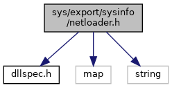

[Namespaces](#namespaces) \| [Enumerations](#enum-members) \| [Functions](#func-members)

`#include "`<a href="dllspec_8h_source.md">dllspec.h</a>`"`
`#include <map>`
`#include <string>`

Include dependency graph for netloader.h:

<a href="sys_2export_2sysinfo_2netloader_8h_source.md">Go to the source code of this file.</a>

|            |                                                              |
|------------|--------------------------------------------------------------|
| Namespaces |                                                              |
|            | <a href="namespacevfinetloader.md">vfinetloader</a> |

|  |  |
|----|----|
| Enumerations |  |
| enum   | <a href="namespacevfinetloader.md#a5f296faf43817f74cdc62a57df124574">sysStatus</a> {   <a href="namespacevfinetloader.md#a5f296faf43817f74cdc62a57df124574a3ab6be3c1b0fd47ca2fcd2d7363b50f0">SYS_ERR</a> = 0, <a href="namespacevfinetloader.md#a5f296faf43817f74cdc62a57df124574a21933eb4e27259f1a267e9fb749a489d">SYS_MSG</a> = 1, <a href="namespacevfinetloader.md#a5f296faf43817f74cdc62a57df124574ac669b4cc9530e9b8d205cd6c4a41607c">SYS_DNLD_FILE</a> = 2, <a href="namespacevfinetloader.md#a5f296faf43817f74cdc62a57df124574a2eb37b39c728843c7f77129bac4f4e59">SYS_DNLD_DONE</a> = 3,   <a href="namespacevfinetloader.md#a5f296faf43817f74cdc62a57df124574a1ea0900fd364c4bad650e83da73855d4">SYS_DNLD_ERR</a> = 4, <a href="namespacevfinetloader.md#a5f296faf43817f74cdc62a57df124574aa026777c6f5b3cee773aade827188da5">SYS_DNLD_INSTALL</a> = 5, <a href="namespacevfinetloader.md#a5f296faf43817f74cdc62a57df124574ae4aa6c6e56e57aee208fd3edfd0ec096">SYS_DNLD_INSTALL_DONE</a> = 6, <a href="namespacevfinetloader.md#a5f296faf43817f74cdc62a57df124574a196ac998408748267d37a9fc867f276d">SYS_DNLD_INSTALL_FAIL</a> = 7,   <a href="namespacevfinetloader.md#a5f296faf43817f74cdc62a57df124574a1621f521ace543fe69dc4fdf31e943a2">SYS_REBOOT</a> = 8, <a href="namespacevfinetloader.md#a5f296faf43817f74cdc62a57df124574a5faeb632dd222d6dec15ed7517c00e57">SYS_FILE_FINISH</a> = 9, <a href="namespacevfinetloader.md#a5f296faf43817f74cdc62a57df124574a1d3ebe09ea1b211ab781dbe36db40e9d">SYS_REBOOT_REQUIRED</a> = 10, <a href="namespacevfinetloader.md#a5f296faf43817f74cdc62a57df124574ad06d637dd93eb8ec348fe3f71f424ddc">SYS_BASE_INSTALL_FAIL</a> = 11,   <a href="namespacevfinetloader.md#a5f296faf43817f74cdc62a57df124574a4dd35a555c49706006658088a4a353a1">SYS_NETLOADER_READY</a> = 100, <a href="namespacevfinetloader.md#a5f296faf43817f74cdc62a57df124574aba573103184526a99faf0ff769fbc087">SYS_NETLOADER_EXIT</a> = 200 } |
| enum   | <a href="namespacevfinetloader.md#aed6b03cebf679080000ec2bc8e934436">sysMsgMode</a> { <a href="namespacevfinetloader.md#aed6b03cebf679080000ec2bc8e934436ad1bbcd783f557f7d8f9dee3af5820fc7">SYS_EXT_MSG_DISABLED</a> = 0, <a href="namespacevfinetloader.md#aed6b03cebf679080000ec2bc8e934436ada6e7f6d43a0f5efa4f0cc6a80d33ef0">SYS_EXT_MSG</a> = 1, <a href="namespacevfinetloader.md#aed6b03cebf679080000ec2bc8e934436a722c4c0d8e05257102ccdb41180842cd">SYS_EXT_MSG_1_2</a> = 2, <a href="namespacevfinetloader.md#aed6b03cebf679080000ec2bc8e934436a9b4c794232f8f1a26e9edce0fe8a9c0d">SYS_EXT_MSG_1</a> = 9 } |
| enum   | <a href="namespacevfinetloader.md#a94cc038c7531a6a77b801ea738c8c207">sysReadMode</a> { <a href="namespacevfinetloader.md#a94cc038c7531a6a77b801ea738c8c207a6eb1637d52cb720bad9093a06b3d0ce9">SYS_BLOCKING</a> = 0, <a href="namespacevfinetloader.md#a94cc038c7531a6a77b801ea738c8c207aa94ece816839eabaf0167cdb5de9314c">SYS_NON_BLOCKING</a> = 1, <a href="namespacevfinetloader.md#a94cc038c7531a6a77b801ea738c8c207a71f587b6099a2f4c5ae573a4d4a5eb5d">SYS_LAST</a> = 2, <a href="namespacevfinetloader.md#a94cc038c7531a6a77b801ea738c8c207ab87968ad51b944e6b68d2bc38cb2a3cd">SYS_CANCEL</a> = 9 } |

|  |  |
|----|----|
| Functions |  |
| <a href="dllspec_8h.md#a06244aced91c3fbc18547181038765aa">SYS_INFO_API</a> int  | <a href="namespacevfinetloader.md#a242ae7a34df4fc588df0296a73764506">sysNetloaderStart</a> () |
| <a href="dllspec_8h.md#a06244aced91c3fbc18547181038765aa">SYS_INFO_API</a> int  | <a href="namespacevfinetloader.md#a9c618b2b0fc7eeb76f20889cdb3ce902">sysNetloaderStartBase</a> () |
| <a href="dllspec_8h.md#a06244aced91c3fbc18547181038765aa">SYS_INFO_API</a> int  | <a href="namespacevfinetloader.md#a165fe3f559570c22c65f6eee716d9fe9">sysNetloaderStopBase</a> () |
| <a href="dllspec_8h.md#a06244aced91c3fbc18547181038765aa">SYS_INFO_API</a> int  | <a href="namespacevfinetloader.md#a90f91ae17b4e14bd4ce0787a83b2e34a">sysNetloaderStop</a> () |
| <a href="dllspec_8h.md#a06244aced91c3fbc18547181038765aa">SYS_INFO_API</a> int  | <a href="namespacevfinetloader.md#a4ae7ef57aab598e83caeb2dae452bdf4">sysNetloaderVersion</a> (std::string &version) |
| <a href="dllspec_8h.md#a06244aced91c3fbc18547181038765aa">SYS_INFO_API</a> int  | <a href="namespacevfinetloader.md#a406deb2a09c387517e831dda0726f3e5">sysNetloaderSetMsgMode</a> (int type) |
| <a href="dllspec_8h.md#a06244aced91c3fbc18547181038765aa">SYS_INFO_API</a> int  | <a href="namespacevfinetloader.md#a127d1c5998677e041be0271ea9578f20">sysNetloaderGetMsg</a> (std::string &msg, int flags) |
