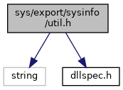

[Namespaces](#namespaces) \| [Functions](#func-members)

`#include <string>`
`#include "`<a href="dllspec_8h_source.md">dllspec.h</a>`"`

Include dependency graph for util.h:

<a href="sys_2export_2sysinfo_2util_8h_source.md">Go to the source code of this file.</a>

|            |                                                          |
|------------|----------------------------------------------------------|
| Namespaces |                                                          |
|            | <a href="namespacevfisysinfo.md">vfisysinfo</a> |

|  |  |
|----|----|
| Functions |  |
| <a href="dllspec_8h.md#a06244aced91c3fbc18547181038765aa">SYS_INFO_API</a> void  | <a href="namespacevfisysinfo.md#a90408ce42d820e13f0f2c7daf474e549">Dsp2Hex</a> (char \*dsp, long \*hex, unsigned int n) |
| <a href="dllspec_8h.md#a06244aced91c3fbc18547181038765aa">SYS_INFO_API</a> int  | <a href="namespacevfisysinfo.md#a209d53b4f90b64ad292fa420911cb385">sysPutEnv</a> (const std::string &section, const std::string &label, const std::string &<a href="_web_service_wrappers_8c.md#a6e248376c0290338633d8137822eb209">value</a>) |
| <a href="dllspec_8h.md#a06244aced91c3fbc18547181038765aa">SYS_INFO_API</a> int  | <a href="namespacevfisysinfo.md#a2f4d2c358c2c96255fe07dc63815c341">sysGetEnv</a> (const std::string &section, const std::string &label, std::string &<a href="_web_service_wrappers_8c.md#a6e248376c0290338633d8137822eb209">value</a>) |
