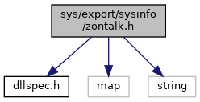

[Namespaces](#namespaces) \| [Typedefs](#typedef-members) \| [Enumerations](#enum-members) \| [Functions](#func-members)

`#include "`<a href="dllspec_8h_source.md">dllspec.h</a>`"`
`#include <map>`
`#include <string>`

Include dependency graph for zontalk.h:

<a href="sys_2export_2sysinfo_2zontalk_8h_source.md">Go to the source code of this file.</a>

|            |                                                          |
|------------|----------------------------------------------------------|
| Namespaces |                                                          |
|            | <a href="namespacevfizontalk.md">vfizontalk</a> |

|  |  |
|----|----|
| Typedefs |  |
| typedef void(\*  | <a href="namespacevfizontalk.md#acd26f94f8d6f0a69f2a7a19bbd0f7ae2">recieve_callback</a>) (char \*) |
| typedef void(\*  | <a href="namespacevfizontalk.md#a5f8e498595d421ca054e012b792ade7a">end_callback</a>) (int) |

|  |  |
|----|----|
| Enumerations |  |
| enum   | <a href="namespacevfizontalk.md#a56f38ce1d91b5263d2ca5af8d537d696">download_type</a> { <a href="namespacevfizontalk.md#a56f38ce1d91b5263d2ca5af8d537d696a34d1361202d8c9652ed81b53cda15159">PARTIAL</a> = 0, <a href="namespacevfizontalk.md#a56f38ce1d91b5263d2ca5af8d537d696ad08f8ac0aa8dfb59589824359772459e">FULL</a> = 1 } |

|  |  |
|----|----|
| Functions |  |
| <a href="dllspec_8h.md#a06244aced91c3fbc18547181038765aa">SYS_INFO_API</a> int  | <a href="namespacevfizontalk.md#a84e98dff4544318d162a761adcf925c1">sysZontalkReceive</a> (short com_port, recieve_callback rc_cb, end_callback end_cb, download_type type) |
| <a href="dllspec_8h.md#a06244aced91c3fbc18547181038765aa">SYS_INFO_API</a> int  | <a href="namespacevfizontalk.md#a0a40c2dc428c53679621bea9a5ad6e44">sysZontalkCancel</a> () |
