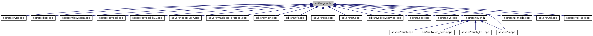

[Data Structures](#nested-classes) \| [Macros](#define-members) \| [Typedefs](#typedef-members) \| [Enumerations](#enum-members) \| [Functions](#func-members)

This graph shows which files directly or indirectly include this file:

<a href="sys_8h_source.md">Go to the source code of this file.</a>

|                 |                                    |
|-----------------|------------------------------------|
| Data Structures |                                    |
| struct          | [thread_data](#structthread__data) |

|  |  |
|----|----|
| Macros |  |
| #define  | [CLA_SYS](#af7805be6c0a1866a0810f2ffc5dfb2dc)   0x20 |
|   | Class for System commands. [More\...](#af7805be6c0a1866a0810f2ffc5dfb2dc)  |
| #define  | [INS_SYS_SYNC_TURN_ON](#aea810192a402df0a33faa882ea076bc8)   0x00 |
|   | Turn On device. [More\...](#aea810192a402df0a33faa882ea076bc8)  |
| #define  | [INS_SYS_TURN_OFF](#a88534d083ea20c7f0e05ede598f105d7)   0x01 |
|   | Turn Off device. [More\...](#a88534d083ea20c7f0e05ede598f105d7)  |
| #define  | [INS_SYS_ABORT](#a9af1087d5ffa81a0f54d93d4c5235c51)   0x02 |
|   | Abort any command in progress. [More\...](#a9af1087d5ffa81a0f54d93d4c5235c51)  |
| #define  | [INS_SYS_GET_CONFIG](#a1e2d090241dfcf12bba5d2e45b3d5f33)   0x03 |
|   | Get device configuration. [More\...](#a1e2d090241dfcf12bba5d2e45b3d5f33)  |
| #define  | [INS_SYS_GET_STATUS](#a98553a2159921c6a4a5e84d933891b0c)   0x04 |
|   | Get device status info. [More\...](#a98553a2159921c6a4a5e84d933891b0c)  |
| #define  | [INS_SYS_SELFTEST](#a2058048dd49ff37e7d14422cf5ffef74)   0x05 |
|   | Perform device selftest. [More\...](#a2058048dd49ff37e7d14422cf5ffef74)  |
| #define  | [INS_SYS_LOCK_PAYMENT](#abd188cb21d2bf805c92a77ddae86eb37)   0x06 |
|   | Lock payment. [More\...](#abd188cb21d2bf805c92a77ddae86eb37)  |
| #define  | [INS_SYS_SET_STATUS](#ac67f66838ed245959518c01ba263c077)   0x09 |
|   | Set device status info. [More\...](#ac67f66838ed245959518c01ba263c077)  |
| #define  | [INS_SYS_AUTH](#ad96983ee0fea39cc2c2de536b01041e5)   0x11 |
|   | Request authentication of data. [More\...](#ad96983ee0fea39cc2c2de536b01041e5)  |
| #define  | [INS_SYS_SET_IDLE_TEXT](#a4716584d8cc1ceb9913b81093b1eb0bb)   0x13 |
|   | Set the text displayed in the idle sceen (replaces the welcome text if set) [More\...](#a4716584d8cc1ceb9913b81093b1eb0bb)  |
| #define  | [INS_SYS_SW_UPLOAD_START](#a3ed8b7fb7f077ce09888eeefd0e6ba30)   0x14 |
|   | Start a software upload. [More\...](#a3ed8b7fb7f077ce09888eeefd0e6ba30)  |
| #define  | [INS_SYS_SW_UPLOAD_TRANSFER](#a586ae83176f7669aca82a81a762f6021)   0x15 |
|   | Transfer record data for software upload. [More\...](#a586ae83176f7669aca82a81a762f6021)  |
| #define  | [INS_SYS_SW_UPLOAD_FINALIZE](#aab035bdcfd31ec20cede910f2dd11be4)   0x16 |
|   | Finalize a software upload. [More\...](#aab035bdcfd31ec20cede910f2dd11be4)  |
| #define  | [INS_SYS_SHUTDOWN_REBOOT_SLEEP](#a3ab736555cafdb3b2edc7576a8fa090d)   0x17 |
|   | Shutdown, reboot or set the terminal to sleep. [More\...](#a3ab736555cafdb3b2edc7576a8fa090d)  |
| #define  | [INS_SYS_MAC_SHOW_DESKTOP](#a556d381c46ef2c2e6a4839efb62286f7)   0x18 |
|   | Show the MAC desktop. [More\...](#a556d381c46ef2c2e6a4839efb62286f7)  |
| #define  | [INS_SYS_SET_PROPERTY](#af8dac5fd1f8896a26d7a7c5045470a56)   0x19 |
|   | Serialized <a href="namespacevfisysinfo.md#a377307b06ac969f30af51e7cccf94dbb">sysSetPropertyInt()</a>/sysSetPropertyString() command. [More\...](#af8dac5fd1f8896a26d7a7c5045470a56)  |
| #define  | [INS_SYS_GET_PROPERTY](#a1f14950b662d9c0e92ff8bc514e2cec7)   0x1A |
|   | Serialized <a href="namespacevfisysinfo.md#ab94a5b33000760afbee10e7fefd16355">sysGetPropertyInt()</a>/sysGetPropertyString() command. [More\...](#a1f14950b662d9c0e92ff8bc514e2cec7)  |
| #define  | [INS_SYS_INSTALL_SPONSOR_CERT](#a183b9d13fdd951745876c62e4e9f36cb)   0x1B |
|   | Check and Install Sponsor Cert. [More\...](#a183b9d13fdd951745876c62e4e9f36cb)  |
| #define  | [INS_SYS_GET_VERSION_INFO](#ae6edcfe0f7e81b59e5716fe53053fd86)   0x1C |
|   | Get version info of SDI components. [More\...](#ae6edcfe0f7e81b59e5716fe53053fd86)  |
| #define  | [INS_SYS_CHECK_FOR_UPDATE](#a5b39f9b83e478aae444085ed9965f7de)   0x1D |
|   | Check for updates. [More\...](#a5b39f9b83e478aae444085ed9965f7de)  |
| #define  | [INS_SYS_SW_GET_LAST_INSTALL_ERROR](#a3270a127f531045f7684ef1347020658)   0x1E |
|   | Get last install error from secure installer and reset. [More\...](#a3270a127f531045f7684ef1347020658)  |
| #define  | [INS_SYS_EXT_BUTTON](#ac05d62b099d61b2dc58ba436a2d83a64)   0x20 |
|   | External button was pressed. [More\...](#ac05d62b099d61b2dc58ba436a2d83a64)  |
| #define  | [INS_SYS_EPP_ENABLE](#a5a3270374de9c98314ce16b41c1b2a87)   0x21 |
|   | Enable/Disable EPP. [More\...](#a5a3270374de9c98314ce16b41c1b2a87)  |
| #define  | [INS_SYS_FACTORY_RESET](#aadd77f7ec4c84183e9f11979d6cc14ef)   0x22 |
|   | Factory Reset. [More\...](#aadd77f7ec4c84183e9f11979d6cc14ef)  |
| #define  | [INS_SYS_READ_CERTIFICATE](#a52291f320dbd3b054203375b5bf368dd)   0x23 |
|   | Read Certificate. [More\...](#a52291f320dbd3b054203375b5bf368dd)  |
| #define  | [INS_SYS_FORCE_CURR_ABBR](#afba0f2e965faeae316893bbfb1871746)   0x24 |
|   | Force Currency Abbreviation. [More\...](#afba0f2e965faeae316893bbfb1871746)  |
| #define  | [MAX_OUT_MSG_SIZE_A](#a535a37cbfd7f58dd8f5dbdb69ababfd9)   0xFFF0 |
| #define  | [MAX_OUT_MSG_SIZE_B_C_D](#a0a4d3755c2b2df8a7d65e91e847f3f0b)   0xFFFF |
| #define  | [MIN](#a3acffbd305ee72dcd4593c0d8af64a4f)(a, b)   ((a)\<(b)?(a):(b)) |

|  |  |
|----|----|
| Typedefs |  |
| typedef struct [thread_data](#structthread__data)  | [Thread_Data](#a180fda2fed413013609591e0b565b8e8) |

|  |  |
|----|----|
| Enumerations |  |
| enum   | [ExtserverResult](#a0ee277aec4317de742cf8b2bd40af3a9) {   [RESULT_OK](#a0ee277aec4317de742cf8b2bd40af3a9a818c541216b4ca0e29b7885495a46ad2) = 0, [RESULT_FAIL](#a0ee277aec4317de742cf8b2bd40af3a9adbaa15b6c3bcc0196b4b314fac50e36c) = -1, [RESULT_TIMEOUT](#a0ee277aec4317de742cf8b2bd40af3a9ad02c8491b0eab6eab286a00466993805) = -2, [RESULT_USER_CANCEL](#a0ee277aec4317de742cf8b2bd40af3a9ae9a95470ffa907b24be20927bd6b6524) = -3,   [RESULT_MOBILE_ABORT](#a0ee277aec4317de742cf8b2bd40af3a9ae0fc559eeb55b5d25b1e3dad4877f02a) = -4, [RESULT_NO_LINK](#a0ee277aec4317de742cf8b2bd40af3a9abb0279cf3581b071df7f16d126c87477) = -5, [RESULT_CLEAR_BUTTON](#a0ee277aec4317de742cf8b2bd40af3a9ae3422d8a18a394540cab891cb3b59b78) = -6, [RESULT_DATA_AVAILABLE](#a0ee277aec4317de742cf8b2bd40af3a9a54ebd26ad0cc26331ce3189908bc1866) = -7,   [RESULT_EXCESSIVE_PIN_REQUESTS](#a0ee277aec4317de742cf8b2bd40af3a9ab7791209b54a1f594110c871500ac7cc) = -8, [RESULT_TAG_ERROR](#a0ee277aec4317de742cf8b2bd40af3a9a98a7e70df73757a57d668cea47b6e058) = -9, [RESULT_TAG_LENGTH_ERROR](#a0ee277aec4317de742cf8b2bd40af3a9a9b341401cd6686c61d31b0ab76fd3ef1) = -10, [RESULT_PARAMETER_ERROR](#a0ee277aec4317de742cf8b2bd40af3a9abdddee10f743a36a524e311669116326) = -11,   [RESULT_INTERCHAR_TIMEOUT](#a0ee277aec4317de742cf8b2bd40af3a9aeaabb76b9cc0decb0985ea5797440b88) = -12, [RESULT_LOGIC_ERROR](#a0ee277aec4317de742cf8b2bd40af3a9a112f04f754eb9b75ffc9852d4c0fb156) = -13 } |
| enum   | [UploadType](#a6cd49ae0288c8ad7e57768049b88e2c0) {   [UPLOAD_TYPE_SOFTWARE_UPDATE](#a6cd49ae0288c8ad7e57768049b88e2c0a7bf67041c45c44d425c383a7ebcdfe46), [UPLOAD_TYPE_CONFIG_WHITELIST](#a6cd49ae0288c8ad7e57768049b88e2c0a34f5269aab5031c2734b5adc6680497e), [UPLOAD_TYPE_CONFIG_SENSITIVE_TAGS](#a6cd49ae0288c8ad7e57768049b88e2c0a2673e19024e6247e70a2af83476dde43), [UPLOAD_TYPE_CONFIG_CARD_RANGES](#a6cd49ae0288c8ad7e57768049b88e2c0a81fd3b513fd362d89e3aa7694b8da5ba),   [UPLOAD_TYPE_FIRMWARE_UPDATE](#a6cd49ae0288c8ad7e57768049b88e2c0a7ea1f2e7950b794e9cb1937237ad67af), [UPLOAD_TYPE_KEYS](#a6cd49ae0288c8ad7e57768049b88e2c0a45cf0bd2cd8c067e00540e4eeb5cf688), [UPLOAD_TYPE_CONFIG_SDIEMV](#a6cd49ae0288c8ad7e57768049b88e2c0a794564e38d5b307089756bf59d4cefa9), [UPLOAD_TYPE_REMOVE_SPONSOR](#a6cd49ae0288c8ad7e57768049b88e2c0ac0b55fa237e2c9e6404a01ddaa64e114),   [UPLOAD_TYPE_REMOVE_CONFIG_SDIEMV](#a6cd49ae0288c8ad7e57768049b88e2c0a41e05b1531d19de605151972bfd31bec), [UPLOAD_TYPE_PLUGIN](#a6cd49ae0288c8ad7e57768049b88e2c0a0e250606f2be91f748221a82209ead8a), [UPLOAD_TYPE_REMOVE_PLUGIN](#a6cd49ae0288c8ad7e57768049b88e2c0affd345175d249f8c98f96e0ee0d19c17), [UPLOAD_TYPE_CP_PACKAGE](#a6cd49ae0288c8ad7e57768049b88e2c0a87320aad5379f54e7385ba48e735b3e2),   [UPLOAD_TYPE_EMV_CONFIG_PACKAGE](#a6cd49ae0288c8ad7e57768049b88e2c0a538ea2e0f3f71bc276c0d87787edf922), [UPLOAD_TYPE_UVRK_PACKAGE](#a6cd49ae0288c8ad7e57768049b88e2c0a90968c682bc475511600bccf72633511), [UPLOAD_TYPE_MAX](#a6cd49ae0288c8ad7e57768049b88e2c0a51246b9edc5cc59323c993619584e692) } |
| enum   | [IdleScreenMode](#acdffce6b62c4db2a50dd9cdae6caba78) { [Idle_Normal](#acdffce6b62c4db2a50dd9cdae6caba78abe85fe1a66041bcdd883413a79606363) = 0, [Idle_MenuEnabled](#acdffce6b62c4db2a50dd9cdae6caba78a18fc0e990d0fa8795a191a2a03b9ef64) = 1, [Idle_WaitLogo](#acdffce6b62c4db2a50dd9cdae6caba78a6bc06fe4ebc2a6b6d3e76ea084f42710) = 2, [Idle_NoAdminMode](#acdffce6b62c4db2a50dd9cdae6caba78a2ddddb450f003d9d854201353a3cd4b6) = 4 } |
| enum   | [IdleLockType](#acbca865bf1cc550151c765b4bb11dc7e) { [ILT_NoLock](#acbca865bf1cc550151c765b4bb11dc7ea78d433f6f876bbc24a90dbccae665624) = 0, [ILT_ApiLock](#acbca865bf1cc550151c765b4bb11dc7ea952eed5112fd85859a0bd8ecd62b9647) = 1, [ILT_AdminLock](#acbca865bf1cc550151c765b4bb11dc7ea0af1ff86e1129d6f7f9ad06a68a7b104) = 2 } |

|  |  |
|----|----|
| Functions |  |
| bool  | [handleSystemCmd](#afe8ab8c8d592d69c0b6d074f03081d3e) (unsigned long msgBufSize, unsigned char \*msg, unsigned long msgSize, unsigned short rspBufSize, unsigned char \*rsp, unsigned short \*rspSize) |
| int  | [check4Interrupt](#af8ff9f4a2125f866eda540eaf867197b) (void) |
| void  | [setInterrupt](#a86502db8f28fe31f7ee0266a97ee156a) (enum [ExtserverResult](#a0ee277aec4317de742cf8b2bd40af3a9) reason) |
| int  | [isCardRemoved](#a43801947261b861981e5f2c52e878fa0) (void) |
| const char \*  | [errText](#ae05a33a2f7e55688d36a0692fc795ffe) (int err) |
| void  | [setDevice2Idle](#ac28a8edfbaded7c71c0e249ae70aba3b) (void) |
| void  | [sysDisplayIdleScreen](#ad2bc24707c477aa4c2cb1c4fb92855df) (unsigned mode=[Idle_Normal](#acdffce6b62c4db2a50dd9cdae6caba78abe85fe1a66041bcdd883413a79606363), const char \*idletext=0) |
| bool  | [sysSetIdleScreenFinished](#a02ab2d39fc437b5924aed122a8adb57e) (unsigned long id) |
| void  | [sysSetIdleScreenAdminMenu](#af85581548b99a07d923feb33e0297b5c) (bool on) |
| bool  | [sysSetIdleScreenLocked](#af0f2a2ccba88c6c9f0ee759172febaa0) (bool lock=true, bool update_screen=true) |
| enum [IdleLockType](#acbca865bf1cc550151c765b4bb11dc7e)  | [sysGetIdleScreenLocked](#af826b34d72f2718baf08d472448063bd) () |
| void  | [setSW1SW2](#a2b1e62cbba20fe441f74365bab09c22c) (int result, unsigned char \*rsp) |
| bool  | [sys_internal_android](#a914eb0ad5b455073caeed46e742f3cd2) () |
| bool  | [vos_sys8](#a7109ff8195a9046828f8120509022d76) () |
| bool  | [checkBundleInstalled](#a3aeb676c0c19ca74396503eb1267f979) (const char \*bdlname) |
| bool  | [isHwModelName](#aadbe3a6553fce242b52a2655173897fe) (const char \*targetHwModelName) |
| void  | [sysResetUpdateContext](#a6777013b116ca3f41fc511143671ef8e) (void \*handle) |

------------------------------------------------------------------------

## DataStructure Documentation {#data-structure-documentation}

## thread_data 

struct thread_data

| Data Fields   |               |     |
|---------------|---------------|-----|
| void \*       | addThreadData |     |
| char \*       | cmdData       |     |
| unsigned long | cmdSize       |     |
| int           | taskId        |     |

## MacroDefinition Documentation {#macro-definition-documentation}

## CLA_SYS 

#define CLA_SYS   0x20

Class for System commands.

## INS_SYS_ABORT 

#define INS_SYS_ABORT   0x02

Abort any command in progress.

## INS_SYS_AUTH 

#define INS_SYS_AUTH   0x11

Request authentication of data.

## INS_SYS_CHECK_FOR_UPDATE 

#define INS_SYS_CHECK_FOR_UPDATE   0x1D

Check for updates.

## INS_SYS_EPP_ENABLE 

#define INS_SYS_EPP_ENABLE   0x21

Enable/Disable EPP.

## INS_SYS_EXT_BUTTON 

#define INS_SYS_EXT_BUTTON   0x20

External button was pressed.

## INS_SYS_FACTORY_RESET 

#define INS_SYS_FACTORY_RESET   0x22

Factory Reset.

## INS_SYS_FORCE_CURR_ABBR 

#define INS_SYS_FORCE_CURR_ABBR   0x24

Force Currency Abbreviation.

## INS_SYS_GET_CONFIG 

#define INS_SYS_GET_CONFIG   0x03

Get device configuration.

## INS_SYS_GET_PROPERTY 

#define INS_SYS_GET_PROPERTY   0x1A

Serialized <a href="namespacevfisysinfo.md#ab94a5b33000760afbee10e7fefd16355">sysGetPropertyInt()</a>/sysGetPropertyString() command.

## INS_SYS_GET_STATUS 

#define INS_SYS_GET_STATUS   0x04

Get device status info.

## INS_SYS_GET_VERSION_INFO 

#define INS_SYS_GET_VERSION_INFO   0x1C

Get version info of SDI components.

## INS_SYS_INSTALL_SPONSOR_CERT 

#define INS_SYS_INSTALL_SPONSOR_CERT   0x1B

Check and Install Sponsor Cert.

## INS_SYS_LOCK_PAYMENT 

#define INS_SYS_LOCK_PAYMENT   0x06

Lock payment.

## INS_SYS_MAC_SHOW_DESKTOP 

#define INS_SYS_MAC_SHOW_DESKTOP   0x18

Show the MAC desktop.

## INS_SYS_READ_CERTIFICATE 

#define INS_SYS_READ_CERTIFICATE   0x23

Read Certificate.

## INS_SYS_SELFTEST 

#define INS_SYS_SELFTEST   0x05

Perform device selftest.

## INS_SYS_SET_IDLE_TEXT 

#define INS_SYS_SET_IDLE_TEXT   0x13

Set the text displayed in the idle sceen (replaces the welcome text if set)

## INS_SYS_SET_PROPERTY 

#define INS_SYS_SET_PROPERTY   0x19

Serialized <a href="namespacevfisysinfo.md#a377307b06ac969f30af51e7cccf94dbb">sysSetPropertyInt()</a>/sysSetPropertyString() command.

## INS_SYS_SET_STATUS 

#define INS_SYS_SET_STATUS   0x09

Set device status info.

## INS_SYS_SHUTDOWN_REBOOT_SLEEP 

#define INS_SYS_SHUTDOWN_REBOOT_SLEEP   0x17

Shutdown, reboot or set the terminal to sleep.

## INS_SYS_SW_GET_LAST_INSTALL_ERROR 

#define INS_SYS_SW_GET_LAST_INSTALL_ERROR   0x1E

Get last install error from secure installer and reset.

## INS_SYS_SW_UPLOAD_FINALIZE 

#define INS_SYS_SW_UPLOAD_FINALIZE   0x16

Finalize a software upload.

## INS_SYS_SW_UPLOAD_START 

#define INS_SYS_SW_UPLOAD_START   0x14

Start a software upload.

## INS_SYS_SW_UPLOAD_TRANSFER 

#define INS_SYS_SW_UPLOAD_TRANSFER   0x15

Transfer record data for software upload.

## INS_SYS_SYNC_TURN_ON 

#define INS_SYS_SYNC_TURN_ON   0x00

Turn On device.

## INS_SYS_TURN_OFF 

#define INS_SYS_TURN_OFF   0x01

Turn Off device.

## MAX_OUT_MSG_SIZE_A 

#define MAX_OUT_MSG_SIZE_A   0xFFF0

## MAX_OUT_MSG_SIZE_B_C_D 

#define MAX_OUT_MSG_SIZE_B_C_D   0xFFFF

## MIN 

#define MIN

## TypedefDocumentation {#typedef-documentation}

## Thread_Data 

typedef struct [thread_data](#structthread__data) [Thread_Data](#a180fda2fed413013609591e0b565b8e8)

## EnumerationType Documentation {#enumeration-type-documentation}

## ExtserverResult 

enum [ExtserverResult](#a0ee277aec4317de742cf8b2bd40af3a9)

Internal Extserver Result Values

| Enumerator |  |
|----|----|
| RESULT_OK  | 
No error
 |
| RESULT_FAIL  | 
Generic error
 |
| RESULT_TIMEOUT  | 
Timeout occurred
 |
| RESULT_USER_CANCEL  | 
User cancellation
 |
| RESULT_MOBILE_ABORT  | 
Abort from mobile device received
 |
| RESULT_NO_LINK  | 
Link to mobile device interrupted
 |
| RESULT_CLEAR_BUTTON  | 
clear button pressed
 |
| RESULT_DATA_AVAILABLE  | 
data available from slave device (e.g EPP)
 |
| RESULT_EXCESSIVE_PIN_REQUESTS  | 
Excessive PIN entry
 |
| RESULT_TAG_ERROR  | 
Tag error
 |
| RESULT_TAG_LENGTH_ERROR  | 
Tag length error
 |
| RESULT_PARAMETER_ERROR  | 
Parameter error
 |
| RESULT_INTERCHAR_TIMEOUT  | 
interchar timeout during input
 |
| RESULT_LOGIC_ERROR  | 
Logic error (e.g. wrong command order)
 |

## IdleLockType 

enum [IdleLockType](#acbca865bf1cc550151c765b4bb11dc7e)

| Enumerator |  |
|----|----|
| ILT_NoLock  | 
idle screen recently not locked
 |
| ILT_ApiLock  | 
idle screen locked by [sysSetIdleScreenLocked()](#af0f2a2ccba88c6c9f0ee759172febaa0)
 |
| ILT_AdminLock  | 
idle screen locked by admin mode
 |

## IdleScreenMode 

enum [IdleScreenMode](#acdffce6b62c4db2a50dd9cdae6caba78)

[TABLE]

## UploadType 

enum [UploadType](#a6cd49ae0288c8ad7e57768049b88e2c0)

Types for sw/file upload command

| Enumerator |  |
|----|----|
| UPLOAD_TYPE_SOFTWARE_UPDATE  | 
0: Software update with SW upload 20-14/20-15/20-16
 |
| UPLOAD_TYPE_CONFIG_WHITELIST  | 
1: Whitelist configuration: whitelist.json with SW upload 20-14/20-15/20-16
 |
| UPLOAD_TYPE_CONFIG_SENSITIVE_TAGS  | 
2: Sensitive tags configuration: sensitivetags.json with SW upload 20-14/20-15/20-16
 |
| UPLOAD_TYPE_CONFIG_CARD_RANGES  | 
3: Card ranges configuration: cardranges.json with SW upload 20-14/20-15/20-16
 |
| UPLOAD_TYPE_FIRMWARE_UPDATE  | 
4: Firmware update with check for update 20-1D
 |
| UPLOAD_TYPE_KEYS  | 
5: Install keys with check for update 20-1D
 |
| UPLOAD_TYPE_CONFIG_SDIEMV  | 
6: User configuration for SDI or EMV with check for update 20-1D
 |
| UPLOAD_TYPE_REMOVE_SPONSOR  | 
7: Remove sponsor certificates with check for update 20-1D
 |
| UPLOAD_TYPE_REMOVE_CONFIG_SDIEMV  | 
8: Remove user configuration for SDI or EMV with check for update 20-1D
 |
| UPLOAD_TYPE_PLUGIN  | 
9: Install SDI plugin(s) with check for update 20-1D
 |
| UPLOAD_TYPE_REMOVE_PLUGIN  | 
10: Remove SDI plugin(s) with check for update 20-1D
 |
| UPLOAD_TYPE_CP_PACKAGE  | 
11: Install commerce platform package with SW upload 20-14/20-15/20-16
 |
| UPLOAD_TYPE_EMV_CONFIG_PACKAGE  | 
12: Install EMV config package with SW upload 20-14/20-15/20-16
 |
| UPLOAD_TYPE_UVRK_PACKAGE  | 
13: Install UVRK package with SW upload 20-14/20-15/20-16. tar file \*.uvrk.tar with flat files of \*.vrk2.json.
 |
| UPLOAD_TYPE_MAX  | 
!!! Must be the last entry, please insert before !!\!
 |

## FunctionDocumentation {#function-documentation}

## check4Interrupt() 

int check4Interrupt

Check if a SysAbort command is received or a Link interruption occurred

### Returns

RESULT_MOBILE_ABORT if a SysAbort is received, RESULT_NO_LINK in case of link interrupt, else RESULT_OK

## checkBundleInstalled() 

bool checkBundleInstalled

check for installed bundle with name `bdlname`. String `bdlname` can be a regular expression.

**Parameters**

\[in\] **bdlname** name of the bundle (or regex)

### Returns

true if the bundle is installed, false in case that `bdlname` does not match an installed bundle


This function works for VOS/VOS2 only. If invoked on other platforms it returns always false.


## errText() 

const char\* errText

Return C-String of error ExtserverResult

### Returns

C-String with error name, \"UNKNOWN\" for unknown error codes

## handleSystemCmd() 

bool handleSystemCmd

Dispatch function to handle different system commands

**Parameters**

\[in\] **msgBufSize** size of the input message buffer \[in\] **msg** pointer to the input message buffer \[in\] **msgSize** size of the input message \[in\] **rspBufSize** maximum size of the response buffer \[in,out\] **rsp** pointer to the response buffer \[in,out\] **rspSize** pointer to the response message size

### Returns

true if command was executed and rsp contains a response, false in case invocation is not allowed by a side command.

## isCardRemoved() 

int isCardRemoved

Check if a Chip Card is removed

### Returns

0 = Card inserted, 1 = Card removed

## isHwModelName() 

bool isHwModelName

Check the Hardware Model Name of the device

**Parameters**

\[in\] **targetHwModelName** target Hardware Model Name

### Returns

true if the Hardware Model Name matches, false if the Hardware Model Name doesn\'t match

## setDevice2Idle() 

void setDevice2Idle

Set the device into idle mode

## setInterrupt() 

void setInterrupt

Make the check4Interrupt return not RESULT_OK once.

## setSW1SW2() 

void setSW1SW2

Map result to SW1/SW2

**Parameters**

\[in\] **result** SDI result code \[in,out\] **rsp** pointer to the response buffer

## sys_internal_android() 

bool sys_internal_android

checks for device types, which run SDI server on Engage and the payment application on the internal Android device. A special internal network is used to connect both devices. Recently these are CM5, M440 and M424. Others like X10 or X8 shall not match, since payment application runs on Engage here.

### Returns

true for internal android with payment application

## sysDisplayIdleScreen() 

void sysDisplayIdleScreen

Display idle screen

**Parameters**

\[in\] **mode** idle screen mode bit mask, see enum IdleScreenMode \[in\] **idletext** optional text used in favor of standard or customer text

## sysGetIdleScreenLocked() 

enum [IdleLockType](#acbca865bf1cc550151c765b4bb11dc7e) sysGetIdleScreenLocked

Returns true, if idle screen was locked either by [sysSetIdleScreenLocked()](#af0f2a2ccba88c6c9f0ee759172febaa0) or admin mode w/o admin menu was turned on by [sysSetIdleScreenAdminMenu()](#af85581548b99a07d923feb33e0297b5c)

### Returns

true, if idle screen is locked, else false

## sysResetUpdateContext() 

void sysResetUpdateContext

Reset update context allocated for SW update with 20-14, 20-15, 20-16. The function is invoked by a thread at connection termination to abort a pending update which was started by command 20-14, but not completed with 20-15 and 20-16. SDI server supports multiple connections, which can use the update interface. With a started update with command 20-14 on one connection, the interface is locked for other connections. If a connection terminates, which obtains the update context (lock), the interface would be unaccessable for other connections. Therfore, this function will abort the started update and unlock the update interface, if the connection disturbes so that it can be used by other connection again.

**Parameters**

\[in\] **handle** handle of the terminating connection

## sysSetIdleScreenAdminMenu() 

void sysSetIdleScreenAdminMenu

Turn on the admin menu, if this was locked by admin mode (enabled by config). Next call of [sysDisplayIdleScreen()](#ad2bc24707c477aa4c2cb1c4fb92855df) with mode Idle_MenuEnabled then will display idle screen with menu/info softkey/keyhelpers.


This function has no effect, if admin mode is disabled (not enabled by config).


## sysSetIdleScreenFinished() 

bool sysSetIdleScreenFinished

Function called by idlescreen callback to signal the return of idlescreen

**Parameters**

\[in\] **id** idlescreen ID forwarded by idlescreen callback

### Returns

true, if the last idle screen has display the admin menu, (for active admin mode) else false is returned.

## sysSetIdleScreenLocked() 

bool sysSetIdleScreenLocked

Lock/Unlock the idle screen and disable/enable softkeys/keyhelpers to access the menu. If locked, further subsequent calls of [`sysDisplayIdleScreen()`](#ad2bc24707c477aa4c2cb1c4fb92855df) with mode `Idle_MenuEnabled` are suppressed and idle screen is displayed without softkeys/keyhelpers. Parameter `update_screen` (set to true) will replace an existing idle screen by a default idle screen by invoking function [sysDisplayIdleScreen()](#ad2bc24707c477aa4c2cb1c4fb92855df) with or without option Idle_MenuEnabled depending on the new lock state `lock`.

**Parameters**

**lock** new lock state: true/false to lock/unlock the idle screen **update_screen** update an existing idle screen and enable/disable menu according new lock state

### Returns

old lock state (before this function was called): true, if the idlescreen was already locked false, if the idlescreen was already unlocked


This function does nothing, if SDI admin mode was enabled by configuration. The admin mode defines another behavior for locking the idle screen (e.g. it must be always unlocked by key combination or touch. Thus, internal calls of this function, will be ignored


## vos_sys8() 

bool vos_sys8

returns true, if SDI server runs on V/OS as system user sys8

### Returns

true if running as sys8 user
