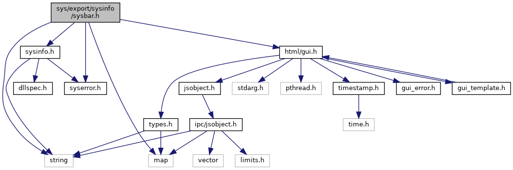
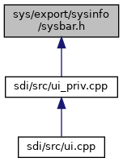

[Namespaces](#namespaces) \| [Macros](#define-members) \| [Typedefs](#typedef-members) \| [Functions](#func-members)

`#include <map>`
`#include <string>`
`#include "`<a href="syserror_8h_source.md">syserror.h</a>`"`
`#include "`<a href="sysinfo_8h_source.md">sysinfo.h</a>`"`
`#include "`<a href="gui_8h_source.md">html/gui.h</a>`"`

Include dependency graph for sysbar.h:

This graph shows which files directly or indirectly include this file:

<a href="sysbar_8h_source.md">Go to the source code of this file.</a>

|            |                                                          |
|------------|----------------------------------------------------------|
| Namespaces |                                                          |
|            | <a href="namespacevfisysinfo.md">vfisysinfo</a> |

|  |  |
|----|----|
| Macros |  |
| #define  | <a href="group__sysbar.md#ga126c91e085914983e138add8b3591cdd">SYS_BAR_API</a> |

|  |  |
|----|----|
| Typedefs |  |
| typedef void(\*  | <a href="namespacevfisysinfo.md#ac7fde07fc977e9f7312af64267659506">sysStatusbarCallback</a>) (void \*data, int region_id, std::map\< std::string, std::string \> &values) |
| typedef <a href="namespacevfigui.md#a29ea0490208725e330b8b11f770b51a7">vfigui::uiAsyncCallback</a>  | <a href="namespacevfisysinfo.md#a3ec38c5db698e56859eb3e175363d22f">sysStatusbarReturnCallback</a> |

|  |  |
|----|----|
| Functions |  |
| <a href="group__sysbar.md#ga126c91e085914983e138add8b3591cdd">SYS_BAR_API</a> int  | <a href="namespacevfisysinfo.md#adb049b3a939a78dedeae1ac9aa15c9df">sysStartStatusbarURL</a> (int region_id, const std::string &url, const std::map\< std::string, std::string \> &values, sysStatusbarCallback cb=0, void \*cbdata=0) |
| <a href="group__sysbar.md#ga126c91e085914983e138add8b3591cdd">SYS_BAR_API</a> int  | <a href="namespacevfisysinfo.md#a6401aac22f963860ed0cc55c227ecf8f">sysStartStatusbarURLReturnVal</a> (int region_id, const std::string &url, const std::map\< std::string, std::string \> &values, sysStatusbarCallback cb, void \*cbdata, sysStatusbarReturnCallback returncb) |
| <a href="group__sysbar.md#ga126c91e085914983e138add8b3591cdd">SYS_BAR_API</a> int  | <a href="namespacevfisysinfo.md#a002c2133e3e778923940535109afcca4">sysStartStatusbar</a> (int region_id, const std::string &html, const std::map\< std::string, std::string \> &values, const std::string &resource_path=std::string(), sysStatusbarCallback cb=0, void \*cbdata=0, sysStatusbarReturnCallback returncb=0) |
| <a href="group__sysbar.md#ga126c91e085914983e138add8b3591cdd">SYS_BAR_API</a> int  | <a href="namespacevfisysinfo.md#aa28127dbc1ddc94bd9c2b784a98c634c">sysStopStatusbar</a> (int region_id) |
| <a href="group__sysbar.md#ga126c91e085914983e138add8b3591cdd">SYS_BAR_API</a> int  | <a href="namespacevfisysinfo.md#a445f352501e089696320af9f48a43013">sysSetStatusbarValues</a> (int region_id, const std::map\< std::string, std::string \> &values) |
| <a href="group__sysbar.md#ga126c91e085914983e138add8b3591cdd">SYS_BAR_API</a> int  | <a href="namespacevfisysinfo.md#a5babb03e766504b26dde5e51a7f5940d">sysGetStatusbarValues</a> (int region_id, std::map\< std::string, std::string \> &values) |
| <a href="group__sysbar.md#ga126c91e085914983e138add8b3591cdd">SYS_BAR_API</a> int  | <a href="namespacevfisysinfo.md#aab58488e2ed93f92618307af850f9880">sysSetRefreshTime</a> (int region_id, int refresh_time_ms) |
| <a href="group__sysbar.md#ga126c91e085914983e138add8b3591cdd">SYS_BAR_API</a> int  | <a href="namespacevfisysinfo.md#aec0cd92586bee1cd0df1d8637994983a">sysGetRefreshTime</a> (int region_id, int \*refresh_time_ms) |
| <a href="group__sysbar.md#ga126c91e085914983e138add8b3591cdd">SYS_BAR_API</a> int  | <a href="namespacevfisysinfo.md#a0a4c0bc815229837e50e2353c1fb9f51">sysRefreshStatusBar</a> (int region_id) |
| const <a href="group__sysbar.md#ga126c91e085914983e138add8b3591cdd">SYS_BAR_API</a> char \*  | <a href="namespacevfisysinfo.md#a8ce093c74ec3a14ede2e8a89ac6af707">sysStatusbar_GetVersion</a> () |
| const <a href="group__sysbar.md#ga126c91e085914983e138add8b3591cdd">SYS_BAR_API</a> char \*  | <a href="namespacevfisysinfo.md#ab9295a05fc42ca989db452a788e77400">sysStatusbarGetVersion</a> () |
