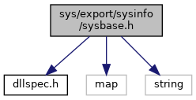

[Namespaces](#namespaces) \| [Functions](#func-members)

`#include "`<a href="dllspec_8h_source.md">dllspec.h</a>`"`
`#include <map>`
`#include <string>`

Include dependency graph for sysbase.h:

<a href="sysbase_8h_source.md">Go to the source code of this file.</a>

|            |                                                          |
|------------|----------------------------------------------------------|
| Namespaces |                                                          |
|            | <a href="namespacevfisysbase.md">vfisysbase</a> |

|  |  |
|----|----|
| Functions |  |
| <a href="dllspec_8h.md#a06244aced91c3fbc18547181038765aa">SYS_INFO_API</a> int  | <a href="namespacevfisysbase.md#aa658507910d7a23d2a62b0193a284abf">sysTransferToBase</a> (const std::string &ip_addr, const std::string &filename) |
