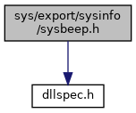
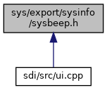

[Namespaces](#namespaces) \| [Functions](#func-members)

`#include "`<a href="dllspec_8h_source.md">dllspec.h</a>`"`

Include dependency graph for sysbeep.h:

This graph shows which files directly or indirectly include this file:

<a href="sysbeep_8h_source.md">Go to the source code of this file.</a>

|            |                                                          |
|------------|----------------------------------------------------------|
| Namespaces |                                                          |
|            | <a href="namespacevfisysinfo.md">vfisysinfo</a> |

|  |  |
|----|----|
| Functions |  |
| <a href="dllspec_8h.md#a06244aced91c3fbc18547181038765aa">SYS_INFO_API</a> int  | <a href="namespacevfisysinfo.md#a44a9ee5ce7fe78c798eb2ad1db29c356">sysBeepNormal</a> (int volume) |
| <a href="dllspec_8h.md#a06244aced91c3fbc18547181038765aa">SYS_INFO_API</a> int  | <a href="namespacevfisysinfo.md#afe4e3fa3d5e705451be9469978f7fd44">sysBeepError</a> (int volume) |
| <a href="dllspec_8h.md#a06244aced91c3fbc18547181038765aa">SYS_INFO_API</a> int  | <a href="namespacevfisysinfo.md#a920110b547bce1eb8e0c016d4064886f">sysPlaySound</a> (int note, int duration, int volume) |
| <a href="dllspec_8h.md#a06244aced91c3fbc18547181038765aa">SYS_INFO_API</a> int  | <a href="namespacevfisysinfo.md#a345cb89a149cb5931e68a989da7c5a32">sysPlaySoundFreq</a> (int frequency, int duration, int volume) |
