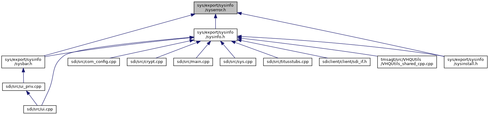

[Namespaces](#namespaces) \| [Enumerations](#enum-members)

This graph shows which files directly or indirectly include this file:

<a href="syserror_8h_source.md">Go to the source code of this file.</a>

|            |                                                          |
|------------|----------------------------------------------------------|
| Namespaces |                                                          |
|            | <a href="namespacevfisysinfo.md">vfisysinfo</a> |

|  |  |
|----|----|
| Enumerations |  |
| enum   | <a href="namespacevfisysinfo.md#aadc050f211cba10bc174fe72cc02ac09">sysError</a> {   <a href="namespacevfisysinfo.md#aadc050f211cba10bc174fe72cc02ac09ab5f89011b3966738d416aa0aadf18d92">SYS_ERR_OK</a> = 0, <a href="namespacevfisysinfo.md#aadc050f211cba10bc174fe72cc02ac09aee91879eb5487ea1c08c5df3f2f24ce9">SYS_ERR_PROP_UNSUPPORTED</a> = -1, <a href="namespacevfisysinfo.md#aadc050f211cba10bc174fe72cc02ac09acc98a3e7cf09547bd1edb15246e9a834">SYS_ERR_PROP_READ_ONLY</a> = -2, <a href="namespacevfisysinfo.md#aadc050f211cba10bc174fe72cc02ac09a64be0d83464a4ed0029c2ab2dad2630e">SYS_ERR_PROP_WRITE_ONLY</a> = -3,   <a href="namespacevfisysinfo.md#aadc050f211cba10bc174fe72cc02ac09ad6fb86a08ba48db4f333915ae4a74aba">SYS_ERR_PARAMETER</a> = -4, <a href="namespacevfisysinfo.md#aadc050f211cba10bc174fe72cc02ac09a98294b67b51a3fefb96bb3d2e561e21f">SYS_ERR_PERMISSION</a> = -5, <a href="namespacevfisysinfo.md#aadc050f211cba10bc174fe72cc02ac09a525b649bb9f37ad057660003e6fbe727">SYS_ERR_REGION</a> = -6, <a href="namespacevfisysinfo.md#aadc050f211cba10bc174fe72cc02ac09adc4c428b31b0c7764696b3f25121a08c">SYS_ERR_FAIL</a> = -7,   <a href="namespacevfisysinfo.md#aadc050f211cba10bc174fe72cc02ac09ad7f6353969ac3cbb2c079a77e7e66f03">SYS_ERR_UNSUPPORTED</a> = -8, <a href="namespacevfisysinfo.md#aadc050f211cba10bc174fe72cc02ac09a9ed2880f739be360d77a0f46c3a08691">SYS_ERR_ACTIVE_TIMEZONE</a> = -9, <a href="namespacevfisysinfo.md#aadc050f211cba10bc174fe72cc02ac09aa41059e859f567948cf01409b50a844d">SYS_ERR_INSTALL_LIMIT</a> = -10, <a href="namespacevfisysinfo.md#aadc050f211cba10bc174fe72cc02ac09afa707e88cc69d08dcdeeb67c84970b41">SYS_ERR_REBOOT_NEEDED</a> = -11,   <a href="namespacevfisysinfo.md#aadc050f211cba10bc174fe72cc02ac09a185a7c2ce2ce941bf0a771e2de7c997d">SYS_ERR_FILE_DOES_NOT_EXIST</a> = -12, <a href="namespacevfisysinfo.md#aadc050f211cba10bc174fe72cc02ac09aac4414e4c98660e6af68dfcd51980ca2">SYS_ERR_BUNDLE_VERSION</a> = -13, <a href="namespacevfisysinfo.md#aadc050f211cba10bc174fe72cc02ac09a9d0ca00f32b541af09a3800cd50a538b">SYS_ERR_EXISTS</a> = -14, <a href="namespacevfisysinfo.md#aadc050f211cba10bc174fe72cc02ac09a6496b238204357c59002508061f1c172">SYS_ERR_ACCESS</a> = -15,   <a href="namespacevfisysinfo.md#aadc050f211cba10bc174fe72cc02ac09a8ec7b5d155f0a7f69c2f34819499d887">SYS_ERR_NOT_DOCKED</a> = -16, <a href="namespacevfisysinfo.md#aadc050f211cba10bc174fe72cc02ac09a66e91b01c0d043dc3ce9481d89f221eb">SYS_ERR_KEY_MISSING</a> = -17, <a href="namespacevfisysinfo.md#aadc050f211cba10bc174fe72cc02ac09a325e4a1a846270d97b6a3b0fea2f978d">SYS_ERR_EXPECTED_KEY</a> = -18, <a href="namespacevfisysinfo.md#aadc050f211cba10bc174fe72cc02ac09a8a1501bb254bd970165895642e54d6f5">SYS_ERR_CONFIGURATIION</a> = -19,   <a href="namespacevfisysinfo.md#aadc050f211cba10bc174fe72cc02ac09ae5ac24e380fc2047df8da4d580aabd2a">SYS_ERR_PATHNAME_TOO_LONG</a> = -20, <a href="namespacevfisysinfo.md#aadc050f211cba10bc174fe72cc02ac09a917ddc6c0da221a3c40f7017b371148e">SYS_ERR_GET_CWD</a> = -21, <a href="namespacevfisysinfo.md#aadc050f211cba10bc174fe72cc02ac09a673ae20098cc84a102d32cbb09b6aae8">SYS_ERR_IPC</a> = -22, <a href="namespacevfisysinfo.md#aadc050f211cba10bc174fe72cc02ac09af802e34f87c3c8f89e770366ed6cfa2f">SYS_ERR_RUNNING</a> = -23,   <a href="namespacevfisysinfo.md#aadc050f211cba10bc174fe72cc02ac09a271d06521567568f63b7007dd2e47fe5">SYS_ERR_SDI_NOT_CONNECTED</a> = -24, <a href="namespacevfisysinfo.md#aadc050f211cba10bc174fe72cc02ac09a5e65ec20be12cfba8db8d7aac38371f6">SYS_ERR_CALCULATING</a> = -25, <a href="namespacevfisysinfo.md#aadc050f211cba10bc174fe72cc02ac09a404a2a185d40b430e68a6ea2ac32d2ee">SYS_ERR_BASE_CTRL_NOT_AVAILABLE</a> = -26, <a href="namespacevfisysinfo.md#aadc050f211cba10bc174fe72cc02ac09a10037a2aeca857fcc0b26de926b81698">SYS_ERR_ANDROID_NOT_AVAILABLE</a> = -27 } |
