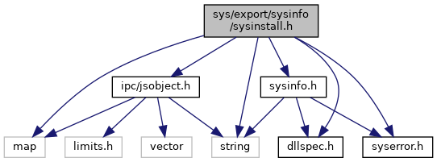

[Namespaces](#namespaces) \| [Functions](#func-members)

`#include <map>`
`#include <string>`
`#include "`<a href="sysinfo_8h_source.md">sysinfo.h</a>`"`
`#include "`<a href="syserror_8h_source.md">syserror.h</a>`"`
`#include "`<a href="dllspec_8h_source.md">dllspec.h</a>`"`
`#include "`<a href="ipc_2src_2ipc_2jsobject_8h_source.md">ipc/jsobject.h</a>`"`

Include dependency graph for sysinstall.h:

<a href="sysinstall_8h_source.md">Go to the source code of this file.</a>

|            |                                                                |
|------------|----------------------------------------------------------------|
| Namespaces |                                                                |
|            | <a href="namespacevfisysinstall.md">vfisysinstall</a> |

|  |  |
|----|----|
| Functions |  |
| <a href="dllspec_8h.md#a06244aced91c3fbc18547181038765aa">SYS_INFO_API</a> <a href="namespacevfisysinfo.md#aadc050f211cba10bc174fe72cc02ac09">vfisysinfo::sysError</a>  | <a href="namespacevfisysinstall.md#a0860cad505a474f8a061cdf2d298863c">sysAuthenticateFile</a> (const std::string &path) |
| <a href="dllspec_8h.md#a06244aced91c3fbc18547181038765aa">SYS_INFO_API</a> <a href="namespacevfisysinfo.md#aadc050f211cba10bc174fe72cc02ac09">vfisysinfo::sysError</a>  | <a href="namespacevfisysinstall.md#aa32611fb3057a6b9c560396807476304">sysInstall</a> (const std::string &path) |
| <a href="dllspec_8h.md#a06244aced91c3fbc18547181038765aa">SYS_INFO_API</a> <a href="namespacevfisysinfo.md#aadc050f211cba10bc174fe72cc02ac09">vfisysinfo::sysError</a>  | <a href="namespacevfisysinstall.md#a32b8ada3672bd95b04fca4c2c61623a1">sysBaseInstall</a> () |
| <a href="dllspec_8h.md#a06244aced91c3fbc18547181038765aa">SYS_INFO_API</a> <a href="namespacevfisysinfo.md#aadc050f211cba10bc174fe72cc02ac09">vfisysinfo::sysError</a>  | <a href="namespacevfisysinstall.md#ae97c35980e2527791d524fb9e28f25cc">sysFreeResourcesInstall</a> (const std::string &<a href="_web_service_wrappers_8c.md#a6e248376c0290338633d8137822eb209">value</a>) |
| <a href="dllspec_8h.md#a06244aced91c3fbc18547181038765aa">SYS_INFO_API</a> <a href="namespacevfisysinfo.md#aadc050f211cba10bc174fe72cc02ac09">vfisysinfo::sysError</a>  | <a href="namespacevfisysinstall.md#ad0be97821636d524f2cc56c7106e1217">sysGetInstallStatus</a> (<a href="classvfiipc_1_1_j_s_object.md">vfiipc::JSObject</a> &json) |
