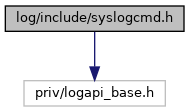

[Enumerations](#enum-members) \| [Functions](#func-members)

`#include "priv/logapi_base.h"`

Include dependency graph for syslogcmd.h:

<a href="syslogcmd_8h_source.md">Go to the source code of this file.</a>

|  |  |
|----|----|
| Enumerations |  |
| enum   | [SYSL_ERROR](#a0eb0f037f3c642e27dd2464751c7d4dd) {   [SYSL_E_OK](#a0eb0f037f3c642e27dd2464751c7d4dda9ef200d935d00ae1552791644efed5ae) = 0, [SYSL_E_PARAM](#a0eb0f037f3c642e27dd2464751c7d4dda511c0d098e5ada5f14b94d97bcb50d69) = -1, [SYSL_E_CONN](#a0eb0f037f3c642e27dd2464751c7d4dda223d0ee7107ff163db6fee7bbe12caf3) = -2, [SYSL_E_UNEXP](#a0eb0f037f3c642e27dd2464751c7d4dda01020c22b699c17bd7a7b46ef5838ac1) = -3,   [SYSL_E_NOT_IMPL](#a0eb0f037f3c642e27dd2464751c7d4dda885703cf951e3427f3028d633b0ff714) = -99 } |
| enum   | [SYSL_SRC](#acf4ae1d193df756ada6ad21ca9fe3254) { [SSRC_VERIX_BUF](#acf4ae1d193df756ada6ad21ca9fe3254a79ffb724fbdaf4b711aba9aa30c1172e) = 0x2, [SSRC_APPS](#acf4ae1d193df756ada6ad21ca9fe3254ac7659f14e617cfac1e4d3aac76a692eb) = 0x4, [SSRC_ALL](#acf4ae1d193df756ada6ad21ca9fe3254a842201a8e810be8fa4b5c198684bfeea) = 0x6 } |
| enum   | [SYSL_LVL](#a2d22a0b7aa8b36200053c3ac5a643d39) {   [SYSL_LVL_EMERG](#a2d22a0b7aa8b36200053c3ac5a643d39a90d907b9e648fffb822a0903c3492bb5), [SYSL_LVL_ALERT](#a2d22a0b7aa8b36200053c3ac5a643d39a41180365af184099d33adef8bf672675), [SYSL_LVL_CRIT](#a2d22a0b7aa8b36200053c3ac5a643d39a7b416e234faa255d6ba19248c9eb1897), [SYSL_LVL_ERROR](#a2d22a0b7aa8b36200053c3ac5a643d39a88829c4a79698b372774e8e3765453b4),   [SYSL_LVL_WARN](#a2d22a0b7aa8b36200053c3ac5a643d39a51957f48b6df48daeeef09a61c615460), [SYSL_LVL_NOTICE](#a2d22a0b7aa8b36200053c3ac5a643d39a8c2cf77f620f26461d3c9e9911e3e2c4), [SYSL_LVL_INFO](#a2d22a0b7aa8b36200053c3ac5a643d39ae64372806c082a1d5b6e593bbbc7b1d5), [SYSL_LVL_TRACE](#a2d22a0b7aa8b36200053c3ac5a643d39ad2626c7c0f06e2c387971a0065ebe078) } |
| enum   | [config_option](#aa5ce2add12b42175db5dbab55d3c384c) {   [ENABLED](#aa5ce2add12b42175db5dbab55d3c384ca99788d1f27bac42d0c7bac63026c5959) = 0, [DESTINATION](#aa5ce2add12b42175db5dbab55d3c384ca22f853bba9ebb23d90508dc6496b746c) = 1, [SERIAL_COM](#aa5ce2add12b42175db5dbab55d3c384ca4166650dbb29bc7320367331ef87d990) = 2, [UDP_HOST](#aa5ce2add12b42175db5dbab55d3c384caf7578f5362abffff13fe66f4638fb7bc) = 3,   [LOG_LEVEL](#aa5ce2add12b42175db5dbab55d3c384ca6855ab498cdb7dc1c1c184eb6c8bb038) = 4, [UDP_PORT](#aa5ce2add12b42175db5dbab55d3c384cadfc56233aff0b7514e9be0baa4571f35) = 5, [FILE_NAME](#aa5ce2add12b42175db5dbab55d3c384ca77374a65274f20cc342c53cc2fd52ea0) = 6, [FILE_BUF_SIZE](#aa5ce2add12b42175db5dbab55d3c384caa377f3858ec8881a5e30e6ff03d54780) = 7,   [LOG_SOURCE](#aa5ce2add12b42175db5dbab55d3c384cafbdb3be38e077abfa134caa588917869) = 8, [SEND_RETRIES](#aa5ce2add12b42175db5dbab55d3c384cad4aef5e04bb62e9f483d66f3818c7448) = 9, [MAX_LOGFILE_SIZE](#aa5ce2add12b42175db5dbab55d3c384cae669bd9b6473732da984d7b44c9b5f98) = 10, [NUMBER_OF_FILES](#aa5ce2add12b42175db5dbab55d3c384cacc5886741786e14c009b1406cf99c464) = 11,   [LOG_FORMAT](#aa5ce2add12b42175db5dbab55d3c384ca14423b4eabe47dea2e98d5ebfdf10657) = 12, [FILTER_OUT_CONSOLE_LOGS](#aa5ce2add12b42175db5dbab55d3c384ca1e34b580ae11439efa8c54f8d1927360) = 13, [MAX_ENUM_COUNT](#aa5ce2add12b42175db5dbab55d3c384cad01a30ce08f64d860d896a43fb3110c5) = 14 } |
| enum   | [COMMUNICATION](#a3634f6fef0c62931e673162e0714d39c) { [COM](#a3634f6fef0c62931e673162e0714d39caaaabad2553753eb2aceaa31ab2ad3d72), [ETH](#a3634f6fef0c62931e673162e0714d39cadbc24c1d2cb5f08132fc9a0f7aa683ae), [FS](#a3634f6fef0c62931e673162e0714d39ca59e0bfb4f405c70dd8788b19d5084966), [USB](#a3634f6fef0c62931e673162e0714d39ca65f6b55fdc64778bf10632a795b97761) } |
| enum   | { [LOGAPI_SYSL_BUFFER_LEN](#a0411cd49bb5b71852cecd93bcbf0ca2daf49f701220e595ad6fd5f9ae64875362) = 50 } |

|  |  |
|----|----|
| Functions |  |
| LOGAPI_PUBLIC enum [SYSL_ERROR](#a0eb0f037f3c642e27dd2464751c7d4dd)  | [syslcmd_set_level](#a9b45919ef5fe9f2b4ec89ff27d19ec30) (enum [SYSL_LVL](#a2d22a0b7aa8b36200053c3ac5a643d39) lvl) |
|   | Sets level on syslog daemon side. [More\...](#a9b45919ef5fe9f2b4ec89ff27d19ec30)  |
| LOGAPI_PUBLIC enum [SYSL_ERROR](#a0eb0f037f3c642e27dd2464751c7d4dd)  | [syslcmd_set_source](#afa7176aab63ea25440d5790c64885caa) (enum [SYSL_SRC](#acf4ae1d193df756ada6ad21ca9fe3254) src) |
|   | Sets source of log messages. [More\...](#afa7176aab63ea25440d5790c64885caa)  |
| LOGAPI_PUBLIC enum [SYSL_ERROR](#a0eb0f037f3c642e27dd2464751c7d4dd)  | [syslcmd_set_dest_UDP](#ae5d5ce27ee87e076c762b06d8fe26fc5) (const char \*addr, int port) |
|   | Sets UPD as destination for messages. [More\...](#ae5d5ce27ee87e076c762b06d8fe26fc5)  |
| LOGAPI_PUBLIC enum [SYSL_ERROR](#a0eb0f037f3c642e27dd2464751c7d4dd)  | [syslcmd_set_dest_COM](#a155d47993134d2694a06ffd000d06dd8) (int serial_port) |
|   | Sets serial as destination for messages. [More\...](#a155d47993134d2694a06ffd000d06dd8)  |
| LOGAPI_PUBLIC enum [SYSL_ERROR](#a0eb0f037f3c642e27dd2464751c7d4dd)  | [syslcmd_set_dest_FILE](#aff55c12911bcfc4dceee1e717a904e88) (const char \*filename) |
|   | Sets file as destination for messages. [More\...](#aff55c12911bcfc4dceee1e717a904e88)  |
| LOGAPI_PUBLIC enum [SYSL_ERROR](#a0eb0f037f3c642e27dd2464751c7d4dd)  | [syslcmd_apply_config](#ae79e868aa5c9cd5cbcf2772c9938c8ce) (void) |
|   | apply configuration to syslog daemon [More\...](#ae79e868aa5c9cd5cbcf2772c9938c8ce)  |
| LOGAPI_PUBLIC enum [SYSL_ERROR](#a0eb0f037f3c642e27dd2464751c7d4dd)  | [syslcmd_set_cfg_str](#aa4b80452347490e05b502546792aadae) (enum [config_option](#aa5ce2add12b42175db5dbab55d3c384c) option, const char \*sval) |
|   | Sets string options(UDP host and file name) on syslog daemon side. [More\...](#aa4b80452347490e05b502546792aadae)  |
| LOGAPI_PUBLIC enum [SYSL_ERROR](#a0eb0f037f3c642e27dd2464751c7d4dd)  | [syslcmd_set_cfg_int](#a8fe51a2185b092cbdcd6e883b93248bf) (enum [config_option](#aa5ce2add12b42175db5dbab55d3c384c) option, int ival) |
|   | Sets integer options(others than UDP host and file name) on syslog daemon side. [More\...](#a8fe51a2185b092cbdcd6e883b93248bf)  |
| LOGAPI_PUBLIC enum [SYSL_ERROR](#a0eb0f037f3c642e27dd2464751c7d4dd)  | [syslcmd_get_cfg_str](#a94f13c3a6a608ba2c24ace72bbc2714c) (enum [config_option](#aa5ce2add12b42175db5dbab55d3c384c) option, char \*sval) |
|   | Returns string options(UDP host and file name) from syslog daemon side. [More\...](#a94f13c3a6a608ba2c24ace72bbc2714c)  |
| LOGAPI_PUBLIC enum [SYSL_ERROR](#a0eb0f037f3c642e27dd2464751c7d4dd)  | [syslcmd_get_cfg_str2](#ace143cbc5c26fa1bada02589c97c5027) (enum [config_option](#aa5ce2add12b42175db5dbab55d3c384c) option, char \*sval, unsigned int len) |
|   | Returns string options(UDP host and file name) from syslog daemon side. [More\...](#ace143cbc5c26fa1bada02589c97c5027)  |
| LOGAPI_PUBLIC enum [SYSL_ERROR](#a0eb0f037f3c642e27dd2464751c7d4dd)  | [syslcmd_get_cfg_int](#a1665cdbed014c0926a02a242708c5234) (enum [config_option](#aa5ce2add12b42175db5dbab55d3c384c) option, int \*ival) |
|   | Returns integer options(others than UDP host and file name) on syslog daemon side. [More\...](#a1665cdbed014c0926a02a242708c5234)  |

## EnumerationType Documentation {#enumeration-type-documentation}

## anonymousenum  {#anonymous-enum}

anonymous enum

| Enumerator              |     |
|-------------------------|-----|
| LOGAPI_SYSL_BUFFER_LEN  |     |

## COMMUNICATION 

enum [COMMUNICATION](#a3634f6fef0c62931e673162e0714d39c)

| Enumerator |     |
|------------|-----|
| COM        |     |
| ETH        |     |
| FS         |     |
| USB        |     |

## config_option 

enum [config_option](#aa5ce2add12b42175db5dbab55d3c384c)

| Enumerator               |     |
|--------------------------|-----|
| ENABLED                  |     |
| DESTINATION              |     |
| SERIAL_COM               |     |
| UDP_HOST                 |     |
| LOG_LEVEL                |     |
| UDP_PORT                 |     |
| FILE_NAME                |     |
| FILE_BUF_SIZE            |     |
| LOG_SOURCE               |     |
| SEND_RETRIES             |     |
| MAX_LOGFILE_SIZE         |     |
| NUMBER_OF_FILES          |     |
| LOG_FORMAT               |     |
| FILTER_OUT_CONSOLE_LOGS  |     |
| MAX_ENUM_COUNT           |     |

## SYSL_ERROR 

enum [SYSL_ERROR](#a0eb0f037f3c642e27dd2464751c7d4dd)

codes returned by syslcmd\_ API

| Enumerator |  |
|----|----|
| SYSL_E_OK  | 
operation succeeded
 |
| SYSL_E_PARAM  | 
one or more paramteres are invalid
 |
| SYSL_E_CONN  | 
no connection to daemon
 |
| SYSL_E_UNEXP  | 
unexpected error while executing a function
 |
| SYSL_E_NOT_IMPL  | 
not implemented
 |

## SYSL_LVL 

enum [SYSL_LVL](#a2d22a0b7aa8b36200053c3ac5a643d39)

Enum denotes an upper level of log messages

| Enumerator       |     |
|------------------|-----|
| SYSL_LVL_EMERG   |     |
| SYSL_LVL_ALERT   |     |
| SYSL_LVL_CRIT    |     |
| SYSL_LVL_ERROR   |     |
| SYSL_LVL_WARN    |     |
| SYSL_LVL_NOTICE  |     |
| SYSL_LVL_INFO    |     |
| SYSL_LVL_TRACE   |     |

## SYSL_SRC 

enum [SYSL_SRC](#acf4ae1d193df756ada6ad21ca9fe3254)

Denotes a source of log messages

| Enumerator      |     |
|-----------------|-----|
| SSRC_VERIX_BUF  |     |
| SSRC_APPS       |     |
| SSRC_ALL        |     |

## FunctionDocumentation {#function-documentation}

## syslcmd_apply_config() 

LOGAPI_PUBLIC enum [SYSL_ERROR](#a0eb0f037f3c642e27dd2464751c7d4dd) syslcmd_apply_config

apply configuration to syslog daemon

## syslcmd_get_cfg_int() 

LOGAPI_PUBLIC enum [SYSL_ERROR](#a0eb0f037f3c642e27dd2464751c7d4dd) syslcmd_get_cfg_int

Returns integer options(others than UDP host and file name) on syslog daemon side.

**Parameters**

\[in\] **option** configuration option to get \[out\] **ival** configuration options value

## syslcmd_get_cfg_str() 

LOGAPI_PUBLIC enum [SYSL_ERROR](#a0eb0f037f3c642e27dd2464751c7d4dd) syslcmd_get_cfg_str

Returns string options(UDP host and file name) from syslog daemon side.

**Parameters**

\[in\] **option** configuration option to get \[out\] **sval** configuration options value

## syslcmd_get_cfg_str2() 

LOGAPI_PUBLIC enum [SYSL_ERROR](#a0eb0f037f3c642e27dd2464751c7d4dd) syslcmd_get_cfg_str2

Returns string options(UDP host and file name) from syslog daemon side.

**Parameters**

\[in\] **option** configuration option to get \[out\] **sval** configuration options value \[in\] **len** string value\'s buffer size

## syslcmd_set_cfg_int() 

LOGAPI_PUBLIC enum [SYSL_ERROR](#a0eb0f037f3c642e27dd2464751c7d4dd) syslcmd_set_cfg_int

Sets integer options(others than UDP host and file name) on syslog daemon side.

**Parameters**

\[in\] **option** configuration option to set \[in\] **ival** value to set

## syslcmd_set_cfg_str() 

LOGAPI_PUBLIC enum [SYSL_ERROR](#a0eb0f037f3c642e27dd2464751c7d4dd) syslcmd_set_cfg_str

Sets string options(UDP host and file name) on syslog daemon side.

**Parameters**

\[in\] **option** configuration option to set \[in\] **sval** value to set

## syslcmd_set_dest_COM() 

LOGAPI_PUBLIC enum [SYSL_ERROR](#a0eb0f037f3c642e27dd2464751c7d4dd) syslcmd_set_dest_COM

Sets serial as destination for messages.

**Parameters**

\[in\] **serial_port** COM port to use

## syslcmd_set_dest_FILE() 

LOGAPI_PUBLIC enum [SYSL_ERROR](#a0eb0f037f3c642e27dd2464751c7d4dd) syslcmd_set_dest_FILE

Sets file as destination for messages.

**Parameters**

\[in\] **filename** file to write logs to

## syslcmd_set_dest_UDP() 

LOGAPI_PUBLIC enum [SYSL_ERROR](#a0eb0f037f3c642e27dd2464751c7d4dd) syslcmd_set_dest_UDP

Sets UPD as destination for messages.

**Parameters**

\[in\] **addr** address of target host \[in\] **port** port of target host

## syslcmd_set_level() 

LOGAPI_PUBLIC enum [SYSL_ERROR](#a0eb0f037f3c642e27dd2464751c7d4dd) syslcmd_set_level

Sets level on syslog daemon side.

**Parameters**

\[in\] **lvl** upper level of log messages

## syslcmd_set_source() 

LOGAPI_PUBLIC enum [SYSL_ERROR](#a0eb0f037f3c642e27dd2464751c7d4dd) syslcmd_set_source

Sets source of log messages.

**Parameters**

\[in\] **src** source of log messages
