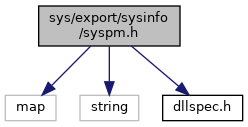

[Namespaces](#namespaces) \| [Functions](#func-members)

`#include <map>`
`#include <string>`
`#include "`<a href="dllspec_8h_source.md">dllspec.h</a>`"`

Include dependency graph for syspm.h:

<a href="syspm_8h_source.md">Go to the source code of this file.</a>

|            |                                                          |
|------------|----------------------------------------------------------|
| Namespaces |                                                          |
|            | <a href="namespacevfisysinfo.md">vfisysinfo</a> |

|  |  |
|----|----|
| Functions |  |
| <a href="dllspec_8h.md#a06244aced91c3fbc18547181038765aa">SYS_INFO_API</a> int  | <a href="namespacevfisysinfo.md#aae13f271ba6f2d8d1e20d65785df0633">sysReboot</a> () |
| <a href="dllspec_8h.md#a06244aced91c3fbc18547181038765aa">SYS_INFO_API</a> int  | <a href="namespacevfisysinfo.md#a3a740e4154bfe01a6f48463a766ee747">sysRebootDock</a> () |
| <a href="dllspec_8h.md#a06244aced91c3fbc18547181038765aa">SYS_INFO_API</a> int  | <a href="namespacevfisysinfo.md#aa4e2bde8892f7c052fc3ab3efb80a473">sysSleep</a> () |
| <a href="dllspec_8h.md#a06244aced91c3fbc18547181038765aa">SYS_INFO_API</a> int  | <a href="namespacevfisysinfo.md#a363ef3b20e3852f6e6cd87085b295f22">sysDeepSleep</a> () |
| <a href="dllspec_8h.md#a06244aced91c3fbc18547181038765aa">SYS_INFO_API</a> int  | <a href="namespacevfisysinfo.md#a6709c064e4794698a20ca0f076a4345f">sysHibernate</a> () |
| <a href="dllspec_8h.md#a06244aced91c3fbc18547181038765aa">SYS_INFO_API</a> int  | <a href="namespacevfisysinfo.md#a208c6199b44128a4bccf6fae0be44c95">sysShutdown</a> () |
