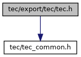
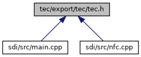

[Macros](#define-members) \| [Typedefs](#typedef-members) \| [Functions](#func-members)

`#include "`<a href="tec__common_8h_source.md">tec/tec_common.h</a>`"`

Include dependency graph for tec.h:

This graph shows which files directly or indirectly include this file:

<a href="tec_8h_source.md">Go to the source code of this file.</a>

|  |  |
|----|----|
| Macros |  |
| #define  | <a href="group___t_e_c___n_o_t_i_f_i_c_a_t_i_o_n___c_b_k___t_y_p_e.md#ga131e9251b6b4f9c9c7a187c07f12820a">CTS_NOTIFICATION_CBK_TYPE_UX_CARD_INSERTED</a>   0x01 |

|  |  |
|----|----|
| Typedefs |  |
| typedef void(\*  | [cts_Callback](#adbb62b791d8135bcd7edca85fcef33a5)) (void \*data) |

|  |  |
|----|----|
| Functions |  |
| int  | [cts_SetOptions](#aa237be1f0249503d0b959d3800f1ee34) (const unsigned char \*options, unsigned char options_len) |
| int  | [cts_StartSelection](#ac6699fe32fc23e90713eb617e9ff25e7) (unsigned char supportedTechnologies, unsigned short timeout_sec, [cts_Callback](#adbb62b791d8135bcd7edca85fcef33a5) cbf, void \*cb_data, unsigned char \*options, unsigned char options_len) |
| int  | [cts_StopSelection](#acaf2d75d1b584ae97ff9ee4da47cee38) (void) |
| int  | [cts_WaitSelection](#aee5b104d8ad6e85feddb685379cdbf0c) (unsigned char \*usedTechnology, unsigned char \*dataBuffer, unsigned short \*dataBufferLength, unsigned short timeout_msec) |
| int  | [cts_RemoveTechnologies](#a8569782d27f43e5d88cef3575a5d12c6) (unsigned char technologies) |
| int  | [cts_AddTechnologies](#aa60922ab5b40a033ac85a36e8022cafa) (unsigned char technologies, unsigned char \*options, unsigned char options_len) |
| int  | [cts_WaitCardRemoval](#a8db288b6803c1fba534d94a99f1b646b) ([cts_Callback](#adbb62b791d8135bcd7edca85fcef33a5) cbf, void \*cb_data) |
| int  | [cts_WaitCardRemoval2](#a92ab7780df1f8150c6d8a9b3ab3163bf) (unsigned short timeout_sec) |
| void  | [cts_SetNotificationCallback](#ada083dc0f484d99ab24df79ed5f145c9) (int type, [cts_Callback](#adbb62b791d8135bcd7edca85fcef33a5) cbf, void \*cb_data) |

## DetailedDescription {#detailed-description}

Interface definitions for libtec. This file defines the API for the technology selection library.

### Author

Thomas Buening, GSS

## TypedefDocumentation {#typedef-documentation}

## cts_Callback 

typedef void(\* cts_Callback) (void \*data)

Type of function that is called after technology selection has been finished (see [cts_StartSelection()](#ac6699fe32fc23e90713eb617e9ff25e7)) or removed (see [cts_WaitCardRemoval()](#a8db288b6803c1fba534d94a99f1b646b)).

**Parameters**

\[in\] **data** : Data pointer provided by the application.

## FunctionDocumentation {#function-documentation}

## cts_AddTechnologies() 

int cts_AddTechnologies

This function adds technologies to currently running technology selection.
This can be useful to adapt to an interface with separated \"enable\" functions for each technology.
Restrictions:

- Adding <a href="group___t_e_c___t_e_c_h_n_o_l_o_g_i_e_s.md#ga56e64c2a97c61e8cb043de2852986a3a">CTS_CTLS</a> is not allowed in case one of these options set: <a href="group___t_e_c___s_t_a_r_t___o_p_t_i_o_n_s.md#gaeff0a0e1b335597ea1ec0781f15edb08">CTS_PURE_CARD_DETECTION</a>, <a href="group___t_e_c___s_t_a_r_t___o_p_t_i_o_n_s.md#gaafe9099680a56edd52a1258a797efa07">CTS_NFC_ENABLE</a>, <a href="group___t_e_c___s_t_a_r_t___o_p_t_i_o_n_s.md#ga4678a7752f0337b236971dcd370edf93">CTS_VAS_ENABLE</a>
- No support for Contact synchronous cards (<a href="group___t_e_c___o_p_t_i_o_n___t_a_g_s.md#ga10f9930ac821ef5f612690b2201f94e3">CTS_OPTION_TAG_SYNC_CARD_TYPE</a>)

**Parameters**

\[in\] **technologies** : technologies to add to running technology selection: combination of TEC technology code, any additional bits are reserved for future use and are currently ignored. Supplying none of TEC technology code is allowed. In this case this function does actually nothing. \[in\] **options** : data pointer for future use \[in\] **options_len** : length of options.

### Returns

\[unsupported block\]

## cts_RemoveTechnologies() 

int cts_RemoveTechnologies

This function removes technologies from currently running technology selection. This can be useful to remove contact and magstripe technologies after the application was informed by EMV-ADK that a ctls retap scenario is running.

**Parameters**

\[in\] **technologies** : technologies to remove from running technology selection: combination of TEC technology code, any additional bits are reserved for future use and are currently ignored. Supplying none of TEC technology code is allowed. In this case this function does actually nothing.

### Returns

\[unsupported block\]

## cts_SetNotificationCallback() 

void cts_SetNotificationCallback

Set notification callback function

**Parameters**

\[in\] **type** : one of Notification callback types \[in\] **cbf** : Callback function, may be NULL. \[in\] **cb_data** : Data pointer that is passed on to the callback function cbf, may be NULL.

## cts_SetOptions() 

int cts_SetOptions

Set additional options. This function must not be called while technology selection is running.

**Parameters**

\[in\] **options** : data pointer, TLV format, see TEC option tags \[in\] **options_len** : length of options

### Returns

\[unsupported block\]

## cts_StartSelection() 

int cts_StartSelection

This function starts an asynchronous card reader monitoring. The monitoring ends if

- magstripe card is swiped or inserted
- or chip card is inserted
- or contactless card is tapped
- or the timeout occurs
- or [cts_StopSelection()](#acaf2d75d1b584ae97ff9ee4da47cee38) is called
- or error occurred.

**Parameters**

\[in\] **supportedTechnologies** : supported technologies: combination of TEC technology code, any additional bits are reserved for future use and are currently ignored. Supplying none of TEC technology code is allowed. In this case cts_WaitSelection() will never return CTS_OK or CTS_NO_CHIP of course. \[in\] **timeout_sec** : main timeout in seconds to wait for card insertion/swipe/tap, min=0 (makes no sense), max=65535s, infinite timeout not possible; if this timeout expires while a timeout defined in options\[6..7\] or options\[8..9\] is running, latter timeouts have higher priority, they are not aborted. \[in\] **cbf** : callback function that is called when technology selection has been finished, that means a (positive or negative) result != CTS_IN_PROGRESS can be obtained with cts_WaitSelection(), may be NULL.The following APIs are not allowed to be called while the callback function is still in progress:cts_SetTraceCallback() cts_SetOptions() cts_StartSelection() cts_RemoveTechnologies() cts_WaitCardRemoval() cts_WaitCardRemoval2() cts_StopSelection() \[in\] **cb_data** : data pointer that is passed on to the callback function, may be NULL. \[in\] **options** : data pointer:options\[0..1\]: see TEC start options options\[2..3\]: reserved. options\[4\]: CT ICC options Passed as options to EMV_CT_SmartDetect() and EMV_CT_SmartReset() options\[5\]: CTLS ICC options Passed as options to EMV_CTLS_SmartReset() options\[6..7\]: MSR after CTLS timeout 2-byte binary parameter in big-endian format. min = 0x0000, max = 0xFFFF = 65535ms. Time in milliseconds to wait for MSR-Data after CTLS has been detected. \"0x0000\" means \"do not wait for MSR after CTLS detection\". If CTS_MSR_AFTER_CTLS_FAIL set: wait for MSR after CTLS transaction only if that failed. options\[8..9\]: UX30x only: MSR timeout after card insertion 2-byte binary parameter in big-endian format. min = 0x0000, max = 0xFFFF = 65535ms. For hints about UX hybrid reader handling see Special behavior on hybrid readers (UX30x) . Two different meanings depending if CTS_CHIP is set in TEC technology code : CTS_CHIP is set. Time in milliseconds to wait for MSR-Data after a card without chip or with broken chip was inserted. \"0x0000\" means \"do not wait for MSR-Data after card insertion and report CTS_NO_CHIP immediately\". CTS_CHIP is disabled. Time window in milliseconds for reading MSR-Data after card was inserted. \"0x0000\" means wait for MSR-Data after card insertion until technology selection finishes. If MSR-Data is not read during this time window:MSR_Deactivate() shall be called,technology selection shall be terminated andcts_WaitSelection() shall return the value CTS_UX_MSRDATA_NOT_AVAILABLE_TIMEOUT options\[10..11\]: CTLS timeout after VAS Only relevant if CTS_VAS_ENABLE and CTS_EMV_CTLS_TIMEOUT_AFTER_VAS are set. Permissible time window in milliseconds to perform an EMV contactless payment after either VAS_DO_PAY or VAS_DO_PAY_DECRYPT_REQ has been detected. 2-byte binary parameter in big-endian format, min = 0x0000 = default value, max = 0xFFFF = 65535ms \"0x0000\" means \"wait for a contactless payment until the main timeout \'timeout_sec\' expires\". If value is non-zero and a contactless-payment-medium is not detected during this time window:technology selection shall be terminated andcts_WaitSelection() shall return the value CTS_CTLS_EMV_NO_CARD.options\[12..15\]: NFC technologies Passed to NFC_PT_PollingFull() parameter pollReq.tech_bitmap, 4 byte binary, big-endian, only relevant if CTS_NFC_ENABLE is set, may be NULL (default = {0}). \[in\] **options_len** : length of options.

### Returns

\[unsupported block\]

## cts_StopSelection() 

int cts_StopSelection

This function stops a technology selection started via [cts_StartSelection()](#ac6699fe32fc23e90713eb617e9ff25e7). It will be called by application if waiting for a card is canceled by user or ECR break. Keep in mind that the technology selection may not be stopped immediately. Call [cts_WaitSelection()](#aee5b104d8ad6e85feddb685379cdbf0c) to wait for termination of technology selection. After [cts_WaitSelection()](#aee5b104d8ad6e85feddb685379cdbf0c) returns != <a href="group___t_e_c___r_e_t_u_r_n___c_o_d_e_s.md#ga7ee2b62641a168354503adbb06508deb">CTS_IN_PROGRESS</a>, it is safe to call [cts_StartSelection()](#ac6699fe32fc23e90713eb617e9ff25e7) again.

### Returns

\[unsupported block\]

## cts_WaitCardRemoval() 

int cts_WaitCardRemoval

This function registers callback for card removal. The function returns immediately with one of the return values stated below. The callback is invoked as soon as the inserted card is removed or immediately if no card is inserted. Keep in mind that the callback is only invoked once. If you want to be informed about the next card removal as well, call this function again, even from within the callback function. Attention: Do not call this function as long as other TEC/EMV functions are running and do not call other TEC/EMV functions until the callback has been invoked!

**Parameters**

\[in\] **cbf** : callback function that is called when a card has been removed, must not be NULL. \[in\] **cb_data** : data pointer that is passed on to the callback function.

### Returns

\[unsupported block\]

## cts_WaitCardRemoval2() 

int cts_WaitCardRemoval2

This function waits for card removal. The function does not return until card has been removed or timeout has occurred. Attention: Do not call this function as long as other TEC/EMV functions are running and do not call other TEC/EMV functions until the function has returned!

**Parameters**

\[in\] **timeout_sec** : timeout in seconds to wait for card removal.

### Returns

\[unsupported block\]

## cts_WaitSelection() 

int cts_WaitSelection

This function waits for technology selection to finish.

**Parameters**

\[out\] **usedTechnology** : technology that has been selected, only set if CTS_OK is returned. See TEC technology code . If CTS_DATA_TLV is set dataBuffer is in TLV format (this is the case if NFC or VAS was detected). In certain circumstances (\'MSR after CTLS timeout\' is set; UX MSR enhancements not enabled) it is possible that usedTechnology contains more than one technology at once, see documentation. \[out\] **dataBuffer** : reference to buffer for output data, only filled if CTS_OK is returned.Recommended allocation size: 11264 bytes if NFC/VAS is used, else 256 bytesa) CTS_DATA_TLV is set in usedTechnology:contains tags, see TEC result data tags.b) CTS_DATA_TLV is not set in usedTechnology:If \*usedTechnology & CTS_CHIP : contains ATR.If \*usedTechnology & CTS_CTLS and CTS_PURE_CARD_DETECTION was set as option to cts_StartSelection() : contains card info delivered by EMV_CTLS_SmartReset().If \*usedTechnology & CTS_CTLS and CTS_PURE_CARD_DETECTION was not set : contains return value of EMV_CTLS_ContinueOffline(). \[in,out\] **dataBufferLength** : buffer size for output data, return data length; if the size of dataBuffer is too small to hold the whole output data, no special error code is returned, the return code is as usual, but the output buffer will be empty, dataBufferLength is set to 0. If return value is != CTS_OK, dataBufferLength is set to 0 to indicate that there is no data written in dataBuffer. \[in\] **timeout_msec** : timeout in milliseconds to wait for technology selection to finish, min=0, max=65535ms. If technology selection is not finished after this timeout has expired, CTS_IN_PROGRESS is returned. In this case cts_WaitSelection() has to be called again. If a callback function is supplied to cts_StartSelection(), setting a timeout != 0 is not allowed.

### Returns

\[unsupported block\]
