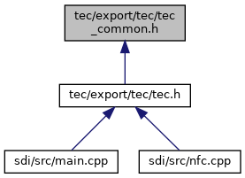

[Macros](#define-members) \| [Typedefs](#typedef-members) \| [Functions](#func-members)

This graph shows which files directly or indirectly include this file:

<a href="tec__common_8h_source.md">Go to the source code of this file.</a>

|  |  |
|----|----|
| Macros |  |
| #define  | <a href="group___t_e_c___t_e_c_h_n_o_l_o_g_i_e_s.md#gadbc63cc59da76fff7974cd5631f56662">CTS_CHIP</a>   1 |
| #define  | <a href="group___t_e_c___t_e_c_h_n_o_l_o_g_i_e_s.md#gaece6355aecbe1744ed15e5b41e0e6c15">CTS_MSR</a>   2 |
| #define  | <a href="group___t_e_c___t_e_c_h_n_o_l_o_g_i_e_s.md#ga56e64c2a97c61e8cb043de2852986a3a">CTS_CTLS</a>   4 |
| #define  | <a href="group___t_e_c___t_e_c_h_n_o_l_o_g_i_e_s.md#ga04faa97d1f562e3d9911be8b2e3d250f">CTS_SYNC</a>   8 |
| #define  | [CTS_DATA_TLV](#a56386219739d173835a83194608fedea)   0x80 |
| #define  | <a href="group___t_e_c___r_e_t_u_r_n___c_o_d_e_s.md#ga1952f713ce2bbfa1d8b54142ca52ecc4">CTS_OK</a>   0 |
| #define  | <a href="group___t_e_c___r_e_t_u_r_n___c_o_d_e_s.md#ga058dc7a7d6d6562dac8171ca86f5b5c0">CTS_NO_CHIP</a>   1 |
| #define  | <a href="group___t_e_c___r_e_t_u_r_n___c_o_d_e_s.md#ga7ee2b62641a168354503adbb06508deb">CTS_IN_PROGRESS</a>   2 |
| #define  | <a href="group___t_e_c___r_e_t_u_r_n___c_o_d_e_s.md#gae1d5a1303c3edd9aa78e9ed9b8c3207a">CTS_TIMEOUT</a>   3 |
| #define  | <a href="group___t_e_c___r_e_t_u_r_n___c_o_d_e_s.md#ga3e498393b2a0ebf740bb6f1e903270a0">CTS_PARAM</a>   4 |
| #define  | <a href="group___t_e_c___r_e_t_u_r_n___c_o_d_e_s.md#gad672622165e6bdf597675c829606bb62">CTS_NOT_STARTED</a>   5 |
| #define  | <a href="group___t_e_c___r_e_t_u_r_n___c_o_d_e_s.md#ga7cc5cc3d019136c0a8942e62c558b69c">CTS_STOPPED</a>   6 |
| #define  | <a href="group___t_e_c___r_e_t_u_r_n___c_o_d_e_s.md#ga1827cb909b31c770a7af3c5521253ceb">CTS_CTLS_INIT</a>   7 |
| #define  | <a href="group___t_e_c___r_e_t_u_r_n___c_o_d_e_s.md#gac7ce1e8ae224edcd06cbd17046a9f9de">CTS_ERROR</a>   8 |
| #define  | <a href="group___t_e_c___r_e_t_u_r_n___c_o_d_e_s.md#gaf0431ada300a75873e555d8ec68484c6">CTS_CTLS_NOT_ALLOWED</a>   9 |
| #define  | <a href="group___t_e_c___r_e_t_u_r_n___c_o_d_e_s.md#ga1279a0bd837c7c80b23c747bfe40310f">CTS_CTLS_EMV_NO_CARD</a>   10 |
| #define  | <a href="group___t_e_c___r_e_t_u_r_n___c_o_d_e_s.md#ga631b3ac8f6e41ecfa2aefc97296e0f75">CTS_ERR_LOAD</a>   11 |
| #define  | <a href="group___t_e_c___r_e_t_u_r_n___c_o_d_e_s.md#ga11e77d01884f12702d0652efb875c9bd">CTS_VAS_DECRYPTION_NOT_REQUIRED</a>   12 |
| #define  | <a href="group___t_e_c___r_e_t_u_r_n___c_o_d_e_s.md#ga773aac25463871c28c91a217fca64caa">CTS_VAS_DATA_DECRYPTED_OK</a>   13 |
| #define  | <a href="group___t_e_c___r_e_t_u_r_n___c_o_d_e_s.md#gac051158cd3273d316aa38227c996503a">CTS_VAS_DATA_DECRYPTED_FAILED</a>   14 |
| #define  | <a href="group___t_e_c___r_e_t_u_r_n___c_o_d_e_s.md#gadf0a2a2d0df56c222253a27bfeefdbb7">CTS_UX_MSRDATA_NOT_AVAILABLE_TIMEOUT</a>   15 |
| #define  | <a href="group___t_e_c___r_e_t_u_r_n___c_o_d_e_s.md#ga1527ff5876cd8d07fb7790fb9582ef8f">CTS_NFC_INIT</a>   16 |
| #define  | <a href="group___t_e_c___r_e_t_u_r_n___c_o_d_e_s.md#gac43b71a6f5b22f202d8d9ae853d42cf1">CTS_CHIP_WITH_WRONG_ATR</a>   17 |
| #define  | <a href="group___t_e_c___r_e_t_u_r_n___c_o_d_e_s.md#ga7dd3d4f95380f5b689a4e20aec5a33f7">CTS_API_NOT_ALLOWED</a>   18 |
| #define  | <a href="group___t_e_c___r_e_t_u_r_n___c_o_d_e_s.md#gafb45d462dce92aeffd12f7867a2c3f6c">CTS_VAS_DATA_ENCRYPTED_OK</a>   19 |
| #define  | <a href="group___t_e_c___r_e_t_u_r_n___c_o_d_e_s.md#gab88646562adf7c9201c7806c4ce3e962">CTS_UX_NO_MSR_DATA_AFTER_CARD_REMOVL</a>   20 |
| #define  | <a href="group___t_e_c___r_e_t_u_r_n___c_o_d_e_s.md#gaa49d5062e70c65550fb09392d8e955a7">CTS_MSR_ONLY_REQUEST_BUT_NO_DEVICE</a>   21 |
| #define  | <a href="group___t_e_c___s_t_a_r_t___o_p_t_i_o_n_s.md#gaeff0a0e1b335597ea1ec0781f15edb08">CTS_PURE_CARD_DETECTION</a>   0x01 |
| #define  | <a href="group___t_e_c___s_t_a_r_t___o_p_t_i_o_n_s.md#ga1073825ee49c63471bef39392d6df7e6">CTS_NO_POWERON</a>   0x02 |
| #define  | <a href="group___t_e_c___s_t_a_r_t___o_p_t_i_o_n_s.md#ga43a0e13c6472e524f11a71d9385b117e">CTS_POWERON_AFTER_CTLS_MSR_DEACTIVATION</a>   0x04 |
| #define  | <a href="group___t_e_c___s_t_a_r_t___o_p_t_i_o_n_s.md#gaafe9099680a56edd52a1258a797efa07">CTS_NFC_ENABLE</a>   0x01 |
| #define  | <a href="group___t_e_c___s_t_a_r_t___o_p_t_i_o_n_s.md#ga4678a7752f0337b236971dcd370edf93">CTS_VAS_ENABLE</a>   0x02 |
| #define  | <a href="group___t_e_c___s_t_a_r_t___o_p_t_i_o_n_s.md#ga16d617787fe23f80aae81a4c3bc944bf">CTS_EMV_AFTER_NFC_ISO</a>   0x04 |
| #define  | <a href="group___t_e_c___s_t_a_r_t___o_p_t_i_o_n_s.md#ga5edf88e1021b06efbedfd488d47ec829">CTS_VAS_HANDLE_LED_BUZZ</a>   0x08 |
| #define  | <a href="group___t_e_c___s_t_a_r_t___o_p_t_i_o_n_s.md#gaa9ca286b38f42e300648c3d445c90eb3">CTS_EMV_CTLS_TIMEOUT_AFTER_VAS</a>   0x10 |
| #define  | <a href="group___t_e_c___s_t_a_r_t___o_p_t_i_o_n_s.md#ga58a66c0d181fb53ca29ace7158f9d9fb">CTS_VAS_DONT_DECRYPT</a>   0x20 |
| #define  | <a href="group___t_e_c___s_t_a_r_t___o_p_t_i_o_n_s.md#ga16b2beeb43cad695a24390db9bee5c15">CTS_MSR_AFTER_CTLS_FAIL</a>   0x40 |
| #define  | <a href="group___t_e_c___s_t_a_r_t___o_p_t_i_o_n_s.md#gadd4d792acfce9f801d2511938028e68e">CTS_NFC_DUTY_CYCLE_OFF</a>   0x80 |
| #define  | <a href="group___t_e_c___d_a_t_a___t_a_g_s.md#gaf6119d8d13132973743201b7cbb7bb04">CTS_DATA_TAG_NFC_RESULT</a>   0xDFDB20 |
| #define  | <a href="group___t_e_c___d_a_t_a___t_a_g_s.md#ga1622a00c90e677978ff06581f4630743">CTS_DATA_TAG_CARD</a>   0xFFDB20 |
| #define  | <a href="group___t_e_c___d_a_t_a___t_a_g_s.md#gaf6eee3de6886c30697951526013d3794">CTS_DATA_TAG_CARD_TYPE</a>   0xDFDB21 |
| #define  | <a href="group___t_e_c___d_a_t_a___t_a_g_s.md#ga63ba82102b4e6fe41cea1b5ccfaf8961">CTS_DATA_TAG_CARD_INFO</a>   0xDFDB22 |
| #define  | <a href="group___t_e_c___d_a_t_a___t_a_g_s.md#ga90e89126d9d47b47ffc81f383a25f270">CTS_DATA_TAG_VAS_RESULT</a>   0xDFDB23 |
| #define  | <a href="group___t_e_c___d_a_t_a___t_a_g_s.md#ga98da116b51dd2dc960e37d72259b2bea">CTS_DATA_TAG_VAS_DATA</a>   0xDFDB24 |
| #define  | <a href="group___t_e_c___d_a_t_a___t_a_g_s.md#ga6de766623c7d58220a766c7bb6722c6f">CTS_DATA_TAG_EMV_RESULT</a>   0xDFDB25 |
| #define  | <a href="group___t_e_c___d_a_t_a___t_a_g_s.md#ga1092b3be73e407a67aa85580b4c2400a">CTS_DATA_TAG_VAS_DECRYPT_DATA_RESULT</a>   0xDFDB26 |
| #define  | <a href="group___t_e_c___d_a_t_a___t_a_g_s.md#gac639546d7913d5f57190cc84b9c72f79">CTS_DATA_TAG_CARD_TYPE_FULL</a>   0xDFDB27 |
| #define  | <a href="group___t_e_c___d_a_t_a___t_a_g_s.md#gae0ecdfeeff410e46cbe26e14ec60b193">CTS_DATA_TAG_CARDS_TOTAL_COUNT</a>   0xDFDB28 |
| #define  | <a href="group___t_e_c___d_a_t_a___t_a_g_s.md#gacd7882d48b3f77222d363198404c2d08">CTS_DATA_TAG_CARDS_A</a>   0xDFDB29 |
| #define  | <a href="group___t_e_c___d_a_t_a___t_a_g_s.md#ga5910b3f3e2c30f33f80c38db6c06cdb0">CTS_DATA_TAG_CARDS_B</a>   0xDFDB2A |
| #define  | <a href="group___t_e_c___d_a_t_a___t_a_g_s.md#gaa2a77ff11eacad346a5a279052a62f55">CTS_DATA_TAG_CARDS_F</a>   0xDFDB2B |
| #define  | <a href="group___t_e_c___d_a_t_a___t_a_g_s.md#ga3d1c310415df92df05c6ef95f1f359e5">CTS_DATA_TAG_CUSTOM_POLL_RESULT</a>   0xDFDB2C |
| #define  | <a href="group___t_e_c___d_a_t_a___t_a_g_s.md#gafd4dad5d39906ccf5556501baea1e29d">CTS_DATA_TAG_CARD_SAK</a>   0xDFDB2D |
| #define  | <a href="group___t_e_c___d_a_t_a___t_a_g_s.md#gae800761c4d8f9fea080b1119fd08cc80">CTS_DATA_TAG_CARD_ATQ</a>   0xDFDB2E |
| #define  | <a href="group___t_e_c___d_a_t_a___t_a_g_s.md#ga263dd4e8800e48d2941b9c4c89c18618">CTS_DATA_TAG_CARD_RFU</a>   0xDFDB2F |
| #define  | <a href="group___t_e_c___o_p_t_i_o_n___t_a_g_s.md#gaf932194d9ad8e368f5a4cc6ba4a66819">CTS_OPTION_TAG_APP_ID</a>   0xDFDB40 |
| #define  | <a href="group___t_e_c___o_p_t_i_o_n___t_a_g_s.md#ga10f9930ac821ef5f612690b2201f94e3">CTS_OPTION_TAG_SYNC_CARD_TYPE</a>   0xDFDB41 |
| #define  | <a href="group___t_e_c___o_p_t_i_o_n___t_a_g_s.md#gac87bf22ae5667cc2b22f86aad8218ce5">CTS_OPTION_TAG_UX_MSR_TIMEOUT</a>   0xDFDB42 |

|  |  |
|----|----|
| Typedefs |  |
| typedef void(\*  | [cts_TraceCallback](#a4d9b5e1c850295682b905f7e7dd31f64)) (const char \*str, void \*data) |

|  |  |
|----|----|
| Functions |  |
| void  | [cts_Version](#a68272ed65703130d4858d9c28c21f9b9) (char \*version, unsigned char len) |
| void  | [cts_SetTraceCallback](#a90770d44c55c14fa472396c74fec6052) ([cts_TraceCallback](#a4d9b5e1c850295682b905f7e7dd31f64) cbf, void \*cb_data) |

## DetailedDescription {#detailed-description}

Interface definitions for libtec, common part for <a href="tec_8h.md">tec.h</a>. This file defines the API for the technology selection library.

### Author

Dirk Germann, GSS

## MacroDefinition Documentation {#macro-definition-documentation}

## CTS_DATA_TLV 

#define CTS_DATA_TLV   0x80

if set in usedTechnology parameter of <a href="tec_8h.md#aee5b104d8ad6e85feddb685379cdbf0c">cts_WaitSelection()</a>, dataBuffer is in TLV format (this is only the case if NFC or VAS are used)

## TypedefDocumentation {#typedef-documentation}

## cts_TraceCallback 

typedef void(\* cts_TraceCallback) (const char \*str, void \*data)

Type of function that is called for traces, see [cts_SetTraceCallback()](#a90770d44c55c14fa472396c74fec6052);

**Parameters**

\[in\] **str** : Trace message. \[in\] **data** : Data pointer provided by the application.

## FunctionDocumentation {#function-documentation}

## cts_SetTraceCallback() 

void cts_SetTraceCallback

Set callback function for trace output.

**Parameters**

\[in\] **cbf** : Callback function for trace messages, may be NULL. \[in\] **cb_data** : Data pointer that is passed on to the callback function cbf, may be NULL.

## cts_Version() 

void cts_Version

Get version of libtec.

**Parameters**

\[out\] **version** : Buffer to store null-terminated version string. \[in\] **len** : Size of buffer version.
