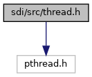
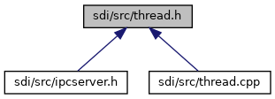

[Data Structures](#nested-classes)

`#include <pthread.h>`

Include dependency graph for thread.h:

This graph shows which files directly or indirectly include this file:

<a href="thread_8h_source.md">Go to the source code of this file.</a>

|  |  |
|----|----|
| Data Structures |  |
| class   | <a href="class_thread.md">Thread</a> |
| class   | <a href="class_thread_control.md">ThreadControl</a> |
