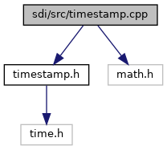

[Namespaces](#namespaces) \| [Functions](#func-members)

`#include "`<a href="sdi_2src_2timestamp_8h_source.md">timestamp.h</a>`"`
`#include <math.h>`

Include dependency graph for timestamp.cpp:

|            |                                            |
|------------|--------------------------------------------|
| Namespaces |                                            |
|            | <a href="namespacesdi.md">sdi</a> |

|  |  |
|----|----|
| Functions |  |
| TimeStamp  | <a href="namespacesdi.md#afc5ba7603df562e3057600548a77ae19">operator+</a> (const TimeStamp &a, const TimeStamp &b) |
| TimeStamp  | <a href="namespacesdi.md#adf8b527bef1f0f4e433ad88ccae5677c">operator-</a> (const TimeStamp &a, const TimeStamp &b) |
