[Data Structures](#nested-classes) \| [Namespaces](#namespaces) \| [Macros](#define-members) \| [Typedefs](#typedef-members) \| [Enumerations](#enum-members) \| [Functions](#func-members)

`#include <`<a href="sysinfo_8h_source.md">sysinfo/sysinfo.h</a>`>`

Include dependency graph for titusstubs.cpp:

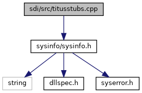

|                 |                                                      |
|-----------------|------------------------------------------------------|
| Data Structures |                                                      |
| struct          | [rawData](#structraw_data)                           |
| struct          | [discoveryParams](#structdiscovery_params)           |
| struct          | [activateParams](#structactivate_params)             |
| struct          | [discoveryResult](#structdiscovery_result)           |
| struct          | [\_cardInfo](#struct__card_info)                     |
| struct          | [\_pollRes](#struct__poll_res)                       |
| struct          | [\_cardInfoFull](#struct__card_info_full)            |
| struct          | [\_pollResFull](#struct__poll_res_full)              |
| struct          | [\_pollReq](#struct__poll_req)                       |
| struct          | [authenticationResult](#structauthentication_result) |
| struct          | [getServicesResult](#structget_services_result)      |
| struct          | [authenticationParams](#structauthentication_params) |
| struct          | [getServicesParams](#structget_services_params)      |
| struct          | [doVASInput](#structdo_v_a_s_input)                  |
| struct          | [doVASOutput](#structdo_v_a_s_output)                |
| struct          | [apduTxData](#structapdu_tx_data)                    |
| struct          | [apduRxData](#structapdu_rx_data)                    |
| struct          | [apduCommand](#structapdu_command)                   |
| struct          | [felicaTxData](#structfelica_tx_data)                |
| struct          | [felicaRxData](#structfelica_rx_data)                |
| struct          | [felicaPolling](#structfelica_polling)               |
| struct          | [felicaPollingOutput](#structfelica_polling_output)  |
| struct          | [TX_RX_PARAM](#struct_t_x___r_x___p_a_r_a_m)         |
| struct          | [callbackFlags](#structcallback_flags)               |
| struct          | [callbackText](#structcallback_text)                 |
| struct          | [callbackLeds](#structcallback_leds)                 |
| struct          | [callbackBuzzer](#structcallback_buzzer)             |
| struct          | [callbackInfo](#structcallback_info)                 |

|            |                                                  |
|------------|--------------------------------------------------|
| Namespaces |                                                  |
|            | <a href="namespacevfigui.md">vfigui</a> |

|  |  |
|----|----|
| Macros |  |
| #define  | [UNKNOWN](#ac1ae4add974b9cfc6b5aaf8a578f01ab)   0x00000000 |
| #define  | [MIFARE_NO_DESFIRE](#a7ffa3265212a9b40d6b3768cbf1da891)   0x00000001 |
| #define  | [ULTRALIGHT](#ab0ee3b39e7b9a5230150a96670251567)   0x00000002 |
| #define  | [MINI](#a0cb2443a51e91f6bb4955607e6740eb4)   0x00000004 |
| #define  | [CLASSIC_1K](#afabadb409a9406d7fd423c4db3b1e917)   0x00000008 |
| #define  | [CLASSIC_4K](#addd3f79ade461371becb4e85cb3e81a6)   0x00000010 |
| #define  | [DESFIRE_CL1](#ab8e8b957c7b98ba00619fe90f3700343)   0x00000020 |
| #define  | [DESFIRE_CL2](#a6ade05bbb66dcb6f2cc55b5f1313d76b)   0x00000040 |
| #define  | [PLUS_2K_SL_1](#a7405413ab8b172c9539cdd1f851e9420)   0x00000080 |
| #define  | [PLUS_4K_SL_1](#ad2f459f5a2cd67baf02442e3be3fcb3f)   0x00000100 |
| #define  | [PLUS_2K_SL_2](#ad3a0b75332626545a7b430f16212c818)   0x00000200 |
| #define  | [PLUS_4K_SL_2](#a67ee9df73f586e3f6a9971b27bad369d)   0x00000400 |
| #define  | [PLUS_2K_SL_3](#afab8839c55c2dad35b4a8a579be6c1c8)   0x00000800 |
| #define  | [PLUS_4K_SL_3](#afe1ac3006d24252fb43bcf34248b3604)   0x00001000 |
| #define  | [TNP3xxx](#a7f4204d1357778e64b982c1ffa74c96d)   0x00002000 |
| #define  | [SMART_MX_1K_EMULATION](#a1a8cadaea5e7374d4486470bb2685cd5)   0x00004000 |
| #define  | [SMART_MX_4K_EMULATION](#aabfceb0ada224732b12e43734980632a)   0x00008000 |
| #define  | [SMART_MX](#a32ed49cbee6829c1ab0131400ed2b97a)   0x00010000 |
| #define  | [APDU_COMPLIANT](#a21c1d446acec2f41a9682c822f12c383)   0x00020000 |
| #define  | [NFC_COMPLIANT](#a2283919157fea12db50306ed710f156b)   0x00040000 |
| #define  | [ULTRALIGHT_C](#a55a3805e87e8aed0644c5026399e4b57)   0x00080000 |
| #define  | [ACTION_DECRYPT](#ab5e3bc6a3475812dcde34d851e0186ff)   1 |
| #define  | [ACTION_STORE_WALLET_KEYS](#ae9333ee0c84b990ae32f0df948a9868e)   3 |
| #define  | [ACTION_GET_WALLET_KEYS](#ad38cb1db79e3de794edff1323dcfb963)   4 |
| #define  | [ACTION_GET_TOKEN](#a8eb76ec6ff48e37d8d1bbc2a401fe28d)   5 |
| #define  | [ACTION_ENCRYPT_TOKEN](#aa14ab37911d23aa32958f41c6b002b00)   6 |
| #define  | [CALLBACK_MAX_TEXT_SIZE](#af1a3bbc93dff14ddbe899b6eacdcf8da)   (64) |

|  |  |
|----|----|
| Typedefs |  |
| typedef struct [\_cardInfo](#struct__card_info)  | [cardInfo](#ac4f9d74d3e7ae774efd6a8c7c31b6965) |
| typedef struct [\_pollRes](#struct__poll_res)  | [pollRes](#abc99c096c433e8ed2fc1a6ac42d2bbc6) |
| typedef struct [\_cardInfoFull](#struct__card_info_full)  | [cardInfoFull](#a40a595cd5294506deeede16a41b91b15) |
| typedef struct [\_pollResFull](#struct__poll_res_full)  | [pollResFull](#abffd13a24a89d1aedf98ae22d6e40eb4) |
| typedef struct [\_pollReq](#struct__poll_req)  | [pollReq](#ab4fc5a0481fff4756bbb875051581e61) |
| typedef void()  | [NfcCallbackFunction](#a09e0971bdc5fca16b920275a5f9aa508)(unsigned char \*data, size_t dataSizeBytes) |

|  |  |
|----|----|
| Enumerations |  |
| enum   | [ResponseCodes](#a42e167e83e1f0229d501a09e3f1d2b1a) {   [EMB_APP_OK](#a42e167e83e1f0229d501a09e3f1d2b1aa1ae5b9979c8827877b43c0eb6dbf193d) = 0, [EMB_APP_INCORRECT_HEADER](#a42e167e83e1f0229d501a09e3f1d2b1aadbc10f56d46e462bfeaf4500bd431124), [EMB_APP_UNKNOWN_COMMAND](#a42e167e83e1f0229d501a09e3f1d2b1aa9f99ca121c6c185ecb9acd8617306e6f), [EMB_APP_UNKNOWN_SUBCOMMAND](#a42e167e83e1f0229d501a09e3f1d2b1aacea836e8c378e7f22cf69fcbd576061c),   [EMB_APP_COMMAND_NOT_SUPPORTED](#a42e167e83e1f0229d501a09e3f1d2b1aa23d842fb52fb9c7e2edc30a8c333d846), [EMB_APP_SUBCOMMAND_NOT_SUPPORTED](#a42e167e83e1f0229d501a09e3f1d2b1aaeb631791b2927af13383b7c287d789bf), [EMB_APP_CRC_ERROR](#a42e167e83e1f0229d501a09e3f1d2b1aa7afa89583fd2f48ec6e9df6978fc6b19), [EMB_APP_FAILED](#a42e167e83e1f0229d501a09e3f1d2b1aaf35513b90b5a053dea0ca992bb20f1f1),   [EMB_APP_TIMEOUT](#a42e167e83e1f0229d501a09e3f1d2b1aa23ef12dc79b4c33fa7a8c04f8dfb134a), [EMB_APP_UNKNOWN_APP_NAME](#a42e167e83e1f0229d501a09e3f1d2b1aa6d346c08346da4fa08ca922c866af099), [EMB_APP_PARAMETER_NOT_SUPPORTED](#a42e167e83e1f0229d501a09e3f1d2b1aaf55a0ff1ed620d281f8f0a46f6b83e5a), [EMB_APP_OTHER_APP_RUNNING](#a42e167e83e1f0229d501a09e3f1d2b1aa2379d0505ba1c598d85c7ccc0b640ffb),   [EMB_APP_AUTO_RUN](#a42e167e83e1f0229d501a09e3f1d2b1aa85e9eafbcabf2c45ed2ebb1d022782be), [EMB_APP_MULTI_CARDS](#a42e167e83e1f0229d501a09e3f1d2b1aa18b8a2ed42ec0c8d30bc932beeecd3ac), [EMB_APP_START_PAYMENT](#a42e167e83e1f0229d501a09e3f1d2b1aaf659038e8cff8c2e14be64bb50bb6c04), [EMB_APP_COMM_ERROR](#a42e167e83e1f0229d501a09e3f1d2b1aa24e0dafa39a46392eb21e22e9cce49b7),   [EMB_APP_DATA_CRC_ERROR](#a42e167e83e1f0229d501a09e3f1d2b1aa7f9aa628463bd420dc1b4e1611da3396), [EMB_APP_INCORRECT_DATA](#a42e167e83e1f0229d501a09e3f1d2b1aa36e526dd5acf4a3ce487da1e48bf5ddd), [EMB_APP_CANCEL_DONE](#a42e167e83e1f0229d501a09e3f1d2b1aafabca2e04d597898c898833b8c7ce6db), [EMB_APP_CANCEL_IRRELEVANT](#a42e167e83e1f0229d501a09e3f1d2b1aa37075839dd27bc1cfb48aaedc6941bff),   [EMB_APP_CANCEL_NOT_ALLOWED](#a42e167e83e1f0229d501a09e3f1d2b1aac1e64c57ff2fea77a25f5f8dd9958923), [EMB_APP_DISCOVERY_CANCELED](#a42e167e83e1f0229d501a09e3f1d2b1aa29c1d452b7a420e45eef56ec4432ff48), [EMB_APP_UNSUPPORTED_CARD](#a42e167e83e1f0229d501a09e3f1d2b1aaf46968b1c847491d30ceafc78edb0232), [EMB_APP_SECOND_TAP_FAILED](#a42e167e83e1f0229d501a09e3f1d2b1aa64a2394c4994cf11a70f4034fa00be50),   [EMB_APP_OUT_OF_ORDER_COMMAND](#a42e167e83e1f0229d501a09e3f1d2b1aa23cac3e7820d9457347e2ff3ad09dd4e), [EMB_APP_2ND_AUTHENTICATION_FAILED](#a42e167e83e1f0229d501a09e3f1d2b1aa3a0355ef9602f97cf3cd9a3d4b96bffe), [EMB_APP_NFC_GROUP_RET_FAIL](#a42e167e83e1f0229d501a09e3f1d2b1aa59665a57652856273260bc1150600039), [EMB_APP_INCORRECT_LEN](#a42e167e83e1f0229d501a09e3f1d2b1aaddec18878c94681f0d6881ca20e45a43),   [EMB_APP_TO_MANY_WALLETS](#a42e167e83e1f0229d501a09e3f1d2b1aa1470bc59ca5b22189e574d0e1ec997c6), [EMB_APP_COMMAND_NOT_ALLOWED](#a42e167e83e1f0229d501a09e3f1d2b1aaed22b476375aa37fb50330d1814175a8), [EMB_APP_MISSING_MANDATORY_DATA](#a42e167e83e1f0229d501a09e3f1d2b1aa8432f9d9eb6ff2673eeaac4d1d63fa1b), [EMB_APP_TWO_SNEP_DEFAULT_WALLET](#a42e167e83e1f0229d501a09e3f1d2b1aadf3c87d70162043abc70eaea4f75221a),   [EMB_APP_INCORRECT_APP_NAME](#a42e167e83e1f0229d501a09e3f1d2b1aaf4d7b3061b0cd0ea2bf95331fb6c6a69), [EMB_APP_APPLICATION_DATA_NOT_ALLOWED](#a42e167e83e1f0229d501a09e3f1d2b1aa25fef497cf4c74f20887eee42ca8ad28), [EMB_APP_APPLICATION_NOT_FOUND](#a42e167e83e1f0229d501a09e3f1d2b1aa642ba1011f50313969be3ae73351d986), [EMB_APP_MISMATHCED_UID](#a42e167e83e1f0229d501a09e3f1d2b1aa56288f47aa408d7355247465edb53664),   [EMB_APP_WALLET_NOT_EXIST](#a42e167e83e1f0229d501a09e3f1d2b1aab659e922ff9890f56e932ee5160436df), [EMB_APP_NFCUTIL_ERROR](#a42e167e83e1f0229d501a09e3f1d2b1aa8ec129611f9a6e54cae94b102ebf927d), [EMB_APP_USER_ACTION_REQUIRED_UI](#a42e167e83e1f0229d501a09e3f1d2b1aa440b092da2e8723b50c264f4e837ef87), [EMB_APP_VAS_DATA_NOT_ACTIVATED](#a42e167e83e1f0229d501a09e3f1d2b1aa81eda044206542c5d9f75b1538a7e8c4),   [EMB_APP_BAD_SYNTAX](#a42e167e83e1f0229d501a09e3f1d2b1aa1639270ddc8d372d46ee0d6061894580), [EMB_APP_INTERNAL_ERROR](#a42e167e83e1f0229d501a09e3f1d2b1aa4547070a73a3905a09a34d57e735201d), [EMB_APP_CARD_NOT_FOUND](#a42e167e83e1f0229d501a09e3f1d2b1aa091726a012061e05ff7d0365de388c0c), [EMB_APP_CARD_ERROR](#a42e167e83e1f0229d501a09e3f1d2b1aafebbcf8141dbcddb65012f78546e3d74),   [EMB_APP_L1_CARD_PROTOCOL_ERROR](#a42e167e83e1f0229d501a09e3f1d2b1aa22b159dd27817ac8e1b22282f453ce2b), [EMB_APP_L1_CARD_NOT_ACTIVE](#a42e167e83e1f0229d501a09e3f1d2b1aae65561b21e5d4ae28c97e0ad957c3376), [EMB_APP_DUMMY_FUNC_CALL](#a42e167e83e1f0229d501a09e3f1d2b1aaf48275d704ede739cd5793f71b589426), [EMB_APP_CALLBACK_SET_ERROR](#a42e167e83e1f0229d501a09e3f1d2b1aa545c5b4f2bb83c9b4c11e67ea8235c07),   [EMB_APP_INIT_ERROR](#a42e167e83e1f0229d501a09e3f1d2b1aa66b47940f40a23fec0e893d00c8d301b), [EMB_APP_L1_DRIVER_CLOSED](#a42e167e83e1f0229d501a09e3f1d2b1aaf88fbe772fbd14d061dbad2ac7daf464) } |
| enum   | [VasStatus](#a23878ec2ab700ea0ebd617a736ff664d) {   [VAS_OK](#a23878ec2ab700ea0ebd617a736ff664da8c7c8ccd8db096b7018471ef8b7cbb42) = 0, [VAS_DO_PAY](#a23878ec2ab700ea0ebd617a736ff664dac8e118bd9e781d29218896dec1de6924), [VAS_FAIL](#a23878ec2ab700ea0ebd617a736ff664dadd9f66e2ae107c591dee356e885ae116), [VAS_ERR_CTLS_DRIVER_CLOSE](#a23878ec2ab700ea0ebd617a736ff664da8fec5eb424f2f4454076cf139b46ac15),   [VAS_CANCEL](#a23878ec2ab700ea0ebd617a736ff664dac20a573e60d5a8e36ae536a629643ba6), [VAS_TIME_OUT](#a23878ec2ab700ea0ebd617a736ff664da83a598d17127ea50928c4e4efd979c51), [VAS_ERR_CONFIG](#a23878ec2ab700ea0ebd617a736ff664dab2cdbdf047c6ca307296d4d0b3b557a5), [VAS_DUMMY_CALL](#a23878ec2ab700ea0ebd617a736ff664da797b33170413c39b1720c81198c1ff59),   [VAS_CANCEL_NOT_ALLOWED](#a23878ec2ab700ea0ebd617a736ff664daca88bd730481734ac943cbef6d54bd80), [VAS_CANCEL_IRRELEVANT](#a23878ec2ab700ea0ebd617a736ff664dae34269934860d0687a1a32b4fd58ec3c), [VAS_COMM_ERR](#a23878ec2ab700ea0ebd617a736ff664dab4a27fa4a39c7f705d8eca7bc5d9ac92), [VAS_INIT_ERROR](#a23878ec2ab700ea0ebd617a736ff664dab2da40a454079c6b259069df563440f7),   [VAS_DO_PAY_DECRYPT_REQ](#a23878ec2ab700ea0ebd617a736ff664daf64f0437ec028a3a61caa4b3a1f52e87), [VAS_OK_DECRYPT_REQ](#a23878ec2ab700ea0ebd617a736ff664dae7cd8d56ea62d1b47794de1dc0350719) } |
| enum   | [NFC_CARD_TYPE](#aaa127d57ebb465856805042ac5cd3276) {   [I_ISO14443A](#aaa127d57ebb465856805042ac5cd3276a3c01f70e75a226e41d3da590894a5420) = 1, [I_JEWEL](#aaa127d57ebb465856805042ac5cd3276a5622953c1d34372843815f2f3b186ac5) = 2, [I_ISO14443B](#aaa127d57ebb465856805042ac5cd3276af83700cd9387203788e0eea62b589a16) = 3, [I_ISO14443BI](#aaa127d57ebb465856805042ac5cd3276a2ff69117c375dfae66bfa98536b88fe0) = 4,   [I_ISO14443B2SR](#aaa127d57ebb465856805042ac5cd3276a25721b05538db8287192e9b9fc8a57ee) = 5, [I_ISO14443B2CT](#aaa127d57ebb465856805042ac5cd3276acc483e7e63fd2ed9f3608378692409d8) = 6, [I_DEP](#aaa127d57ebb465856805042ac5cd3276a902aba4d258a8f49df9479c28e2d7e37) = 7, [I_FELICA](#aaa127d57ebb465856805042ac5cd3276aab6e793bee8234a2e5a8338bfa7801f1) = 8,   [I_ISO14443A_MIFARE_MINI](#aaa127d57ebb465856805042ac5cd3276a29101ced040fb2c598886e4d6daef0a1) = 9, [I_ISO14443A_MIFARE_1K](#aaa127d57ebb465856805042ac5cd3276ae89ee3a1a38bb5c408a60dea6bcf12ba) = 10, [I_ISO14443A_MIFARE_4K](#aaa127d57ebb465856805042ac5cd3276a29aff7e4401402cd5bf2a3f184b56d4e) = 11, [I_ISO14443A_MIFARE_DES](#aaa127d57ebb465856805042ac5cd3276a1ed02278f8caa3a39778c50e340158c8) = 12,   [I_ISO14443A_MIFARE_PLUS](#aaa127d57ebb465856805042ac5cd3276ad30e84105080a927b71592065ff9c85c) = 13, [I_ISO14443A_MIFARE_UL](#aaa127d57ebb465856805042ac5cd3276a407f42558e97c012ade03a996964f2c0) = 14, [I_ISO14443A_MIFARE_UL_C](#aaa127d57ebb465856805042ac5cd3276a512aa5b7cccd17f04f5a02272d5ddc95) = 15, [I_UNKNOWN_CARD_TYPE](#aaa127d57ebb465856805042ac5cd3276aaa8ce646247179be2819e126c2edf3ea) = 16,   [I_ISO14443A_APDU_MIFARE_1K](#aaa127d57ebb465856805042ac5cd3276a1b0b79737533639714a9b7ce73c9178b) = 17 } |
| enum   | [I_MIFARE_CARD_TYPE](#a305e8ef6dafad4980a3c94ce20eb4528) { [I_MIFARE_TYPE_CLASSIC](#a305e8ef6dafad4980a3c94ce20eb4528adad7ef11b13de8b7177ce35220e7aba4), [I_MIFARE_TYPE_ULTRALIGHT](#a305e8ef6dafad4980a3c94ce20eb4528a25079351bd0ad1a1b8095bd10ce35c60), [I_MIFARE_TYPE_ULTRALIGHT_C](#a305e8ef6dafad4980a3c94ce20eb4528a25821f35dee2e0981f981b2037c3f35e), [I_MIFARE_TYPE_CLASSIC_4K](#a305e8ef6dafad4980a3c94ce20eb4528a34d109084b2a8060213edeb2fa250031) } |
| enum   | [NFC_POLL_PARAM_TECH](#a9bd1ffbba4634a8707caf0b8840ed5c9) {   [NFC_POLL_PARAM_TECH_A](#a9bd1ffbba4634a8707caf0b8840ed5c9a095d722cb68670beea6002cd84ef6a37) = 0x01, [NFC_POLL_PARAM_TECH_B](#a9bd1ffbba4634a8707caf0b8840ed5c9a2fbda2a62f66a6644864cf576f01443d) = 0x02, [NFC_POLL_PARAM_TECH_AB](#a9bd1ffbba4634a8707caf0b8840ed5c9ae44c9cc468b3953877e9420cc8b30950) = 0x03, [NFC_POLL_PARAM_TECH_F_DEP](#a9bd1ffbba4634a8707caf0b8840ed5c9a6c6842f2e8a0bb03131fdff2bafc2a51) = 0x04,   [NFC_POLL_PARAM_TECH_FELICA](#a9bd1ffbba4634a8707caf0b8840ed5c9a151d690b298436f3db72c8bb46a62901) = 0x08, [NFC_POLL_PARAM_TECH_F](#a9bd1ffbba4634a8707caf0b8840ed5c9ac528b0bb0eacc076f5d5accfe0e52f65) = 0x0C, [NFC_POLL_PARAM_TECH_AF](#a9bd1ffbba4634a8707caf0b8840ed5c9a29502eed0bb440065cf05f204fa77854) = 0x05, [NFC_POLL_PARAM_TECH_BF](#a9bd1ffbba4634a8707caf0b8840ed5c9aba77a6510477affe00c1d6d5fb329642) = 0x06,   [NFC_POLL_PARAM_TECH_ABF](#a9bd1ffbba4634a8707caf0b8840ed5c9a1e79da4b579afa4d1ee3988607832409) = 0x07, [NFC_POLL_PARAM_CUSTOM](#a9bd1ffbba4634a8707caf0b8840ed5c9a3ac537b8375ed7bd59c84a614586d270) = 0x10 } |
| enum   | [NFC_F_BAUD](#afbdd40a0f001fb7ab2c52ee99422b5eb) { [INF_BAUD212](#afbdd40a0f001fb7ab2c52ee99422b5eba8340c2a3c3e67d28784023e1b22fcd9b), [INF_BAUD424](#afbdd40a0f001fb7ab2c52ee99422b5eba8ebd537666fa94d66b54f31560e0e53f) } |
| enum   | [MIFARE_KEY_TYPE](#a72881cdace76f5df6b0296a826ea71ee) { [MIFARE_KEY_TYPE_A](#a72881cdace76f5df6b0296a826ea71eea46393e0dddf2945e04b4a12b9c77ca4a) = 1, [MIFARE_KEY_TYPE_B](#a72881cdace76f5df6b0296a826ea71eeacc5f608d84d6854777ba463adf2399a0) } |
| enum   | [FrameworkState](#ad4a095600742c645131c8e3afbefc436) { [IDLE](#ad4a095600742c645131c8e3afbefc436afd6a0e4343048b10646dd2976cc5ad18) = 1, [BUSY](#ad4a095600742c645131c8e3afbefc436aa6e504d57ec9777faa0185fbd3b93b97) = 2 } |
| enum   | [callbackBuzzerFrequency](#a39f67630f813a1b3cd2e1a83396473ca) { [CALLBACK_BUZZER_FREQUENCY_LOW](#a39f67630f813a1b3cd2e1a83396473caadb5a66f31909e3373122dc565ffb8496) = 0xFFFF, [CALLBACK_BUZZER_FREQUENCY_HIGH](#a39f67630f813a1b3cd2e1a83396473caa6793faa6853fa2f877587c7617abe8f2) = 0xFFFE } |

|  |  |
|----|----|
| Functions |  |
| bool  | [isVclEnabled](#a78fee93cfc06d514ca06597ec76f4344) (bool checkVCLStatus) |
| bool  | [isVclTag](#ae39fd7875d2587fff66e7ea5ac6eebf5) (unsigned long ulTag) |
| bool  | [VCL_DecryptMSR](#a761a155521638c5af5d80704e48ffb6b) () |
| bool  | [VCL_EncryptEMV](#ab69f251cd1f487f02772398cd791b2fe) () |
| [ResponseCodes](#a42e167e83e1f0229d501a09e3f1d2b1a)  | [NFC_Config_Init](#a0d86892d3fb8c0bd2e38f4dc2558f326) (void) |
| [ResponseCodes](#a42e167e83e1f0229d501a09e3f1d2b1a)  | [NFC_Get_Version](#aeb1d7b0b11d9e03b115520994b55f35c) ([rawData](#structraw_data) \*output) |
| [ResponseCodes](#a42e167e83e1f0229d501a09e3f1d2b1a)  | [NFC_Ping](#a67ffc3f45da9f94fe48f8b7915008bf1) ([rawData](#structraw_data) \*output) |
| [ResponseCodes](#a42e167e83e1f0229d501a09e3f1d2b1a)  | [NFC_Set_Callback_Function](#ae2824260537e148970342b114f4f3cef) ([rawData](#structraw_data) \*id, [NfcCallbackFunction](#a09e0971bdc5fca16b920275a5f9aa508) \*callbackFunction) |
| [ResponseCodes](#a42e167e83e1f0229d501a09e3f1d2b1a)  | [NFC_Callback_Test](#a4393526286ccc021c29b5c9ffffea6d5) (void) |
| [ResponseCodes](#a42e167e83e1f0229d501a09e3f1d2b1a)  | [NFC_PT_Open](#aaa8fefdd6c9e72d4d3a487b0ae5e5925) (void) |
| [ResponseCodes](#a42e167e83e1f0229d501a09e3f1d2b1a)  | [NFC_PT_Close](#a00d4921f4a21667ae4cddb317ffc04a5) (void) |
| [ResponseCodes](#a42e167e83e1f0229d501a09e3f1d2b1a)  | [NFC_PT_FieldOn](#af0e3c8e7991ac4edbeceb2e432c10275) (void) |
| [ResponseCodes](#a42e167e83e1f0229d501a09e3f1d2b1a)  | [NFC_PT_FieldOff](#a65c5ac372de4d71a8154f61b820abaf0) (void) |
| [ResponseCodes](#a42e167e83e1f0229d501a09e3f1d2b1a)  | [NFC_PT_Polling](#aa1e541259f194621834060bf770b717b) ([pollReq](#ab4fc5a0481fff4756bbb875051581e61) \*in_pull_req, [pollRes](#abc99c096c433e8ed2fc1a6ac42d2bbc6) \*out_pull_res) |
| [ResponseCodes](#a42e167e83e1f0229d501a09e3f1d2b1a)  | [NFC_PT_PollingFull](#ac692591d9c1287d0d4b6131a03b2e977) ([pollReq](#ab4fc5a0481fff4756bbb875051581e61) \*in_pull_req, [pollResFull](#abffd13a24a89d1aedf98ae22d6e40eb4) \*out_pull_res) |
| void  | [NFC_Free_Poll_Data](#a57637ae13b965f52baad6f2cf6df9b29) ([pollRes](#abc99c096c433e8ed2fc1a6ac42d2bbc6) \*out_pull_res) |
| void  | [NFC_Free_Poll_DataFull](#ab5991ed326183f4e8d0f7a00c9ff60a4) ([pollResFull](#abffd13a24a89d1aedf98ae22d6e40eb4) \*out_pull_res) |
| [ResponseCodes](#a42e167e83e1f0229d501a09e3f1d2b1a)  | [NFC_PT_Cancel_Polling](#ac828fb5be4468adf0d1058e70db106ee) (void) |
| [ResponseCodes](#a42e167e83e1f0229d501a09e3f1d2b1a)  | [NFC_PT_Activation](#a969e1a6109a61709214ff554e91eed60) ([NFC_CARD_TYPE](#aaa127d57ebb465856805042ac5cd3276) cardType, [rawData](#structraw_data) \*rd_activationData) |
| [ResponseCodes](#a42e167e83e1f0229d501a09e3f1d2b1a)  | [NFC_PT_TxRx](#a32723e5224c90c693a167dbdfb7d4700) ([NFC_CARD_TYPE](#aaa127d57ebb465856805042ac5cd3276) cardType, [rawData](#structraw_data) \*in_buff, [rawData](#structraw_data) \*out_buff) |
| [ResponseCodes](#a42e167e83e1f0229d501a09e3f1d2b1a)  | [NFC_PT_FtechBaud](#af3c0de5e1db22e34a32d0d5adab0e756) ([NFC_F_BAUD](#afbdd40a0f001fb7ab2c52ee99422b5eb) baud) |
| [ResponseCodes](#a42e167e83e1f0229d501a09e3f1d2b1a)  | [NFC_PT_Adv_TxRx](#a38c8ee979705bde141c922ebb2915337) ([TX_RX_PARAM](#struct_t_x___r_x___p_a_r_a_m) \*comParams, [rawData](#structraw_data) \*in_buff, [rawData](#structraw_data) \*out_buff) |
| [ResponseCodes](#a42e167e83e1f0229d501a09e3f1d2b1a)  | [NFC_Mifare_Authenticate](#aedec140cfc839fe5a37cf2a50a2817f4) (unsigned char blockNumber, [MIFARE_KEY_TYPE](#a72881cdace76f5df6b0296a826ea71ee) keyType, [rawData](#structraw_data) \*Key) |
| [ResponseCodes](#a42e167e83e1f0229d501a09e3f1d2b1a)  | [NFC_Mifare_Read](#ae4ae024c208eeaf4a8a8c6a0d4455850) ([I_MIFARE_CARD_TYPE](#a305e8ef6dafad4980a3c94ce20eb4528) m_cardType, unsigned int StartBlockNum, unsigned int blockAmount, [rawData](#structraw_data) \*out_buff) |
| [ResponseCodes](#a42e167e83e1f0229d501a09e3f1d2b1a)  | [NFC_Mifare_Write](#a530661a2519e18704b7b42d20f975d10) ([I_MIFARE_CARD_TYPE](#a305e8ef6dafad4980a3c94ce20eb4528) m_cardType, unsigned int StartBlockNum, unsigned int blockAmount, [rawData](#structraw_data) \*in_buff) |
| [ResponseCodes](#a42e167e83e1f0229d501a09e3f1d2b1a)  | [NFC_Mifare_Increment](#a1465ec2daccc203d021d97c85d216628) (unsigned int blockNum, int amount) |
| [ResponseCodes](#a42e167e83e1f0229d501a09e3f1d2b1a)  | [NFC_Mifare_Decrement](#a0173f202da9dcb995cf8a0ae2c676a9d) (unsigned int blockNum, int amount) |
| [ResponseCodes](#a42e167e83e1f0229d501a09e3f1d2b1a)  | [NFC_Mifare_Increment_Only](#a905d4c59d169e24179efdefb7b02ea29) (unsigned int blockNum, int amount) |
| [ResponseCodes](#a42e167e83e1f0229d501a09e3f1d2b1a)  | [NFC_Mifare_Decrement_Only](#af60063ed1a2e16ea0d36246c00060b9e) (unsigned int blockNum, int amount) |
| [ResponseCodes](#a42e167e83e1f0229d501a09e3f1d2b1a)  | [NFC_Mifare_Transfer](#a927d249ae02b388d7cd1e673844263d0) (unsigned int blockNum) |
| [ResponseCodes](#a42e167e83e1f0229d501a09e3f1d2b1a)  | [NFC_Mifare_Restore](#ab6deea5c5d4fda9e929350926b527196) (unsigned int blockNum) |
| [ResponseCodes](#a42e167e83e1f0229d501a09e3f1d2b1a)  | [NFC_Felica_Exchange](#a2c931bb61406783d5beae327e75f9c62) ([felicaTxData](#structfelica_tx_data) \*in_buff, [felicaRxData](#structfelica_rx_data) \*out_buff) |
| [ResponseCodes](#a42e167e83e1f0229d501a09e3f1d2b1a)  | [NFC_Felica_Polling](#a243a0bf8d307ac9e73b6ceb1428b5fee) (unsigned int pollTimeout, [felicaPolling](#structfelica_polling) \*inData, [felicaPollingOutput](#structfelica_polling_output) \*outData) |
| [ResponseCodes](#a42e167e83e1f0229d501a09e3f1d2b1a)  | [NFC_APDU_Exchange](#af4ee1c833fe1c5cb410982be81a68a12) ([apduTxData](#structapdu_tx_data) \*txData, [apduRxData](#structapdu_rx_data) \*rxData) |
| [ResponseCodes](#a42e167e83e1f0229d501a09e3f1d2b1a)  | [NFC_Card_Removal](#a568828e0b074fc2efb83f864ee06aafb) (void) |
| [VasStatus](#a23878ec2ab700ea0ebd617a736ff664d)  | [NFC_Terminal_Config](#ad0a349a0904d698fea9fffa004cb3eb3) ([rawData](#structraw_data) \*input, [rawData](#structraw_data) \*output) |
| [VasStatus](#a23878ec2ab700ea0ebd617a736ff664d)  | [NFC_TERMINAL_ReadConfig](#a2de5511cecb17b6859116720c33b48bf) ([rawData](#structraw_data) \*id, [rawData](#structraw_data) \*output) |
| [VasStatus](#a23878ec2ab700ea0ebd617a736ff664d)  | [NFC_VAS_ReadConfig](#af8f463010a4c8584d2973b9df3c88c52) ([rawData](#structraw_data) \*id, [rawData](#structraw_data) \*output) |
| [VasStatus](#a23878ec2ab700ea0ebd617a736ff664d)  | [NFC_VAS_Activate](#a1f0e681b88497ef9e25abde4ed3b5b3b) ([rawData](#structraw_data) \*id, [rawData](#structraw_data) \*input, [rawData](#structraw_data) \*output) |
| [VasStatus](#a23878ec2ab700ea0ebd617a736ff664d)  | [NFC_VAS_Cancel](#a03691ec1f524ef86c995066b25185e80) (void) |
| [VasStatus](#a23878ec2ab700ea0ebd617a736ff664d)  | [NFC_VAS_UpdateConfig](#a8816583d91da702a6c7e2143ed68f7d9) ([rawData](#structraw_data) \*id, [rawData](#structraw_data) \*input, [rawData](#structraw_data) \*output) |
| [VasStatus](#a23878ec2ab700ea0ebd617a736ff664d)  | [NFC_VAS_CancelConfig](#a7ea699bbeb85daabaf52bb2d94d7dc61) ([rawData](#structraw_data) \*id) |
| [VasStatus](#a23878ec2ab700ea0ebd617a736ff664d)  | [NFC_VAS_PreLoad](#a8ee28a30cc5757bdd4d9ac413fe7ef17) ([rawData](#structraw_data) \*id, [rawData](#structraw_data) \*input, [rawData](#structraw_data) \*output) |
| [VasStatus](#a23878ec2ab700ea0ebd617a736ff664d)  | [NFC_VAS_CancelPreLoad](#a46e68ef15da8c20bc91ddef1b814859c) ([rawData](#structraw_data) \*id) |
| [VasStatus](#a23878ec2ab700ea0ebd617a736ff664d)  | [NFC_VAS_Decrypt](#a19053197bd7fd0894d55827e7becec0a) ([rawData](#structraw_data) \*id, [rawData](#structraw_data) \*input, [rawData](#structraw_data) \*output) |
| [VasStatus](#a23878ec2ab700ea0ebd617a736ff664d)  | [NFC_VAS_Action](#a2598cb3e420c45913bfab5801c6a33a8) ([rawData](#structraw_data) \*id, int action, [rawData](#structraw_data) \*inData, [rawData](#structraw_data) \*outBuff) |
| <a href="sound_8h.md#ad7c2e1cb200073ed64c64285a5f37231">DllSpec</a> int  | <a href="namespacevfigui.md#aeeb84d055718fd760d2db795f5c7159c">uiSetLED</a> (int display, unsigned led, bool state) |
| <a href="sound_8h.md#ad7c2e1cb200073ed64c64285a5f37231">DllSpec</a> int  | <a href="namespacevfigui.md#a2d552e5f0863af3ad7aeb9789c6f0e0c">uiSetLED</a> (unsigned led, bool state) |

------------------------------------------------------------------------

## DataStructure Documentation {#data-structure-documentation}

## rawData 

struct rawData

| Data Fields      |               |     |
|------------------|---------------|-----|
| unsigned char \* | buffer        |     |
| unsigned int     | bufferLen     |     |
| unsigned int     | bufferMaxSize |     |

## discoveryParams 

struct discoveryParams

| Data Fields   |                       |     |
|---------------|-----------------------|-----|
| unsigned char | activation            |     |
| unsigned char | cardType              |     |
| unsigned char | collision             |     |
| unsigned char | customPollParams\[1\] |     |
| unsigned char | customPollParamsSize  |     |
| unsigned int  | pollTime              |     |
| unsigned char | technology            |     |

## activateParams 

struct activateParams

| Data Fields   |            |     |
|---------------|------------|-----|
| unsigned char | technology |     |

## discoveryResult 

struct discoveryResult

| Data Fields   |               |     |
|---------------|---------------|-----|
| unsigned char | cardTypeA     |     |
| unsigned char | cardTypeB     |     |
| unsigned char | cardTypeF     |     |
| unsigned char | numOfCards    |     |
| unsigned char | numOfCardsA   |     |
| unsigned char | numOfCardsB   |     |
| unsigned char | numOfCardsF   |     |
| unsigned char | pollData\[1\] |     |
| unsigned char | pollDataSize  |     |
| unsigned char | sak           |     |
| unsigned char | status        |     |
| unsigned char | uidA\[1\]     |     |
| unsigned char | uidA_Size     |     |
| unsigned char | uidB\[1\]     |     |
| unsigned char | uidB_Size     |     |
| unsigned char | uidF\[1\]     |     |
| unsigned char | uidF_Size     |     |

## \_cardInfo 

struct \_cardInfo

Collaboration diagram for \_cardInfo:

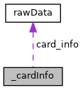

\[<a href="graph_legend.md">legend</a>\]

| Data Fields                                         |           |     |
|-----------------------------------------------------|-----------|-----|
| [rawData](#structraw_data)                          | card_info |     |
| [NFC_CARD_TYPE](#aaa127d57ebb465856805042ac5cd3276) | cardType  |     |

## \_pollRes 

struct \_pollRes

Collaboration diagram for \_pollRes:

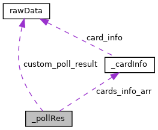

\[<a href="graph_legend.md">legend</a>\]

| Data Fields |  |  |
|----|----|----|
| [cardInfo](#ac4f9d74d3e7ae774efd6a8c7c31b6965) \* | cards_info_arr |  |
| [rawData](#structraw_data) | custom_poll_result |  |
| unsigned int | m_foundTargetsA |  |
| unsigned int | m_foundTargetsB |  |
| unsigned int | m_foundTargetsF |  |
| unsigned int | m_foundTargetsTotalCount |  |

## \_cardInfoFull 

struct \_cardInfoFull

Collaboration diagram for \_cardInfoFull:

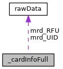

\[<a href="graph_legend.md">legend</a>\]

| Data Fields                |              |     |
|----------------------------|--------------|-----|
| unsigned char              | ATQ\[2\]     |     |
| long                       | m_cardTypes  |     |
| unsigned char              | m_modulation |     |
| unsigned char              | m_SAK        |     |
| [rawData](#structraw_data) | mrd_RFU      |     |
| [rawData](#structraw_data) | mrd_UID      |     |

## \_pollResFull 

struct \_pollResFull

Collaboration diagram for \_pollResFull:

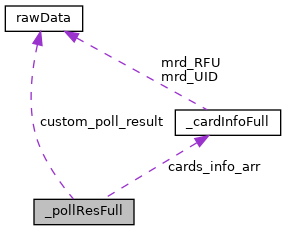

\[<a href="graph_legend.md">legend</a>\]

| Data Fields |  |  |
|----|----|----|
| [cardInfoFull](#a40a595cd5294506deeede16a41b91b15) \* | cards_info_arr |  |
| [rawData](#structraw_data) | custom_poll_result |  |
| unsigned int | m_foundTargetsA |  |
| unsigned int | m_foundTargetsB |  |
| unsigned int | m_foundTargetsF |  |
| unsigned int | m_foundTargetsTotalCount |  |

## \_pollReq 

struct \_pollReq

Collaboration diagram for \_pollReq:

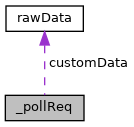

\[<a href="graph_legend.md">legend</a>\]

| Data Fields                |                 |     |
|----------------------------|-----------------|-----|
| [rawData](#structraw_data) | customData      |     |
| unsigned int               | poll_timeout    |     |
| unsigned int               | tech_bitmap     |     |
| bool                       | turnDutyCycleOn |     |

## authenticationResult 

struct authenticationResult

Collaboration diagram for authenticationResult:

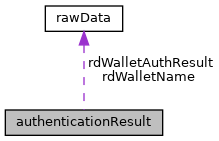

\[<a href="graph_legend.md">legend</a>\]

| Data Fields                |                    |     |
|----------------------------|--------------------|-----|
| [rawData](#structraw_data) | rdWalletAuthResult |     |
| [rawData](#structraw_data) | rdWalletName       |     |
| unsigned char              | status             |     |

## getServicesResult 

struct getServicesResult

Collaboration diagram for getServicesResult:

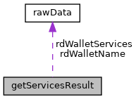

\[<a href="graph_legend.md">legend</a>\]

| Data Fields                |                  |     |
|----------------------------|------------------|-----|
| [rawData](#structraw_data) | rdWalletName     |     |
| [rawData](#structraw_data) | rdWalletServices |     |
| unsigned char              | status           |     |

## authenticationParams 

struct authenticationParams

Collaboration diagram for authenticationParams:

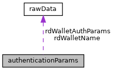

\[<a href="graph_legend.md">legend</a>\]

| Data Fields                |                       |     |
|----------------------------|-----------------------|-----|
| unsigned char              | cardType              |     |
| unsigned int               | expectedResultMaxSize |     |
| [rawData](#structraw_data) | rdWalletAuthParams    |     |
| [rawData](#structraw_data) | rdWalletName          |     |
| unsigned char              | tech                  |     |

## getServicesParams 

struct getServicesParams

Collaboration diagram for getServicesParams:

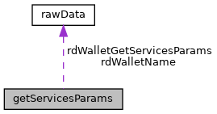

\[<a href="graph_legend.md">legend</a>\]

| Data Fields                |                           |     |
|----------------------------|---------------------------|-----|
| unsigned int               | expectedResultMaxSize     |     |
| [rawData](#structraw_data) | rdWalletGetServicesParams |     |
| [rawData](#structraw_data) | rdWalletName              |     |

## doVASInput 

struct doVASInput

Collaboration diagram for doVASInput:

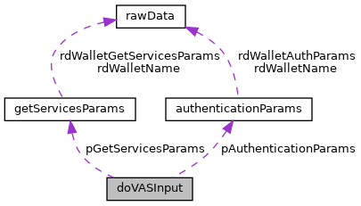

\[<a href="graph_legend.md">legend</a>\]

| Data Fields |  |  |
|----|----|----|
| [authenticationParams](#structauthentication_params) \* | pAuthenticationParams |  |
| [getServicesParams](#structget_services_params) \* | pGetServicesParams |  |

## doVASOutput 

struct doVASOutput

Collaboration diagram for doVASOutput:

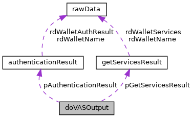

\[<a href="graph_legend.md">legend</a>\]

| Data Fields |  |  |
|----|----|----|
| [authenticationResult](#structauthentication_result) \* | pAuthenticationResult |  |
| [getServicesResult](#structget_services_result) \* | pGetServicesResult |  |

## apduTxData 

struct apduTxData

Collaboration diagram for apduTxData:

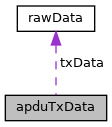

\[<a href="graph_legend.md">legend</a>\]

| Data Fields                |                     |     |
|----------------------------|---------------------|-----|
| unsigned int               | clas                |     |
| unsigned int               | expectedResponseLen |     |
| unsigned int               | instruction         |     |
| unsigned int               | param1              |     |
| unsigned int               | param2              |     |
| [rawData](#structraw_data) | txData              |     |

## apduRxData 

struct apduRxData

Collaboration diagram for apduRxData:

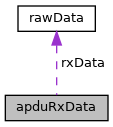

\[<a href="graph_legend.md">legend</a>\]

| Data Fields                |        |     |
|----------------------------|--------|-----|
| [rawData](#structraw_data) | rxData |     |
| unsigned int               | sw1    |     |
| unsigned int               | sw2    |     |

## apduCommand 

struct apduCommand

| Data Fields   |              |     |
|---------------|--------------|-----|
| unsigned char | clas         |     |
| unsigned char | expectResLen |     |
| unsigned char | instraction  |     |
| unsigned char | param1       |     |
| unsigned char | param2       |     |

## felicaTxData 

struct felicaTxData

Collaboration diagram for felicaTxData:

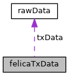

\[<a href="graph_legend.md">legend</a>\]

| Data Fields                |         |     |
|----------------------------|---------|-----|
| unsigned int               | timeOut |     |
| [rawData](#structraw_data) | txData  |     |

## felicaRxData 

struct felicaRxData

Collaboration diagram for felicaRxData:

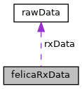

\[<a href="graph_legend.md">legend</a>\]

| Data Fields                |        |     |
|----------------------------|--------|-----|
| [rawData](#structraw_data) | rxData |     |

## felicaPolling 

struct felicaPolling

| Data Fields   |                 |     |
|---------------|-----------------|-----|
| unsigned int  | reciveTimeOUt   |     |
| unsigned char | requestCode     |     |
| unsigned char | systemCode\[2\] |     |
| unsigned char | TimeSlot        |     |

## felicaPollingOutput 

struct felicaPollingOutput

| Data Fields   |              |     |
|---------------|--------------|-----|
| unsigned char | pad\[8\]     |     |
| unsigned char | sysCode\[2\] |     |
| unsigned char | UID\[8\]     |     |

## TX_RX_PARAM 

struct TX_RX_PARAM

| Data Fields   |                 |     |
|---------------|-----------------|-----|
| unsigned char | CRC             |     |
| unsigned char | invalidFrames   |     |
| unsigned char | parity          |     |
| unsigned int  | responseTimeout |     |
| unsigned char | tech            |     |
| unsigned int  | timeOutCom      |     |

## callbackFlags 

struct callbackFlags

| Data Fields  |                  |     |
|--------------|------------------|-----|
| unsigned int | buzzerPresent: 1 |     |
| unsigned int | init: 1          |     |
| unsigned int | ledsPresent: 1   |     |
| unsigned int | textPresent: 1   |     |

## callbackText 

struct callbackText

| Data Fields |  |  |
|----|----|----|
| char | text\[[CALLBACK_MAX_TEXT_SIZE](#af1a3bbc93dff14ddbe899b6eacdcf8da)\] |  |

## callbackLeds 

struct callbackLeds

| Data Fields  |         |     |
|--------------|---------|-----|
| unsigned int | led1: 2 |     |
| unsigned int | led2: 2 |     |
| unsigned int | led3: 2 |     |
| unsigned int | led4: 2 |     |

## callbackBuzzer 

struct callbackBuzzer

| Data Fields |  |  |
|----|----|----|
| [callbackBuzzerFrequency](#a39f67630f813a1b3cd2e1a83396473ca) | frequency |  |
| unsigned int | nTimes |  |
| unsigned int | off_ms |  |
| unsigned int | on_ms |  |

## callbackInfo 

struct callbackInfo

Collaboration diagram for callbackInfo:

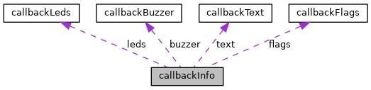

\[<a href="graph_legend.md">legend</a>\]

| Data Fields                              |        |     |
|------------------------------------------|--------|-----|
| [callbackBuzzer](#structcallback_buzzer) | buzzer |     |
| [callbackFlags](#structcallback_flags)   | flags  |     |
| [callbackLeds](#structcallback_leds)     | leds   |     |
| [callbackText](#structcallback_text)     | text   |     |

## MacroDefinition Documentation {#macro-definition-documentation}

## ACTION_DECRYPT 

#define ACTION_DECRYPT   1

## ACTION_ENCRYPT_TOKEN 

#define ACTION_ENCRYPT_TOKEN   6

## ACTION_GET_TOKEN 

#define ACTION_GET_TOKEN   5

## ACTION_GET_WALLET_KEYS 

#define ACTION_GET_WALLET_KEYS   4

## ACTION_STORE_WALLET_KEYS 

#define ACTION_STORE_WALLET_KEYS   3

## APDU_COMPLIANT 

#define APDU_COMPLIANT   0x00020000

## CALLBACK_MAX_TEXT_SIZE 

#define CALLBACK_MAX_TEXT_SIZE   (64)

## CLASSIC_1K 

#define CLASSIC_1K   0x00000008

## CLASSIC_4K 

#define CLASSIC_4K   0x00000010

## DESFIRE_CL1 

#define DESFIRE_CL1   0x00000020

## DESFIRE_CL2 

#define DESFIRE_CL2   0x00000040

## MIFARE_NO_DESFIRE 

#define MIFARE_NO_DESFIRE   0x00000001

## MINI 

#define MINI   0x00000004

## NFC_COMPLIANT 

#define NFC_COMPLIANT   0x00040000

## PLUS_2K_SL_1 

#define PLUS_2K_SL_1   0x00000080

## PLUS_2K_SL_2 

#define PLUS_2K_SL_2   0x00000200

## PLUS_2K_SL_3 

#define PLUS_2K_SL_3   0x00000800

## PLUS_4K_SL_1 

#define PLUS_4K_SL_1   0x00000100

## PLUS_4K_SL_2 

#define PLUS_4K_SL_2   0x00000400

## PLUS_4K_SL_3 

#define PLUS_4K_SL_3   0x00001000

## SMART_MX 

#define SMART_MX   0x00010000

## SMART_MX_1K_EMULATION 

#define SMART_MX_1K_EMULATION   0x00004000

## SMART_MX_4K_EMULATION 

#define SMART_MX_4K_EMULATION   0x00008000

## TNP3xxx 

#define TNP3xxx   0x00002000

## ULTRALIGHT 

#define ULTRALIGHT   0x00000002

## ULTRALIGHT_C 

#define ULTRALIGHT_C   0x00080000

## UNKNOWN 

#define UNKNOWN   0x00000000

## TypedefDocumentation {#typedef-documentation}

## cardInfo 

typedef struct [\_cardInfo](#struct__card_info) [cardInfo](#ac4f9d74d3e7ae774efd6a8c7c31b6965)

## cardInfoFull 

typedef struct [\_cardInfoFull](#struct__card_info_full) [cardInfoFull](#a40a595cd5294506deeede16a41b91b15)

## NfcCallbackFunction 

typedef void() NfcCallbackFunction(unsigned char \*data, size_t dataSizeBytes)

## pollReq 

typedef struct [\_pollReq](#struct__poll_req) [pollReq](#ab4fc5a0481fff4756bbb875051581e61)

## pollRes 

typedef struct [\_pollRes](#struct__poll_res) [pollRes](#abc99c096c433e8ed2fc1a6ac42d2bbc6)

## pollResFull 

typedef struct [\_pollResFull](#struct__poll_res_full) [pollResFull](#abffd13a24a89d1aedf98ae22d6e40eb4)

## EnumerationType Documentation {#enumeration-type-documentation}

## callbackBuzzerFrequency 

enum [callbackBuzzerFrequency](#a39f67630f813a1b3cd2e1a83396473ca)

| Enumerator                      |     |
|---------------------------------|-----|
| CALLBACK_BUZZER_FREQUENCY_LOW   |     |
| CALLBACK_BUZZER_FREQUENCY_HIGH  |     |

## FrameworkState 

enum [FrameworkState](#ad4a095600742c645131c8e3afbefc436)

| Enumerator |     |
|------------|-----|
| IDLE       |     |
| BUSY       |     |

## I_MIFARE_CARD_TYPE 

enum [I_MIFARE_CARD_TYPE](#a305e8ef6dafad4980a3c94ce20eb4528)

| Enumerator                  |     |
|-----------------------------|-----|
| I_MIFARE_TYPE_CLASSIC       |     |
| I_MIFARE_TYPE_ULTRALIGHT    |     |
| I_MIFARE_TYPE_ULTRALIGHT_C  |     |
| I_MIFARE_TYPE_CLASSIC_4K    |     |

## MIFARE_KEY_TYPE 

enum [MIFARE_KEY_TYPE](#a72881cdace76f5df6b0296a826ea71ee)

| Enumerator         |     |
|--------------------|-----|
| MIFARE_KEY_TYPE_A  |     |
| MIFARE_KEY_TYPE_B  |     |

## NFC_CARD_TYPE 

enum [NFC_CARD_TYPE](#aaa127d57ebb465856805042ac5cd3276)

| Enumerator                  |     |
|-----------------------------|-----|
| I_ISO14443A                 |     |
| I_JEWEL                     |     |
| I_ISO14443B                 |     |
| I_ISO14443BI                |     |
| I_ISO14443B2SR              |     |
| I_ISO14443B2CT              |     |
| I_DEP                       |     |
| I_FELICA                    |     |
| I_ISO14443A_MIFARE_MINI     |     |
| I_ISO14443A_MIFARE_1K       |     |
| I_ISO14443A_MIFARE_4K       |     |
| I_ISO14443A_MIFARE_DES      |     |
| I_ISO14443A_MIFARE_PLUS     |     |
| I_ISO14443A_MIFARE_UL       |     |
| I_ISO14443A_MIFARE_UL_C     |     |
| I_UNKNOWN_CARD_TYPE         |     |
| I_ISO14443A_APDU_MIFARE_1K  |     |

## NFC_F_BAUD 

enum [NFC_F_BAUD](#afbdd40a0f001fb7ab2c52ee99422b5eb)

| Enumerator   |     |
|--------------|-----|
| INF_BAUD212  |     |
| INF_BAUD424  |     |

## NFC_POLL_PARAM_TECH 

enum [NFC_POLL_PARAM_TECH](#a9bd1ffbba4634a8707caf0b8840ed5c9)

| Enumerator                  |     |
|-----------------------------|-----|
| NFC_POLL_PARAM_TECH_A       |     |
| NFC_POLL_PARAM_TECH_B       |     |
| NFC_POLL_PARAM_TECH_AB      |     |
| NFC_POLL_PARAM_TECH_F_DEP   |     |
| NFC_POLL_PARAM_TECH_FELICA  |     |
| NFC_POLL_PARAM_TECH_F       |     |
| NFC_POLL_PARAM_TECH_AF      |     |
| NFC_POLL_PARAM_TECH_BF      |     |
| NFC_POLL_PARAM_TECH_ABF     |     |
| NFC_POLL_PARAM_CUSTOM       |     |

## ResponseCodes 

enum [ResponseCodes](#a42e167e83e1f0229d501a09e3f1d2b1a)

| Enumerator |  |
|----|----|
| EMB_APP_OK  | 
EMB_APP_OK.
 |
| EMB_APP_INCORRECT_HEADER  |  |
| EMB_APP_UNKNOWN_COMMAND  |  |
| EMB_APP_UNKNOWN_SUBCOMMAND  |  |
| EMB_APP_COMMAND_NOT_SUPPORTED  |  |
| EMB_APP_SUBCOMMAND_NOT_SUPPORTED  |  |
| EMB_APP_CRC_ERROR  |  |
| EMB_APP_FAILED  |  |
| EMB_APP_TIMEOUT  |  |
| EMB_APP_UNKNOWN_APP_NAME  |  |
| EMB_APP_PARAMETER_NOT_SUPPORTED  |  |
| EMB_APP_OTHER_APP_RUNNING  |  |
| EMB_APP_AUTO_RUN  |  |
| EMB_APP_MULTI_CARDS  |  |
| EMB_APP_START_PAYMENT  |  |
| EMB_APP_COMM_ERROR  |  |
| EMB_APP_DATA_CRC_ERROR  |  |
| EMB_APP_INCORRECT_DATA  |  |
| EMB_APP_CANCEL_DONE  |  |
| EMB_APP_CANCEL_IRRELEVANT  |  |
| EMB_APP_CANCEL_NOT_ALLOWED  |  |
| EMB_APP_DISCOVERY_CANCELED  |  |
| EMB_APP_UNSUPPORTED_CARD  |  |
| EMB_APP_SECOND_TAP_FAILED  |  |
| EMB_APP_OUT_OF_ORDER_COMMAND  |  |
| EMB_APP_2ND_AUTHENTICATION_FAILED  |  |
| EMB_APP_NFC_GROUP_RET_FAIL  |  |
| EMB_APP_INCORRECT_LEN  |  |
| EMB_APP_TO_MANY_WALLETS  |  |
| EMB_APP_COMMAND_NOT_ALLOWED  |  |
| EMB_APP_MISSING_MANDATORY_DATA  |  |
| EMB_APP_TWO_SNEP_DEFAULT_WALLET  |  |
| EMB_APP_INCORRECT_APP_NAME  |  |
| EMB_APP_APPLICATION_DATA_NOT_ALLOWED  |  |
| EMB_APP_APPLICATION_NOT_FOUND  |  |
| EMB_APP_MISMATHCED_UID  |  |
| EMB_APP_WALLET_NOT_EXIST  |  |
| EMB_APP_NFCUTIL_ERROR  |  |
| EMB_APP_USER_ACTION_REQUIRED_UI  |  |
| EMB_APP_VAS_DATA_NOT_ACTIVATED  |  |
| EMB_APP_BAD_SYNTAX  |  |
| EMB_APP_INTERNAL_ERROR  |  |
| EMB_APP_CARD_NOT_FOUND  |  |
| EMB_APP_CARD_ERROR  |  |
| EMB_APP_L1_CARD_PROTOCOL_ERROR  |  |
| EMB_APP_L1_CARD_NOT_ACTIVE  |  |
| EMB_APP_DUMMY_FUNC_CALL  |  |
| EMB_APP_CALLBACK_SET_ERROR  |  |
| EMB_APP_INIT_ERROR  |  |
| EMB_APP_L1_DRIVER_CLOSED  |  |

## VasStatus 

enum [VasStatus](#a23878ec2ab700ea0ebd617a736ff664d)

| Enumerator                 |     |
|----------------------------|-----|
| VAS_OK                     |     |
| VAS_DO_PAY                 |     |
| VAS_FAIL                   |     |
| VAS_ERR_CTLS_DRIVER_CLOSE  |     |
| VAS_CANCEL                 |     |
| VAS_TIME_OUT               |     |
| VAS_ERR_CONFIG             |     |
| VAS_DUMMY_CALL             |     |
| VAS_CANCEL_NOT_ALLOWED     |     |
| VAS_CANCEL_IRRELEVANT      |     |
| VAS_COMM_ERR               |     |
| VAS_INIT_ERROR             |     |
| VAS_DO_PAY_DECRYPT_REQ     |     |
| VAS_OK_DECRYPT_REQ         |     |

## FunctionDocumentation {#function-documentation}

## isVclEnabled() 

bool isVclEnabled

## isVclTag() 

bool isVclTag

## NFC_APDU_Exchange() 

[ResponseCodes](#a42e167e83e1f0229d501a09e3f1d2b1a) NFC_APDU_Exchange

Data transive of APDU protocol.


This command is not allowed on SDI Server external interface
 **Parameters**

\[in\] **txData** apduTxData data to send \[out\] **rxData** apduRxData data received

### Returns

EMB_APP_COMMAND_NOT_SUPPORTED

## NFC_Callback_Test() 

[ResponseCodes](#a42e167e83e1f0229d501a09e3f1d2b1a) NFC_Callback_Test

Undocumented function, just included because part of NFC_Interface.h.

### Returns

EMB_APP_COMMAND_NOT_SUPPORTED

## NFC_Card_Removal() 

[ResponseCodes](#a42e167e83e1f0229d501a09e3f1d2b1a) NFC_Card_Removal

## NFC_Config_Init() 

[ResponseCodes](#a42e167e83e1f0229d501a09e3f1d2b1a) NFC_Config_Init

According NFC documentation: Initializes NFC Configuration. But this function does nothing and always returns error.

### Returns

EMB_APP_FAILED

## NFC_Felica_Exchange() 

[ResponseCodes](#a42e167e83e1f0229d501a09e3f1d2b1a) NFC_Felica_Exchange

Data transive over Felica protocol

**Parameters**

\[in\] **in_buff** binary input \[out\] **out_buff** binary output

### Returns

ResponseCodes

## NFC_Felica_Polling() 

[ResponseCodes](#a42e167e83e1f0229d501a09e3f1d2b1a) NFC_Felica_Polling

FeliCa Polling request

**Parameters**

\[in\] **pollTimeout** timeout in Milli Seconds \[in\] **inData** felicaPolling input data \[out\] **outData** felicaPollingOutput result data

### Returns

ResponseCodes

## NFC_Free_Poll_Data() 

void NFC_Free_Poll_Data

Releases memory allocated in the pollRes \*outPollRes when <a href="sdi__nfc_8h.md#a309c7373d9b530f7c6027466d7e6f6f7">NFC_PT_Polling()</a> was called.

## NFC_Free_Poll_DataFull() 

void NFC_Free_Poll_DataFull

## NFC_Get_Version() 

[ResponseCodes](#a42e167e83e1f0229d501a09e3f1d2b1a) NFC_Get_Version

Returns ADK-NFC build and kernels versions as JSON string Depending on return code <a href="namespacelibsdi.md#a3b0818635e2caaab3b2f98370fb37d16">getNfcSW12()</a> or <a href="namespacelibsdi.md#a22b6870acf257e81edc02ef0942b98ed">getNfcClientError()</a> might provide the error reason.

**Parameters**

\[out\] **output** data buffer for the version information

### Returns

NFC result, EMB_APP_FAILED for other SW12, EMB_APP_COMM_ERROR for client side error

## NFC_Mifare_Authenticate() 

[ResponseCodes](#a42e167e83e1f0229d501a09e3f1d2b1a) NFC_Mifare_Authenticate

Authenticates the section with given block address with either key A or B.

**Parameters**

\[in\] **blockNumber** MIFARE block address within the section to authenticate \'00\' .. \'FF\' \[in\] **keyType** MIFARE_KEY_TYPE_A or MIFARE_KEY_TYPE_B \[in\] **Key** MIFARE key (e.g. MIFARE classic crypto-1 key with 48 bit)

### Returns

ResponseCodes

## NFC_Mifare_Decrement() 

[ResponseCodes](#a42e167e83e1f0229d501a09e3f1d2b1a) NFC_Mifare_Decrement

Decrement MIFARE value block by amount and transfer to original location

**Parameters**

\[in\] **blockNum** source and destination block address \[in\] **amount** 4 byte signed integer

### Returns

ResponseCodes

## NFC_Mifare_Decrement_Only() 

[ResponseCodes](#a42e167e83e1f0229d501a09e3f1d2b1a) NFC_Mifare_Decrement_Only

Decrement MIFARE value block by amount and store at transfer buffer

**Parameters**

\[in\] **blockNum** source block address \[in\] **amount** 4 byte signed integer

### Returns

ResponseCodes

## NFC_Mifare_Increment() 

[ResponseCodes](#a42e167e83e1f0229d501a09e3f1d2b1a) NFC_Mifare_Increment

Increment MIFARE value block by amount and transfer to original location

**Parameters**

\[in\] **blockNum** source and destination block address \[in\] **amount** 4 byte signed integer

### Returns

ResponseCodes

## NFC_Mifare_Increment_Only() 

[ResponseCodes](#a42e167e83e1f0229d501a09e3f1d2b1a) NFC_Mifare_Increment_Only

Increment MIFARE value block by amount and store at transfer buffer

**Parameters**

\[in\] **blockNum** source block address \[in\] **amount** 4 byte signed integer

### Returns

ResponseCodes

## NFC_Mifare_Read() 

[ResponseCodes](#a42e167e83e1f0229d501a09e3f1d2b1a) NFC_Mifare_Read

Read block data of up to 15 blocks

**Parameters**

\[in\] **m_cardType** I_MIFARE_CARD_TYPE \[in\] **StartBlockNum** address of first block \[in\] **blockAmount** number of blocks to read \[out\] **out_buff** output buffer, required size is 16\*blockAmount

### Returns

ResponseCodes

## NFC_Mifare_Restore() 

[ResponseCodes](#a42e167e83e1f0229d501a09e3f1d2b1a) NFC_Mifare_Restore

Write value from source block to transfer buffer

**Parameters**

\[in\] **blockNum** source block address

### Returns

ResponseCodes

## NFC_Mifare_Transfer() 

[ResponseCodes](#a42e167e83e1f0229d501a09e3f1d2b1a) NFC_Mifare_Transfer

Write value from transfer buffer to destination block

**Parameters**

\[in\] **blockNum** destination block address

### Returns

ResponseCodes

## NFC_Mifare_Write() 

[ResponseCodes](#a42e167e83e1f0229d501a09e3f1d2b1a) NFC_Mifare_Write

Write block data of up to 15 blocks

**Parameters**

\[in\] **m_cardType** I_MIFARE_CARD_TYPE \[in\] **StartBlockNum** address of first block \[in\] **blockAmount** number of blocks to read \[in\] **in_buff** data to write of size 16\*blockAmount

### Returns

ResponseCodes

## NFC_Ping() 

[ResponseCodes](#a42e167e83e1f0229d501a09e3f1d2b1a) NFC_Ping

Return NFC Framework State of the NFC framework.

## NFC_PT_Activation() 

[ResponseCodes](#a42e167e83e1f0229d501a09e3f1d2b1a) NFC_PT_Activation

Activates (selects) the card found during polling. When the SDI server response is not 90xx or there was a communication problem an appropriate CL_STATUS or CL_STATUS_GENERAL_ERROR is returned. The functions getNfcClientError and getNfcSW12 will provide the error indication.

**Parameters**

\[in\] **cardtype** value from pollRes::cardInfo\]n\].cardType or pollResFull::cards_info_arr\[n\].m_modulation \[in\] **rd_activationData** value from pollRes::cards_info_arr\[n\].card_info or pollResFull::card_info_arr\[n\].mrd_UID

## NFC_PT_Adv_TxRx() 

[ResponseCodes](#a42e167e83e1f0229d501a09e3f1d2b1a) NFC_PT_Adv_TxRx

## NFC_PT_Cancel_Polling() 

[ResponseCodes](#a42e167e83e1f0229d501a09e3f1d2b1a) NFC_PT_Cancel_Polling

Stop polling before timeout. Note: This command has to be send asynchronously while waiting for polling response. Since is not yet supported on SDI Server side there is also no implementation on client side.

### Returns

EMB_APP_COMMAND_NOT_SUPPORTED

## NFC_PT_Close() 

[ResponseCodes](#a42e167e83e1f0229d501a09e3f1d2b1a) NFC_PT_Close

Release NFC L1 driver. When the SDI server response is not 90xx or there was a communication problem an appropriate CL_STATUS or CL_STATUS_GENERAL_ERROR is returned. The functions getNfcClientError and getNfcSW12 will provide the error indication.

## NFC_PT_FieldOff() 

[ResponseCodes](#a42e167e83e1f0229d501a09e3f1d2b1a) NFC_PT_FieldOff

Turns RF field off. When the SDI server response is not 90xx or there was a communication problem an appropriate CL_STATUS or CL_STATUS_GENERAL_ERROR is returned. The functions getNfcClientError and getNfcSW12 will provide the error indication.

## NFC_PT_FieldOn() 

[ResponseCodes](#a42e167e83e1f0229d501a09e3f1d2b1a) NFC_PT_FieldOn

Turns RF field on. When the SDI server response is not 90xx or there was a communication problem an appropriate CL_STATUS or CL_STATUS_GENERAL_ERROR is returned. The functions getNfcClientError and getNfcSW12 will provide the error indication.

## NFC_PT_FtechBaud() 

[ResponseCodes](#a42e167e83e1f0229d501a09e3f1d2b1a) NFC_PT_FtechBaud

Changes NFC-F baud rate

**Parameters**

\[in\] **baud** value of NFC_F_BAUD

### Returns

value of ResponseCodes

## NFC_PT_Open() 

[ResponseCodes](#a42e167e83e1f0229d501a09e3f1d2b1a) NFC_PT_Open

Initialise NFC L1 driver. When the SDI server response is not 90xx or there was a communication problem an appropriate CL_STATUS or CL_STATUS_GENERAL_ERROR is returned. The functions getNfcClientError and getNfcSW12 will provide the error indication.

## NFC_PT_Polling() 

[ResponseCodes](#a42e167e83e1f0229d501a09e3f1d2b1a) NFC_PT_Polling

Activates polling. See NFC documentation. When the SDI server response is not 90xx or there was a communication problem an appropriate CL_STATUS or CL_STATUS_GENERAL_ERROR is returned. The functions getNfcClientError and getNfcSW12 will provide the error indication.

## NFC_PT_PollingFull() 

[ResponseCodes](#a42e167e83e1f0229d501a09e3f1d2b1a) NFC_PT_PollingFull

Activates polling. See NFC documentation. When the SDI server response is not 90xx or there was a communication problem an appropriate CL_STATUS or CL_STATUS_GENERAL_ERROR is returned. The functions getNfcClientError and getNfcSW12 will provide the error indication.

## NFC_PT_TxRx() 

[ResponseCodes](#a42e167e83e1f0229d501a09e3f1d2b1a) NFC_PT_TxRx

Sends and receives raw data using ISO 14443-3 protocol (31-08) This function is no more available at SDI server external interface

### Returns

EMB_APP_COMMAND_NOT_SUPPORTED

## NFC_Set_Callback_Function() 

[ResponseCodes](#a42e167e83e1f0229d501a09e3f1d2b1a) NFC_Set_Callback_Function

Set UI callback function handling text, status indicators (LEDs) and buzzer. So far, there is no client side implementation.

### Returns

EMB_APP_COMMAND_NOT_SUPPORTED

## NFC_Terminal_Config() 

[VasStatus](#a23878ec2ab700ea0ebd617a736ff664d) NFC_Terminal_Config

Terminal wide VAS configuration

**Parameters**

\[in\] **input** JSON string see Terminal Configuration Parameters \[out\] **output** nothing - RFU

### Returns

VasStatus

## NFC_TERMINAL_ReadConfig() 

[VasStatus](#a23878ec2ab700ea0ebd617a736ff664d) NFC_TERMINAL_ReadConfig

Reads the most updated terminal configuration.Static parameter will be returned in case appID is unknown or <a href="sdi__nfc_8h.md#a071c33860fb2cf846a1466edf5bedfb7">NFC_VAS_PreLoad()</a> issued without changing Terminal configuration.

**Parameters**

\[in\] **id** application unique identifier \[out\] **output** JSON string most updated Read Terminal Configuration Parameters

### Returns

VasStatus

## NFC_VAS_Action() 

[VasStatus](#a23878ec2ab700ea0ebd617a736ff664d) NFC_VAS_Action

Key transfer between Counter Top and External PIN pad.


Not to be used at external SDI Server interface


### Returns

VasStatus

## NFC_VAS_Activate() 

[VasStatus](#a23878ec2ab700ea0ebd617a736ff664d) NFC_VAS_Activate

Activates NFC interface, runs through wallet kernel flow and retrieves VAS data.

**Parameters**

\[in\] **id** application unique identifier \[in\] **input** JSON string set of dynamic parameters to be merged with configuration from data base. \[out\] **output** JSON string VAS data received from the mobile.

### Returns

VasStatus

## NFC_VAS_Cancel() 

[VasStatus](#a23878ec2ab700ea0ebd617a736ff664d) NFC_VAS_Cancel

Stop VAS activate polling before timeout. Note: This command has to be send asynchronously while waiting for polling response. Since is not yet supported on SDI Server side there is also no implementation on client side.

### Returns

EMB_APP_COMMAND_NOT_SUPPORTED

## NFC_VAS_CancelConfig() 

[VasStatus](#a23878ec2ab700ea0ebd617a736ff664d) NFC_VAS_CancelConfig

Clears all the VAS configuration by application ID

**Parameters**

\[in\] **id** application unique identifier

### Returns

VasStatus

## NFC_VAS_CancelPreLoad() 

[VasStatus](#a23878ec2ab700ea0ebd617a736ff664d) NFC_VAS_CancelPreLoad

Clear preloaded configuration by application ID and pulls latest static configuration from data base.

**Parameters**

\[in\] **id** application unique identifier

### Returns

VasStatus

## NFC_VAS_Decrypt() 

[VasStatus](#a23878ec2ab700ea0ebd617a736ff664d) NFC_VAS_Decrypt

Decrypts an encrypted VAS response.

**Parameters**

\[in\] **id** application unique identifier \[in\] **input** The json in the same format of the Vas Data Response with the included encrypted message \[out\] **output** The json in the same format of the Vas Data Response with the included decrypted message

### Returns

VasStatus

## NFC_VAS_PreLoad() 

[VasStatus](#a23878ec2ab700ea0ebd617a736ff664d) NFC_VAS_PreLoad

Configures the terminal with wallet specific parameters. <a href="sdi__nfc_8h.md#a4dc6d61bb9ed1d3e8cef769db32f6ac6">NFC_VAS_Activate()</a> has to be called to get VAS data. Only single PreLoaded configuration is available.

**Parameters**

\[in\] **id** application unique identifier \[in\] **input** input Set of PreLoad parameters to be merged with configuration from data base. \[out\] **output** none - RFU

### Returns

VasStatus

## NFC_VAS_ReadConfig() 

[VasStatus](#a23878ec2ab700ea0ebd617a736ff664d) NFC_VAS_ReadConfig

Reads the most updated wallets configuration.

**Parameters**

\[in\] **id** application unique identifier \[out\] **output** JSON string most updated configuration for terminal and all wallets

### Returns

VasStatus

## NFC_VAS_UpdateConfig() 

[VasStatus](#a23878ec2ab700ea0ebd617a736ff664d) NFC_VAS_UpdateConfig

Configures the terminal with wallet specific parameters.

**Parameters**

\[in\] **id** application unique identifier \[in\] **input** JSON string set of parameters to configure ome or multiple wallets \[out\] **output** none - RFU

### Returns

VasStatus

## VCL_DecryptMSR() 

bool VCL_DecryptMSR

## VCL_EncryptEMV() 

bool VCL_EncryptEMV

