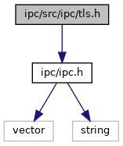

[Data Structures](#nested-classes) \| [Namespaces](#namespaces) \| [Macros](#define-members)

`#include <`<a href="ipc_8h_source.md">ipc/ipc.h</a>`>`

Include dependency graph for tls.h:

<a href="tls_8h_source.md">Go to the source code of this file.</a>

|                 |                                                     |
|-----------------|-----------------------------------------------------|
| Data Structures |                                                     |
| class           | <a href="classvfiipc_1_1_t_l_s.md">TLS</a> |

|            |                                                  |
|------------|--------------------------------------------------|
| Namespaces |                                                  |
|            | <a href="namespacevfiipc.md">vfiipc</a> |

|          |                                               |
|----------|-----------------------------------------------|
| Macros   |                                               |
| #define  | [DllSpec](#ad7c2e1cb200073ed64c64285a5f37231) |

## MacroDefinition Documentation {#macro-definition-documentation}

## DllSpec 

#define DllSpec

