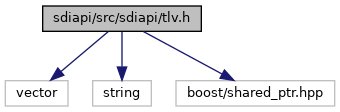
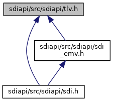

[Data Structures](#nested-classes) \| [Namespaces](#namespaces) \| [Macros](#define-members)

`#include <vector>`
`#include <string>`
`#include <boost/shared_ptr.hpp>`

Include dependency graph for tlv.h:

This graph shows which files directly or indirectly include this file:

<a href="tlv_8h_source.md">Go to the source code of this file.</a>

|  |  |
|----|----|
| Data Structures |  |
| class   | <a href="classvfisdi_1_1_t_l_v.md">TLV</a> |
| class   | <a href="classvfisdi_1_1_t_l_v_1_1_tag.md">TLV::Tag</a> |

|            |                                                  |
|------------|--------------------------------------------------|
| Namespaces |                                                  |
|            | <a href="namespacestd.md">std</a>       |
|            | <a href="namespacevfisdi.md">vfisdi</a> |

|          |                                               |
|----------|-----------------------------------------------|
| Macros   |                                               |
| #define  | [DllSpec](#ad7c2e1cb200073ed64c64285a5f37231) |

## MacroDefinition Documentation {#macro-definition-documentation}

## DllSpec 

#define DllSpec

