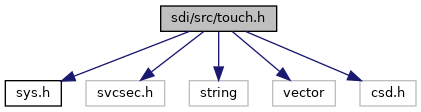
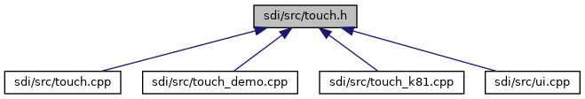

[Data Structures](#nested-classes) \| [Enumerations](#enum-members)

`#include "`<a href="sys_8h_source.md">sys.h</a>`"`
`#include <svcsec.h>`
`#include <string>`
`#include <vector>`
`#include "csd.h"`

Include dependency graph for touch.h:

This graph shows which files directly or indirectly include this file:

<a href="touch_8h_source.md">Go to the source code of this file.</a>

|                 |                                                    |
|-----------------|----------------------------------------------------|
| Data Structures |                                                    |
| class           | <a href="class_touch_pad.md">TouchPad</a> |

|  |  |
|----|----|
| Enumerations |  |
| enum   | [SpecialKey](#af73903edfc3728d3b9b4d7e50dfb15ae) { [keyCancel](#af73903edfc3728d3b9b4d7e50dfb15aea09e7239c57eb7493a40ba2a1dee691a8) = 27, [keyOK](#af73903edfc3728d3b9b4d7e50dfb15aea2c3493d163d595077a43a4fe97a0fb7b) = 13, [keyCorrection](#af73903edfc3728d3b9b4d7e50dfb15aeae7539767125a51c5e4ff9a0d2a3c065c) = 8, [keyNoKey](#af73903edfc3728d3b9b4d7e50dfb15aeaf9bc2f61a5620086019398d878f01720) = 0 } |

## EnumerationType Documentation {#enumeration-type-documentation}

## SpecialKey 

enum [SpecialKey](#af73903edfc3728d3b9b4d7e50dfb15ae)

| Enumerator     |     |
|----------------|-----|
| keyCancel      |     |
| keyOK          |     |
| keyCorrection  |     |
| keyNoKey       |     |
