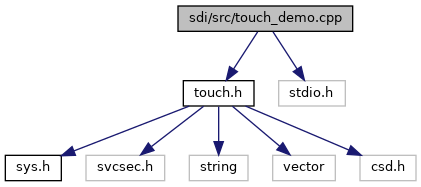

[Macros](#define-members) \| [Functions](#func-members)

`#include "`<a href="touch_8h_source.md">touch.h</a>`"`
`#include <stdio.h>`

Include dependency graph for touch_demo.cpp:

|          |                                              |
|----------|----------------------------------------------|
| Macros   |                                              |
| #define  | [Carbon](#aa4ab7b7b19b2bcae3322c41e962506f4) |

|  |  |
|----|----|
| Functions |  |
| void  | [setTestButtons](#a8c9adfa80810924c7289c587971af789) (<a href="class_touch_pad.md">TouchPad</a> &t) |
|   | setTestButtons generate hotspots with same layout as we have it on the pinpad [More\...](#a8c9adfa80810924c7289c587971af789)  |
| void  | [enterDataCB](#a1fbfabe2c26ccf7e51ebec203abcab53) (int num) |
| void  | [enterPinCB](#a776b903c0aac110a11b68a38917e40f4) (int num) |
| int  | [main](#a0ddf1224851353fc92bfbff6f499fa97) (int argc, char \*argv\[\]) |

## MacroDefinition Documentation {#macro-definition-documentation}

## Carbon 

#define Carbon

## FunctionDocumentation {#function-documentation}

## enterDataCB() 

void enterDataCB

## enterPinCB() 

void enterPinCB

## main() 

int main

## setTestButtons() 

void setTestButtons

setTestButtons generate hotspots with same layout as we have it on the pinpad

**Parameters**

**t**
