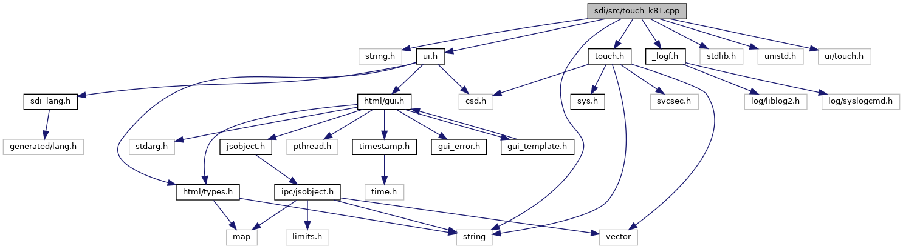

`#include <string.h>`
`#include "`<a href="ui_8h_source.md">ui.h</a>`"`
`#include "`<a href="touch_8h_source.md">touch.h</a>`"`
`#include "`<a href="__logf_8h_source.md">_logf.h</a>`"`
`#include <string>`
`#include <stdlib.h>`
`#include <unistd.h>`
`#include <ui/touch.h>`

Include dependency graph for touch_k81.cpp:

