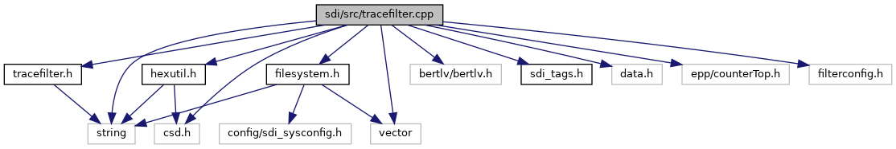

[Macros](#define-members) \| [Functions](#func-members)

`#include "`<a href="tracefilter_8h_source.md">tracefilter.h</a>`"`
`#include "`<a href="sdi_2src_2hexutil_8h_source.md">hexutil.h</a>`"`
`#include "bertlv/bertlv.h"`
`#include "`<a href="src_2sdi__tags_8h_source.md">sdi_tags.h</a>`"`
`#include "data.h"`
`#include "csd.h"`
`#include "epp/counterTop.h"`
`#include "filterconfig.h"`
`#include "`<a href="filesystem_8h_source.md">filesystem.h</a>`"`

Include dependency graph for tracefilter.cpp:

|  |  |
|----|----|
| Macros |  |
| #define  | [TRACE_FILTER](#a7d73b96d87d8d6c5ca11984ea1561fa1) |
| #define  | [MAX_TRACE_MSG_SIZE](#a3f93b787c104f97c9516331226cc65fc)   4096 |
| #define  | [BIN2HEXSTRING](#a15de59a01f8e1e9afd07ec8652ccb999)(str, buf, size)   bintohexstring(str,buf,(size\<=[MAX_TRACE_MSG_SIZE](#a3f93b787c104f97c9516331226cc65fc)?size:MAX_TRACE_MSG_SIZE)) |

|  |  |
|----|----|
| Functions |  |
| void  | [filterCommand](#a8aaa0c77c2012c10fbad3096aa16d5e0) (const unsigned char \*cmd, unsigned cmdSize, std::string &out) |
| void  | [filterResponse](#ad1af8f83e3601d284db2ad4ff06dac6d) (const unsigned char \*cmd, unsigned cmdSize, const unsigned char \*rsp, unsigned rspSize, std::string &out) |

## MacroDefinition Documentation {#macro-definition-documentation}

## BIN2HEXSTRING 

#define BIN2HEXSTRING

## MAX_TRACE_MSG_SIZE 

#define MAX_TRACE_MSG_SIZE   4096

## TRACE_FILTER 

#define TRACE_FILTER

## FunctionDocumentation {#function-documentation}

## filterCommand() 

void filterCommand

Prepare and SDI command for trace and return a hexdump as STL string for it. For release build variants of SDI a trace filter is applied to command data to wipe out values of TLV tags containing sensitive data. For debug build variant the trace filter is disabled by default (use -DTRACE_FILTER to activate).

**Parameters**

\[in\] **cmd** pointer to SDI command buffer (starting wich class/instruction) \[in\] **cmdSize** size of command data in buffer cmd \[out\] **out** hexdump of SDI command as STL string


The size of the hexdump is basically limited by MAX_TRACE_MSG_SIZE in <a href="tracefilter_8cpp.md">tracefilter.cpp</a>.


## filterResponse() 

void filterResponse

Prepare and SDI response for trace and return a hexdump as STL string for it. For release build variants of SDI a trace filter is applied to response data to wipe out values of TLV tags containing sensitive data. For debug build variant the trace filter is disabled by default (use -DTRACE_FILTER to activate).

**Parameters**

\[in\] **cmd** pointer to SDI command buffer (starting wich class/instruction) \[in\] **cmdSize** size of command data in buffer cmd \[in\] **rsp** pointer to SDI response buffer (starting wich class/instruction) \[in\] **rspSize** size of response data in buffer rsp \[out\] **out** hexdump of SDI response as STL string


The size of the hexdump is basically limited by MAX_TRACE_MSG_SIZE in <a href="tracefilter_8cpp.md">tracefilter.cpp</a>.

