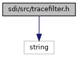
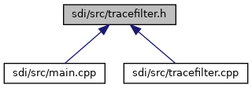

[Functions](#func-members)

`#include <string>`

Include dependency graph for tracefilter.h:

This graph shows which files directly or indirectly include this file:

<a href="tracefilter_8h_source.md">Go to the source code of this file.</a>

|  |  |
|----|----|
| Functions |  |
| void  | [filterCommand](#a8aaa0c77c2012c10fbad3096aa16d5e0) (const unsigned char \*cmd, unsigned cmdSize, std::string &out) |
| void  | [filterResponse](#ad1af8f83e3601d284db2ad4ff06dac6d) (const unsigned char \*cmd, unsigned cmdSize, const unsigned char \*rsp, unsigned rspSize, std::string &out) |

## FunctionDocumentation {#function-documentation}

## filterCommand() 

void filterCommand

Prepare and SDI command for trace and return a hexdump as STL string for it. For release build variants of SDI a trace filter is applied to command data to wipe out values of TLV tags containing sensitive data. For debug build variant the trace filter is disabled by default (use -DTRACE_FILTER to activate).

**Parameters**

\[in\] **cmd** pointer to SDI command buffer (starting wich class/instruction) \[in\] **cmdSize** size of command data in buffer cmd \[out\] **out** hexdump of SDI command as STL string


The size of the hexdump is basically limited by MAX_TRACE_MSG_SIZE in <a href="tracefilter_8cpp.md">tracefilter.cpp</a>.


## filterResponse() 

void filterResponse

Prepare and SDI response for trace and return a hexdump as STL string for it. For release build variants of SDI a trace filter is applied to response data to wipe out values of TLV tags containing sensitive data. For debug build variant the trace filter is disabled by default (use -DTRACE_FILTER to activate).

**Parameters**

\[in\] **cmd** pointer to SDI command buffer (starting wich class/instruction) \[in\] **cmdSize** size of command data in buffer cmd \[in\] **rsp** pointer to SDI response buffer (starting wich class/instruction) \[in\] **rspSize** size of response data in buffer rsp \[out\] **out** hexdump of SDI response as STL string


The size of the hexdump is basically limited by MAX_TRACE_MSG_SIZE in <a href="tracefilter_8cpp.md">tracefilter.cpp</a>.

