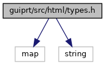
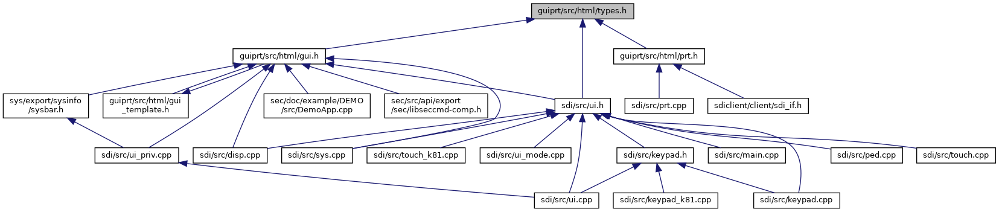

[Namespaces](#namespaces) \| [Typedefs](#typedef-members)

`#include <map>`
`#include <string>`

Include dependency graph for types.h:

This graph shows which files directly or indirectly include this file:

<a href="types_8h_source.md">Go to the source code of this file.</a>

|            |                                                    |
|------------|----------------------------------------------------|
| Namespaces |                                                    |
|            | <a href="namespacevfihtml.md">vfihtml</a> |

|  |  |
|----|----|
| Typedefs |  |
| typedef std::map\< std::string, std::string \>  | <a href="namespacevfihtml.md#a53240b3eda61c045f82728814874a1f8">stringmap</a> |
