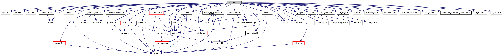

[Functions](#func-members)

`#include <stdio.h>`
`#include <string.h>`
`#include <stdlib.h>`
`#include <time.h>`
`#include "unistd.h"`
`#include "`<a href="ui_8h_source.md">ui.h</a>`"`
`#include "`<a href="__logf_8h_source.md">_logf.h</a>`"`
`#include "`<a href="sdi_2src_2util_8h_source.md">util.h</a>`"`
`#include "`<a href="sysbeep_8h_source.md">sysinfo/sysbeep.h</a>`"`
`#include "`<a href="sysinfo_8h_source.md">sysinfo/sysinfo.h</a>`"`
`#include "`<a href="touch_8h_source.md">touch.h</a>`"`
`#include "`<a href="keypad_8h_source.md">keypad.h</a>`"`
`#include "`<a href="btlv__helper_8h_source.md">btlv_helper.h</a>`"`
`#include "config/sdi_sysconfig.h"`
`#include "`<a href="src_2sdi__tags_8h_source.md">sdi_tags.h</a>`"`
`#include "data.h"`
`#include "cardranges.h"`
`#include "filterconfig.h"`
`#include "`<a href="sys_8h_source.md">sys.h</a>`"`
`#include "common/callback.h"`
`#include "csd.h"`
`#include "`<a href="sdi_2src_2hexutil_8h_source.md">hexutil.h</a>`"`
`#include "`<a href="pathutil_8h_source.md">pathutil.h</a>`"`
`#include "`<a href="madk__pp__protocol_8h_source.md">madk_pp_protocol.h</a>`"`
`#include "vcl_client.h"`
`#include "`<a href="filesystem_8h_source.md">filesystem.h</a>`"`
`#include "`<a href="_e_m_v___common___interface_8h_source.md">emv/EMV_Common_Interface.h</a>`"`
`#include "`<a href="pthreadutil_8h_source.md">pthreadutil.h</a>`"`
`#include "`<a href="sdi_2src_2timestamp_8h_source.md">timestamp.h</a>`"`
`#include "`<a href="sdi__lang_8h_source.md">sdi_lang.h</a>`"`
`#include "`<a href="sdi__text_8h_source.md">sdi_text.h</a>`"`
`#include "`<a href="loadplugin_8h_source.md">loadplugin.h</a>`"`
`#include <svcsec.h>`
`#include <`<a href="notify_8h_source.md">ipc/notify.h</a>`>`
`#include <sys/time.h>`
`#include <sys/stat.h>`
`#include "`<a href="ui__priv_8cpp.md">ui_priv.cpp</a>`"`

Include dependency graph for ui.cpp:

|  |  |
|----|----|
| Functions |  |
| void  | [pinstateCallback](#a5258ad4e0cbe13f486f274129a358288) (void \*data, const string &from, const string &to, const string &notification_id, const <a href="classvfiipc_1_1_j_s_object.md">vfiipc::JSObject</a> &param, unsigned flags) |
| int  | [ui_getInputMinLength](#aa7b91499b7f0047183fb60112272cef1) (string text) |
| int  | [ui_handleCardRequestDisplay](#ab30732de7d5a5c7664efde3ba8904adc) (unsigned char CardTec, unsigned char displayMode, unsigned char \*amount, unsigned short currency, unsigned char cancel_allowed, unsigned char transType) |
| int  | [ui_handleSecureInput](#ae1a3565bb963e8b3ee9d9ad8558c6552) (unsigned char templateId, Language textLanguage, unsigned char beep, unsigned short timeout, <a href="namespacevfihtml.md#a53240b3eda61c045f82728814874a1f8">stringmap</a> &<a href="_web_service_wrappers_8c.md#a6e248376c0290338633d8137822eb209">value</a>, char maskingCharacter, char \*inputFormatString, unsigned char \*amount, unsigned short currency) |
| int  | [ui_handleSignatureCapture](#ad51625e522622ff3a4d9b4248a332696) (Language textLanguage, unsigned short timeout, <a href="namespacevfihtml.md#a53240b3eda61c045f82728814874a1f8">stringmap</a> &<a href="_web_service_wrappers_8c.md#a6e248376c0290338633d8137822eb209">value</a>) |
| int  | [ui_externalDialog](#a8c8e9616c659c8437c056502abd215ef) (unsigned char templateId, <a href="namespacevfihtml.md#a53240b3eda61c045f82728814874a1f8">stringmap</a> &<a href="_web_service_wrappers_8c.md#a6e248376c0290338633d8137822eb209">value</a>, unsigned char confirmation, unsigned options, unsigned short timeout, int \*raw_ui_error) |
| int  | [ui_htmlDialog](#ab5fb2651253033bd2a852aa5fe93d194) (const std::string &htmlFileName, <a href="namespacevfihtml.md#a53240b3eda61c045f82728814874a1f8">stringmap</a> &<a href="_web_service_wrappers_8c.md#a6e248376c0290338633d8137822eb209">value</a>, unsigned short timeout, Language lang, int opts, int \*raw_ui_error) |
| int  | [ui_handleMenu](#ab36b3a8ffc4375efd4469d7c3ab90dec) (<a href="namespacevfihtml.md#a53240b3eda61c045f82728814874a1f8">stringmap</a> &<a href="_web_service_wrappers_8c.md#a6e248376c0290338633d8137822eb209">value</a>, unsigned options, int timeout, int \*raw_ui_error) |
| int  | [validateData_ControlCB](#a24ae12b43cdf0e5ddc08d65af8906c86) (const char \*sdi_tag, const csd_string &pan, csd_string &expDate, bool &skipCvv, char \*formatString=NULL, unsigned short formatStringSize=0, unsigned char \*continuationMode=NULL) |
| int  | [ui_handleManualCardDataEntry](#a3361842d1c7077b38a36fb16038c2f27) (Language textLanguage, unsigned short timeout, csd_stringmap &<a href="_web_service_wrappers_8c.md#a6e248376c0290338633d8137822eb209">value</a>, unsigned char cardEntryValueDeactivation, unsigned char cardEntryMode, char \*inputFormatString, char \*touchCoordinates, unsigned char nbrTouchButtons, unsigned char forceMinPanLenTo7, unsigned char skipCb9FFE) |
| int  | [ui_EnterPin](#af17f18bdf0615c0d25c17294b36c4c8f) (Language pinTextLanguage, unsigned short timeout, unsigned char \*pinBypass, unsigned opts, unsigned char minPINLength, unsigned char maxPINLength, unsigned interchar_tout, <a href="namespacevfihtml.md#a53240b3eda61c045f82728814874a1f8">vfigui::stringmap</a> \*<a href="_web_service_wrappers_8c.md#a6e248376c0290338633d8137822eb209">value</a>, int password_char, char \*touchCoordinates, unsigned char nbrTouchButtons) |
| int  | [ui_dialog](#af05890167f6e0fb9e2c1f996b68f5b15) (const string &msg, unsigned options, int timeout, <a href="namespacevfihtml.md#a53240b3eda61c045f82728814874a1f8">stringmap</a> \*<a href="_web_service_wrappers_8c.md#a6e248376c0290338633d8137822eb209">value</a>, bool \*abort) |
| int  | [ui_idlescreen](#ab0e1806a4c3d12c4b1a0cfe57dd953f8) (const string &msg, int options, int timeout, void \*data) |
| void  | [ui_displayTextKey](#a90fde1c78b5378ced38fc9ebdcd232dd) (const string &textKey, Language language) |
| int  | [ui_confirmTextKey](#ac9a69e7b36d13618ec73d405eb7edd66) (const string &textKey, Language language, <a href="namespacevfihtml.md#a53240b3eda61c045f82728814874a1f8">stringmap</a> \*<a href="_web_service_wrappers_8c.md#a6e248376c0290338633d8137822eb209">value</a>, unsigned short timeout) |
| void  | [ui_init](#a4d87ff365759c09fcaf72d5055afa034) (uiAsyncCallback idlescreen_cb) |
| bool  | [ui_enabled](#a1ad32d548b03e8a236234a14a403b542) (void) |
| void  | [ui_clear](#a1acba8dd875b196c56fd81343bd7268c) (void) |
| enum <a href="ui_8h.md#ac7e05259c409a7da9ce23ecc55fb7965">ui_async_result</a>  | [ui_getAsyncResult](#a687a3615b892cce919e5e87b84e7d10c) (bool reset, int \*raw_ui_error) |
| void  | [ui_enableLEDs](#a6ecaef1e13d1c6127adcc531dbcfcef4) (bool enable) |
| void  | [ui_dispLEDs](#a00dd9f7eda4dffa9bfd85ee9640edd15) (unsigned char leds) |

## FunctionDocumentation {#function-documentation}

## pinstateCallback() 

void pinstateCallback

## ui_clear() 

void ui_clear

Removes the last rendered UI dialog and clears the display.

## ui_confirmTextKey() 

int ui_confirmTextKey

## ui_dialog() 

int ui_dialog

## ui_displayTextKey() 

void ui_displayTextKey

## ui_dispLEDs() 

void ui_dispLEDs

## ui_enabled() 

bool ui_enabled

Returns true, if UI interface of SDI server was enabled with call of <a href="ui_8h.md#a68956acd7367ab924e908aa21ff69977">ui_init()</a>.

### Returns

true, if UI interface of SDI server was enabled

## ui_enableLEDs() 

void ui_enableLEDs

## ui_EnterPin() 

int ui_EnterPin

## ui_externalDialog() 

int ui_externalDialog

Displays an external dialog for command Handle Display (24-03) with a specified template *templateId*. For templateId==1, SDI server used default dialog dialog.html, otherwise the following file is looked up: template_e\_\<templateId\>.html. The templateId in the filename is filled up to 3 digits, e.g. templateId==2 will look up template_e_002.html.

**Parameters**

\[in\] **templateId** Template Identifier as passed in TLV tag DFA010 (default: 1 for dialog.html). \[in\] **value** Stringmap including the text to display \[in\] **confirmation** Confirmation requested (0 = no, 1 = yes) =\> this parameter is ignored, if options hasn\'t set bit DLG_ExtDialogCompat \[in\] **options** dialog options as supported for ui_dialog(), see enum Ui_DialogOpts \[in\] **timeout** Timeout in seconds \[out\] **raw_ui_error** if a pointer is passed the related variable is set with the raw error code of ADKGUI

### Returns

RESULT_OK or RESULT_FAIL

## ui_getAsyncResult() 

enum <a href="ui_8h.md#ac7e05259c409a7da9ce23ecc55fb7965">ui_async_result</a> ui_getAsyncResult

## ui_getInputMinLength() 

int ui_getInputMinLength

## ui_handleCardRequestDisplay() 

int ui_handleCardRequestDisplay

Handles the displays for card requests

**Parameters**

\[in\] **CardTec** Supported card technology \[in\] **displayMode** Display mode: 0 = default, 1 = Fallback, 2 = retry \[in\] **amount** Pointer to amount (BCD buffer of 6 bytes) or NULL if no amount used \[in\] **currency** Currency code or 0 if no currency used \[in\] **cancel_allowed** Cancel button allowed or not \[in\] **transType** Transaction Type according to EMV-ADK

### Returns

RESULT_OK or RESULT_FAIL

## ui_handleManualCardDataEntry() 

int ui_handleManualCardDataEntry

## ui_handleMenu() 

int ui_handleMenu

display a menu dialog. Menu entries are passed in value map `value`, which supports the following values: \"headline\": a text line used as menu headline \"menu\": a JSON formatted string. The JSON data consist of an array, each entry represents a menu item having additional options and values as follows: \[ { \"icon_id\": \"checked\", \"selected\": true, \"submenu\": true, \"text\": \"LAN\", \"value\": 0 },{ \"icon_id\": \"unchecked\", \"selected\": false, \"submenu\": false, \"text\": \"USB\", \"value\": 1 } \] Meaning of JSON values for each menu item entry: \"icon_id\": an icon ID referring to an CSS class to display a icon next to the item text \"checked\" is recently used to display a checked radio button icon \"unchecked\" is recently used to display an un-checked radio buttion Omitting \"icon_id\" or an empty value means displaying no icon. \"selected\": sets the menu item as pre-selected. The pre-selection may be a background color, which differs from un-selected menu icons. Confirming the pre-selected item with enter hardkey/softkey lets <a href="ui_8h.md#afd08dfc1f42b0f1bd659824a5306b445">ui_handleMenu()</a> return the value assigned to \"value\". Omitting \"selected\" or setting to false means the item is not pre-selected. \"submenu\": the menu item is displayed as submenu item. On selection the item shall display submenu and on return of this menu the previous menu shall be displayed. Recently an arrow icon is displayed next to the item text. Omitting \"submenu\" or setting to false means the item is displayed as normal item entry. \"text\": text line used as menu item text \"value\": value, which is returned <a href="ui_8h.md#afd08dfc1f42b0f1bd659824a5306b445">ui_handleMenu()</a>, if the menu item is selected. Please note to use positive values (\>=0) to distingish menu times from error codes returned for failures or aborts.

**Parameters**

\[out\] **value** Stringmap including the selected menu entry \[in\] **options** menu dialog options, see enum Ui_MenuOpts \[in\] **timeout** menu dialog timeout in seconds, a value \<=0 means infinite timeout \[out\] **raw_ui_error** if a pointer is passed the related variable is set with the raw error code of ADKGUI

### Returns

For a selected menu item, the \"value\" for the selected menu item is returned. This is usually value \>=0. Negative values indicate the following errors: RESULT_USER_CANCEL: Cancel softkey/hardkey pressed to abort the menu dialog without selection of an menu item. RESULT_TIMEOUT: Menu dialog timed out RESULT_MOBILE_ABORT: Abort received from mobile device (see option MENU_IgnoreExtAbort) RESULT_NO_LINK: Link to mobile device disturbed (see option MENU_IgnoreExtAbort) RESULT_FAIL: Card was removed (see option MENU_AbortOnCardRemove) RESULT_FAIL: For other errors

## ui_handleSecureInput() 

int ui_handleSecureInput

## ui_handleSignatureCapture() 

int ui_handleSignatureCapture

## ui_htmlDialog() 

int ui_htmlDialog

## ui_idlescreen() 

int ui_idlescreen

## ui_init() 

void ui_init

## validateData_ControlCB() 

int validateData_ControlCB

