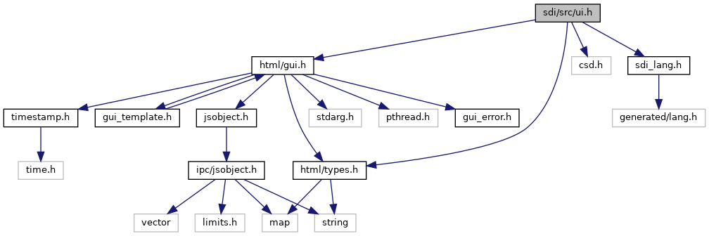
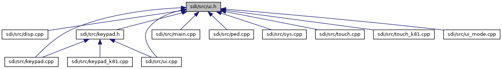

[Data Structures](#nested-classes) \| [Macros](#define-members) \| [Enumerations](#enum-members) \| [Functions](#func-members)

`#include "`<a href="types_8h_source.md">html/types.h</a>`"`
`#include "`<a href="gui_8h_source.md">html/gui.h</a>`"`
`#include "csd.h"`
`#include "`<a href="sdi__lang_8h_source.md">sdi_lang.h</a>`"`

Include dependency graph for ui.h:

This graph shows which files directly or indirectly include this file:

<a href="ui_8h_source.md">Go to the source code of this file.</a>

|                 |                                                       |
|-----------------|-------------------------------------------------------|
| Data Structures |                                                       |
| class           | <a href="class_u_i_catalog.md">UICatalog</a> |

|  |  |
|----|----|
| Macros |  |
| #define  | [TOO_MANY_DIGITS_ENTERED](#a419f69613fd3444396c9af77b9d47373)   0xFB |
| #define  | [TOO_FEW_DIGITS_ENTERED](#ae49db04824fdd7a151a457fb4968c499)   0xFC |
| #define  | [INVALID_VALUE_ENTERED](#a8c8fff356b0fe8c881ce84b5811c832d)   0xFD |
| #define  | [PAN_ENTERED_CHECK_AND_CONFIRM](#ac58a59fe7cf09a094b60c02f551622c8)   0xFE |
| #define  | [CONT_VAL_CONTINUE](#ad63d347097f5fee92132ab988f1d3330)   0x01 |
| #define  | [CONT_VAL_REENTER](#a492f2ee0aab63c46e662d50f37f40644)   0x02 |
| #define  | [CONT_VAL_ABORT](#a33684442ed28588ba245da01ebcda01e)   0x03 |
| #define  | [CONT_MODE_INITIAL](#aac748c8bfe6a6cacfa6debe95e11d67b)   0x00 |
| #define  | [CONT_MODE_CONTINUE](#a0382e04565af914cd803e0c76319eebb)   0x01 |
| #define  | [CONT_MODE_BYPASS](#aaed9dc7793d609ee3adf9f9a3f1112fc)   0x02 |
| #define  | [CONT_MODE_SKIP](#a6e13f7249b6924bec5502b337eb054b7)   0x03 |

|  |  |
|----|----|
| Enumerations |  |
| enum   | [ui_async_result](#ac7e05259c409a7da9ce23ecc55fb7965) {   [UI_AR_NONE](#ac7e05259c409a7da9ce23ecc55fb7965a6bf014695a4620f9377b7e43334ae710) = 0, [UI_AR_IN_PROGRESS](#ac7e05259c409a7da9ce23ecc55fb7965a5572c1729b325117ab80bc8a6389a253) = 1, [UI_AR_KEY_ENTER](#ac7e05259c409a7da9ce23ecc55fb7965ae4d126ebdd7dc068df96a99f9fbbd251) = 2, [UI_AR_KEY_CANCEL](#ac7e05259c409a7da9ce23ecc55fb7965a12ee4f536203f3b87f7fa51040bfe2ce) = 3,   [UI_AR_KEY_CLEAR](#ac7e05259c409a7da9ce23ecc55fb7965a89739941510c2b12307dada5918c5aa8) = 4, [UI_AR_TIMEOUT](#ac7e05259c409a7da9ce23ecc55fb7965a9bacc81bff5ef4db3f30109ecdf88ee9) = 5, [UI_AR_FAILED](#ac7e05259c409a7da9ce23ecc55fb7965a03b78cb3adea44b9d3f6e0191e0356ba) = 6 } |
| enum   | [DataEntryType](#a20ac1546c46d429507d181c015aaa912) { [TYPE_PAN](#a20ac1546c46d429507d181c015aaa912aca54464035e00c84a71d87ab6573d969), [TYPE_EXPIRYDATE](#a20ac1546c46d429507d181c015aaa912a8194ea92bc96f55706436de26b62cb1f), [TYPE_CVV](#a20ac1546c46d429507d181c015aaa912ac73221990f14f0a82761dc3170b4f50e) } |
| enum   | [Ui_MenuOpts](#a03c36e7a7b2a4a8348a923d1bbea40cd) {   [MENU_NoOpts](#a03c36e7a7b2a4a8348a923d1bbea40cdae4fbe9039b772ade068e88f8265108be) = 0x00, [MENU_Beep](#a03c36e7a7b2a4a8348a923d1bbea40cdae274aa9ca6d5c52e9671283f6304e226) = 0x01, [MENU_NoLEDs](#a03c36e7a7b2a4a8348a923d1bbea40cda04f179e208546b814b2bb85754513193) = 0x02, [MENU_ClearOnReturn](#a03c36e7a7b2a4a8348a923d1bbea40cda0eca438702e343792e54ec5fb9672d57) = 0x04,   [MENU_AbortOnCardRemove](#a03c36e7a7b2a4a8348a923d1bbea40cda31347aa4fd275a1d5fc7545c5e34015c) = 0x08, [MENU_IgnoreExtAbort](#a03c36e7a7b2a4a8348a923d1bbea40cda23fdc8155276da979dda754abc3f2e36) = 0x10, [MENU_NoHeader](#a03c36e7a7b2a4a8348a923d1bbea40cdaddc74501fd977aca961b664ab58de5ec) = 0x20, [MENU_AllowedExtOptions](#a03c36e7a7b2a4a8348a923d1bbea40cda0aa61128aaff335ef6d358ca954eee2e) = (MENU_Beep \| MENU_NoLEDs \| MENU_ClearOnReturn \| MENU_AbortOnCardRemove \| MENU_IgnoreExtAbort \| MENU_NoHeader) } |
| enum   | [Ui_PinOpts](#ae6494117b1b0c196ab1b9981ab683c49) {   [PIN_NoOpts](#ae6494117b1b0c196ab1b9981ab683c49a17596fceda9610ca318260b1f8b23ae0) = 0x0, [PIN_NoLEDs](#ae6494117b1b0c196ab1b9981ab683c49aa80cee0745f62ca2a70b23dc2d0a7272) = 0x1, [PIN_NoHeader](#ae6494117b1b0c196ab1b9981ab683c49a910ab4a46abbd3417b5120d678299a29) = 0x2, [PIN_NoAmount](#ae6494117b1b0c196ab1b9981ab683c49a0e346cddafa652c33c73c83e83ee55be) = 0x4,   [PIN_NoCardAppLabel](#ae6494117b1b0c196ab1b9981ab683c49acf6a643135657aecf4e5c2fa17708482) = 0x8, [PIN_AllowedExtOptions](#ae6494117b1b0c196ab1b9981ab683c49a6003c3467ccbca13da8b003dc8fbd760) = (PIN_NoLEDs \| PIN_NoHeader \| PIN_NoAmount \| PIN_NoCardAppLabel), [PIN_ClearOnReturn](#ae6494117b1b0c196ab1b9981ab683c49ab2102291c926e18b07a2e7f9e76deb16) = 0x100, [PIN_AbortOnCardRemove](#ae6494117b1b0c196ab1b9981ab683c49a9dfeeb3f8fb4a36718045760945312b4) = 0x200,   [PIN_IgnoreExtAbort](#ae6494117b1b0c196ab1b9981ab683c49afa79a26238464052d9dc46ea9f269a6c) = 0x400, [PIN_NavigatorMode_1](#ae6494117b1b0c196ab1b9981ab683c49a604b3eaf05fe40a63cbafe255489b697) = 0x800, [PIN_NavigatorMode_2](#ae6494117b1b0c196ab1b9981ab683c49a78a302ca51ec258709d2c4404fe7de5e) = 0x1000, [PIN_ClearAllDigits](#ae6494117b1b0c196ab1b9981ab683c49a74530e73c20faf0e6b7c52b85e75848c) = 0x2000,   [PIN_AutoEnter](#ae6494117b1b0c196ab1b9981ab683c49ad1fa104e654e6c088663aeac2eddfc23) = 0x4000, [PIN_Beep](#ae6494117b1b0c196ab1b9981ab683c49ae9d961aaad7f3dad4d6bf9509757e790) = 0x8000 } |
| enum   | [Ui_PinBypass](#a35047e077ef95212c81b8fbba2fbb3e1) {   [PINBypass_Disabled](#a35047e077ef95212c81b8fbba2fbb3e1ad1099ac5696f8dafd3fc194aa7853ebd) = 0, [PINBypass_Enter](#a35047e077ef95212c81b8fbba2fbb3e1a2576d980abb84370ff76007b4cb7e959) = 1, [PINBypass_Clear](#a35047e077ef95212c81b8fbba2fbb3e1a1dfd732485ef3075302c685c5bcc3288) = 2, [PINBypass_DisableByDigit](#a35047e077ef95212c81b8fbba2fbb3e1ab20307c5065433769b6efffff2653662) = 4,   [PINBypass_MaskAllowed](#a35047e077ef95212c81b8fbba2fbb3e1a5982133dd5857d94756febdd1ea4b5ad) = (PINBypass_Enter \| PINBypass_Clear \| PINBypass_DisableByDigit) } |
| enum   | [Ui_DialogOpts](#ae940dc1b4b4dc186b37f3bba108b17c4) {   [DLG_DisplayOnly](#ae940dc1b4b4dc186b37f3bba108b17c4a6e1ed34d857cbab889f3f9e121a4704e) = 0x0000, [DLG_Beep](#ae940dc1b4b4dc186b37f3bba108b17c4ae8b60c80d09ac6497ed914938584c070) = 0x0001, [DLG_CancelKey](#ae940dc1b4b4dc186b37f3bba108b17c4a1aa5dc6095771f5f644b6451aed9f168) = 0x0002, [DLG_ClearKey](#ae940dc1b4b4dc186b37f3bba108b17c4a1e5bc20277a11d131dd8a557fd3df588) = 0x0004,   [DLG_EnterKey](#ae940dc1b4b4dc186b37f3bba108b17c4a7b04fb78596732049129e9d2cb1dc253) = 0x0008, [DLG_NoLEDs](#ae940dc1b4b4dc186b37f3bba108b17c4a5efdaf4def8ffc5c8c25a3869d234434) = 0x0010, [DLG_CtlsLogo](#ae940dc1b4b4dc186b37f3bba108b17c4a4cbf6cfdb8db2f90d333b70d212ae9b4) = 0x0020, [DLG_QuestionLogo](#ae940dc1b4b4dc186b37f3bba108b17c4adeb41cab201b899444ae3484e83aa1da) = 0x0040,   [DLG_WarningLogo](#ae940dc1b4b4dc186b37f3bba108b17c4af686065df611f977f561a889dce1425e) = 0x0080, [DLG_ErrorLogo](#ae940dc1b4b4dc186b37f3bba108b17c4a6eecf4e733e8b4fe5959f555f4d6b606) = 0x0100, [DLG_SuccessLogo](#ae940dc1b4b4dc186b37f3bba108b17c4a437c0b841dcfefdcfdf470c7db244197) = 0x0200, [DLG_WaitLogo](#ae940dc1b4b4dc186b37f3bba108b17c4a00b91ebe5697223707c72973ac289077) = 0x0400,   [DLG_Async](#ae940dc1b4b4dc186b37f3bba108b17c4af48221f539a38ede61411f2b1861533f) = 0x0800, [DLG_StoreAsyncResult](#ae940dc1b4b4dc186b37f3bba108b17c4a089a15d9f6e99de4b0237f29142f00e6) = 0x1000, [DLG_HideSoftKeys](#ae940dc1b4b4dc186b37f3bba108b17c4a70e7d35335c635736b38881534168282) = 0x2000, [DLG_TextAlignLeft](#ae940dc1b4b4dc186b37f3bba108b17c4a231409e6586a39aae5678df89c1a621e) = 0x4000,   [DLG_TextAlignRight](#ae940dc1b4b4dc186b37f3bba108b17c4ae4f9d64d30ba37afa56d583ddaf5be73) = 0x8000, [DLG_TextAlignTop](#ae940dc1b4b4dc186b37f3bba108b17c4a0acfda466392c9cca22754622ebfa393) = 0x10000, [DLG_TextAlignBottom](#ae940dc1b4b4dc186b37f3bba108b17c4a0311d4cedd9781b1903f76f93124b08a) = 0x20000, [DLG_NoHeader](#ae940dc1b4b4dc186b37f3bba108b17c4a099bfa94f5125c657c70d6c6c5fdc743) = 0x40000,   [DLG_ExtDialogCompat](#ae940dc1b4b4dc186b37f3bba108b17c4ab782e01199a31a001879af77157bbfd7) = 0x80000, [DLG_ClearOnReturn](#ae940dc1b4b4dc186b37f3bba108b17c4ace0f5e6648336a0db6d361200c76d476) = 0x100000, [DLG_AbortOnCardRemove](#ae940dc1b4b4dc186b37f3bba108b17c4a31b65811ddf5e49115015b792214b085) = 0x200000, [DLG_IgnoreExtAbort](#ae940dc1b4b4dc186b37f3bba108b17c4ac1ac51d40e58d905f73a0effe04b7974) = 0x400000,   [DLG_AllowedExtOptions](#ae940dc1b4b4dc186b37f3bba108b17c4aadd6a36426b5eeecb7d8bdbf4ac48d94), [DLG_AllowedOptsHtmlDialog](#ae940dc1b4b4dc186b37f3bba108b17c4aa61db1a614636625bcad0adca325041a) = (DLG_Beep \| DLG_ClearOnReturn \| DLG_AbortOnCardRemove \| DLG_IgnoreExtAbort) } |
| enum   | [Ui_IdleScreenOpts](#abec9dedd169e58d1b41f008e16d3a8eb) {   [IDLE_DisplayOnly](#abec9dedd169e58d1b41f008e16d3a8ebaa368a35cf197e8e77afd19364ba0c3b0) = 0x0000, [IDLE_MenuKey](#abec9dedd169e58d1b41f008e16d3a8ebafa66453b492ab5158d41b14e8e463beb) = 0x0001, [IDLE_InfoKey](#abec9dedd169e58d1b41f008e16d3a8eba548e109a0bb7caaa49db050a1faf2d73) = 0x0002, [IDLE_NoLEDs](#abec9dedd169e58d1b41f008e16d3a8eba3528e93e923d1897d09b6c3750852586) = 0x0004,   [IDLE_AdminMode](#abec9dedd169e58d1b41f008e16d3a8eba3ca089a78876470be3fb26a89d861ea2) = 0x0008, [IDLE_WaitLogo](#abec9dedd169e58d1b41f008e16d3a8eba9cbddaf197a7e05c591619859699c324) = 0x0010 } |

|  |  |
|----|----|
| Functions |  |
| int  | [ui_externalDialog](#a19379bd666609efb538105ce2ae7a807) (unsigned char templateId, <a href="namespacevfihtml.md#a53240b3eda61c045f82728814874a1f8">vfigui::stringmap</a> &<a href="_web_service_wrappers_8c.md#a6e248376c0290338633d8137822eb209">value</a>, unsigned char confirmation, unsigned options, unsigned short timeout, int \*raw_ui_error) |
| int  | [ui_htmlDialog](#a6110a48d377884750953d5d64d08f3b4) (const std::string &htmlFileName, <a href="namespacevfihtml.md#a53240b3eda61c045f82728814874a1f8">vfigui::stringmap</a> &<a href="_web_service_wrappers_8c.md#a6e248376c0290338633d8137822eb209">value</a>, unsigned short timeout, sdi::Language lang, int options, int \*raw_ui_error) |
| int  | [ui_handleSecureInput](#a05673c488203ddc624574dbfc0bd68b6) (unsigned char templateId, sdi::Language textLanguage, unsigned char beep, unsigned short timeout, <a href="namespacevfihtml.md#a53240b3eda61c045f82728814874a1f8">vfigui::stringmap</a> &<a href="_web_service_wrappers_8c.md#a6e248376c0290338633d8137822eb209">value</a>, char maskingCharacter, char \*inputFormatString, unsigned char \*amount=0, unsigned short currency=0) |
| int  | [ui_handleSignatureCapture](#a0cd6b4fc4f709ac8ad90198cdb1f97d1) (sdi::Language textLanguage, unsigned short timeout, <a href="namespacevfihtml.md#a53240b3eda61c045f82728814874a1f8">vfigui::stringmap</a> &<a href="_web_service_wrappers_8c.md#a6e248376c0290338633d8137822eb209">value</a>) |
| int  | [ui_handleMenu](#afd08dfc1f42b0f1bd659824a5306b445) (<a href="namespacevfihtml.md#a53240b3eda61c045f82728814874a1f8">vfigui::stringmap</a> &<a href="_web_service_wrappers_8c.md#a6e248376c0290338633d8137822eb209">value</a>, unsigned options=[MENU_NoOpts](#a03c36e7a7b2a4a8348a923d1bbea40cdae4fbe9039b772ade068e88f8265108be), int timeout=30, int \*raw_ui_error=0) |
| int  | [ui_handleCardRequestDisplay](#ab30732de7d5a5c7664efde3ba8904adc) (unsigned char CardTec, unsigned char displayMode, unsigned char \*amount, unsigned short currency, unsigned char cancel_allowed, unsigned char transType) |
| int  | [ui_handleManualCardDataEntry](#a4ffbada8f7cd08d22a0ef5245a729f53) (sdi::Language textLanguage, unsigned short timeout, csd::csd_stringmap &<a href="_web_service_wrappers_8c.md#a6e248376c0290338633d8137822eb209">value</a>, unsigned char cardEntryValueDeactivation, unsigned char cardEntryMode, char \*inputFormatString, char \*touchCoordinates=NULL, unsigned char nbrTouchButtons=0, unsigned char forceMinPanLenTo7=0, unsigned char skipCb9FFE=0) |
| int  | [ui_getInputMinLength](#a73cf2c8bc44322fd8bc317d8209d33eb) (std::string text) |
| int  | [ui_EnterPin](#a53aab43e03449d3bdacdde9bd16720a6) (sdi::Language pinTextLanguage, unsigned short timeout=30, unsigned char \*pinBypass=0, unsigned opts=[PIN_NoOpts](#ae6494117b1b0c196ab1b9981ab683c49a17596fceda9610ca318260b1f8b23ae0), unsigned char minPINLength=4, unsigned char maxPINLength=12, unsigned interchar_tout=0, <a href="namespacevfihtml.md#a53240b3eda61c045f82728814874a1f8">vfigui::stringmap</a> \*<a href="_web_service_wrappers_8c.md#a6e248376c0290338633d8137822eb209">value</a>=0, int password_char=\' \*\', char \*touchCoordinates=NULL, unsigned char nbrTouchButtons=0) |
| void  | [ui_displayTextKey](#a16368be7b4e7be2510250e631e574d5f) (const std::string &textKey, sdi::Language language) |
| int  | [ui_confirmTextKey](#ae691f65eca85109b97ccd8deac99d31b) (const std::string &textKey, sdi::Language language, <a href="namespacevfihtml.md#a53240b3eda61c045f82728814874a1f8">vfigui::stringmap</a> \*<a href="_web_service_wrappers_8c.md#a6e248376c0290338633d8137822eb209">value</a>=0, unsigned short timeout=30) |
| int  | [ui_dialog](#a4b7319a86c184959120dce38a728d0b6) (const std::string &msg, unsigned options, int timeout=30, <a href="namespacevfihtml.md#a53240b3eda61c045f82728814874a1f8">vfigui::stringmap</a> \*<a href="_web_service_wrappers_8c.md#a6e248376c0290338633d8137822eb209">value</a>=0, bool \*abort=0) |
| int  | [ui_idlescreen](#aea3e6754899767db82e0d6f833217d86) (const std::string &msg, int options, int timeout=-1, void \*data=0) |
| void  | [ui_init](#a68956acd7367ab924e908aa21ff69977) (<a href="namespacevfigui.md#a29ea0490208725e330b8b11f770b51a7">vfigui::uiAsyncCallback</a> idlescreen_cb) |
| bool  | [ui_enabled](#a1ad32d548b03e8a236234a14a403b542) (void) |
| void  | [ui_clear](#a1acba8dd875b196c56fd81343bd7268c) (void) |
| enum [ui_async_result](#ac7e05259c409a7da9ce23ecc55fb7965)  | [ui_getAsyncResult](#a40088972f5ff382908110f7ca09c4562) (bool reset=true, int \*raw_ui_error=0) |
| void  | [ui_enableLEDs](#a0d50a3becade3528b73e45167104edb2) (bool enable=true) |
| void  | [ui_dispLEDs](#a00dd9f7eda4dffa9bfd85ee9640edd15) (unsigned char leds) |

## MacroDefinition Documentation {#macro-definition-documentation}

## CONT_MODE_BYPASS 

#define CONT_MODE_BYPASS   0x02

## CONT_MODE_CONTINUE 

#define CONT_MODE_CONTINUE   0x01

## CONT_MODE_INITIAL 

#define CONT_MODE_INITIAL   0x00

## CONT_MODE_SKIP 

#define CONT_MODE_SKIP   0x03

## CONT_VAL_ABORT 

#define CONT_VAL_ABORT   0x03

## CONT_VAL_CONTINUE 

#define CONT_VAL_CONTINUE   0x01

## CONT_VAL_REENTER 

#define CONT_VAL_REENTER   0x02

## INVALID_VALUE_ENTERED 

#define INVALID_VALUE_ENTERED   0xFD

## PAN_ENTERED_CHECK_AND_CONFIRM 

#define PAN_ENTERED_CHECK_AND_CONFIRM   0xFE

## TOO_FEW_DIGITS_ENTERED 

#define TOO_FEW_DIGITS_ENTERED   0xFC

## TOO_MANY_DIGITS_ENTERED 

#define TOO_MANY_DIGITS_ENTERED   0xFB

## EnumerationType Documentation {#enumeration-type-documentation}

## DataEntryType 

enum [DataEntryType](#a20ac1546c46d429507d181c015aaa912)

Data which have to be enetered

| Enumerator       |                                                  |
|------------------|--------------------------------------------------|
| TYPE_PAN         | 
PAN
                     |
| TYPE_EXPIRYDATE  | 
Expiry Date
             |
| TYPE_CVV         | 
Card Verifivcation Code
 |

## ui_async_result 

enum [ui_async_result](#ac7e05259c409a7da9ce23ecc55fb7965)

| Enumerator |  |
|----|----|
| UI_AR_NONE  | 
no async dialog started (no result)
 |
| UI_AR_IN_PROGRESS  | 
async dialog in progress (no result returned yet)
 |
| UI_AR_KEY_ENTER  | 
ENTER/CONFIRM hardkey/softkey was pressed
 |
| UI_AR_KEY_CANCEL  | 
CANCEL/ABORT hardkey/softkey was pressed
 |
| UI_AR_KEY_CLEAR  | 
BACK/CLEAR hardkey/softkey was pressed
 |
| UI_AR_TIMEOUT  | 
async dialog has timed out
 |
| UI_AR_FAILED  | 
async dialog has failed (more details will provide ADKGUI raw error code, see parameter `raw_ui_error` of function [ui_getAsyncResult()](#a40088972f5ff382908110f7ca09c4562)
 |

## Ui_DialogOpts 

enum [Ui_DialogOpts](#ae940dc1b4b4dc186b37f3bba108b17c4)

| Enumerator                 |     |
|----------------------------|-----|
| DLG_DisplayOnly            |     |
| DLG_Beep                   |     |
| DLG_CancelKey              |     |
| DLG_ClearKey               |     |
| DLG_EnterKey               |     |
| DLG_NoLEDs                 |     |
| DLG_CtlsLogo               |     |
| DLG_QuestionLogo           |     |
| DLG_WarningLogo            |     |
| DLG_ErrorLogo              |     |
| DLG_SuccessLogo            |     |
| DLG_WaitLogo               |     |
| DLG_Async                  |     |
| DLG_StoreAsyncResult       |     |
| DLG_HideSoftKeys           |     |
| DLG_TextAlignLeft          |     |
| DLG_TextAlignRight         |     |
| DLG_TextAlignTop           |     |
| DLG_TextAlignBottom        |     |
| DLG_NoHeader               |     |
| DLG_ExtDialogCompat        |     |
| DLG_ClearOnReturn          |     |
| DLG_AbortOnCardRemove      |     |
| DLG_IgnoreExtAbort         |     |
| DLG_AllowedExtOptions      |     |
| DLG_AllowedOptsHtmlDialog  |     |

## Ui_IdleScreenOpts 

enum [Ui_IdleScreenOpts](#abec9dedd169e58d1b41f008e16d3a8eb)

| Enumerator        |     |
|-------------------|-----|
| IDLE_DisplayOnly  |     |
| IDLE_MenuKey      |     |
| IDLE_InfoKey      |     |
| IDLE_NoLEDs       |     |
| IDLE_AdminMode    |     |
| IDLE_WaitLogo     |     |

## Ui_MenuOpts 

enum [Ui_MenuOpts](#a03c36e7a7b2a4a8348a923d1bbea40cd)

| Enumerator              |     |
|-------------------------|-----|
| MENU_NoOpts             |     |
| MENU_Beep               |     |
| MENU_NoLEDs             |     |
| MENU_ClearOnReturn      |     |
| MENU_AbortOnCardRemove  |     |
| MENU_IgnoreExtAbort     |     |
| MENU_NoHeader           |     |
| MENU_AllowedExtOptions  |     |

## Ui_PinBypass 

enum [Ui_PinBypass](#a35047e077ef95212c81b8fbba2fbb3e1)

| Enumerator                |     |
|---------------------------|-----|
| PINBypass_Disabled        |     |
| PINBypass_Enter           |     |
| PINBypass_Clear           |     |
| PINBypass_DisableByDigit  |     |
| PINBypass_MaskAllowed     |     |

## Ui_PinOpts 

enum [Ui_PinOpts](#ae6494117b1b0c196ab1b9981ab683c49)

| Enumerator             |     |
|------------------------|-----|
| PIN_NoOpts             |     |
| PIN_NoLEDs             |     |
| PIN_NoHeader           |     |
| PIN_NoAmount           |     |
| PIN_NoCardAppLabel     |     |
| PIN_AllowedExtOptions  |     |
| PIN_ClearOnReturn      |     |
| PIN_AbortOnCardRemove  |     |
| PIN_IgnoreExtAbort     |     |
| PIN_NavigatorMode_1    |     |
| PIN_NavigatorMode_2    |     |
| PIN_ClearAllDigits     |     |
| PIN_AutoEnter          |     |
| PIN_Beep               |     |

## FunctionDocumentation {#function-documentation}

## ui_clear() 

void ui_clear

Removes the last rendered UI dialog and clears the display.

## ui_confirmTextKey() 

int ui_confirmTextKey

display a confirmation dialog, which text is taken from UI catalog looked up by specified text key *textKey*. Language ID *language* will the select the corresponding language specific UI catalog.

**Parameters**

\[in\] **textKey** to look up text from UI catalog to display \[in\] **language** language ID \[in\] **value** Initial UI key value map (or NULL if not provided). Following additional UI string parameters can be passed:Key \"header_text\" with value used as PIN dialog header text (instead of customer logo)Key \"amount\" used as displayed amount (must come along with \"curr\")Key \"curr\" used as displayed currency (must come along with \"amount\") \[in\] **timeout** dialog timeout in seconds (default: 30)

### Returns

RESULT_OK if the configuration dialog was confirmed, else RESULT_USER_CANCEL if confirmation was declined. Finally other error codes (as returned by [ui_dialog()](#a4b7319a86c184959120dce38a728d0b6), e.g. RESULT_FAIL, RESULT_MOBILE_ABORT, RESULT_NO_LINK, RESULT_TIMEOUT) can be returned.

## ui_dialog() 

int ui_dialog

display a generic dialog. Depending on option `DLG_Async` the function is invoked asynchronously (returning immediately) or synchronously (waiting for the dialog result). For synchronous calls the dialog result is returned as function return value. For asynchronous calls, the user may set additional option `DLG_StoreAsyncResult` to buffer the result and read it with function [ui_getAsyncResult()](#a40088972f5ff382908110f7ca09c4562) afterwards.

**Parameters**

\[in\] **msg** dialog text message \[in\] **options** dialog options, see enum Ui_DialogOpts \[in\] **timeout** dialog timeout in seconds, a negative value means infinite timeout \[in,out\] **value** an optional value map passed to uiInvoke()/uiInvokeAsync(). UI result values are returned in this map to the caller. \[in\] **abort** optional pointer to flag variable, which can be set to true, to abort the synchronous dialog. Set this parameter NULL to disable abort by this flag. In this case of successfull abort, RESULT_USER_CANCEL is returned. Please note that this flag is ignored for asynchronous calls with option DLG_Async.

### Returns

Result codes for synchronous calls: RESULT_OK: Enter softkey/hardkey pressed RESULT_CLEAR_BUTTON: Clear softkey/hardkey pressed RESULT_USER_CANCEL: Cancel softkey/hardkey pressed or flag `abort` set to true RESULT_TIMEOUT: Dialog timed out RESULT_MOBILE_ABORT: Abort received from mobile device (see option DLG_IgnoreExtAbort) RESULT_NO_LINK: Link to mobile device disturbed (see option DLG_IgnoreExtAbort) RESULT_FAIL: Card was removed (see option DLG_AbortOnCardRemove) RESULT_FAIL: For other errors Result codes for asynchronous calls: RESULT_OK: dialog invocation successful RESULT_FAIL: dialog invocation failed

## ui_displayTextKey() 

void ui_displayTextKey

display a message dialog, which text is taken from UI catalog looked up by specified text key *textKey*. Language ID *language* will the select the corresponding language specific UI catalog. The dialog is invoked asynchornously so that this function returns immediately.

**Parameters**

\[in\] **textKey** text key to look up text from UI catalog to display \[in\] **language** language ID to select the UI catalog

## ui_dispLEDs() 

void ui_dispLEDs

## ui_enabled() 

bool ui_enabled

Returns true, if UI interface of SDI server was enabled with call of [ui_init()](#a68956acd7367ab924e908aa21ff69977).

### Returns

true, if UI interface of SDI server was enabled

## ui_enableLEDs() 

void ui_enableLEDs

## ui_EnterPin() 

int ui_EnterPin

Enter the PIN

**Parameters**

\[in\] **pinTextLanguage** language for the PIN entry text (ignored for headless mode) \[in\] **timeout** timeout value for PIN entry in seconds \[in,out\] **pinBypass** Input values: Bitmask, see enum Ui_PinBypass Passing a NULL pointer also disables PIN bypass. Output values: (only valid if function returns RESULT_OK) 0: no PIN bypass done 1: PIN bypass with Enter key 2: PIN bypass with Clear key \[in\] **opts** PIN entry options, see enum Ui_PinOpts for more details \[in\] **minPINLength** minimum number of PIN digits to enter, default is 4 \[in\] **maxPINLength** maximum number of PIN digits to enter, default is 12 \[in\] **interchar_tout** inter-character timeout (in ms). 0 means no timeout specified (default). \[in\] **value** Initial UI key value map (or NULL if not provided). Following additional UI string parameters can be passed:Key \"header_text\" with value used as PIN dialog header text (instead of customer logo), please note that this value is ignored, if option PIN_NoHeader is set.Key \"amount\" used as displayed amount (must come along with \"curr\"), please note that this value is ignored, if option PIN_NoAmount is set.Key \"curr\" used as displayed currency (must come along with \"amount\"), please note that this value is ignored, if option PIN_NoAmount is set.Key \"prefname\" as application preferred name (or card application name), please note that this value is ignored, if option PIN_NoCardAppLabel is set. \[in\] **password_char** Echo character to display for an entered digit (default: \'\*\') \[in\] **touchCoordinates** pointer to the memory for the touch coordinates (default: NULL) \[in\] **nbrTouchButtons** 0: no touch buttons defined, else \> 0

### Returns

RESULT_OK if PIN is entered successfully (check for pinBypass return value), RESULT_FAIL, RESULT_MOBILE_ABORT, RESULT_NO_LINK, RESULT_TIMEOUT, RESULT_USER_CANCEL

## ui_externalDialog() 

int ui_externalDialog

Displays an external dialog for command Handle Display (24-03) with a specified template *templateId*. For templateId==1, SDI server used default dialog dialog.html, otherwise the following file is looked up: template_e\_\<templateId\>.html. The templateId in the filename is filled up to 3 digits, e.g. templateId==2 will look up template_e_002.html.

**Parameters**

\[in\] **templateId** Template Identifier as passed in TLV tag DFA010 (default: 1 for dialog.html). \[in\] **value** Stringmap including the text to display \[in\] **confirmation** Confirmation requested (0 = no, 1 = yes) =\> this parameter is ignored, if options hasn\'t set bit DLG_ExtDialogCompat \[in\] **options** dialog options as supported for ui_dialog(), see enum Ui_DialogOpts \[in\] **timeout** Timeout in seconds \[out\] **raw_ui_error** if a pointer is passed the related variable is set with the raw error code of ADKGUI

### Returns

RESULT_OK or RESULT_FAIL

## ui_getAsyncResult() 

enum [ui_async_result](#ac7e05259c409a7da9ce23ecc55fb7965) ui_getAsyncResult

## ui_getInputMinLength() 

int ui_getInputMinLength

## ui_handleCardRequestDisplay() 

int ui_handleCardRequestDisplay

Handles the displays for card requests

**Parameters**

\[in\] **CardTec** Supported card technology \[in\] **displayMode** Display mode: 0 = default, 1 = Fallback, 2 = retry \[in\] **amount** Pointer to amount (BCD buffer of 6 bytes) or NULL if no amount used \[in\] **currency** Currency code or 0 if no currency used \[in\] **cancel_allowed** Cancel button allowed or not \[in\] **transType** Transaction Type according to EMV-ADK

### Returns

RESULT_OK or RESULT_FAIL

## ui_handleManualCardDataEntry() 

int ui_handleManualCardDataEntry

Handles the manual card data entry

**Parameters**

\[in\] **textLanguage** Language to use \[in\] **timeout** Timeout in seconds \[out\] **value** Stringmap including the input data \[in\] **cardEntryValueDeactivation** Value Deactivation (0 = enter all values, 1 = skip CVV, 2 = skip Expiry Date and CVV) \[in\] **cardEntryMode** Entry Mode (0 = enter data in one screen, 1 = enter data in separate screens) \[in\] **inputFormatString** Alternative Format string (see separate documentation for details) \[in\] **touchCoordinates** pointer to the memory for the touch coordinates (default: NULL) \[in\] **nbrTouchButtons** 0: no touch buttons defined, else \> 0 \[in\] **forceMinPanLenTo7** 0: use minimal PAN length in catalog file, else force minimal PAN length of 7 digits \[in\] **skipCb9FFE** 0: CB 9FFE active, 1: CB 9FFE skipped

### Returns

RESULT_OK or RESULT_FAIL

## ui_handleMenu() 

int ui_handleMenu

display a menu dialog. Menu entries are passed in value map `value`, which supports the following values: \"headline\": a text line used as menu headline \"menu\": a JSON formatted string. The JSON data consist of an array, each entry represents a menu item having additional options and values as follows: \[ { \"icon_id\": \"checked\", \"selected\": true, \"submenu\": true, \"text\": \"LAN\", \"value\": 0 },{ \"icon_id\": \"unchecked\", \"selected\": false, \"submenu\": false, \"text\": \"USB\", \"value\": 1 } \] Meaning of JSON values for each menu item entry: \"icon_id\": an icon ID referring to an CSS class to display a icon next to the item text \"checked\" is recently used to display a checked radio button icon \"unchecked\" is recently used to display an un-checked radio buttion Omitting \"icon_id\" or an empty value means displaying no icon. \"selected\": sets the menu item as pre-selected. The pre-selection may be a background color, which differs from un-selected menu icons. Confirming the pre-selected item with enter hardkey/softkey lets [ui_handleMenu()](#afd08dfc1f42b0f1bd659824a5306b445) return the value assigned to \"value\". Omitting \"selected\" or setting to false means the item is not pre-selected. \"submenu\": the menu item is displayed as submenu item. On selection the item shall display submenu and on return of this menu the previous menu shall be displayed. Recently an arrow icon is displayed next to the item text. Omitting \"submenu\" or setting to false means the item is displayed as normal item entry. \"text\": text line used as menu item text \"value\": value, which is returned [ui_handleMenu()](#afd08dfc1f42b0f1bd659824a5306b445), if the menu item is selected. Please note to use positive values (\>=0) to distingish menu times from error codes returned for failures or aborts.

**Parameters**

\[out\] **value** Stringmap including the selected menu entry \[in\] **options** menu dialog options, see enum Ui_MenuOpts \[in\] **timeout** menu dialog timeout in seconds, a value \<=0 means infinite timeout \[out\] **raw_ui_error** if a pointer is passed the related variable is set with the raw error code of ADKGUI

### Returns

For a selected menu item, the \"value\" for the selected menu item is returned. This is usually value \>=0. Negative values indicate the following errors: RESULT_USER_CANCEL: Cancel softkey/hardkey pressed to abort the menu dialog without selection of an menu item. RESULT_TIMEOUT: Menu dialog timed out RESULT_MOBILE_ABORT: Abort received from mobile device (see option MENU_IgnoreExtAbort) RESULT_NO_LINK: Link to mobile device disturbed (see option MENU_IgnoreExtAbort) RESULT_FAIL: Card was removed (see option MENU_AbortOnCardRemove) RESULT_FAIL: For other errors

## ui_handleSecureInput() 

int ui_handleSecureInput

Handles secure inputs

**Parameters**

\[in\] **templateId** Template identifier as passed in TLV tag DFA007 of command Handle Secure Input (24-04) \[in\] **textLanguage** Language to use \[in\] **beep** Beep when text will be displayed (0 = no, 1 = yes) \[in\] **timeout** Timeout in seconds \[out\] **value** Stringmap including the input data \[in\] **maskingCharacter** Masking character to be use during the input \[in\] **inputFormatString** Alternative Format string (see separate documentation for details) \[in\] **amount** Amount to be displayed during the input \[in\] **currency** Currency to be displayed during the input

### Returns

RESULT_OK or RESULT_FAIL

## ui_handleSignatureCapture() 

int ui_handleSignatureCapture

Handles the signature capture

**Parameters**

\[in\] **textLanguage** Language to use \[in\] **timeout** Timeout in seconds \[out\] **value** Stringmap for the captured signature

### Returns

RESULT_OK or RESULT_FAIL

## ui_htmlDialog() 

int ui_htmlDialog

Displays an external HTML dialog specified by cusomer specific HTML file

**Parameters**

\[in\] **htmlFileName** Name of the HTML file \[in,out\] **value** Stringmap including the HTML input and output values (needs to be matched with the corresponding HTML file) \[in\] **timeout** Timeout in seconds \[in\] **lang** Language to use \[in\] **options** dialog options as used for ui_dialog(), see enum Ui_DialogOpts. Supported options are defined by DLG_AllowedOptsHtmlDialog. \[out\] **raw_ui_error** if a pointer is passed the related variable is set with the raw error code of ADKGUI

### Returns

SDI result code (e.g. RESULT_OK or RESULT_FAIL)

## ui_idlescreen() 

int ui_idlescreen

display the idlescreen. This function is always called asynchronously and dialog results are reported via callback, which was passed as parameter `idlescreen_cb` to function [`ui_init()`](#a68956acd7367ab924e908aa21ff69977). If both, parameters `msg` and `logo` are empty, the idlescreen displays the standard idle text referred by text ID TXT_IDLE_SCREEN. A filled string for `msg` and/or `logo` will remove the standard idle text and display the text message and/or the image logo on idlescreen.

**Parameters**

\[in\] **msg** idlescreen text message \[in\] **options** idlescreen options, see enum Ui_IdleScreenOpts \[in\] **timeout** idlescreen timeout in seconds, a negative value means infinite timeout \[in\] **data** pointer directly passed to idlescreen callback idlescreen_cb set by function ui_init()

### Returns

RESULT_OK: idlescreen invocation successful RESULT_FAIL: idlescreen invocation failed

## ui_init() 

void ui_init

Enable and initialize the UI interface of SDI server.

**Parameters**

\[in\] **idlescreen_cb** idlescreen result callback function, which is invoked, if asynchronous idlescreen dialog returns (see function ui_idlescreen()).


The function must be called at once at startup (SDI standard mode). After UI initialization, the function [ui_enabled()](#a1ad32d548b03e8a236234a14a403b542) returns true.

