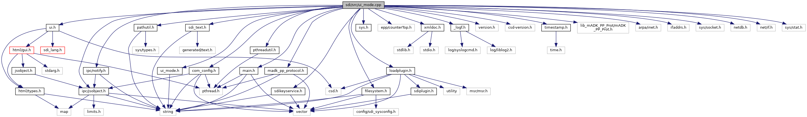

[Data Structures](#nested-classes) \| [Macros](#define-members) \| [Enumerations](#enum-members) \| [Functions](#func-members) \| [Variables](#var-members)

`#include "`<a href="ui__mode_8h_source.md">ui_mode.h</a>`"`
`#include "`<a href="com__config_8h_source.md">com_config.h</a>`"`
`#include "`<a href="sys_8h_source.md">sys.h</a>`"`
`#include "`<a href="ui_8h_source.md">ui.h</a>`"`
`#include "epp/counterTop.h"`
`#include "`<a href="madk__pp__protocol_8h_source.md">madk_pp_protocol.h</a>`"`
`#include "`<a href="ipc_2src_2ipc_2jsobject_8h_source.md">ipc/jsobject.h</a>`"`
`#include "`<a href="notify_8h_source.md">ipc/notify.h</a>`"`
`#include "`<a href="xmldoc_8h_source.md">xmldoc.h</a>`"`
`#include "`<a href="pathutil_8h_source.md">pathutil.h</a>`"`
`#include "`<a href="pthreadutil_8h_source.md">pthreadutil.h</a>`"`
`#include "`<a href="filesystem_8h_source.md">filesystem.h</a>`"`
`#include "`<a href="__logf_8h_source.md">_logf.h</a>`"`
`#include "`<a href="main_8h_source.md">main.h</a>`"`
`#include "version.h"`
`#include "csd-version.h"`
`#include "`<a href="sdikeyservice_8h_source.md">sdikeyservice.h</a>`"`
`#include "`<a href="loadplugin_8h_source.md">loadplugin.h</a>`"`
`#include "`<a href="sdi__text_8h_source.md">sdi_text.h</a>`"`
`#include "`<a href="sdi_2src_2timestamp_8h_source.md">timestamp.h</a>`"`
`#include "lib_mADK_PP_Prot/mADK_PP_Prot.h"`
`#include <arpa/inet.h>`
`#include <ifaddrs.h>`
`#include <sys/socket.h>`
`#include <netdb.h>`
`#include <net/if.h>`
`#include <sys/stat.h>`

Include dependency graph for ui_mode.cpp:



|  |  |
|----|----|
| Data Structures |  |
| struct   | <a href="struct_com_if_table.md">ComIfTable</a> |
| struct   | <a href="struct_bt_com1a_context.md">BtCom1aContext</a> |
| struct   | <a href="struct_if_info.md">IfInfo</a> |

|          |                                                                |
|----------|----------------------------------------------------------------|
| Macros   |                                                                |
| #define  | [FALL_THROUGH](#a38dadd06badcc5b7cca444a551604399)             |
| #define  | [BT_PAIRING_TIMEOUT](#a48288c09e26ef3be471e5a904644df55)   120 |

|  |  |
|----|----|
| Enumerations |  |
| enum   | [CCPInterfaces](#aafbccd6a9b43780a5d5f3f042147aeae) {<br/>  [CCP_INTERFACE_ETH0](#aafbccd6a9b43780a5d5f3f042147aeaead919927c1a351c8d8fdced6632c5d70e) = 0, [CCP_INTERFACE_ETH1](#aafbccd6a9b43780a5d5f3f042147aeaea0c201ec57249e3b990a2649f74e7b78c) = 1, [CCP_INTERFACE_WLAN0](#aafbccd6a9b43780a5d5f3f042147aeaea37b73b3aa2f65249ac886cbdc5dc7cd7) = 2, [CCP_INTERFACE_PPP_DIAL](#aafbccd6a9b43780a5d5f3f042147aeaeabfb056ccde19d547452d73a72923df9d) = 3,<br/>  [CCP_INTERFACE_GPRS0](#aafbccd6a9b43780a5d5f3f042147aeaea9e96fbf03b840a99b8d40d5ec642ec45) = 4, [CCP_INTERFACE_ETH_BT](#aafbccd6a9b43780a5d5f3f042147aeaea8af4ca3bc25e82890a3205b5b2336d09) = 5, [CCP_INTERFACE_PPP_BT](#aafbccd6a9b43780a5d5f3f042147aeaea262cc35885f9a141499c8baa0ef75c6a) = 6, [CCP_INTERFACE_ETH_USB_GADGET](#aafbccd6a9b43780a5d5f3f042147aeaeaefee2fa353771d377727fc296967f5f3) = 7,<br/>  [CCP_INTERFACE_ETH_USB1_GADGET](#aafbccd6a9b43780a5d5f3f042147aeaea3a384b3cc8c614d70c0a9251911bfa35) = 8, [CCP_INTERFACE_ETH_USB_HOST_GADGET](#aafbccd6a9b43780a5d5f3f042147aeaea22c97c07a68f584eba6dc1b1b6bbd478) = 9, [CCP_INTERFACE_PPP_USBD](#aafbccd6a9b43780a5d5f3f042147aeaea20cef2dcc956ff50b51b0f9dc84bc1f0) = 10, [CCP_INTERFACE_BRIDGE](#aafbccd6a9b43780a5d5f3f042147aeaea5915fb6e76f9b4b513dfa6af97d98971) = 11,<br/>  [CCP_INTERFACE_SERIAL_USBD](#aafbccd6a9b43780a5d5f3f042147aeaea8fa06c896886268076ef43a52ef67245) = 12, [CCP_INTERFACE_ETH_USB0](#aafbccd6a9b43780a5d5f3f042147aeaea0dd292692849b907191d210cd363bd1f) = 13, [CCP_INTERFACE_BT](#aafbccd6a9b43780a5d5f3f042147aeaeab13f7b105d165d62dcc5df31d26c7b6c) = 14<br/>} |
| enum   | [ProfileSubType](#a2a5f9f0f77ae498a2bf12bdd7ea1e21c) {<br/>  [PST_NONE](#a2a5f9f0f77ae498a2bf12bdd7ea1e21ca02e9c10cb1b2ddd85ff084180c5e1e69) = 0, [PST_INTERNAL_ANDROID](#a2a5f9f0f77ae498a2bf12bdd7ea1e21ca47eb4ed9df1bcc8ee733fdbd4f31148c) = 1, [PST_COM1A_BT_USB](#a2a5f9f0f77ae498a2bf12bdd7ea1e21ca1c60a2b6dc2a23d1442910400ae7e633) = 2, [PST_COM1A_USB](#a2a5f9f0f77ae498a2bf12bdd7ea1e21caa334105b2c0cc946207913b59fdf07d1) = 3,<br/>  [PST_EPP_TLS](#a2a5f9f0f77ae498a2bf12bdd7ea1e21caea4d2147beb5d10787ee82f53000ad70) = 4<br/>} |
| enum   | [DisplayConnectStatus](#a4e4846d0287203421004e6dbd27be39c) {<br/>  [DCS_None](#a4e4846d0287203421004e6dbd27be39ca9ceeb500844ce2cc41a6908b7f7c142c) = 0, [DCS_ComWaitOpen](#a4e4846d0287203421004e6dbd27be39ca612f83a6012853785e08964b118e6408) = 1, [DCS_ComOpened](#a4e4846d0287203421004e6dbd27be39caabfec22bfca97c94873d2987779b0100) = 2, [DCS_ComConnected](#a4e4846d0287203421004e6dbd27be39cad1862d96f415942e9212d1a77d06741e) = 4,<br/>  [DCS_ComFailed](#a4e4846d0287203421004e6dbd27be39ca62d1cbb676a48c33cf437ff3625e6649) = 8, [DCS_All](#a4e4846d0287203421004e6dbd27be39caefec6a8961500a611af0aea035864381) = (DCS_ComWaitOpen \| DCS_ComOpened \| DCS_ComConnected \| DCS_ComFailed)<br/>} |
| enum   | [BTCom1AOpts](#a44aa653082f7bd79a3855a6b02df18e9) { [BTCom1A_None](#a44aa653082f7bd79a3855a6b02df18e9a00ad73b65e09bd939e54c7b2c238f762) = 0, [BTCom1A_Headless](#a44aa653082f7bd79a3855a6b02df18e9a8a354b273b7381b2725c060d55ea661c) = 1, [BTCom1A_Reconnect](#a44aa653082f7bd79a3855a6b02df18e9a59303fa6ca26cf8091ef1ba3bc0b96f1) = 2 } |
| enum   | [BTPairingState](#aff9579e934a27963339cbda757e469f6) {<br/>  [BT_PairingStopped](#aff9579e934a27963339cbda757e469f6a83412459364f96d99fc0e14eb8bd2d0b) = 0, [BT_PairingStarted](#aff9579e934a27963339cbda757e469f6a21af22d3ff0d1cb1d7fbd79b91231b05), [BT_ConfirmPIN](#aff9579e934a27963339cbda757e469f6a33231ba5126334901e002d6917535312), [BT_ConfirmPINDone](#aff9579e934a27963339cbda757e469f6ae8c74fbdb8681c4d574511b967e64385),<br/>  [BT_PairingSuccess](#aff9579e934a27963339cbda757e469f6a5a599a03dceeab63cd9b9a9b9215e495), [BT_PairingFailed](#aff9579e934a27963339cbda757e469f6a9dd7b1b7987cf09ad6cd26d4989404fc), [BT_PairingTimeout](#aff9579e934a27963339cbda757e469f6a5131a7b6a3d249f2a567818badc0fedb), [BT_PairingCancelled](#aff9579e934a27963339cbda757e469f6a9025645d0e20a3d7d06ed6f538ca3380)<br/>} |

|  |  |
|----|----|
| Functions |  |
| void  | [show_idle_connect_status](#a6dcc06a913ac018ca40d1a0eae7b557b) () |
| void \*  | [io_menu_invoker](#a6affc64ea4b98abc54d73fd71aadade0) (void \*data) |
| void  | [init_ui_mode](#a66a4622071497e674b301c3c01f0041d) () |
| void \*  | [ccp_thread_func](#aae2c9091b1d1a28076f110321042c399) (void \*data) |
| bool  | [btStartPairing](#a0c143f8abde0a11e7a3b3f252017a4db) (unsigned discovery_tout_sec, enum <a href="libcom_8h.md#a332bd39910a20de262a2321a456e4a58">com_ErrorCodes</a> \*com_errno=0, bool ble=false) |
| void \*  | [com1a_bt_thread_func](#a255eedc1025a4bbc93356842974aa660) (void \*data) |
| bool  | [select_com_profile](#a55d15b6967e1c13ce450da41e5624e0a) (int comInterfaces, char \*\*ComFileName) |
| void  | [reset_com_profile](#a4b5e64e6037e936f64283fb6f75747ae) () |
| bool  | [multi_connection_support_enabled](#a72dc449a4d0934020d297eb7a1b5a1a6) () |
| bool  | [comcfg_file_valid](#a4b12b6e2cef9b3406881aed32e1217fc) (const string &comcfg_file) |
| void  | [protocol_status_ui_update](#a6a46d1447df15675918b58136a68b3b1) (const struct ProtStatus \*status) |

|  |  |
|----|----|
| Variables |  |
| const struct <a href="struct_com_if_table.md">ComIfTable</a>  | [comIfTable](#a2fef02428283cce5ee4775635a7d501f) \[\] |
| enum [CCPInterfaces](#aafbccd6a9b43780a5d5f3f042147aeae)  | [ccp_if_type](#afd6f0450f16f686ff7adfa44dc505359) |
| enum [BTPairingState](#aff9579e934a27963339cbda757e469f6)  | [bt_pairing_state](#a3cd68cbcb12275675e622ffa5df4b48f) = [BT_PairingStopped](#aff9579e934a27963339cbda757e469f6a83412459364f96d99fc0e14eb8bd2d0b) |
| enum <a href="libcom_8h.md#a332bd39910a20de262a2321a456e4a58">com_ErrorCodes</a>  | [bt_pairing_errno](#acc18c34559cdf7d2bc07cda72d0afa93) |

## MacroDefinition Documentation {#macro-definition-documentation}

## BT_PAIRING_TIMEOUT <a href="#a48288c09e26ef3be471e5a904644df55" id="a48288c09e26ef3be471e5a904644df55"></a>

<p>#define BT_PAIRING_TIMEOUT   120</p>

## FALL_THROUGH <a href="#a38dadd06badcc5b7cca444a551604399" id="a38dadd06badcc5b7cca444a551604399"></a>

<p>#define FALL_THROUGH</p>

## EnumerationType Documentation {#enumeration-type-documentation}

## BTCom1AOpts <a href="#a44aa653082f7bd79a3855a6b02df18e9" id="a44aa653082f7bd79a3855a6b02df18e9"></a>

<p>enum [BTCom1AOpts](#a44aa653082f7bd79a3855a6b02df18e9)</p>

| Enumerator |  |
|----|----|
| BTCom1A_None  | <p>no option</p> |
| BTCom1A_Headless  | <p>don\'t display wait screen to abort BT connnect</p> |
| BTCom1A_Reconnect  | <p>force reconnect, even if device was already connected</p> |

## BTPairingState <a href="#aff9579e934a27963339cbda757e469f6" id="aff9579e934a27963339cbda757e469f6"></a>

<p>enum [BTPairingState](#aff9579e934a27963339cbda757e469f6)</p>

| Enumerator           |     |
|----------------------|-----|
| BT_PairingStopped    |     |
| BT_PairingStarted    |     |
| BT_ConfirmPIN        |     |
| BT_ConfirmPINDone    |     |
| BT_PairingSuccess    |     |
| BT_PairingFailed     |     |
| BT_PairingTimeout    |     |
| BT_PairingCancelled  |     |

## CCPInterfaces <a href="#aafbccd6a9b43780a5d5f3f042147aeae" id="aafbccd6a9b43780a5d5f3f042147aeae"></a>

<p>enum [CCPInterfaces](#aafbccd6a9b43780a5d5f3f042147aeae)</p>

| Enumerator                         |     |
|------------------------------------|-----|
| CCP_INTERFACE_ETH0                 |     |
| CCP_INTERFACE_ETH1                 |     |
| CCP_INTERFACE_WLAN0                |     |
| CCP_INTERFACE_PPP_DIAL             |     |
| CCP_INTERFACE_GPRS0                |     |
| CCP_INTERFACE_ETH_BT               |     |
| CCP_INTERFACE_PPP_BT               |     |
| CCP_INTERFACE_ETH_USB_GADGET       |     |
| CCP_INTERFACE_ETH_USB1_GADGET      |     |
| CCP_INTERFACE_ETH_USB_HOST_GADGET  |     |
| CCP_INTERFACE_PPP_USBD             |     |
| CCP_INTERFACE_BRIDGE               |     |
| CCP_INTERFACE_SERIAL_USBD          |     |
| CCP_INTERFACE_ETH_USB0             |     |
| CCP_INTERFACE_BT                   |     |

## DisplayConnectStatus <a href="#a4e4846d0287203421004e6dbd27be39c" id="a4e4846d0287203421004e6dbd27be39c"></a>

<p>enum [DisplayConnectStatus](#a4e4846d0287203421004e6dbd27be39c)</p>

| Enumerator |  |
|----|----|
| DCS_None  | <p>status display disabled for all, even for ComInterrupt, ComClose</p> |
| DCS_ComWaitOpen  | <p>show display updates for status ComWaitOpen</p> |
| DCS_ComOpened  | <p>show display updates for status ComOpened</p> |
| DCS_ComConnected  | <p>show display updates for status DCS_ComConnected</p> |
| DCS_ComFailed  | <p>show suppress display updates for status ComFailed</p> |
| DCS_All  |  |

## ProfileSubType <a href="#a2a5f9f0f77ae498a2bf12bdd7ea1e21c" id="a2a5f9f0f77ae498a2bf12bdd7ea1e21c"></a>

<p>enum [ProfileSubType](#a2a5f9f0f77ae498a2bf12bdd7ea1e21c)</p>

| Enumerator |  |
|----|----|
| PST_NONE  | <p>no profile subtype</p> |
| PST_INTERNAL_ANDROID  | <p>allow this profile for Engage devices with internal Android only, e.g. CM5, M440, M424</p> |
| PST_COM1A_BT_USB  | <p>option to mark the profile to be used for COM1A (BT-SPP client/server and USB Host). Profile makred with PST_COM1A_BT_USB will skip profile with PST_COM1A_USB, which must be the next profile entry in table !!\!</p> |
| PST_COM1A_USB  | <p>option to mark the profile to be used for COM1A (USB host only)</p> |
| PST_EPP_TLS  | <p>this profile is used for an external PINPad (EPP) using TLS over USB</p> |

## FunctionDocumentation {#function-documentation}

## btStartPairing() <a href="#a0c143f8abde0a11e7a3b3f252017a4db" id="a0c143f8abde0a11e7a3b3f252017a4db"></a>

<p>bool btStartPairing</p>

## ccp_thread_func() <a href="#aae2c9091b1d1a28076f110321042c399" id="aae2c9091b1d1a28076f110321042c399"></a>

<p>void\* ccp_thread_func</p>

## com1a_bt_thread_func() <a href="#a255eedc1025a4bbc93356842974aa660" id="a255eedc1025a4bbc93356842974aa660"></a>

<p>void\* com1a_bt_thread_func</p>

## comcfg_file_valid() <a href="#a4b12b6e2cef9b3406881aed32e1217fc" id="a4b12b6e2cef9b3406881aed32e1217fc"></a>

<p>bool comcfg_file_valid</p>

## init_ui_mode() <a href="#a66a4622071497e674b301c3c01f0041d" id="a66a4622071497e674b301c3c01f0041d"></a>

<p>void init_ui_mode</p>

This module contains implementation, which is additionally required to support standard UI mode. Most of these implementations are UI related (e.g. to provide COM menus, idlescreen etc.) SDI variants using this module are compiled without define HEADLESS to add UI standard mode, in addition to headless mode. Finally, program parameter --headless will switch the SDI mode at startup. Recently supported platforms with UI support are: VOS/VOS2/VOS3 Note: This module also contains functions invoked for headless mode on these platforms, too. This is to cover the same behavior as in UI mode. (e.g. selection of a COM profile by COM_IF.CFG (COM settings file). function called once at startup to initialize UI mode of SDI

## io_menu_invoker() <a href="#a6affc64ea4b98abc54d73fd71aadade0" id="a6affc64ea4b98abc54d73fd71aadade0"></a>

<p>void\* io_menu_invoker</p>

## multi_connection_support_enabled() <a href="#a72dc449a4d0934020d297eb7a1b5a1a6" id="a72dc449a4d0934020d297eb7a1b5a1a6"></a>

<p>bool multi_connection_support_enabled</p>

For VOS/VOS2/VOS3 devices this function returns true, if SDI protocol with multi-connection support (using ADKIPC) was enabled by COM settings file. For other platforms this function just returns false.

### Returns

true, if the IPC variant of the SDI protocol library shall be used on VOS/VOS2/VOS3, else false (e.g. disabled by configuration or wrong platform).

## protocol_status_ui_update() <a href="#a6a46d1447df15675918b58136a68b3b1" id="a6a46d1447df15675918b58136a68b3b1"></a>

<p>void protocol_status_ui_update</p>

## reset_com_profile() <a href="#a4b5e64e6037e936f64283fb6f75747ae" id="a4b5e64e6037e936f64283fb6f75747ae"></a>

<p>void reset_com_profile</p>

Function to reset selected COM profile and clear current COM configuration. This will force reading of COM configuration and selection of COM profile with next call of <a href="ui__mode_8h.md#a55d15b6967e1c13ce450da41e5624e0a">select_com_profile()</a>.

## select_com_profile() <a href="#a55d15b6967e1c13ce450da41e5624e0a" id="a55d15b6967e1c13ce450da41e5624e0a"></a>

<p>bool select_com_profile</p>

Function invoked by SDI protocol to select and specify the used COM profile. The function passes the available COM interfaces in parameter *comInterfaces* as bitmask with values of ADKCOM enum com_FeatureMask1, so that SDI COM settings menu is displayed with corresponding entries with configuration options. With first invocation at startup with default settings, SDI shows up a COM setting wizard (in standard UI mode) from which the user is able to select the COM profile to use. Once the profile and settings are applied the function knows the stored settings for further SDI startups. On success, the function returns full path of the COM profile assigned to pointer of parameter *ComFileName*. The supplied buffer of this parameter is static, thus, the caller (SDI protocol) doen\'t need to care about to release resources of it.

**Parameters**

\[in\] **comInterfaces** available COM interfaces, bitmask of ADKCOM enum com_FeatureMask1 \[out\] **ComFileName** full path to COM profile to use

### Returns

true on success, else false on error

## show_idle_connect_status() <a href="#a6dcc06a913ac018ca40d1a0eae7b557b" id="a6dcc06a913ac018ca40d1a0eae7b557b"></a>

<p>void show_idle_connect_status</p>

function to read the connect status from the SDI protocol and to display with the idlescreen. This is usually triggered by the running SDI protocol via callback, but in special situations this is required to be triggered by SDI (e.g. in EPP mode during SDI startup).

## VariableDocumentation {#variable-documentation}

## bt_pairing_errno <a href="#acc18c34559cdf7d2bc07cda72d0afa93" id="acc18c34559cdf7d2bc07cda72d0afa93"></a>

<p>enum <a href="libcom_8h.md#a332bd39910a20de262a2321a456e4a58">com_ErrorCodes</a> bt_pairing_errno</p>

## bt_pairing_state <a href="#a3cd68cbcb12275675e622ffa5df4b48f" id="a3cd68cbcb12275675e622ffa5df4b48f"></a>

<p>enum [BTPairingState](#aff9579e934a27963339cbda757e469f6) bt_pairing_state = [BT_PairingStopped](#aff9579e934a27963339cbda757e469f6a83412459364f96d99fc0e14eb8bd2d0b)</p>

## ccp_if_type <a href="#afd6f0450f16f686ff7adfa44dc505359" id="afd6f0450f16f686ff7adfa44dc505359"></a>

<p>enum [CCPInterfaces](#aafbccd6a9b43780a5d5f3f042147aeae) ccp_if_type</p>

## comIfTable <a href="#a2fef02428283cce5ee4775635a7d501f" id="a2fef02428283cce5ee4775635a7d501f"></a>

<p>const struct <a href="struct_com_if_table.md">ComIfTable</a> comIfTable\[\]</p>

**Initial value:**

``` cpp
=
{
  
  {COM_LAN_1, PST_NONE, "ETH (LAN)", COM_PREFIX CONNECT_LAN_FILE, eth_menu },
  {COM_BLUETOOTH, PST_NONE, "BT PAN", COM_PREFIX CONNECT_BT_FILE, bt_pan_menu, },
  {COM_WIFI, PST_NONE, "WiFi", COM_PREFIX CONNECT_WIFI_FILE, wifi_menu, },
  {COM_SERIAL_USBD, PST_NONE, "USB (serial)", COM_PREFIX CONNECT_USB_SER_FILE, 0, },
  {COM_LAN_USBD, PST_NONE, "USB (LAN)", COM_PREFIX CONNECT_USB_LAN_FILE, usb_eth_menu, },
  {COM_SERIAL_COM1A | COM_BLUETOOTH, PST_COM1A_BT_USB, "COM1A", COM_PREFIX CONNECT_COM1A_FILE, com1a_menu },
  {COM_SERIAL_COM1A, PST_COM1A_USB, "COM1A (USB)", COM_PREFIX CONNECT_COM1A_FILE, 0, },
  {COM_BLE, PST_NONE, "BLE", COM_PREFIX CONNECT_BLE_FILE, ble_menu, },
  {COM_SERIAL_1, PST_NONE, "COM1", COM_PREFIX CONNECT_COM1_FILE, 0, },
  {0, PST_NONE, "ANY (LAN)", COM_PREFIX CONNECT_ANY_FILE, eth_menu, },
  {0, PST_NONE, "LOCALHOST", COM_PREFIX CONNECT_LO_FILE, 0, },
  {0, PST_INTERNAL_ANDROID, "ANDROID (intern)", COM_PREFIX CONNECT_ANDROID_FILE, 0, },
  {0, PST_EPP_TLS, "" , EPP_PREFIX CONNECT_EPP_TLS, 0, }
}
```
