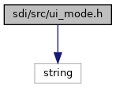
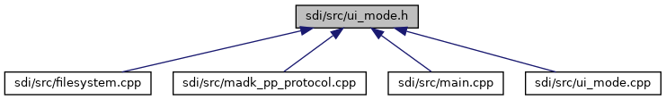

[Functions](#func-members)

`#include <string>`

Include dependency graph for ui_mode.h:

This graph shows which files directly or indirectly include this file:

<a href="ui__mode_8h_source.md">Go to the source code of this file.</a>

|  |  |
|----|----|
| Functions |  |
| void  | [init_ui_mode](#a66a4622071497e674b301c3c01f0041d) () |
| bool  | [select_com_profile](#a55d15b6967e1c13ce450da41e5624e0a) (int comInterfaces, char \*\*ComFileName) |
| void  | [reset_com_profile](#a4b5e64e6037e936f64283fb6f75747ae) () |
| void  | [protocol_status_ui_update](#a6a46d1447df15675918b58136a68b3b1) (const struct ProtStatus \*status) |
| bool  | [multi_connection_support_enabled](#a72dc449a4d0934020d297eb7a1b5a1a6) () |
| bool  | [comcfg_file_valid](#ad17510e582c63802351a6b0acb27dfca) (const std::string &comcfg_file) |
| void  | [show_idle_connect_status](#a6dcc06a913ac018ca40d1a0eae7b557b) () |

## FunctionDocumentation {#function-documentation}

## comcfg_file_valid() 

bool comcfg_file_valid

check content of SDI communication settings file COM_IF.CFG, if it is well formatted and contains at least a COM profile. If not, the file is considered as currupt and needs recovery.

### Returns

true, if file *com_if_file* has valid format of expected COM_IF.CFG, else false.

## init_ui_mode() 

void init_ui_mode

This module contains implementation, which is additionally required to support standard UI mode. Most of these implementations are UI related (e.g. to provide COM menus, idlescreen etc.) SDI variants using this module are compiled without define HEADLESS to add UI standard mode, in addition to headless mode. Finally, program parameter --headless will switch the SDI mode at startup. Recently supported platforms with UI support are: VOS/VOS2/VOS3 Note: This module also contains functions invoked for headless mode on these platforms, too. This is to cover the same behavior as in UI mode. (e.g. selection of a COM profile by COM_IF.CFG (COM settings file). function called once at startup to initialize UI mode of SDI

## multi_connection_support_enabled() 

bool multi_connection_support_enabled

For VOS/VOS2/VOS3 devices this function returns true, if SDI protocol with multi-connection support (using ADKIPC) was enabled by COM settings file. For other platforms this function just returns false.

### Returns

true, if the IPC variant of the SDI protocol library shall be used on VOS/VOS2/VOS3, else false (e.g. disabled by configuration or wrong platform).

## protocol_status_ui_update() 

void protocol_status_ui_update

## reset_com_profile() 

void reset_com_profile

Function to reset selected COM profile and clear current COM configuration. This will force reading of COM configuration and selection of COM profile with next call of [select_com_profile()](#a55d15b6967e1c13ce450da41e5624e0a).

## select_com_profile() 

bool select_com_profile

Function invoked by SDI protocol to select and specify the used COM profile. The function passes the available COM interfaces in parameter *comInterfaces* as bitmask with values of ADKCOM enum com_FeatureMask1, so that SDI COM settings menu is displayed with corresponding entries with configuration options. With first invocation at startup with default settings, SDI shows up a COM setting wizard (in standard UI mode) from which the user is able to select the COM profile to use. Once the profile and settings are applied the function knows the stored settings for further SDI startups. On success, the function returns full path of the COM profile assigned to pointer of parameter *ComFileName*. The supplied buffer of this parameter is static, thus, the caller (SDI protocol) doen\'t need to care about to release resources of it.

**Parameters**

\[in\] **comInterfaces** available COM interfaces, bitmask of ADKCOM enum com_FeatureMask1 \[out\] **ComFileName** full path to COM profile to use

### Returns

true on success, else false on error

## show_idle_connect_status() 

void show_idle_connect_status

function to read the connect status from the SDI protocol and to display with the idlescreen. This is usually triggered by the running SDI protocol via callback, but in special situations this is required to be triggered by SDI (e.g. in EPP mode during SDI startup).
