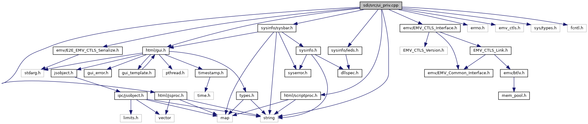
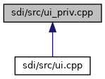

[Data Structures](#nested-classes) \| [Variables](#var-members)

`#include "`<a href="gui_8h_source.md">html/gui.h</a>`"`
`#include "`<a href="scriptproc_8h_source.md">html/scriptproc.h</a>`"`
`#include "`<a href="jsproc_8h_source.md">html/jsproc.h</a>`"`
`#include "`<a href="sysbar_8h_source.md">sysinfo/sysbar.h</a>`"`
`#include "`<a href="leds_8h_source.md">sysinfo/leds.h</a>`"`
`#include "`<a href="_e2_e___e_m_v___c_t_l_s___serialize_8h_source.md">emv/E2E_EMV_CTLS_Serialize.h</a>`"`
`#include "`<a href="_e_m_v___c_t_l_s___interface_8h_source.md">emv/EMV_CTLS_Interface.h</a>`"`
`#include <errno.h>`
`#include "emv_ctls.h"`
`#include <sys/types.h>`
`#include <fcntl.h>`
`#include <string>`

Include dependency graph for ui_priv.cpp:

This graph shows which files directly or indirectly include this file:

|                 |                                                        |
|-----------------|--------------------------------------------------------|
| Data Structures |                                                        |
| struct          | <a href="struct_dlg_cb_data.md">DlgCbData</a> |

|  |  |
|----|----|
| Variables |  |
| uiAsyncCallback  | [async_idlescreen_cb](#a06f170fc2f97e81f7611e1694043a3b1) = 0 |

## VariableDocumentation {#variable-documentation}

## async_idlescreen_cb 

uiAsyncCallback async_idlescreen_cb = 0

