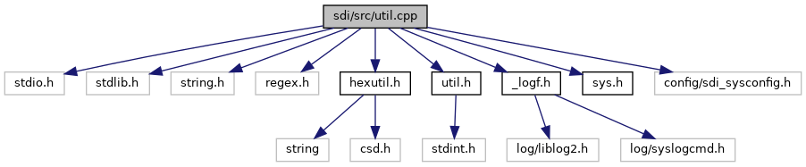

[Functions](#func-members)

`#include <stdio.h>`
`#include <stdlib.h>`
`#include <string.h>`
`#include <regex.h>`
`#include <`<a href="sdi_2src_2hexutil_8h_source.md">hexutil.h</a>`>`
`#include "`<a href="sdi_2src_2util_8h_source.md">util.h</a>`"`
`#include "`<a href="__logf_8h_source.md">_logf.h</a>`"`
`#include "`<a href="sys_8h_source.md">sys.h</a>`"`
`#include "config/sdi_sysconfig.h"`

Include dependency graph for util.cpp:

|  |  |
|----|----|
| Functions |  |
| bool  | [getForceCurrAbbr](#ad052d8032bf71a0869d0eccdf4a7c6c5) (unsigned short currency) |
| const char \*  | [getCurrencyName](#af8e537859d3bd237614e1f416351cdbe) (unsigned short currency) |
| short  | [getCurrencyExponent](#a747e0b130dd6c037d12411a173843e0d) (unsigned short currency) |
| int  | [verifyDate](#ab29fd00cd12931bf70c259be8569ed35) (const char \*date, const char \*format) |
| int  | [bcdValid](#a5d38a0b4222458e86fffe40d3101ff4a) (const unsigned char \*a, unsigned size) |
| string  | [bcdToAmountStr](#a41542e6c6f279dab1d218a7f1f66e9b3) (const unsigned char \*bcd, unsigned size, unsigned pos, const string dsep, const string tsep) |
| bool  | [matchRegex](#a38e7c6dca4df24149a7c53b66d62a6ab) (const char \*str, const char \*\_regex) |
| string  | [escapeRegex](#a4c8a23387bc04abfd2451af2f2771bf5) (const string &str) |

## FunctionDocumentation {#function-documentation}

## bcdToAmountStr() 

string bcdToAmountStr

## bcdValid() 

int bcdValid

check if data is a valid BCD number

**Parameters**

\[in\] **a** pointer to data \[in\] **size** size of the buffer data points to

### Returns

1 if it is a valid BCD number, 0 else

## escapeRegex() 

string escapeRegex

## getCurrencyExponent() 

short getCurrencyExponent

returns the currency exponent for the corresponding currency code. If the currency code is unknown or not supported, -1 returned.

**Parameters**

\[in\] **currency** currency code

### Returns

currency exponent or -1, if code is unknown

## getCurrencyName() 

const char\* getCurrencyName

returns the currency name for the corresponding currency code. If the currency code is unknown or not supported, an empty string is returned.

**Parameters**

\[in\] **currency** currency code

### Returns

currency name as C-string or an empty string, if code is unknown

## getForceCurrAbbr() 

bool getForceCurrAbbr

## matchRegex() 

bool matchRegex

## verifyDate() 

int verifyDate

Verify date

**Parameters**

\[in\] **date** Pointer to date buffer \[in\] **format** Pointer to format buffer

### Returns

1 if date is valid, else 0


Two-digit year values are interpreted as 2000\...2099 Four-digit year values must be at least 1776 (the date of the global introduction of the Gregorian calendar)

