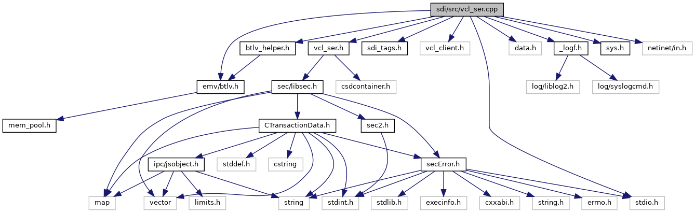

[Functions](#func-members)

`#include <stdio.h>`
`#include "`<a href="btlv__helper_8h_source.md">btlv_helper.h</a>`"`
`#include "`<a href="src_2sdi__tags_8h_source.md">sdi_tags.h</a>`"`
`#include "vcl_client.h"`
`#include "`<a href="vcl__ser_8h_source.md">vcl_ser.h</a>`"`
`#include "data.h"`
`#include "`<a href="__logf_8h_source.md">_logf.h</a>`"`
`#include "`<a href="sys_8h_source.md">sys.h</a>`"`
`#include <`<a href="btlv_8h_source.md">emv/btlv.h</a>`>`
`#include <netinet/in.h>`

Include dependency graph for vcl_ser.cpp:

|  |  |
|----|----|
| Functions |  |
| void  | [handleVcl](#ad02af29750575b39f81961596d4c4f8e) (unsigned short msgBufSize, unsigned char \*msg, unsigned short msgSize, unsigned short rspBufSize, unsigned char \*rsp, unsigned short \*rspSize) |

## FunctionDocumentation {#function-documentation}

## handleVcl() 

void handleVcl

Dispatch function to handle different VCL commands

**Parameters**

\[in\] **msgBufSize** size of the input message buffer \[in\] **msg** pointer to the input message buffer \[in\] **msgSize** size of the input message \[in\] **rspBufSize** maximum size of the response buffer \[in,out\] **rsp** pointer to the response buffer \[in,out\] **rspSize** pointer to the response message size
