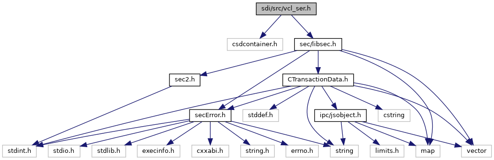
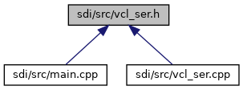

[Macros](#define-members) \| [Functions](#func-members)

`#include "csdcontainer.h"`
`#include "`<a href="libsec_8h_source.md">sec/libsec.h</a>`"`

Include dependency graph for vcl_ser.h:

This graph shows which files directly or indirectly include this file:

<a href="vcl__ser_8h_source.md">Go to the source code of this file.</a>

|  |  |
|----|----|
| Macros |  |
| #define  | [CLA_VCL](#a23b96d4db7f9fc006bbde013693be6e9)   0x28 |
|   | Class for VCL commands. [More\...](#a23b96d4db7f9fc006bbde013693be6e9)  |
| #define  | [INS_VCL_MSG_REGISTART_SRED_REQ](#aab12a07d994fb440092bb014a8a32346)   0x00 |
|   | Turn on Encryption in SRED mode. [More\...](#aab12a07d994fb440092bb014a8a32346)  |
| #define  | [INS_VCL_MSG_STATUS_REQUEST](#a12e57ffa62016cf689e247dc71babb83)   0x01 |
|   | Get VCL\'s current status. [More\...](#a12e57ffa62016cf689e247dc71babb83)  |
| #define  | [INS_VCL_MSG_ADVANCE_DDK](#a21eb6707e39ccf673708ca0dcdfe3091)   0x02 |
|   | Advance to next derived key. [More\...](#a21eb6707e39ccf673708ca0dcdfe3091)  |
| #define  | [INS_VCL_MSG_EPARMS_REQUEST](#a2c95212e9eb1c730247a166f9d191eef)   0x03 |
|   | Get eParms from VCL. [More\...](#a2c95212e9eb1c730247a166f9d191eef)  |
| #define  | [INS_VCL_MSG_DIAG_QUERY](#a145b342de0e8ad187675a464f7a73c03)   0x06 |
|   | Diag query. [More\...](#a145b342de0e8ad187675a464f7a73c03)  |
| #define  | [INS_VCL_MSG_DERIV_QUERY](#a3e0786e6b404dc69cdc7823e73ad0a5c)   0x07 |
|   | Derive data query. [More\...](#a3e0786e6b404dc69cdc7823e73ad0a5c)  |
| #define  | [INS_VCL_MSG_OVERRIDE_MSG_QUERY](#ae32ce12f910cb6b405505b34da87ccc0)   0x08 |
|   | Request the queued VCL Override Command Response. [More\...](#ae32ce12f910cb6b405505b34da87ccc0)  |
| #define  | [INS_VCL_MSG_KSN_REQ](#ad3ae7aa355c3a6851cadb280c8f1fd1d)   0x09 |
|   | KSN request. [More\...](#ad3ae7aa355c3a6851cadb280c8f1fd1d)  |
| #define  | [INS_VCL_MSG_KMAILIN_REQUEST](#a9fec4a51efd591ca5caad365b3f8e345)   0x0A |
|   | KMAILIN request (VOS3 only) [More\...](#a9fec4a51efd591ca5caad365b3f8e345)  |

|  |  |
|----|----|
| Functions |  |
| void  | [handleVcl](#ad02af29750575b39f81961596d4c4f8e) (unsigned short msgBufSize, unsigned char \*msg, unsigned short msgSize, unsigned short rspBufSize, unsigned char \*rsp, unsigned short \*rspSize) |

## MacroDefinition Documentation {#macro-definition-documentation}

## CLA_VCL 

#define CLA_VCL   0x28

Class for VCL commands.

## INS_VCL_MSG_ADVANCE_DDK 

#define INS_VCL_MSG_ADVANCE_DDK   0x02

Advance to next derived key.

## INS_VCL_MSG_DERIV_QUERY 

#define INS_VCL_MSG_DERIV_QUERY   0x07

Derive data query.

## INS_VCL_MSG_DIAG_QUERY 

#define INS_VCL_MSG_DIAG_QUERY   0x06

Diag query.

## INS_VCL_MSG_EPARMS_REQUEST 

#define INS_VCL_MSG_EPARMS_REQUEST   0x03

Get eParms from VCL.

## INS_VCL_MSG_KMAILIN_REQUEST 

#define INS_VCL_MSG_KMAILIN_REQUEST   0x0A

KMAILIN request (VOS3 only)

## INS_VCL_MSG_KSN_REQ 

#define INS_VCL_MSG_KSN_REQ   0x09

KSN request.

## INS_VCL_MSG_OVERRIDE_MSG_QUERY 

#define INS_VCL_MSG_OVERRIDE_MSG_QUERY   0x08

Request the queued VCL Override Command Response.

## INS_VCL_MSG_REGISTART_SRED_REQ 

#define INS_VCL_MSG_REGISTART_SRED_REQ   0x00

Turn on Encryption in SRED mode.

## INS_VCL_MSG_STATUS_REQUEST 

#define INS_VCL_MSG_STATUS_REQUEST   0x01

Get VCL\'s current status.

## FunctionDocumentation {#function-documentation}

## handleVcl() 

void handleVcl

Dispatch function to handle different VCL commands

**Parameters**

\[in\] **msgBufSize** size of the input message buffer \[in\] **msg** pointer to the input message buffer \[in\] **msgSize** size of the input message \[in\] **rspBufSize** maximum size of the response buffer \[in,out\] **rsp** pointer to the response buffer \[in,out\] **rspSize** pointer to the response message size
