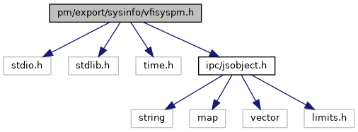
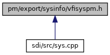

[Data Structures](#nested-classes) \| [Namespaces](#namespaces) \| [Macros](#define-members) \| [Typedefs](#typedef-members) \| [Enumerations](#enum-members) \| [Functions](#func-members)

`#include <stdio.h>`
`#include <stdlib.h>`
`#include <time.h>`
`#include "`<a href="ipc_2src_2ipc_2jsobject_8h_source.md">ipc/jsobject.h</a>`"`

Include dependency graph for vfisyspm.h:

This graph shows which files directly or indirectly include this file:

<a href="vfisyspm_8h_source.md">Go to the source code of this file.</a>

|  |  |
|----|----|
| Data Structures |  |
| struct   | <a href="namespacevfisyspm.md#structvfisyspm_1_1vfisyspm___date_time">vfisyspm_DateTime</a> |

|            |                                                      |
|------------|------------------------------------------------------|
| Namespaces |                                                      |
|            | <a href="namespacevfisyspm.md">vfisyspm</a> |

|  |  |
|----|----|
| Macros |  |
| #define  | <a href="group___power.md#ga60a5fae455021030347aeef511a88634">VFI_SYS_PM_API</a> |
| #define  | <a href="group___power.md#gad8cd9341efa39f085693d8da543bbbe4">PM_SUPRESS_NONE</a>   PM_SUPPRESS_NONE |
| #define  | <a href="group___power.md#ga0d02a37c110367e53d3a69d985429b31">PM_SUPRESS_CRITICAL_SECTION</a>   PM_SUPPRESS_CRITICAL_SECTION |
| #define  | <a href="group___power.md#ga1968c44922fe78c262f75b40e1583774">PM_SUPRESS_CHARGE_CHECK</a>   PM_SUPPRESS_CHARGE_CHECK |
| #define  | <a href="group___power.md#gabd5fc58abfa592ed34817dd83600211f">PM_SUPRESS_ALL</a>   PM_SUPPRESS_ALL |

|  |  |
|----|----|
| Typedefs |  |
| typedef int  | <a href="namespacevfisyspm.md#adeae56fc8c1e11c26aefe7ef065d48b5">wakeupHandle</a> |
| typedef int  | <a href="namespacevfisyspm.md#ae4336e421149646b6ef2394f1c5118a3">timerHandle</a> |
| typedef void(\*  | <a href="namespacevfisyspm.md#a1236e50ed89f0acbdce14dec534b6361">timerNotificationCallback</a>) (const <a href="classvfiipc_1_1_j_s_object.md">vfiipc::JSObject</a> &json) |
| typedef void(\*  | <a href="namespacevfisyspm.md#af13eecf2baf53d8f7d4197fe496410dc">vfisyspmCallback</a>) (vfisyspmNotificationType type, vfisyspmNotifications notification) |

|  |  |
|----|----|
| Enumerations |  |
| enum   | <a href="namespacevfisyspm.md#a116cd14a22494b717a346ddd5be42746">vfisyspmError</a> {   <a href="namespacevfisyspm.md#a116cd14a22494b717a346ddd5be42746ae6e828a228aa2729ef13e39aeb60c993">SYS_PM_ERR_OK</a> = 0, <a href="namespacevfisyspm.md#a116cd14a22494b717a346ddd5be42746af5bd33ce0af71453dfb44a9814d03cb5">SYS_PM_ERR_FAIL</a> = -1, <a href="namespacevfisyspm.md#a116cd14a22494b717a346ddd5be42746a82b2f70a22c97206fee5b8dca67f84c0">SYS_PM_ERR_UNSUPPORTED</a> = -2, <a href="namespacevfisyspm.md#a116cd14a22494b717a346ddd5be42746aae8d7f2b6ae4f09e48dcc0fd6bce9839">SYS_PM_ERR_UNKNOWN</a> = -3,   <a href="namespacevfisyspm.md#a116cd14a22494b717a346ddd5be42746a5884170ce1ce8d75d8a74f4bd374bb11">SYS_PM_ERR_DAEMON_COM</a> = -4, <a href="namespacevfisyspm.md#a116cd14a22494b717a346ddd5be42746a92138b43bfc3d7edab2a1ab6641c08e3">SYS_PM_ERR_TIMEOUT</a> = -5, <a href="namespacevfisyspm.md#a116cd14a22494b717a346ddd5be42746a299d89b8ddcaef1c1cb68415ce412739">SYS_PM_ERR_LIBNOTIFY</a> = -6, <a href="namespacevfisyspm.md#a116cd14a22494b717a346ddd5be42746a92c5f00991921b77c8e64a3b59284a67">SYS_PM_ERR_IPC</a> = -7,   <a href="namespacevfisyspm.md#a116cd14a22494b717a346ddd5be42746a2ba53fd74486fb81a91f6e5507fb55c4">SYS_PM_ERR_NOT_RUNNING</a> = -8, <a href="namespacevfisyspm.md#a116cd14a22494b717a346ddd5be42746aef56cc53fc519e9cefd5e3360c05c2ca">SYS_PM_ERR_PARAM</a> = -9, <a href="namespacevfisyspm.md#a116cd14a22494b717a346ddd5be42746a54f680b1baeda8a550260a8cd4d782c4">SYS_PM_ERR_INIT</a> = -10, <a href="namespacevfisyspm.md#a116cd14a22494b717a346ddd5be42746a207bb908cae8a83962b29bac0251d1f4">SYS_PM_ERR_IN_CRIT_SECTION</a> = -11,   <a href="namespacevfisyspm.md#a116cd14a22494b717a346ddd5be42746a4202f878b3a87ff06fae1d55724a1967">SYS_PM_ERR_POWER</a> = -12, <a href="namespacevfisyspm.md#a116cd14a22494b717a346ddd5be42746aea05ecd5dd03fd74cc3d3228f0fa8eb0">SYS_PM_ERR_CHARGING</a> = -13, <a href="namespacevfisyspm.md#a116cd14a22494b717a346ddd5be42746ac0c023e278546f72723caeec35b4f170">SYS_PM_ERR_CONFIG</a> = -14, <a href="namespacevfisyspm.md#a116cd14a22494b717a346ddd5be42746af6cdb2549cde9a9e94df56d89e8a62ed">SYS_PM_ERR_NON_EXISTING</a> = -15,   <a href="namespacevfisyspm.md#a116cd14a22494b717a346ddd5be42746a9652fa520e4543e8237af60e0aa5a191">SYS_PM_ERR_NOTIFY_SVC</a> = -16, <a href="namespacevfisyspm.md#a116cd14a22494b717a346ddd5be42746a569d82151dc442011b139abf87e618a0">SYS_PM_ERR_TIMER</a> = -17, <a href="namespacevfisyspm.md#a116cd14a22494b717a346ddd5be42746a2a1727fbf8eb5c5aaa7d932b96e4e46e">SYS_PM_ERR_ALREADY_INIT</a> = -18, <a href="namespacevfisyspm.md#a116cd14a22494b717a346ddd5be42746ac297c7c9668ba922b7794f3bf77f5773">SYS_PM_ERR_ALLOWED</a> = -19,   <a href="namespacevfisyspm.md#a116cd14a22494b717a346ddd5be42746a65f6f5eb0488509067c8a9fac31c6c08">SYS_PM_ERR_STATE</a> = -20, <a href="namespacevfisyspm.md#a116cd14a22494b717a346ddd5be42746a5d7a0ef8dbdeffdc3f85bb9066850695">SYS_PM_ERR_LOW_LEVEL</a> = -21, <a href="namespacevfisyspm.md#a116cd14a22494b717a346ddd5be42746a4eb7c919019f254c797582f75e29c8df">SYS_PM_ERR_WAKE_UP_IS_PENDING</a> = -22 } |
| enum   | <a href="namespacevfisyspm.md#a12f0755f1d6c6a1c2116fd1d626a36b2">vfisyspmNotificationType</a> {   <a href="namespacevfisyspm.md#a12f0755f1d6c6a1c2116fd1d626a36b2adda9d4b8e95861b3e009c221bc97754f">PM_NOTIFY_TYPE_NONE</a> = 0, <a href="namespacevfisyspm.md#a12f0755f1d6c6a1c2116fd1d626a36b2a876d631d9f439725cdd318d9617a2be1">PM_NOTIFY_TYPE_POWER_MODE</a> = (1 \<\< 0), <a href="namespacevfisyspm.md#a12f0755f1d6c6a1c2116fd1d626a36b2ae25a95a629bf2261792e8f60443dffc4">PM_NOTIFY_TYPE_DOCK_STATE</a> = (1 \<\< 1), <a href="namespacevfisyspm.md#a12f0755f1d6c6a1c2116fd1d626a36b2aa6e6275051c9866a3b16ff4ad5501527">PM_NOTIFY_TYPE_POWER_SOURCE</a> = (1 \<\< 2),   <a href="namespacevfisyspm.md#a12f0755f1d6c6a1c2116fd1d626a36b2afdedc13a10a78a4325571e6824660dbb">PM_NOTIFY_TYPE_WAKEUP_SOURCE</a> = (1 \<\< 3), <a href="namespacevfisyspm.md#a12f0755f1d6c6a1c2116fd1d626a36b2aa9f7173f2dde2bb8143be3ea6bd81c48">PM_NOTIFY_TYPE_CRITICAL_SECTION</a> = (1 \<\< 4), <a href="namespacevfisyspm.md#a12f0755f1d6c6a1c2116fd1d626a36b2ac5632f655bdad9187cb90e2dc913631b">PM_NOTIFY_TYPE_PCI_REBOOT</a> = (1 \<\< 5), <a href="namespacevfisyspm.md#a12f0755f1d6c6a1c2116fd1d626a36b2a332097eb37859446377282c0db9f7498">PM_NOTIFY_TYPE_POWER_BUTTON</a> = (1 \<\< 6),   <a href="namespacevfisyspm.md#a12f0755f1d6c6a1c2116fd1d626a36b2ad6dbc231cf759ee58601f51109a3884f">PM_NOTIFY_TYPE_LAST</a> = (1 \<\< 7), <a href="namespacevfisyspm.md#a12f0755f1d6c6a1c2116fd1d626a36b2a8272e895ac429bfa5b91c9072dadd3be">PM_NOTIFY_TYPE_ALL</a> = 0xFFFF } |
| enum   | <a href="namespacevfisyspm.md#a8bf72e0a67065ff830248d4f950bccf8">vfisyspmTimerFlags</a> { <a href="namespacevfisyspm.md#a8bf72e0a67065ff830248d4f950bccf8a579aa4923fc0124b6528dc730181626b">PM_TIMER_NONE</a> = 0, <a href="namespacevfisyspm.md#a8bf72e0a67065ff830248d4f950bccf8abab523c0bf88d83b778c7a55bd7adfcf">PM_TIMER_NO_WAKE_UP</a> = (1 \<\< 0) } |
| enum   | <a href="namespacevfisyspm.md#a52110948b0aa4715d6ff642d1cb32889">vfisyspmChargningModes</a> { <a href="namespacevfisyspm.md#a52110948b0aa4715d6ff642d1cb32889a7a56935fb216076f3a7351bb9499e28a">PM_CHARGING_MODE_UNRESTRICTED</a> = 1, <a href="namespacevfisyspm.md#a52110948b0aa4715d6ff642d1cb32889a3a5b3f8570d5f3ecc68f9d1e8e5b60c2">PM_CHARGING_MODE_CAR_CHARGER</a> = 2 } |
| enum   | <a href="namespacevfisyspm.md#adffb93f77c4d1190fd7dc0397335b9a2">vfisyspmTransitionFlags</a> {   <a href="namespacevfisyspm.md#adffb93f77c4d1190fd7dc0397335b9a2a2fcfcf79a2dbb05ff302c1d3a50ffce5">PM_SUPPRESS_NONE</a> = 0, <a href="namespacevfisyspm.md#adffb93f77c4d1190fd7dc0397335b9a2ae5fa433f19e5c699e0a72e6ff3dae351">PM_SUPPRESS_CRITICAL_SECTION</a> = (1 \<\< 0), <a href="namespacevfisyspm.md#adffb93f77c4d1190fd7dc0397335b9a2a8246a65429e400d532e58b754c3bf3f5">PM_SUPPRESS_CHARGE_CHECK</a> = (1 \<\< 1), <a href="namespacevfisyspm.md#adffb93f77c4d1190fd7dc0397335b9a2aef52bc9676bca049c63d78e740e2af1a">PM_SUPPRESS_BOOT_STATE</a> = (1 \<\< 2),   <a href="namespacevfisyspm.md#adffb93f77c4d1190fd7dc0397335b9a2ad00ca996a01fdcdb456857eba2a8a054">PM_SYNC</a> = (1 \<\< 3), <a href="namespacevfisyspm.md#adffb93f77c4d1190fd7dc0397335b9a2a1fe1ad21e4f33534364cdd0e734c8b8c">PM_SUPPRESS_ALL</a> } |
| enum   | <a href="namespacevfisyspm.md#ad9757c6641d1ed2c0a5d438d08ce9cc0">vfisyspmCritSectionParameters</a> { <a href="namespacevfisyspm.md#ad9757c6641d1ed2c0a5d438d08ce9cc0aef329a468a5a095f29d727afe39c6688">PM_CRIT_NONE</a> = 0, <a href="namespacevfisyspm.md#ad9757c6641d1ed2c0a5d438d08ce9cc0a8d83189d664475c36ee3d24ad77d42c2">PM_CRIT_SUPRESS_STANDBY</a> = (1 \<\< 0) } |
| enum   | <a href="namespacevfisyspm.md#ad6865f9a76c1985e26c2e86719fc674a">powermngtState</a> {   <a href="namespacevfisyspm.md#ad6865f9a76c1985e26c2e86719fc674aaee429d2b18e984f9be3d8a35ab58f77f">BOOT</a> =-1, <a href="namespacevfisyspm.md#ad6865f9a76c1985e26c2e86719fc674aa33cf1d8ef1d06ee698a7fabf40eb3a7f">ACTIVE</a> = 0, <a href="namespacevfisyspm.md#ad6865f9a76c1985e26c2e86719fc674aae4634ae4352b512b38c5da9dc1610ca6">STANDBY</a> = 1, <a href="namespacevfisyspm.md#ad6865f9a76c1985e26c2e86719fc674aad6137abebe4fdc59e2f0f2c84bdbe3fa">SLEEP</a> = 2,   <a href="namespacevfisyspm.md#ad6865f9a76c1985e26c2e86719fc674aa3c282494db59c58249a6b608e20050bf">DEEP_SLEEP</a> = 3, <a href="namespacevfisyspm.md#ad6865f9a76c1985e26c2e86719fc674aac22ce256f44d6d9df78af9ee4ee9b3b7">HIBERNATE</a> = 4, <a href="namespacevfisyspm.md#ad6865f9a76c1985e26c2e86719fc674aaac132f2982b98bcaa3445e535a03ff75">OFF</a> = 5, <a href="namespacevfisyspm.md#ad6865f9a76c1985e26c2e86719fc674aa054795c72261d4d92e885ac46296a18e">REBOOT</a> = 6,   <a href="namespacevfisyspm.md#ad6865f9a76c1985e26c2e86719fc674aa990cd45e93be2b4661f3499e0a658a33">LAST</a> = 9 } |
| enum   | <a href="namespacevfisyspm.md#a40ea12a9b19b561cd7403fc1362c49d0">vfisyspmNotifications</a> {   <a href="namespacevfisyspm.md#a40ea12a9b19b561cd7403fc1362c49d0a21b09ed5fa8b7dafbfa95197eeb0462f">ENTER_BOOT</a> = 37, <a href="namespacevfisyspm.md#a40ea12a9b19b561cd7403fc1362c49d0a436b629f22dd3a3e7cc0756587580851">ENTER_ACTIVE</a> = 0, <a href="namespacevfisyspm.md#a40ea12a9b19b561cd7403fc1362c49d0ae83e2617f3c06e99ab254957bcbe5b48">ENTER_STANDBY</a> = 1, <a href="namespacevfisyspm.md#a40ea12a9b19b561cd7403fc1362c49d0a5916aab3235532fa23ed7e8dbb62bafa">ENTER_SLEEP</a> = 2,   <a href="namespacevfisyspm.md#a40ea12a9b19b561cd7403fc1362c49d0a7712c5b15a993220069c449414826806">ENTER_DEEP_SLEEP</a> = 13, <a href="namespacevfisyspm.md#a40ea12a9b19b561cd7403fc1362c49d0aab963348cd57bdd8d1bff679d825f837">ENTER_HIBERNATE</a> = 10, <a href="namespacevfisyspm.md#a40ea12a9b19b561cd7403fc1362c49d0af9d877a3ba3e6e4c778b9b1721ad913f">ENTER_SHUTDOWN</a> = 12, <a href="namespacevfisyspm.md#a40ea12a9b19b561cd7403fc1362c49d0a1d938770222af584750199577cbc366e">ENTER_REBOOT</a> = 11,   <a href="namespacevfisyspm.md#a40ea12a9b19b561cd7403fc1362c49d0a60dd79b5470a3dcbfd77356325e4325e">ENTER_SYSMODE</a> = 27, <a href="namespacevfisyspm.md#a40ea12a9b19b561cd7403fc1362c49d0a46d861287edfaeef8c18e3e8199593fd">ENTER_DOCKED</a> = 3, <a href="namespacevfisyspm.md#a40ea12a9b19b561cd7403fc1362c49d0a6e71020d15bc10c4dd07b4e9ece16133">ENTER_UNDOCKED</a> = 4, <a href="namespacevfisyspm.md#a40ea12a9b19b561cd7403fc1362c49d0ae6fcbf1904b2300b1a380c3e0e7ad658">ENTER_BATTERY</a> = 5,   <a href="namespacevfisyspm.md#a40ea12a9b19b561cd7403fc1362c49d0afaa60ff5a05125cecd8ccbfb5efe3960">ENTER_EXTERNAL_POWER</a> = 6, <a href="namespacevfisyspm.md#a40ea12a9b19b561cd7403fc1362c49d0addcbc3a931663eabce71c7ade209d41b">ENTER_BATTERY_NORMAL</a> = 26, <a href="namespacevfisyspm.md#a40ea12a9b19b561cd7403fc1362c49d0a4044700d8a89584d6e79c3b50510c125">ENTER_BATTERY_FULL</a> = 7, <a href="namespacevfisyspm.md#a40ea12a9b19b561cd7403fc1362c49d0ab6285d5dc823ff91620260a329ca0bc0">ENTER_BATTERY_LOW</a> = 8,   <a href="namespacevfisyspm.md#a40ea12a9b19b561cd7403fc1362c49d0a6043322349163fdc8bfbc6511c6eafc1">ENTER_BATTERY_CRITICAL</a> = 9, <a href="namespacevfisyspm.md#a40ea12a9b19b561cd7403fc1362c49d0a5e65c645140a71ee8680731d117db539">BATTERY_FAULT</a> = 35, <a href="namespacevfisyspm.md#a40ea12a9b19b561cd7403fc1362c49d0a1ed19f741a8e8ca234663d12733a4ac9">BATTERY_REMOVED</a> = 36, <a href="namespacevfisyspm.md#a40ea12a9b19b561cd7403fc1362c49d0a9e4ddc0c463fc8a8e52d052738ce8f7f">BUTTON_X_PRESSED</a> = 14,   <a href="namespacevfisyspm.md#a40ea12a9b19b561cd7403fc1362c49d0aa715b70b669df8305b1bc85e13c3bf17">BUTTON_X_RELEASED</a> = 15, <a href="namespacevfisyspm.md#a40ea12a9b19b561cd7403fc1362c49d0a1a4d75cb3d28ed562ea1860f99b74656">PCI_REBOOT_WARNING</a> = 17, <a href="namespacevfisyspm.md#a40ea12a9b19b561cd7403fc1362c49d0a9204d962c01740d01d1ea40b219a0472">WAKEUP</a> = 16, <a href="namespacevfisyspm.md#a40ea12a9b19b561cd7403fc1362c49d0a69c89a0509fedf5feac1047446dec7d7">WAKEUP_COMM</a> = 18,   <a href="namespacevfisyspm.md#a40ea12a9b19b561cd7403fc1362c49d0a61a7a1db2cc82549c02410d2927d861a">WAKEUP_USB</a> = 19, <a href="namespacevfisyspm.md#a40ea12a9b19b561cd7403fc1362c49d0a45f46c8561816869183909e78e4fe4bd">WAKEUP_CONSOLE</a> = 20, <a href="namespacevfisyspm.md#a40ea12a9b19b561cd7403fc1362c49d0a83a5a1e121975a81de3132c8e22737c0">WAKEUP_KEY_PRESS</a> = 21, <a href="namespacevfisyspm.md#a40ea12a9b19b561cd7403fc1362c49d0a7400bfb621d43c5b03cda19a40c07c83">WAKEUP_TIMER</a> = 22,   <a href="namespacevfisyspm.md#a40ea12a9b19b561cd7403fc1362c49d0af5dddba077c7f1d02fb870d1ac056fae">WAKEUP_EXTERNAL</a> = 23, <a href="namespacevfisyspm.md#a40ea12a9b19b561cd7403fc1362c49d0ae0b0fae8848e9ca883497db9451b3f86">CRITICAL_SECTION_ENABLED</a> = 24, <a href="namespacevfisyspm.md#a40ea12a9b19b561cd7403fc1362c49d0ab9bfdaa4f280dc926f19a28f77ec29c5">CRITICAL_SECTION_DISABLED</a> = 25, <a href="namespacevfisyspm.md#a40ea12a9b19b561cd7403fc1362c49d0ada24837b9778c85a104d0ae5a3b07d6d">ABORT_PINPAD_ENABLE</a> = 28,   <a href="namespacevfisyspm.md#a40ea12a9b19b561cd7403fc1362c49d0afaf2574140a1d211dddea048530e3229">ABORT_EARLY_WAKEUP</a> = 29, <a href="namespacevfisyspm.md#a40ea12a9b19b561cd7403fc1362c49d0a170625ad571671b33659bf8259221dce">ABORT_HMAC_PROCESSING</a> = 30, <a href="namespacevfisyspm.md#a40ea12a9b19b561cd7403fc1362c49d0a3c990105f87b91a975c3a69f082f6c20">ABORT_CRITICAL_SECTION</a> = 31, <a href="namespacevfisyspm.md#a40ea12a9b19b561cd7403fc1362c49d0a3d9a09ae810d52c40b06d468866991fb">ABORT_SYSTEM_ERROR</a> = 32,   <a href="namespacevfisyspm.md#a40ea12a9b19b561cd7403fc1362c49d0a65303937699c54a124f01e78f6b0c778">CHARGING_MODE_UNRESTRICTED</a> = 33, <a href="namespacevfisyspm.md#a40ea12a9b19b561cd7403fc1362c49d0abcc6616888db2f6196dfe2ad6fd81bc2">CHARGING_MODE_CAR_CHARGER</a> = 34, <a href="namespacevfisyspm.md#a40ea12a9b19b561cd7403fc1362c49d0a133bafcf1854e4513b813726d6cf5bff">POWER_BUTTON_PRESSED</a> = 37, <a href="namespacevfisyspm.md#a40ea12a9b19b561cd7403fc1362c49d0a6cfca8e555b914a5b68498fb9d52a589">POWER_BUTTON_RELEASED</a> = 38 } |

|  |  |
|----|----|
| Functions |  |
| <a href="group___power.md#ga60a5fae455021030347aeef511a88634">VFI_SYS_PM_API</a> vfisyspmError  | <a href="namespacevfisyspm.md#a828c03869c165b8b79ebba5cccc27fa4">sys_Init</a> () |
| <a href="group___power.md#ga60a5fae455021030347aeef511a88634">VFI_SYS_PM_API</a> vfisyspmError  | <a href="namespacevfisyspm.md#affcdd833ed5aac0e91f5c9346edfbc4f">sys_Init</a> (vfisyspmCallback cb) |
| <a href="group___power.md#ga60a5fae455021030347aeef511a88634">VFI_SYS_PM_API</a> vfisyspmError  | <a href="namespacevfisyspm.md#abdec5840b8be1aba2e4054207437fd38">sys_Init</a> (vfisyspmCallback cb, int typeMask) |
| <a href="group___power.md#ga60a5fae455021030347aeef511a88634">VFI_SYS_PM_API</a> vfisyspmError  | <a href="namespacevfisyspm.md#ad9a48a6a21ba5c32e37f92e9e6263e48">sys_Init</a> (vfisyspmCallback cb, vfisyspmNotificationType typeMask) |
| <a href="group___power.md#ga60a5fae455021030347aeef511a88634">VFI_SYS_PM_API</a> vfisyspmError  | <a href="namespacevfisyspm.md#a691e7888b9004d8a527f419e7966df7f">sys_Deinit</a> () |
| <a href="group___power.md#ga60a5fae455021030347aeef511a88634">VFI_SYS_PM_API</a> vfisyspmError  | <a href="namespacevfisyspm.md#a34c2604900fb863f387cb2485d5c8b8c">sys_SetNotificationCB</a> (vfisyspmCallback cb, vfisyspmNotificationType typeMask) |
| <a href="group___power.md#ga60a5fae455021030347aeef511a88634">VFI_SYS_PM_API</a> vfisyspmError  | <a href="namespacevfisyspm.md#a5993899ccf9771a2c045a4d15b65f621">sys_SetChargingMode</a> (vfisyspmChargningModes mode) |
| <a href="group___power.md#ga60a5fae455021030347aeef511a88634">VFI_SYS_PM_API</a> vfisyspmError  | <a href="namespacevfisyspm.md#a72fd982609120a896c05d8f390c59dc9">sys_GetChargingMode</a> (vfisyspmChargningModes &mode) |
| <a href="group___power.md#ga60a5fae455021030347aeef511a88634">VFI_SYS_PM_API</a> vfisyspmError  | <a href="namespacevfisyspm.md#a70b475852f505c319505a7b8d0a13193">sys_RefreshConfig</a> () |
| <a href="group___power.md#ga60a5fae455021030347aeef511a88634">VFI_SYS_PM_API</a> vfisyspmError  | <a href="namespacevfisyspm.md#a7bac542d589655ccc9fd16450ccb0ccb">sys_Active</a> (int flags) |
| <a href="group___power.md#ga60a5fae455021030347aeef511a88634">VFI_SYS_PM_API</a> vfisyspmError  | <a href="namespacevfisyspm.md#a72d161698f6401af9b44559284b818cd">sys_Active</a> () |
| <a href="group___power.md#ga60a5fae455021030347aeef511a88634">VFI_SYS_PM_API</a> vfisyspmError  | <a href="namespacevfisyspm.md#add1c02a9ecf32dea3ffedb136972c7ce">sys_Standby</a> (int flags) |
| <a href="group___power.md#ga60a5fae455021030347aeef511a88634">VFI_SYS_PM_API</a> vfisyspmError  | <a href="namespacevfisyspm.md#a957c8be2ed54e65a5498a98349b9cf86">sys_Standby</a> () |
| <a href="group___power.md#ga60a5fae455021030347aeef511a88634">VFI_SYS_PM_API</a> vfisyspmError  | <a href="namespacevfisyspm.md#a60947349d2da486a930e8847c017b236">sys_Sleep</a> (int flags) |
| <a href="group___power.md#ga60a5fae455021030347aeef511a88634">VFI_SYS_PM_API</a> vfisyspmError  | <a href="namespacevfisyspm.md#ac082ceac95b7703ded5445c8aee7536f">sys_Sleep</a> () |
| <a href="group___power.md#ga60a5fae455021030347aeef511a88634">VFI_SYS_PM_API</a> vfisyspmError  | <a href="namespacevfisyspm.md#acb4d7c188a1d12752c5215a44ced3263">sys_DeepSleep</a> (int flags) |
| <a href="group___power.md#ga60a5fae455021030347aeef511a88634">VFI_SYS_PM_API</a> vfisyspmError  | <a href="namespacevfisyspm.md#add96f5e934bdadf2f6a41e189d6353e9">sys_DeepSleep</a> () |
| <a href="group___power.md#ga60a5fae455021030347aeef511a88634">VFI_SYS_PM_API</a> vfisyspmError  | <a href="namespacevfisyspm.md#afe74f69646f3357df026f70ac5d943ae">sys_Hibernate</a> (int flags) |
| <a href="group___power.md#ga60a5fae455021030347aeef511a88634">VFI_SYS_PM_API</a> vfisyspmError  | <a href="namespacevfisyspm.md#adb4b44a32a9f1d354d4e142519e6b46e">sys_Hibernate</a> () |
| <a href="group___power.md#ga60a5fae455021030347aeef511a88634">VFI_SYS_PM_API</a> vfisyspmError  | <a href="namespacevfisyspm.md#a5b1865b11b0d0bd3887347e29692b8c2">sys_Shutdown</a> (int flags) |
| <a href="group___power.md#ga60a5fae455021030347aeef511a88634">VFI_SYS_PM_API</a> vfisyspmError  | <a href="namespacevfisyspm.md#a1c09afd331bb3ba33601a3ef580a2076">sys_Shutdown</a> () |
| <a href="group___power.md#ga60a5fae455021030347aeef511a88634">VFI_SYS_PM_API</a> vfisyspmError  | <a href="namespacevfisyspm.md#ac2c3afe63131d7a7fb38604881c643db">sys_Reboot</a> (int flags) |
| <a href="group___power.md#ga60a5fae455021030347aeef511a88634">VFI_SYS_PM_API</a> vfisyspmError  | <a href="namespacevfisyspm.md#ad55a0bca60ed5c19f87f0a12e9e552e3">sys_Reboot</a> () |
| <a href="group___power.md#ga60a5fae455021030347aeef511a88634">VFI_SYS_PM_API</a> vfisyspmError  | <a href="namespacevfisyspm.md#af09cc28d263f6316e293617ab360c9cd">sys_RebootDock</a> () |
| <a href="group___power.md#ga60a5fae455021030347aeef511a88634">VFI_SYS_PM_API</a> vfisyspmError  | <a href="namespacevfisyspm.md#ac46060410ba78b557470d51eb9c90feb">sys_CriticalSectionEnter</a> () |
| <a href="group___power.md#ga60a5fae455021030347aeef511a88634">VFI_SYS_PM_API</a> vfisyspmError  | <a href="namespacevfisyspm.md#aa27206ac015214c2b9826ceb931caee6">sys_CriticalSectionEnter</a> (int params) |
| <a href="group___power.md#ga60a5fae455021030347aeef511a88634">VFI_SYS_PM_API</a> vfisyspmError  | <a href="namespacevfisyspm.md#a1fe354c573d66613fbae37897509cf04">sys_CriticalSectionExit</a> () |
| <a href="group___power.md#ga60a5fae455021030347aeef511a88634">VFI_SYS_PM_API</a> vfisyspmError  | <a href="namespacevfisyspm.md#a553702af12298474a0dbe35685aa582e">sys_CriticalSectionState</a> (bool &state) |
| <a href="group___power.md#ga60a5fae455021030347aeef511a88634">VFI_SYS_PM_API</a> vfisyspmError  | <a href="namespacevfisyspm.md#ab6864fd6fce20f5e804d9a9a6fe01239">sys_SetWakeupTime</a> (struct vfisyspm_DateTime \*wakeupTime) |
| <a href="group___power.md#ga60a5fae455021030347aeef511a88634">VFI_SYS_PM_API</a> vfisyspmError  | <a href="namespacevfisyspm.md#a1ab01151064ddf942771a17725333694">sys_SetWakeupTime</a> (wakeupHandle &handle, const vfisyspm_DateTime &wakeup_time) |
| <a href="group___power.md#ga60a5fae455021030347aeef511a88634">VFI_SYS_PM_API</a> vfisyspmError  | <a href="namespacevfisyspm.md#a2609875d7c7e7a16b50119430ea15802">sys_SetWakeupTime</a> (wakeupHandle &handle, time_t time) |
| <a href="group___power.md#ga60a5fae455021030347aeef511a88634">VFI_SYS_PM_API</a> vfisyspmError  | <a href="namespacevfisyspm.md#a8357d72c64c8dcf1a6f6d0069e9d7bf9">sys_SetWakeupTime</a> (wakeupHandle &handle, time_t time, powermngtState state, int flags) |
| <a href="group___power.md#ga60a5fae455021030347aeef511a88634">VFI_SYS_PM_API</a> vfisyspmError  | <a href="namespacevfisyspm.md#a7d682df53ed4dcfe7b15c21dc8fb064a">sys_SetWakeupTime</a> (time_t time) |
| <a href="group___power.md#ga60a5fae455021030347aeef511a88634">VFI_SYS_PM_API</a> vfisyspmError  | <a href="namespacevfisyspm.md#a379d3c0293774ea6ae82c084715c9e6a">sys_CancelWakeupTime</a> (const wakeupHandle &handle) |
| <a href="group___power.md#ga60a5fae455021030347aeef511a88634">VFI_SYS_PM_API</a> vfisyspmError  | <a href="namespacevfisyspm.md#a445bbf4ec804907506c633fef8e814f8">sys_ClearWakeupTimes</a> () |
| <a href="group___power.md#ga60a5fae455021030347aeef511a88634">VFI_SYS_PM_API</a> vfisyspmError  | <a href="namespacevfisyspm.md#a27733055b3dffa5f12f8a7a2fdaf4755">sys_SetPciRebootTime</a> (struct vfisyspm_DateTime \*rebootTime) |
| <a href="group___power.md#ga60a5fae455021030347aeef511a88634">VFI_SYS_PM_API</a> vfisyspmError  | <a href="namespacevfisyspm.md#aa08792636f5c4645041fa8fe765108ce">sys_GetPciRebootTime</a> (struct vfisyspm_DateTime \*rebootTime) |
| <a href="group___power.md#ga60a5fae455021030347aeef511a88634">VFI_SYS_PM_API</a> vfisyspmError  | <a href="namespacevfisyspm.md#a8d11de8c8d681b6e9023abb735bd2f8a">sys_ClearPciRebootTime</a> () |
| <a href="group___power.md#ga60a5fae455021030347aeef511a88634">VFI_SYS_PM_API</a> vfisyspmError  | <a href="namespacevfisyspm.md#ac334c4dcb872d09be68678ee3fe4d348">sys_GetConfig</a> (<a href="classvfiipc_1_1_j_s_object.md">vfiipc::JSObject</a> &config) |
| <a href="group___power.md#ga60a5fae455021030347aeef511a88634">VFI_SYS_PM_API</a> vfisyspmError  | <a href="namespacevfisyspm.md#a0d11383cc1a0947dd99a8eae48692218">sys_SetConfig</a> (const <a href="classvfiipc_1_1_j_s_object.md">vfiipc::JSObject</a> &config) |
| <a href="group___power.md#ga60a5fae455021030347aeef511a88634">VFI_SYS_PM_API</a> vfisyspmError  | <a href="namespacevfisyspm.md#a68430a3c800754545a8d83b6213b848b">sys_SetTimer</a> (timerHandle &handle, const vfisyspm_DateTime &time, const std::string &payload=\"\") |
| <a href="group___power.md#ga60a5fae455021030347aeef511a88634">VFI_SYS_PM_API</a> vfisyspmError  | <a href="namespacevfisyspm.md#ab520652032bdfab68634715ead24caf7">sys_SetTimer</a> (timerHandle &handle, const time_t time, const std::string &payload=\"\") |
| <a href="group___power.md#ga60a5fae455021030347aeef511a88634">VFI_SYS_PM_API</a> vfisyspmError  | <a href="namespacevfisyspm.md#af370c14d178d9ea52c63ba7fb2a0693a">sys_SetTimer</a> (timerHandle &handle, const time_t time, const std::string &payload, timerNotificationCallback cb, int flags=0) |
| <a href="group___power.md#ga60a5fae455021030347aeef511a88634">VFI_SYS_PM_API</a> vfisyspmError  | <a href="namespacevfisyspm.md#a23b7b0a976a2d72581cba03f355fba6b">sys_CancelTimer</a> (const timerHandle &handle) |
| <a href="group___power.md#ga60a5fae455021030347aeef511a88634">VFI_SYS_PM_API</a> vfisyspmError  | <a href="namespacevfisyspm.md#addd3c8a0add2df978b277b7a0591b9f1">sys_CancelTimers</a> () |
| <a href="group___power.md#ga60a5fae455021030347aeef511a88634">VFI_SYS_PM_API</a> vfisyspmError  | <a href="namespacevfisyspm.md#a13541ab5c56e234226b5b9994fc78d90">sys_CancelSleep</a> () |
| <a href="group___power.md#ga60a5fae455021030347aeef511a88634">VFI_SYS_PM_API</a> vfisyspmError  | <a href="namespacevfisyspm.md#af7e5cd36fc1da64f6d3bc6608150c40d">sys_SetTimerCallback</a> (timerNotificationCallback cb) |
| <a href="group___power.md#ga60a5fae455021030347aeef511a88634">VFI_SYS_PM_API</a> vfisyspmError  | <a href="namespacevfisyspm.md#a39c288392cb669a9ac2984e1ca54f57c">sys_GetRebootReason</a> (std::string &reason) |
| <a href="group___power.md#ga60a5fae455021030347aeef511a88634">VFI_SYS_PM_API</a> vfisyspmError  | <a href="namespacevfisyspm.md#aecc49995b326dd842df308d43f882fec">sys_StartSysmode</a> () |
| <a href="group___power.md#ga60a5fae455021030347aeef511a88634">VFI_SYS_PM_API</a> vfisyspmError  | <a href="namespacevfisyspm.md#aad5db89fd567428a39c63cc68a3d62c8">sys_CriticalSectionList</a> (<a href="classvfiipc_1_1_j_s_object.md">vfiipc::JSObject</a> &list) |
|   | Get list of applications currently holding critical section. <a href="namespacevfisyspm.md#aad5db89fd567428a39c63cc68a3d62c8">More...</a>  |
| <a href="group___power.md#ga60a5fae455021030347aeef511a88634">VFI_SYS_PM_API</a> vfisyspmError  | <a href="namespacevfisyspm.md#a6c55f9ea47af8b4082e4f3ce63be4ece">sys_GetCurrentState</a> (powermngtState &state) |
|   | Get current PM daemon state. <a href="namespacevfisyspm.md#a6c55f9ea47af8b4082e4f3ce63be4ece">More...</a>  |
| const <a href="group___power.md#ga60a5fae455021030347aeef511a88634">VFI_SYS_PM_API</a> char \*  | <a href="namespacevfisyspm.md#a3d4c62b4ad7152888495785a9efd3705">sys_GetSvcVersion</a> () |
|   | Get vfisyspm daemon version. <a href="namespacevfisyspm.md#a3d4c62b4ad7152888495785a9efd3705">More...</a>  |
| const <a href="group___power.md#ga60a5fae455021030347aeef511a88634">VFI_SYS_PM_API</a> char \*  | <a href="namespacevfisyspm.md#ae217f122b64926db63e29372317fa200">sys_GetVersion</a> () |
|   | Get vfisyspm library version. <a href="namespacevfisyspm.md#ae217f122b64926db63e29372317fa200">More...</a>  |
| const <a href="group___power.md#ga60a5fae455021030347aeef511a88634">VFI_SYS_PM_API</a> char \*  | <a href="namespacevfisyspm.md#a2c4c002f9b1eed4e0e310fac1a764ad7">sys_StrError</a> (vfisyspmError error) |
|   | Get error description message. <a href="namespacevfisyspm.md#a2c4c002f9b1eed4e0e310fac1a764ad7">More...</a>  |
| <a href="group___power.md#ga60a5fae455021030347aeef511a88634">VFI_SYS_PM_API</a> vfisyspmError  | <a href="namespacevfisyspm.md#a4d6492c4002bd0fe29ab6cb46860b3a6">sys_ResetBatteryFaultState</a> () |
|   | Remove a faulty battery state. <a href="namespacevfisyspm.md#a4d6492c4002bd0fe29ab6cb46860b3a6">More...</a>  |

------------------------------------------------------------------------

## DataStructure Documentation {#data-structure-documentation}

## vfisyspm::vfisyspm_DateTime 

struct vfisyspm::vfisyspm_DateTime

### Examples

<a href="pm-demo_8cpp-example.md#_a8">pm-demo.cpp</a>.

| Data Fields |          |                                               |
|-------------|----------|-----------------------------------------------|
| int         | tm_hour  | 
hours
                |
| int         | tm_isdst | 
daylight saving time
 |
| int         | tm_mday  | 
day of the month
     |
| int         | tm_min   | 
minutes
              |
| int         | tm_mon   | 
month
                |
| int         | tm_sec   | 
seconds
              |
| int         | tm_wday  | 
day of the week
      |
| int         | tm_yday  | 
day in the year
      |
| int         | tm_year  | 
year
                 |
