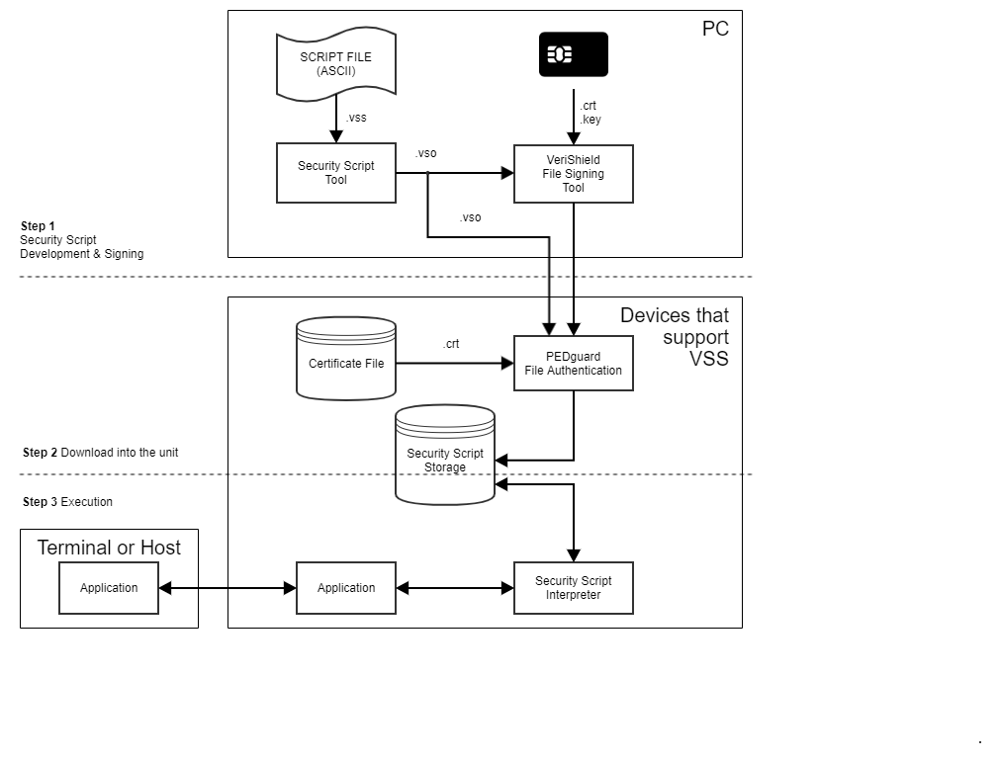
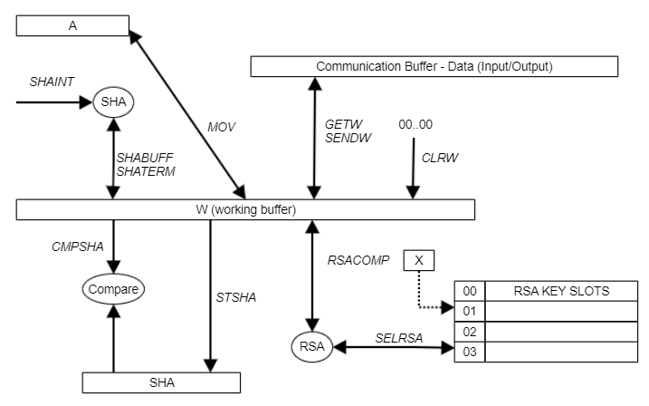
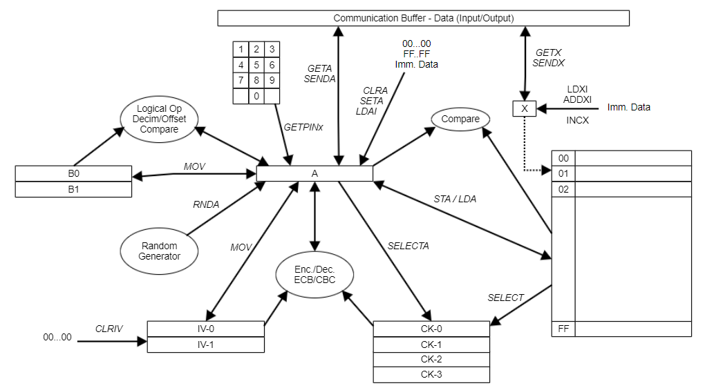

# VeriShield Security Scripts (VSS) <a href="#vss_documentation" id="vss_documentation"></a>

# Introduction <a href="#sec_vss_introduction" id="sec_vss_introduction"></a>

## Purpose <a href="#subsec_vss_purpose" id="subsec_vss_purpose"></a>

This document is to describe VeriShield Security Scripts (VSS), a system that provides security modules with enough flexibility to support different key management schemes, such as triple-DES for master and session keys, offline PIN verifications, Australian AS2806 part 6, Canadian Interac, Semp/4B, and APACS40. This document applies to security modules that implement VSS in programmable and non-programmable devices.

## Organization <a href="#subsec_vss_organization" id="subsec_vss_organization"></a>

This guide is organized as follows:

- [General Overview](#sec_vss_overview). Provides an overview of the VeriShield Security Scripts.
- [Write a Security Script](#sec_vss_write). Describes the principles, keywords, instructions and macrocommands used to create a Security Script.
- [Macro Command Execution](#sec_vss_macro_command_execution). Explains how the macro scripts of PINpads and terminals are executed.
- [Tools](#sec_vss_tools). Discusses the tools such as the Script Processor, Signing Tool and the Key Loading tools used in PINpads and terminals.
- [VSS Key Installation APIs](#sec_vss_loading_apis). Describes the APIs available to install VSS keys.
- [Appendix A: OP Code Table](#sec_vss_appendix_a), Displays the opcode table,which identifies the opcode value for all the keywords that might generate an execution error.
- [Appendix B: VSS Troubleshooting Guide](#sec_vss_appendix_b). Describes frequent VSS issues and how to resolve them

To learn more about the VeriShield Security Scripts please refer to the following documents and their associated Verifone Part Numbers (VPN):
*\[Ref 3\] - SPRD - SC552 Croatia - Revision 1.3
VDN 06199 - PINpad 1000 Plus -- Technical Specification Document
VDN 15299 - Generic Personalization I for Mars V1 - Technical Specifications
VDN 15471 - Most Commonly Used PIN Blocks
VDN 19322 - Secure Macros for PEDguard Internal PINpad*

# Overview <a href="#sec_vss_overview" id="sec_vss_overview"></a>

In the default configurations, the most Verifone PINpads and terminals support only two key management schemes: DUKPT and Master/Session. The two schemes meet the needs of most of the customers and as they are hard-coded, customizing the security module is not required.

For customers who need more flexibility, the VeriShield Security Script mechanism provides support for: Different key management schemes.

- Different PIN block formats such as PVV, CVV IBM3624.
- Additional key space.
- Different encryption algorithms such as triple-DES, AES, RSA. All the information is written in a Security Script file (ASCII) using a VSS extension. This script is processed by a PC tool and converted into a downloadable binary file with a VSO extension. The download is protected by the VeriShield File Authentication (FA) module. Therefore, the Security Script file should be downloaded along with its signature file generated by the VeriShield File Signature Tool (FST).



The certificate used for FA must have VeriShield Security Scripts enabled for the GID in which the script is loaded. VeriShield Security Scripts have a special flag in the certificate for each GID. So, if a sponsor certificate is loaded and a secure script is to be loaded, it can only go into a GID permitting script.

Writing the script does not require any specific development environment besides the script processor tool. Application development teams will develop the scripts. The Sponsor of the PINpad will have the responsibility of auditing and signing the Security Script. Two documents should always come along with a Security Script. The first one is the support document for the security audit. The second one is the user's manual for the application developers.

Up to eight, 64 for VSS v5.0 and higher, 96 for VSS v8.0 and higher, 192 for VSS v9.0 and higher Security Scripts can be installed in the target unit at the same time. Each script defines its independent key space and whether or not those keys can be loaded using the generic key loading functions `iPS_LoadMasterClearKey()` and `iPS_LoadMasterEncKey()`. When using those generic functions, the loading of keys in the clear must be done in a unique session, because all the keys loaded in the previous session are erased. If the generic functions are not used, then the Security Script must define specific macro commands dedicated to the key loading.

The Security Script commands are based on the concept called SMCL (Security Module Control Language) used in SC5xx PINpad in Sweden, Germany, Poland, etc. The idea is to have flexibility inside the security module without compromising the security. The PINpad provides a small interpreter that is used to:

- Handle the key derivation process for a transaction.
- Handle the key exchange process (store a key after decrypting it with another key).
- Handle the PIN encryption process to account for different algorithms.
- Provide enough support to handle specific key management schemes.

The main difference with the SMCL is that the Security Script commands are protected by VeriShield instead of the secure commands, as we know them in the SC5xx PINpads. In PINpads and terminals, the whole set of commands are signed and downloaded into the PINpad before deployment, whereas SMCL commands are individually signed and sent to the security module at the time of execution.

Each Security Script macro command is a group of elementary operations that cannot be executed individually for security reasons. A chaining mechanism can be used to force the execution of the macros in a pre-defined sequence. This can be useful to ensure the key separation and key hierarchy, for instance, enforcing successive derivations of a key before usage or preventing key misusage when a same block can hold different type of keys(MAC key, PIN key, PVV key, etc.). Generally, the macros will perform operations at a level high enough that no chaining should be necessary.

# Write a Security Script <a href="#sec_vss_write" id="sec_vss_write"></a>

This section describes the principles, keywords, instructions and macro commands used to create a Security Script.

## Principle <a href="#subsec_vss_principle" id="subsec_vss_principle"></a>

The Security Script is written using a predefined set of keywords that will be processed by the PC tool.

The script contains three sections:

- The configuration section that contains the identifier and the name of the script and optional restrictions on some of the generic key management functions of the PINpad/terminal API. For instance, the script can disable the default Master/ Session mode or DUKPT modes in order to implement a specific key management scheme that must not co-exist with the default ones.
- The block definition that section defines the number of 8-byte blocks required for the Security Script to run. It also indicates which of those can be loaded using the default master key loading functions. The actual allocation in memory occurs when the script is downloaded in the PINpad. You can also specify a default value for each block (default key or default password). The value is written in the block right after the block allocation in memory during the script loading process.
  
  Since the script file is not encrypted, there are serious security concerns: This feature is provided to anticipate specific requests but should not be used.
  
- The macro definition section contains the macro command implementation. The Security Script macro commands provide high-level functionality by executing a sequence of low-level sensitive cryptographic operations. At the macro command level, the functionality must be high enough that any misuse of a command does not compromise the security of the system or the customer\'s PIN. The macro commands can be chained using the mechanism inherited from the SC5xx PINpads\' secure commands.

Here is a description of the memory available and accessible using the VSS:

- 255 8-byte locations for key/password/data storage
- working registers (A, B0, B1) (8-byte long)
- 1 current key location (CK) used for DES/AES computations (32-byte long)
- 1 initialization vector for DES/AES operations in CBC mode (16-byte long)
- 1 single byte index register (X)
- 1 521-byte communication buffer (CB)
- 1 521-byte working buffer (W) used for RSA computations
- 1 20-byte SHA-1 buffer for storage purpose





Register A is the center of the cryptographic engine. Only A (and W for RSA/SHA operations) can exchange data with the communication buffer, block locations and temporary registers B0 and B1. All logical operations and algorithm computations are performed on A. X is a single byte index register used as a pointer on a block location. B0 and B1 are used for storing temporary values. Registers A, B0, B1, CK and X are erased at the end of each macro execution. If a current key needs to be retained, then it must be stored into a block location. The Initialization vector (IV) is retained between the two macro executions.

## List of Keywords <a href="#subsec_vss_list_of_keywords" id="subsec_vss_list_of_keywords"></a>

Here is the list of keywords and commands available for writing a script.

| Mnemonic | Description |
|----|----|
| <p>SUBDEV ID</p> | <p>Script Identifier, i.e.<br/>sub-device number (0 to 7) or<br/>(0 to 63) in VSS version 5.0 and higher or<br/>(0 to 95) in VSS version 8.0 and higher or<br/>(0 to 191) in VSS version 9.0 and higher.<br/>The macro commands defined in this script will be executed by calling the ExecuteScript(id,...) function.</p> |
| <p>SCRIPT name</p> | <p>Script Name must be 8 ASCII char long. This name will then be returned by the GetScriptStatus() function.</p> |
| <p>PP1000_OFF</p> | <p>Ignored.</p> |
| <p>MS_OFF</p> | <p>Disable default Master/Session support functions (GP1-like). Used in SC 5000. Ignored in Vx terminals.</p> |
| <p>DUKPT_OFF</p> | <p>Disable default DUKPT support functions. Used in SC 5000. Ignored in Vx terminals.</p> |

: Table 1 Configuration Section

| Mnemonic | Description |
|----|----|
| <p>DEF_BLK</p> | <p>Allocate total Nb blocks when loading the script. Only the blocks.</p> |
| <p>totalNb</p> | <p>From `#0` to `#(loadableNb-1)` can be loaded using the default key.</p> |
| <p>loadableNb</p> | <p>Loading functions.</p> |
| <p>RETAIN_BLK</p> | <p>Does not erase the block values when upgrading a script. For v6.0 and higher- can also use fixed retain block value of ASCII Hex value of the name of the previous script. This requires.</p> |
| <p>code</p> | <p>Presentation of a code=DES \[KLK xor (NAME\|NAME)\](NAME) where NAME is the name of the previous script (see keyword SCRIPT).</p> |
| <p>LD_BLK index</p> | <p>Load a default value into the block `#index` when installing the script.</p> |
| <p>value</p> | <p>In the unit.</p> |

: Table 2 Key Definition Section

[TABLE]

: Table 3 Macro Definition Section

A macro performs some of the following actions:

- Check the length of the data field received into the communication buffer using the LENGTH command
- Copy the input data into the register A and index register X using GETA and GETAX commands
- Perform logical and cryptographic operations on the working registers
- Perform comparisons using CMPA commands
- Copy the result into a block location using STA or into the communication buffer using the SENDA command
- Erase the working registers and transmit the response packet using the EOM command

## Detailed Description of Keywords <a href="#subsec_vss_detailed_description_of_keywords" id="subsec_vss_detailed_description_of_keywords"></a>

This section provides the description of the keywords used in the security scripts.

### Configuration Instructions <a href="#subsubsec_vss_configuration_instructions" id="subsubsec_vss_configuration_instructions"></a>

[TABLE]

: Table 4 SUBDEV

|  |  |
|----|----|
| <p>Format</p> | <p>SCRIPT name (Identifier). Must be 8 ASCII characters. Should be unique per script (should contain a version number)</p> |
| <p>Parameters</p> | <p>name</p> |
| <p>Operation</p> | <p>This keyword is used to identify a script</p> |

: Table 5 SCRIPT

|  |  |
|----|----|
| <p>Format</p> | <p>PP1000_OFF</p> |
| <p>Operation</p> | <p>None - Ignored</p> |

: Table 6 PP1000_OFF

|  |  |
|----|----|
| <p>Format</p> | <p>MS_OFF</p> |
| <p>Operation</p> | <p>This keyword disables Master/Session support. If at least one of the scripts loaded in the unit contains this keyword, the number of PIN and MAC M/S Master Keys is set to zero and the API functions are disabled (will return an error code). Used in SC 5000. Ignored in Vx terminals</p> |

: Table 7 MS_OFF

|  |  |
|----|----|
| <p>Format</p> | <p>DUKPT_OFF</p> |
| <p>Operation</p> | <p>This keyword disables all the DUKPT support. If at least one of the scripts loaded in the unit contains this keyword, the DUKPT keys are erased and the related API functions are disabled (return an error code). Used in SC 5000. Ignored in Vx terminals</p> |

: Table 8 DUKPT_OFF

### Key Definition Instructions <a href="#subsubsec_vss_key_definition_instructions" id="subsubsec_vss_key_definition_instructions"></a>

|  |  |
|----|----|
| <p>Format</p> | <p>DEF_BLK total loadable Total number of 8-byte block that will be allocated.<br/>total Range \[0..255\]<br/>loadable Number of blocks that will be loadable using the generic key loading functions. Range \[0..total\]</p> |
| <p>Operation</p> | <p>This keyword is used to define the block area.<br/>Total blocks will be allocated at the time the script is installed in the unit. Out of those blocks only blocks `#0` to `#loadable-1` will be loadable using the generic API functions `LoadMasterClearKey()` and `LoadMasterEncKey()`. If loadable is greater than total, then the script loading will fail.</p> |

: Table 9 DEF_BLK

[TABLE]

: Table 10 RETAIN_BLK

|  |  |
|----|----|
| <p>Format</p> | <p>LD_BLK index value</p> |
| <p>Parameters</p> | <p>index (Block location)<br/>value (8-byte value to be loaded in the block)</p> |
| <p>Operation</p> | <p>This keyword is used to load a default value into the block `#index` at the time the script is installed in the unit.</p> |

: Table 11 LD_BLK

### Macro Command Instructions <a href="#subsubsec_vss_macro_command_instructions" id="subsubsec_vss_macro_command_instructions"></a>

|  |  |
|----|----|
| <p>Format</p> | <p>ADDXI value</p> |
| <p>Parameters</p> | <p>Value (One byte value)</p> |
| <p>Operation</p> | <p>The immediate value is added to the single-byte register X</p> |

: Table 12 ADDXI

|  |  |
|----|----|
| <p>Format</p> | <p>ADJ_EVEN<br/>ADJ_ODD</p> |
| <p>Operation</p> | <p>Adjust the parity of each byte in the register A by changing the least significant bit (rightmost) of the byte. ADJ_EVEN ensures there are even number of bits set to 1 in each byte. ADJ_ODD ensures there are odd number of bits set to 1 in each byte</p> |
| <p>Comments</p> | <p>In versions 3.13 and earlier of the SC 5000 RAM OS, those two instructions do not work correctly: If one byte in the 8-byte buffer has the correct parity, then the remaining bytes in the buffer (on the right) will not get their parity adjusted. A temporary workaround in the script is to alternate 8 ADJ_ODD and ADJ_EVEN OP codes to make sure that the entire 8-byte buffer gets adjusted. For instance, in the script:<br/>ADJ_EVEN<br/>should be replaced by<br/>ADJ_ODD<br/>ADJ_EVEN<br/>ADJ_ODD<br/>ADJ_EVEN<br/>ADJ_ODD<br/>ADJ_EVEN<br/>ADJ_ODD<br/>ADJ_EVEN</p> |

: Table 13 ADJ_EVEN / ADJ_ODD

|  |  |
|----|----|
| <p>Format</p> | <p>ALGO_DES56<br/>ALGO_DES112<br/>ALGO_DES168<br/>ALGO_AES128<br/>ALGO_AES192</p> |
| <p>Parameters</p> | <p>This instruction sets the algorithm and key length for the upcoming instructions in the same macro command.<br/>ALGO_DES56: simple DEA with simple-length key<br/>ALGO_DES112: triple-DEA with double-length key<br/>ALGO_DES168: triple-DEA with triple-length key<br/>ALGO_AES128: AES (Rijndael) with 128-bit key (128-bit data block)<br/>ALGO_AES192: AES (Rijndael) with 192-bit key (128-bit data block)<br/>ALGO_AES256: AES (Rijndael) with 256-bit key (128-bit data block)<br/>This setting has an effect on the following instructions:<br/>SELECT, SELECTA, EECB, DECB, ECBC, DCBC, MOV_A_IV, MOV_IV_A</p> |
| <p>Operation</p> | <p>The algorithm is reset to simple-DES (ALGO_DES56) at the beginning of every macro command, this means, the setting is not retained between two macro command calls</p> |

: Table 14 ALGO_DES56 / ALGO_DES112 / ALGO_DES168 / ALGO_AES128 / ALGO_AES192 / ALGO_AES256

|  |  |
|----|----|
| <p>Format</p> | <p>ALGO_MAC00</p> |
| <p>Parameters</p> | <p>ISO 9797-1 MAC Algorithm 1 -- 56 Bits<br/>K is a single length key (VSS K1)</p> |
| <p>Comments</p> | <p>This OP code is available only in version 6.0 of the VSS interpreter and higher</p> |

: Table 15 ALGO_MAC00 (v6.0+)

|  |  |
|----|----|
| <p>Format</p> | <p>ALGO_MAC10</p> |
| <p>Parameters</p> | <p>ISO 9797-1 MAC Algorithm 1 -- 112 Bits<br/>K is a double length key (VSS K1 and K2)</p> |
| <p>Comments</p> | <p>This OP code is available only in version 6.0 of the VSS interpreter and higher</p> |

: Table 16 ALGO_MAC10 (v6.0+)

|  |  |
|----|----|
| <p>Format</p> | <p>ALGO_MAC20</p> |
| <p>Parameters</p> | <p>ISO 9797-1 MAC Algorithm 2 -- 112 Bits<br/>K is a single length key (VSS K1)<br/>K''' is a single length key (VSS K2)</p> |
| <p>Comments</p> | <p>This OP code is available only in version 6.0 of the VSS interpreter and higher</p> |

: Table 17 ALGO_MAC20 (v6.0+)

|  |  |
|----|----|
| <p>Format</p> | <p>ALGO_MAC20_LAST</p> |
| <p>Parameters</p> | <p>When the last block is MACed, do last block processing Can MAC, 1 or more blocks</p> |
| <p>Comments</p> | <p>This OP code is available only in version 6.0 of the VSS interpreter and higher</p> |

: Table 18 ALGO_MAC20_LAST (v6.0+)

|  |  |
|----|----|
| <p>Format</p> | <p>ALGO_MAC30</p> |
| <p>Parameters</p> | <p>ISO 9797-1 MAC Algorithm 3 -- 112 Bits<br/>K is a single length key (VSS K1)<br/>K' is a single length key (VSS K2)</p> |
| <p>Comments</p> | <p>This OP code is available only in version 6.0 of the VSS interpreter and higher</p> |

: Table 19 ALGO_MAC30 (v6.0+)

|  |  |
|----|----|
| <p>Format</p> | <p>ALGO_MAC30_LAST</p> |
| <p>Parameters</p> | <p>When the last block is MACed, do last block processing Can MAC, 1 or more blocks</p> |
| <p>Comments</p> | <p>This OP code is available only in version 6.0 of the VSS interpreter and higher</p> |

: Table 20 ALGO_MAC30_LAST (v6.0+)

|  |  |
|----|----|
| <p>Format</p> | <p>ALGO_MAC40_FIRST</p> |
| <p>Parameters</p> | <p>ISO 9797-1 MAC Algorithm 4 -- 112 Bits<br/>When the first block is MACed, do first block processing<br/>Can MAC, 1 or more blocks<br/>K is a single length key (VSS K1)<br/>K'' is a single length key (VSS K1 XOR 0xF0F0F0F0F0F0F0F0)<br/>K' is a single length key (VSS K2)</p> |
| <p>Comments</p> | <p>This OP code is available only in version 6.0 of the VSS interpreter and higher</p> |

: Table 21 ALGO_MAC40_FIRST (v6.0+)

|  |  |
|----|----|
| <p>Format</p> | <p>ALGO_MAC40</p> |
| <p>Parameters</p> | <p>Middle block processing</p> |
| <p>Comments</p> | <p>This OP code is available only in version 6.0 of the VSS interpreter and higher</p> |

: Table 22 ALGO_MAC40 (v6.0+)

|  |  |
|----|----|
| <p>Format</p> | <p>ALGO_MAC40_LAST</p> |
| <p>Parameters</p> | <p>When the last block is MACed, do last block processing Can MAC, 1 or more blocks</p> |
| <p>Comments</p> | <p>This OP code is available only in version 6.0 of the VSS interpreter and higher</p> |

: Table 23 ALGO_MAC40_LAST (v6.0+)

|  |  |
|----|----|
| <p>Format</p> | <p>ALGO_MAC50</p> |
| <p>Parameters</p> | <p>ISO 9797-1 MAC Algorithm 5 -- 56 Bits<br/>K1 is a single length key (VSS K1)<br/>K2 is a single length key (VSS K1 XOR 0xF0F0F0F0F0F0F0F0)</p> |
| <p>Comments</p> | <p>This OP code is available only in version 6.0 of the VSS interpreter and higher</p> |

: Table 24 ALGO_MAC50 (v6.0+)

|  |  |
|----|----|
| <p>Format</p> | <p>ALGO_MAC50_LAST</p> |
| <p>Parameters</p> | <p>When the last block is MACed, do last block processing Can MAC, 1 or more blocks</p> |
| <p>Comments</p> | <p>This OP code is available only in version 6.0 of the VSS interpreter and higher</p> |

: Table 25 ALGO_MAC50_LAST (v6.0+)

|  |  |
|----|----|
| <p>Format</p> | <p>ALGO_MAC60</p> |
| <p>Parameters</p> | <p>ISO 9797-1 MAC Algorithm 5 -- 112 Bits<br/>K1 is a double length key (VSS K1 and K2)<br/>K2 is a double length key (VSS K1 XOR 0xF0F0F0F0F0F0F0F0)<br/>(VSS K2 XOR 0xF0F0F0F0F0F0F0F0)</p> |
| <p>Comments</p> | <p>This OP code is available only in version 6.0 of the VSS interpreter and higher</p> |

: Table 26 ALGO_MAC60 (v6.0+)

|  |  |
|----|----|
| <p>Format</p> | <p>ALGO_MAC60_LAST</p> |
| <p>Parameters</p> | <p>When the last block is MACed, do last block processing Can MAC, 1 or more blocks</p> |
| <p>Comments</p> | <p>This OP code is available only in version 6.0 of the VSS interpreter and higher</p> |

: Table 27 ALGO_MAC60_LAST (v6.0+)

|  |  |
|----|----|
| <p>Format</p> | <p>BRA Label</p> |
| <p>Parameters</p> | <p>Label (The Label to branch to)</p> |
| <p>Operation</p> | <p>A branch is taken to the Label</p> |
| <p>Comments</p> | <p>This OP code is available only in version 2.0 of the VSS interpreter and higher.</p> |

: Table 28 BRA

|  |  |
|----|----|
| <p>Format</p> | <p>CHK_EVEN<br/>CHK_ODD</p> |
| <p>Optional</p> | <p>Check the parity of each byte in register A. If one byte is not of the expected parity, then the macro command execution stops, and an error is returned (see [Appendix A: OP Code Table](#sec_vss_appendix_a)).<br/>CHK_EVEN verifies that each byte has even number of bits set to 1.<br/>CHK_ODD verifies that each byte has odd number of bits set to 1.</p> |

: Table 29 CHK_EVEN / CHK_ODD

|  |  |
|----|----|
| <p>Format</p> | <p>CHK_EVEN_BNE Label<br/>CHK_ODD_BNO Label</p> |
| <p>Parameters</p> | <p>Label - The Label to branch to.</p> |
| <p>Operation</p> | <p>Check the parity of each byte in register A. If one byte is not of the expected parity, (Even - even number of bits set to 1, Odd - odd number of bits set to 1), then the macro command execution branches to the Label, otherwise the next OP Code is executed.<br/>CHK_EVEN_BNE if all bytes are not even parity, branch to Label<br/>CHK_ODD_BNO if all bytes are not odd parity, branch to Label</p> |
| <p>Comments</p> | <p>These OP codes are available only in version 2.0 of the VSS interpreter and higher.</p> |

: Table 30 CHK_EVEN_BNE / CHK_ODD_BNO

|  |  |
|----|----|
| <p>Format</p> | <p>CLRA<br/>SETA<br/>RNDA<br/></p> |
| <p>Parameters</p> | <p>The instructions fill the register A with 00h (CLRA), FFh (SETA) or random bytes (RNDA).</p> |
| <p>Operation</p> | <p>Even though the same operation can be accomplished using LDAI, it is recommended to use CLRA and SETA because they are coded on one byte instead of nine for LDAI.</p> |

: Table 31 CLRA/SETA/RNDA

|  |  |
|----|----|
| <p>Format</p> | <p>CLRIV</p> |
| <p>Operation</p> | <p>The content of the Initialization Vectors (IV-0 and IV-1) is cleared (filled with 00h)</p> |

: Table 32 CLRIV

|  |  |
|----|----|
| <p>Format</p> | <p>COMA</p> |
| <p>Operation</p> | <p>Each byte of register A is complemented (one's complement)</p> |

: Table 33 COMA

|  |  |
|----|----|
| <p>Format</p> | <p>CMPA index</p> |
| <p>Parameters</p> | <p>index (block location)</p> |
| <p>Operation</p> | <p>Compare the content of register A with the content of the block `#index`.<br/>If the comparison fails, the macro command execution stops, and an error is returned (see [Appendix A: OP Code Table](#sec_vss_appendix_a))</p> |

: Table 34 CMPA

|  |  |
|----|----|
| <p>Format</p> | <p>CMPA_BEQ index Label<br/>CMPA_BNE index Label<br/>CMPA_BGT index Label<br/>CMPA_BLT index Label<br/>CMPA_BGE index Label<br/>CMPA_BLE index Label<br/></p> |
| <p>Parameters</p> | <p>index (block location)<br/>Label (Label to branch to)</p> |
| <p>Operation</p> | <p>Unsigned compare the content of register A with the content of the block `#index`.<br/>If the comparison is true, a branch is made to Label, otherwise the next OP Code is executed.<br/>CMPA_BEQ if A = block `#index`, branch to Label<br/>CMPA_BNE if A != block `#index`, branch to Label<br/>CMPA_BGT if A \> block `#index`, branch to Label<br/>CMPA_BLT if A \< block `#index`, branch to Label<br/>CMPA_BGE if A \>= block `#index`, branch to Label<br/>CMPA_BLE if A \<= block `#index`, branch to Label</p> |
| <p>Comments</p> | <p>These OP codes are only available in version 2.0 of the VSS interpreter and higher.</p> |

: Table 35 CMPA_BEQ / CMPA_BNE / CMPA_BGT / CMPA_BLT / CMPA_BGE / CMPA_BLE

|  |  |
|----|----|
| <p>Format</p> | <p>CMPA_B0<br/>CMPA_B1</p> |
| <p>Operation</p> | <p>Compare the content of the register A with the content of the register B0 (CMPA_B0) or B1 (CMPA_B1).<br/>If the comparison fails, then the macro command execution stops, and an error is returned (see [Appendix A: OP Code Table](#sec_vss_appendix_a)).</p> |

: Table 36 CMPA_B0/CMPA_B1

|  |  |
|----|----|
| <p>Format</p> | <p>CMPA_B0_BEQ Label<br/>CMPA_B0_BNE Label<br/>CMPA_B0_BGT Label<br/>CMPA_B0_BLT Label<br/>CMPA_B0_BGE Label<br/>CMPA_B0_BLE Label<br/>CMPA_B1_BEQ Label<br/>CMPA_B1_BNE Label<br/>CMPA_B1_BGT Label<br/>CMPA_B1_BLT Label<br/>CMPA_B1_BGE Label<br/>CMPA_B1_BLE Label</p> |
| <p>Parameter</p> | <p>Label (Label to branch to)</p> |
| <p>Operation</p> | <p>Unsigned compare the content of register A with the content of B0 or B1. If the comparison is true, a branch is made to Label, otherwise the next OP Code is executed.<br/>CMPA_B0_BEQ if A = B0, branch to Label<br/>CMPA_B0_BNE if A != B0, branch to Label<br/>CMPA_B0_BGT if A \> B0, branch to Label<br/>CMPA_B0_BLT if A \< B0, branch to Label<br/>CMPA_B0_BGE if A \>= B0, branch to Label<br/>CMPA_B0_BLE if A \<= B0, branch to Label<br/>CMPA_B1_BEQ if A = B1, branch to Label<br/>CMPA_B1_BNE if A != B1, branch to Label<br/>CMPA_B1_BGT if A \> B1, branch to Label<br/>CMPA_B1_BLT if A \< B1, branch to Label<br/>CMPA_B1_BGE if A \>= B1, branch to Label<br/>CMPA_B1_BLE if A \<= B1, branch to Label</p> |
| <p>Comments</p> | <p>These OP codes are only available in version 2.0 of the VSS interpreter and higher.</p> |

: Table 37 CMPA_B0_BEQ / CMPA_B0_BNE / CMPA_B0_BGT / CMPA_B0_BLT / CMPA_B0_BGE / CMPA_B0_BLE / CMPA_B1_BEQ / CMPA_B1_BNE / CMPA_B1_BGT / CMPA_B1_BLT / CMPA_B1_BGE / CMPA_B1_BLE

|  |  |
|----|----|
| <p>Format</p> | <p>CMPAX</p> |
| <p>Parameter</p> | <p>none</p> |
| <p>Operation</p> | <p>Compare the register A with the block pointed by the content of register X.<br/>If the comparison fails, then the macro command execution stops, and an error is returned (see [Appendix A: OP Code Table](#sec_vss_appendix_a)).</p> |

: Table 38 CMPAX

|  |  |
|----|----|
| <p>Format</p> | <p>CMPAX_BEQ Label<br/>CMPAX_BNE Label<br/>CMPAX_BGT Label<br/>CMPAX_BLT Label<br/>CMPAX_BGE Label<br/>CMPAX_BLE Label</p> |
| <p>Parameter</p> | <p>Label (Label to branch to)</p> |
| <p>Operation</p> | <p>Unsigned compare the content of register A with the content of the block, pointed to by the content of register X. If the comparison is true, then a branch is made to Label, otherwise the next Op Code is executed.<br/>CMPAX_BEQ if A = block pointed to by register X, branch to Label<br/>CMPAX_BNE if A != block pointed to by register X, branch to Label<br/>CMPAX_BGT if A \> block pointed to by register X, branch to Label<br/>CMPAX_BLT if A \< block pointed to by register X, branch to Label<br/>CMPAX_BGE if A \>= block pointed to by register X, branch to Label<br/>CMPAX_BLE if A \<= block pointed to by register X, branch to Label</p> |
| <p>Comments</p> | <p>These OP codes are only available in version 2.0 of the VSS interpreter and higher.</p> |

: Table 39 CMPAX_BEQ / CMPAX_BNE / CMPAX_BGT / CMPAX_BLT / CMPAX_BGE / CMPAX_BLE

|  |  |
|----|----|
| <p>Format</p> | <p>CMPSHA / CMPSHA256</p> |
| <p>Operation</p> | <p>Compare the content of the SHA register with the first 20 bytes of SHA and 32 bytes of SHA256 of register W.<br/>If the comparison fails, then the macro command execution stops, and an error is returned (see [Appendix A: OP Code Table](#sec_vss_appendix_a)).</p> |
| <p>Comments</p> | <p>CMPSHA256 OP code is only available in version 6.0 of the VSS interpreter and higher.</p> |

: Table 40 CMPSHA / CMPSHA256

|  |  |
|----|----|
| <p>Format</p> | <p>CMPSHA_BEQ Label<br/>CMPSHA_BNE Label<br/>CMPSHA256_BEQ Label<br/>CMPSHA256_BNE Label</p> |
| <p>Parameters</p> | <p>Label (Label to branch to)</p> |
| <p>Operation</p> | <p>Compare the content of the SHA register with the first 20 bytes of SHA and 32 bytes of SHA256 of register W. If the comparison is true, a branch is made to Label, otherwise the next Op Code is executed.<br/>CMPSHA_BEQ / CMPSHA256_BEQ if W = SHA, branch to Label<br/>CMPSHA_BNE / CMPSHA256_BNE if W != SHA, branch to Label.</p> |
| <p>Comments</p> | <p>CMPSHA_BEQ / CMPSHA_BNE OP codes are only available in version 2.0 of the VSS interpreter and higher.<br/>CMPSHA256_BEQ / CMPSHA256_BNE OP codes are only available in version 6.0 of the VSS interpreter and higher.</p> |

: Table 41 CMPSHA_BEQ / CMPSHA_BNE/CMPSHA256_BEQ / CMPSHA256_BNE

|  |  |
|----|----|
| <p>Format</p> | <p>DECIM0</p> |
| <p>Operation</p> | <p>This function decimalizes the content of register A using the PVV and PAC Shell formats:<br/>From left to right, take only the digits (nibbles) =\< 9.<br/>Then take the digits \> 9 and apply mod 10.<br/>For PVV only the 4 first bytes must be kept, For PAC Shell only the first 3 bytes. This is not done by this instruction.<br/>Refer to VDN 15471 for Description of the algorithms.</p> |
| <p>Example</p> | <p>Reg A Before: FE A1 26 D4 E4 89 66 6F<br/>Reg A After: 12 64 48 96 66 54 03 45</p> |

: Table 42 DECIM0 (PVV & PAC Shell Formats)

|  |  |
|----|----|
| <p>Format</p> | <p>DECIMI</p> |
| <p>Operation</p> | <p>This function decimalizes the content of register A using the IBM3624 with offset format:<br/>The decimalization table must be in register B0.<br/>Refer to VDN 15471 for Description of the IBM3624 algorithm.</p> |
| <p>Example</p> | <p>Reg B0 (dec. table) 85 05 32 01 39 24 16 74<br/>Reg A Before: CA EC A9 73 22 EE FF D0<br/>Reg A After: 12 71 29 15 00 77 44 68</p> |

: Table 43 DECIM1 (IBM3624 Format)

|  |  |
|----|----|
| <p>Format</p> | <p>DECIM2</p> |
| <p>Operation</p> | <p>This function decimalizes the content of register A using the CCV format:<br/>Apply mod 10 on each nibble.<br/>Refer to VDN 15471 for Description of the CCV algorithm.</p> |
| <p>Example</p> | <p>Reg A Before: FE A1 26 D4 E4 89 66 6F<br/>Reg A After: 54 01 26 34 44 89 66 65</p> |

: Table 44 DECIM2 (CCV Format)

|  |  |
|----|----|
| <p>Format</p> | <p>DELETE index_from index_to</p> |
| <p>Parameters</p> | <p>`index_fromfirst` block location to be deleted.<br/>`index_tolast` block location to be deleted.</p> |
| <p>Operation</p> | <p>This instruction deletes all the blocks from block `#index_from` to block `#index_to`. The deletion is done by writing a fixed value in the block and marking it as not loaded. If index_from is greater than index_to or if one index is out-ofrange, then macro command execution stops, and an error is returned (see [Appendix A: OP Code Table](#sec_vss_appendix_a)).<br/>Use index_to = index_from, to delete one block only.</p> |

: Table 45 DELETE

|  |  |
|----|----|
| <p>Format</p> | <p>DELETEX</p> |
| <p>Parameters</p> | <p>none</p> |
| <p>Operation</p> | <p>This instruction deletes the block pointed by the content of register X.<br/>The deletion is done by writing a random value in the block and marking it as not loaded.</p> |

: Table 46 DELETEX

|  |  |
|----|----|
| <p>Format</p> | <p>DELETE_DUKPT_KEY</p> |
| <p>Parameters</p> | <p>none</p> |
| <p>Operation</p> | <p>This instruction deletes the DUKPT Key.</p> |
| <p>Comments</p> | <p>These OP codes are only available in version 4.0 of the VSS interpreter and higher.</p> |

: Table 47 DELETE_DUKPT_KEY

|  |  |
|----|----|
| <p>Format</p> | <p>ECBC<br/>DCBC</p> |
| <p>Operation</p> | <p>Perform an encryption (ECBC) or decryption (DCBC) in CBC mode.<br/>If the algorithm selected is DES, then the computation is performed on the register A with result in A (IV-0 for intermediate result).<br/>If the algorithm selected is AES, then the computation is performed on register A and B0 with result in A and B0 (B0 is used for the second part of the data, IV-0 and IV-1 for intermediate result).<br/>This instruction uses the current key registers CK differently depending on the selected algorithm:<br/>\\ ALGO_DES56 uses CK-0 only<br/>ALGO_DES112, ALGO_AES128 uses CK-0 and CK-1<br/>ALGO_DES168, ALGO_AES192 uses CK-0, CK-1 and CK-2<br/>ALGO_AES256 uses CK-0, CK-1, CK-2 and CK-3</p> |

: Table 48 ECBC / DCBC

|  |  |
|----|----|
| <p>Format</p> | <p>ECBC_CB offset length<br/>DCBC_CB offset length</p> |
| <p>Operation</p> | <p>Perform an encryption (ECBC_CB) or decryption (DCBC_CB) in CBC mode on the data in the communication buffer starting at offset for length.<br/>Result in communication buffer. The data is replaced.<br/>Must select algorithm and then key before execution of the OP code.<br/>Length must be a multiple of 8 bytes for DES and 16 bytes for AES, so data must be padded.<br/>Must set or clear IV before starting encryption/decryption.</p> |
| <p>Comment</p> | <p>These OP codes are only available in version 6.0 of the VSS interpreter and higher.</p> |

: Table 49 ECBC_CB / DCBC_CB

|  |  |
|----|----|
| <p>Format</p> | <p>Format ECBC_CB_X offset<br/>DCBC_CB_X offset</p> |
| <p>Operation</p> | <p>Perform an encryption (ECBC_CB_X) or decryption (DCBC_CB_X) in CBC mode on the data in the communication buffer starting at offset for length in X.<br/>Result in communication buffer. The data is replaced.<br/>Must select algorithm and then key before execution of the OP code.<br/>Length must be a multiple of 8 bytes for DES and 16 bytes for AES, so data must be padded.<br/>Must set or clear IV before starting encryption/decryption.</p> |
| <p>Comment</p> | <p>These OP codes are only available in version 6.0 of the VSS interpreter and higher.</p> |

: Table 50 ECBC_CB_X / DCBC_CB_X

|  |  |
|----|----|
| <p>Format</p> | <p>EECB<br/>DECB</p> |
| <p>Operation</p> | <p>Perform an encryption (EECB) or decryption (DECB) in ECB mode.<br/>If the algorithm selected is DES then the computation is performed on register A with result in A.<br/>If the algorithm selected is AES, then the computation is performed on register A and B0 with result in A and B0 (B0 is used for the second part of the data).<br/>This instruction uses the current key registers CK differently depending on the selected algorithm:<br/>ALGO_DES56uses CK-0 only<br/>ALGO_DES112, ALGO_AES128uses CK-0 and CK-1<br/>ALGO_DES168, ALGO_AES192uses CK-0, CK-1 and CK-2<br/>ALGO_AES256uses CK-0, CK-1, CK-2 and CK-3<br/>This instruction does not use the Initialization Vector.</p> |

: Table 51 EECB / DECB

|  |  |
|----|----|
| <p>Format</p> | <p>EECB_CB offset length<br/>DECB_CB offset length</p> |
| <p>Operation</p> | <p>Perform an encryption (EECB_CB) or decryption (DECB_CB) in ECB mode on the data in the communication buffer starting at offset for length.<br/>Result in communication buffer. The data is replaced.<br/>Must select algorithm and then key before execution of the OP code.<br/>Length must be a multiple of 8 bytes for DES and 16 bytes for AES, so data must be padded.<br/>These instructions do not use the IV.</p> |
| <p>Comment</p> | <p>These OP codes are only available in version 6.0 of the VSS interpreter and higher.</p> |

: Table 52 EECB_CB / DECB_CB

|  |  |
|----|----|
| <p>Format</p> | <p>EECB_CB_X offset<br/>DECB_CB_X offset</p> |
| <p>Operation</p> | <p>Perform an encryption (EECB_CB_X) or decryption (DECB_CB_X) in ECB mode on the data in the communication buffer starting at offset for length in X.<br/>Result in communication buffer. The data is replaced.<br/>Must select algorithm and then key before execution of the OP code.<br/>Length must be a multiple of 8 bytes for DES and 16 bytes for AES, so data must be padded.<br/>These instructions do not use the IV.</p> |
| <p>Comment</p> | <p>These OP codes are only available in version 6.0 of the VSS interpreter and higher.</p> |

: Table 53 EECB_CB_X / DECB_CB_X

|  |  |
|----|----|
| <p>Format</p> | <p>EOM length</p> |
| <p>Parameters</p> | <p>length (Number of bytes to be returned)</p> |
| <p>Operation</p> | <p>End of Macro.<br/>This keyword terminates the OP Code string and instructs the interpreter to return length bytes from the communication buffer in the response packet.</p> |

: Table 54 EOM

|  |  |
|----|----|
| <p>Format</p> | <p>ERR_RET length</p> |
| <p>Parameters</p> | <p>length (Number of bytes to be returned)</p> |
| <p>Operation</p> | <p>Error Return from Macro.<br/>This command will have a non-zero return value (E_VS_ERR_RET). It can be used for returning custom errors or for debugging. The macro can place error or debug data in the CB to be returned to the application.<br/>This keyword terminates the OP code string and instructs the interpreter to return length bytes from the communication buffer in the response packet.</p> |
| <p>Comment</p> | <p>This OP code is only available in version 2.0 of the VSS interpreter and higher.</p> |

: Table 55 ERR_RET

|  |  |
|----|----|
| <p>Format</p> | <p>GET_DUKPT_KEY</p> |
| <p>Operation</p> | <p>Get the Type/Status, the Key Serial Number (KSN), and the DUKPT Future Key (FK)<br/>The Type/Status is in register X.<br/>`X = 0 – Single DES DUKPT Key `<br/>`X = 1 – Triple DES DUKPT Key `<br/>`X = 2 – DUKPT Not Initialized `<br/>`X = 3 – DUKPT Key Exhaustion – End of Life`<br/>The Key Serial Number (KSN) is the first 10 bytes (0-9) of the communication buffer.<br/>The Future Key:<br/>**`Single DES DUKPT Key:`**<br/>`Future Key (FK) is in B0.`<br/>**`Triple DES DUKPT Key:`**<br/>`Future Key Left (FKL) is in B0.`<br/>`Future Key Right (FKR) is in B1.`<br/>The OS will derive the next Future Key (FK).</p> |
| <p>Comment</p> | <p>This OP code is only available in version 4.0 of the VSS interpreter and higher.</p> |

: Table 56 GET_DUKPT_KEY

|  |  |
|----|----|
| <p>Format</p> | <p>GETA offset</p> |
| <p>Parameters</p> | <p>offset (offset in the communication buffer)</p> |
| <p>Operation</p> | <p>End of Macro.<br/>This keyword terminates the OP code string and instructs the interpreter to return length bytes from the communication buffer in the response packet.</p> |

: Table 57 GETA

|  |  |
|----|----|
| <p>Format</p> | <p>GETA_HA_TO_BIN offset</p> |
| <p>Parameters</p> | <p>offset (offset in the communication buffer)</p> |
| <p>Operation</p> | <p>16 bytes from the position offset in the communication buffer are converted from Hex ASCII ('0'-'9', 'A'-'F', 'a'-'f') to Binary and the 8 Binary bytes are copied into register A.<br/>At the beginning of the macro command the communication buffer contains only the data field of the incoming command.</p> |
| <p>Comment</p> | <p>This OP code is only available in version 2.0 of the VSS interpreter and higher.</p> |

: Table 58 GETA_HA_TO_BIN

|  |  |
|----|----|
| <p>Format</p> | <p>GETPINNB</p> |
| <p>Operation</p> | <p>After the PIN entry session is finished, this instruction can be used to transfer the number of PIN digits entered into the first (leftmost) byte of the register A.</p> |
| <p>Example</p> | <p>Entered PIN: 1234<br/>Reg A Before: aa bb cc dd ee ff gg hh<br/>Reg A After: 04 bb cc dd ee ff gg hh</p> |

: Table 59 GETPINNB

|  |  |
|----|----|
| <p>Format</p> | <p>GETPINO</p> |
| <p>Operation</p> | <p>After the PIN entry session is finished, this instruction can be used to transfer the PIN digits into the register A, one nibble per digit starting at the leftmost position. After this operation the PIN is deleted from the keyboard buffer.</p> |
| <p>Example</p> | <p>Entered PIN: 1234<br/>Reg A Before: aa bb cc dd ee ff gg hh<br/>Reg A After: 12 34 aa bb cc dd ee ff</p> |

: Table 60 GETPINO (one nibble per digit, starting from the left)

|  |  |
|----|----|
| <p>Format</p> | <p>GETPIN1</p> |
| <p>Operation</p> | <p>After the PIN entry session is finished, this instruction can be used to transfer the PIN digits into the register A, one nibble per digit starting at the rightmost position. After this operation the PIN is deleted from the keyboard buffer.</p> |
| <p>Example</p> | <p>Entered PIN: 1234<br/>Reg A Before: aa bb cc dd ee ff gg hh<br/>Reg A After: cc dd ee ff gg hh 12 34</p> |

: Table 61 GETPIN1 (One nibble per digit, starting from the right)

|  |  |
|----|----|
| <p>Format</p> | <p>GETPIN2</p> |
| <p>Operation</p> | <p>After the PIN entry session is finished, this instruction can be used to transfer the PIN into the register A one byte (digit) at a time. The content of the register A is shifted to the right before the transfer. The digit transferred to A is then deleted from the keyboard buffer.<br/>If no PIN digit is left in the keyboard buffer, then the command is ignored and the register A is not shifted.</p> |
| <p>Example</p> | <p>Entered PIN: 1234<br/>Reg A Before: aa bb cc dd ee ff gg hh<br/>Reg A After 1st call: 34 aa bb cc dd ee ff gg<br/>Reg A After 2nd call: 33 34 aa bb cc dd ee ff<br/>Reg A After 3rd call: 32 33 34 aa bb cc dd ee<br/>Reg A After 4th call: 31 32 33 34 aa bb cc dd</p> |

: Table 62 GETPIN2 (One byte per digit and per call, starting from the right)

|  |  |
|----|----|
| <p>Format</p> | <p>GETPIN3</p> |
| <p>Operation</p> | <p>The Pin is transferred into the register A as 2 times the 4 ASCII bytes of the pin.</p> |
| <p>Example</p> | <p>Entered PIN: 1234<br/>Reg A Before: aa bb cc dd ee ff gg hh<br/>Reg A After: 31 32 33 34 31 32 33 34</p> |

: Table 63 GETPIN3 ("Smart Card" format)

|  |  |
|----|----|
| <p>Format</p> | <p>GETW offset length</p> |
| <p>Parameters</p> | <p>offset (offset in the communication buffer)<br/>length (number of bytes)</p> |
| <p>Example</p> | <p>length bytes from the position offset in the communication buffer is copied in register W. At the beginning of the macro command the communication buffer contains only the data field of the incoming command.</p> |

: Table 64 GETW

|  |  |
|----|----|
| <p>Format</p> | <p>GETW_HA_TO_BIN offset length</p> |
| <p>Parameters</p> | <p>offset (offset in the communication buffer)<br/>length (number of bytes - must be even)</p> |
| <p>Example</p> | <p>length bytes from the position offset in the communication buffer are converted from Hex ASCII ('0'-'9', 'A'-'F', 'a'-'f') to Binary and length/2 Binary bytes are copied into W.<br/>At the beginning of the macro command the communication buffer contains only the data field of the incoming command.</p> |
| <p>Comments</p> | <p>This OP code is only available in version 2.0 of the VSS interpreter and higher.</p> |

: Table 65 GETW_HA_TO_BIN

|  |  |
|----|----|
| <p>Format</p> | <p>GETX offset</p> |
| <p>Parameters</p> | <p>offset (offset is the communication buffer)</p> |
| <p>Example</p> | <p>One byte from the position offset in the communication buffer is copied into register X.<br/>At the beginning of the macro command the communication buffer contains only the data field of the incoming command.</p> |

: Table 66 GETX

|  |  |
|----|----|
| <p>Format</p> | <p>GETX_HA_TO_BIN offset</p> |
| <p>Parameters</p> | <p>offset (offset is the communication buffer)</p> |
| <p>Example</p> | <p>2 bytes from the position offset in the communication buffer are converted from Hex ASCII ('0'-'9', 'A'-'F', 'a'-'f') to Binary and the 1 Binary byte is copied into register X.<br/>At the beginning of the macro command the communication buffer contains only the data field of the incoming command.</p> |
| <p>Comments</p> | <p>This OP code is only available in version 2.0 of the VSS interpreter and higher.</p> |

: Table 67 GETX_HA_TO_BIN

|  |  |
|----|----|
| <p>Format</p> | <p>INCA<br/>DECA</p> |
| <p>Operation</p> | <p>The content of Register A is incremented (INCA) or decremented (DECA). The Register A is considered as a 64 bit unsigned integer.</p> |

: Table 68 INCA / DECA

|  |  |
|----|----|
| <p>Format</p> | <p>INCX<br/>DECX</p> |
| <p>Operation</p> | <p>The content of Register X is incremented (INCX) or decremented (DECX). The Register X is considered as a 8-bit unsigned integer.</p> |

: Table 69 INCX / DECX

[TABLE]

: Table 70 INIT_1DES_DUKPT

[TABLE]

: Table 71 INIT_3DES_DUKPT

|  |  |
|----|----|
| <p>Format</p> | <p>LDAX</p> |
| <p>Parameters</p> | <p>index (block location)</p> |
| <p>Operation</p> | <p>If the content of the block `#index` is valid (present), then it is copied into register A. If the block is invalid (not been loaded or corrupted), then the macro command execution stops and an error is returned (see [Appendix A: OP Code Table](#sec_vss_appendix_a)).</p> |

: Table 72 LDA

|  |  |
|----|----|
| <p>Format</p> | <p>LDAI value</p> |
| <p>Parameters</p> | <p>value (8-byte immediate value)</p> |
| <p>Operation</p> | <p>The 8-byte immediate value is copied into the register A.</p> |

: Table 73 LDAI

|  |  |
|----|----|
| <p>Format</p> | <p>LAD index</p> |
| <p>Parameters</p> | <p>none</p> |
| <p>Operation</p> | <p>If the block pointed by the content of register X is valid (present), then it is copied into register A. If the block is invalid (not been loaded or corrupted), then the macro command execution stops, and an error is returned (see [Appendix A: OP Code Table](#sec_vss_appendix_a)).</p> |

: Table 74 LDAX

|  |  |
|----|----|
| <p>Format</p> | <p>LDXI value</p> |
| <p>Parameters</p> | <p>One-byte value</p> |
| <p>Operation</p> | <p>The immediate value is copied into the single-byte register X.</p> |

: Table 75 LDXI

|  |  |
|----|----|
| <p>Format</p> | <p>LENGTH number</p> |
| <p>Parameters</p> | <p>number (Number of bytes expected)</p> |
| <p>Operation</p> | <p>This instruction verifies the number of data bytes received in the macro command call.<br/>If the length of the data field does not match the number of bytes expected, then the command is not executed and E_VS_BAD_LENGTH error is returned.</p> |
| <p>Comments</p> | <p>This instruction can be used only after MACRO or SID instructions, E_VS_BAD_CHAINING is returned otherwise.</p> |

: Table 76 LENGTH

|  |  |
|----|----|
| <p>Format</p> | <p>LSLA number<br/>LSRA number</p> |
| <p>Parameters</p> | <p>number (Number of bits to be shifted)</p> |
| <p>Operation</p> | <p>The content of the register A is shifted by number bits to the left (LSLA) or to the right (LSRA).<br/>Incoming bits from the left (LSLA) or from the right (LSRA) are 0.</p> |

: Table 77 LSLA / LSRA

|  |  |
|----|----|
| <p>Format</p> | <p>MACRO index</p> |
| <p>Parameters</p> | <p>index (Macro command index (command number). Range is \[10h..FFh\])</p> |
| <p>Operation</p> | <p>This keyword defines the macro command index that will be used to call this macro.</p> |
| <p>Comments</p> | <p>Commands from 00h to 0Fh are reserved, so the first available value is 10h.</p> |

: Table 78 MACRO index

|  |  |
|----|----|
| <p>Format</p> | <p>MAC_CB offset length</p> |
| <p>Operation</p> | <p>MAC the data in the communication buffer starting at offset for length.</p> |
| <p>Comments</p> | <p>Must set or clear IV before the start of MAC.<br/>Must select algorithm and then key before execution of OP code.<br/>Length must be a multiple of 8 bytes, so data must be padded.<br/>Result in IV, all 8 bytes, data is not truncated.<br/>This OP code is only available in version 6.0 of the VSS interpreter and higher.</p> |

: Table 79 MAC_CB offset length

|  |  |
|----|----|
| <p>Format</p> | <p>MAC_CB_X offset</p> |
| <p>Operation</p> | <p>MAC the data in the communication buffer starting at offset for length in X.</p> |
| <p>Comments</p> | <p>Must set or clear IV before the start of MAC.<br/>Must select algorithm and then key before the execution of OP code.<br/>Length must be a multiple of 8 bytes, so data must be padded.<br/>Result in IV, all 8 bytes, data not truncated.<br/>This OP code is only available in version 6.0 of the VSS interpreter and higher.</p> |

: Table 80 MAC_CB_X offset

|  |  |
|----|----|
| <p>Format</p> | <p>MOV_A_B0<br/>MOV_A_B1</p> |
| <p>Operation</p> | <p>The content of register A is copied into the register B0 or B1.</p> |
| <p>Comments</p> | <p>Content of register A is not modified by this instruction.</p> |

: Table 81 MOV_A_B0 / MOV_A_B1

|  |  |
|----|----|
| <p>Format</p> | <p>MOV_A_IV</p> |
| <p>Operation</p> | <p>Set A as IV. The content of register A is copied into the Initialization Vector.</p> |
| <p>Comments</p> | <p>Content of register A is not modified by this instruction.</p> |

: Table 82 MOV_A_IV

|  |  |
|----|----|
| <p>Format</p> | <p>MOV_A_W</p> |
| <p>Operation</p> | <p>The content of register A is copied into register W. Only the first 8 bytes of register W are modified.</p> |
| <p>Comments</p> | <p>Content of register A is not modified by this instruction.</p> |

: Table 83 MOV_A_W

|  |  |
|----|----|
| <p>Format</p> | <p>MOV_A_X</p> |
| <p>Operation</p> | <p>The first byte of register A is copied into the single-byte register X.</p> |
| <p>Comments</p> | <p>Content of register A is not modified by this instruction.</p> |

: Table 84 MOV_A_X

|  |  |
|----|----|
| <p>Format</p> | <p>MOV_B0_A<br/>MOV_B1_A</p> |
| <p>Operation</p> | <p>The content of register B0 or B1 is copied into register A.</p> |
| <p>Comments</p> | <p>Content of register B0 and B1 is not modified by this instruction.</p> |

: Table 85 MOV_B0_A / MOV_B1_A

|  |  |
|----|----|
| <p>Format</p> | <p>MOV_IV_A</p> |
| <p>Operation</p> | <p>Get IV into A.<br/>If ALGO_DES56 (default) is selected, then the Initialization Vector 0 (IV-0) is copied into the register A. Otherwise, the Initialization Vector 0 (IV-0) is copied into the register A and the Initialization Vector 1 (IV-1) is copied into the register B0.</p> |
| <p>Comments</p> | <p>The behavior of this instruction depends on the selected algorithm.</p> |

: Table 86 MOV_IV_A

|  |  |
|----|----|
| <p>Format</p> | <p>MOV_IW_A</p> |
| <p>Operation</p> | <p>The first 8 bytes of register W are copied into register A.</p> |

: Table 87 MOV_IW_A

|  |  |
|----|----|
| <p>Format</p> | <p>MOV_X_A</p> |
| <p>Operation</p> | <p>The single-byte register X is copied into the first byte of register A.</p> |

: Table 88 MOV_X_A

[TABLE]

: Table 89 OAEP

|  |  |
|----|----|
| <p>Format</p> | <p>OFFSET0</p> |
| <p>Operation</p> | <p>Performs the following operation on each nibble of register A (Register B0 contains the value to be subtracted):<br/>A \<- (A-B0) mod 10</p> |
| <p>Example</p> | <p>Reg B: 12 34 00 00 00 50 00 09<br/>Reg A Before: 99 99 00 00 00 60 00 01<br/>Reg A After: 87 65 00 00 00 10 00 02</p> |

: Table 90 OFFSET0 (A-B0 mod 10)

|  |  |
|----|----|
| <p>Format</p> | <p>OFFSET1</p> |
| <p>Operation</p> | <p>Performs the following operation on each nibble of register A (Register B0 contains the value to be added):<br/>A \<- (A+B0) mod 10</p> |
| <p>Example</p> | <p>Reg B: 12 34 00 00 00 50 00 09<br/>Reg A Before: 99 99 00 00 00 60 00 01<br/>Reg A After: 01 23 00 00 00 10 00 90</p> |

: Table 91 OFFSET1 (CCV type 1)

|  |  |
|----|----|
| <p>Format</p> | <p>OFFSET2 (CCV type 2)</p> |
| <p>Operation</p> | <p>Performs the following operation on each 4-digit pieces of register A (Register B0 contains the value to be added):<br/>A \<- (A+B0) mod 10000</p> |
| <p>Example</p> | <p>Reg B: 12 34 00 00 00 50 00 09<br/>Reg A Before: 99 99 00 00 00 60 00 01<br/>Reg A After: 12 33 00 00 01 10 01 00</p> |

: Table 92 OFFSET2 (CCV type 2)

|  |  |
|----|----|
| <p>Format</p> | <p>RNDW</p> |
| <p>Operation</p> | <p>This instruction fills W with random bytes.</p> |
| <p>Comments</p> | <p>This OP code is only available in version 2.0 of the VSS interpreter of higher.</p> |

: Table 93 RNDW

[TABLE]

: Table 94 RSACOMP

|  |  |
|----|----|
| <p>Format</p> | <p>SELECT index</p> |
| <p>Parameters</p> | <p>index (Key block number. Must be in the range defined by keyword DEF_BLK.)</p> |
| <p>Operation</p> | <p>If ALGO_DES56t key register CK-0 is used. If ALGO_DES112 or ALGO_AES128 is selected, then the content of key blocks `#index` and `#index+1` are copied into current key registers CK-0 and CK-1.<br/>If ALGO_DES168 or ALGO_AES192 is selected, then the content of key blocks `#index`, `#index+1` and `#index+2` are copied into current key registers CK- 0, CK-1 and CK-2.<br/>If ALGO_AES256 is selected, then the content of key blocks `#index`, `#index+1`, `#index+2` and `#index+3` are copied into current key registers CK-0, CK-1, CK-2 and CK-3.</p> |
| <p>Comments</p> | <p>If index is out of range or the key(s) is (are) not present in the block(s), an error is returned (see [Appendix A: OP Code Table](#sec_vss_appendix_a)).</p> |

: Table 95 SELECT

|  |  |
|----|----|
| <p>Format</p> | <p>SELECT index</p> |
| <p>Operation</p> | <p>If ALGO_DES56 (default) is selected, then the content of register A is copied into current key register CK-0.<br/>If ALGO_DES112 or ALGO_AES128 is selected, then the content of register A and B0 are copied into current key registers CK- 0 and CK-1.<br/>If ALGO_DES168 or ALGO_AES192 is selected, then the content of register A, B0 and B1 are copied into current key registers CK-0, CK-1 and CK-2.<br/>If ALGO_AES256 is selected, this instruction does nothing: In that case, each part of the key must be into key slots and then transferred into CK-n using the SELECT command.</p> |

: Table 96 SELECTA

|  |  |
|----|----|
| <p>Format</p> | <p>SELECTX</p> |
| <p>Operation</p> | <p>If ALGO_DES56 (default) is selected, then the content of the block pointed by register X is copied into current key register CK-0.<br/>If ALGO_DES112 or ALGO_AES128 is selected, the content of the block pointed by register X plus the next block are copied into current key registers CK-0 and CK-1.<br/>If ALGO_DES168 or ALGO_AES192 is selected, the content of the block pointed by register X plus the next two blocks are copied into current key registers CK-0, CK-1 and CK-2.<br/>If ALGO_AES256 is selected, then the content of the block pointed by register X plus the next three blocks are copied into current key registers CK-0, CK-1, CK-2 and CK-3.</p> |

: Table 97 SELECTX

|  |  |
|----|----|
| <p>Format</p> | <p>SELRSA</p> |
| <p>Parameters</p> | <p>index (RSA key slot number, Range \[0..5\])</p> |
| <p>Operation</p> | <p>Select the key in RSA key slot `#index` for the next RSA computation.<br/>If the index is out of range, then the macro command execution stops, and an error is returned (see [Appendix A: OP Code Table](#sec_vss_appendix_a)).</p> |

: Table 98 SELRSA

|  |  |
|----|----|
| <p>Parameters</p> | <p>none</p> |
| <p>Operation</p> | <p>Select the key in the slot pointer by register X for the next RSA computation.<br/>If the index value in register X is out of range (\>5) or the key is not present, the macro command execution stops, and an error is returned (see [Appendix A: OP Code Table](#sec_vss_appendix_a)).</p> |

: Table 99 SELRSAX

|  |  |
|----|----|
| <p>Format</p> | <p>SENDA offset</p> |
| <p>Parameters</p> | <p>offset (position in the communication buffer)</p> |
| <p>Operation</p> | <p>The 8 bytes of register A are copied into the communication buffer starting at the position offset.</p> |

: Table 100 SENDA

|  |  |
|----|----|
| <p>Format</p> | <p>SENDA_BIN_TO_HA offset<br/>length (number of bytes)</p> |
| <p>Parameters</p> | <p>offset (position in the communication buffer)</p> |
| <p>Operation</p> | <p>length bytes from W are converted from Binary to Hex ASCII ('0'-'9', 'A'-'F') and length\*2 bytes are copied into the communication buffer starting at the position offset.</p> |
| <p>Comments</p> | <p>This OP code is only available in version 2.0 of the VSS interpreter and higher.</p> |

: Table 101 SENDA_BIN_TO_HA

|  |  |
|----|----|
| <p>Format</p> | <p>SELRAX</p> |
| <p>Parameters</p> | <p>none</p> |
| <p>Operation</p> | <p>Select the key in the slot pointer by register X for the next RSA computation.<br/>If the index value in register X is out of range (\>5) or the key is not present, then the macro command execution stops, and an error is returned (see [Appendix A: OP Code Table](#sec_vss_appendix_a)).</p> |

: Table 102 SENDW

|  |  |
|----|----|
| <p>Format</p> | <p>SENDX offset</p> |
| <p>Parameters</p> | <p>offset (position in the communication buffer)</p> |
| <p>Operation</p> | <p>The content of register X is copied into the communication buffer at the position offset.</p> |

: Table 103 SENDX

|  |  |
|----|----|
| <p>Format</p> | <p>SENDX_BIN_TO_HA offset</p> |
| <p>Parameters</p> | <p>offset (position in the communication buffer)</p> |
| <p>Operation</p> | <p>1 byte from register X is converted from Binary to Hex ASCII ('0'-'9', 'A'-'F') and the 2 bytes are copied into the communication buffer starting at the position offset.</p> |
| <p>Comments</p> | <p>This OP code is only available in version 2.0 of the VSS interpreter and higher.</p> |

: Table 104 SENDX_BIN_TO_HA

|  |  |
|----|----|
| <p>Format</p> | <p>SHAINIT / SHA256INIT</p> |
| <p>Operation</p> | <p>This instruction initiates the SHA-1 / SHA-256 computation. It initializes the SHA context.</p> |
| <p>Comments</p> | <p>SHA256INIT OP code is only available in version 6.0 of the VSS interpreter and higher.</p> |

: Table 105 SHAINIT / SHA256INIT

|  |  |
|----|----|
| <p>Format</p> | <p>SHATERM / SHA256TERM</p> |
| <p>Operation</p> | <p>This instruction finalizes the SHA-1 / SHA-256 computation with the remaining data and padding. The 20-byte SHA or the 32-byte SHA256 result is copied into register W.</p> |
| <p>Comments</p> | <p>SHA256TERM OP code is only available in version 6.0 of the VSS interpreter and higher.</p> |

: Table 106 SHATERM / SHA256TERM

|  |  |
|----|----|
| <p>Format</p> | <p>SHAUPDATE / SHA256UPDATE</p> |
| <p>Parameters</p> | <p>length (Number of bytes to process)</p> |
| <p>Operation</p> | <p>Update SHA-1 / SHA-256 with length bytes from register W.</p> |
| <p>Comments</p> | <p>The SHA-1 / SHA-256 is byte-oriented and does not handle bit streams.<br/>SHA256UPDATE OP code is only available in version 6.0 of the VSS interpreter and higher.</p> |

: Table 107 SHAUPDATE / SHA256UPDATE

|  |  |
|----|----|
| <p>Format</p> | <p>SID current next error</p> |
| <p>Parameters</p> | <p>current (Value of the Current State Identifier (CSID))<br/>next (Value of the Next State Identifier (NSID))<br/>error (Value of the Error State Identifier (ESID))</p> |
| <p>Operation</p> | <p>The instruction first verifies that the internal State Identifier (SID) matches the current value (CSID).<br/>If not, meaning this macro cannot be called at that point, an E_VS_BAD_CHAINING error is returned (the internal SID is not modified.)<br/>If the values match, then the macro command is executed.<br/>If the execution fails (ExecuteScript() return code \> 0), then the internal SID is set to the error value (ESID).<br/>If the execution is successful, then the internal SID is set to the next value (NSID).</p> |
| <p>Comments</p> | <p>This instruction must be used at the beginning of a macro, right after a MACRO or LENGTH keyword.<br/>If the ExecuteScript() function ends due to an error other than an execution error (negative error code) then the SID is not modified.</p> |

: Table 108 SID

|  |  |
|----|----|
| <p>Format</p> | <p>STA index</p> |
| <p>Parameters</p> | <p>index</p> |
| <p>Operation</p> | <p>The content of register A is copied into block `#index`. The block is then marked as valid.<br/>If the index is out of range, then the macro execution stops, and an error code is returned (see [Appendix A: OP Code Table](#sec_vss_appendix_a)).</p> |

: Table 109 STA

|  |  |
|----|----|
| <p>Format</p> | <p>STAX</p> |
| <p>Parameters</p> | <p>none</p> |
| <p>Operation</p> | <p>The content of register A is copied into the block pointed by the content of register X. The block is then marked as valid.<br/>If the value in register X is out of range, then the macro execution stops, and an error code is returned (see [Appendix A: OP Code Table](#sec_vss_appendix_a)).</p> |

: Table 110 STAX

[TABLE]

: Table 111 STRSA

|  |  |
|----|----|
| <p>Format</p> | <p>STRSAX</p> |
| <p>Parameters</p> | <p>none</p> |
| <p>Operation</p> | <p>The RSA key in register W is copied into the key slot pointed by register X. Refer to instruction STRSA for details.<br/>If the index value in register Xis out of range (\<5), then the macro command execution stops, and an error is returned (see [Appendix A: OP Code Table](#sec_vss_appendix_a)).</p> |

: Table 112 STRSAX

|  |  |
|----|----|
| <p>Format</p> | <p>STSHA / STSHA256</p> |
| <p>Operation</p> | <p>The first 20 bytes of SHA or the first 32 bytes of SHA256 of register W are copied into the SHA register.</p> |
| <p>Comments</p> | <p>STSHA256 OP code is only available in version 6.0 of the VSS interpreter and higher.</p> |

: Table 113 STSHA / STSHA256

|  |  |
|----|----|
| <p>Format</p> | <p>TSTXI min max</p> |
| <p>Parameters</p> | <p>min (minimum acceptable value)<br/>max (maximum acceptable value)</p> |
| <p>Operation</p> | <p>This instruction verifies the value contained in the index register X.<br/>If the value is in the range \[min..max\], nothing is done and the next instruction is processed.<br/>If not in the range, then the macro execution stops, and an error is returned (see [Appendix A: OP Code Table](#sec_vss_appendix_a)).</p> |

: Table 114 TSTXI

|  |  |
|----|----|
| <p>Format</p> | <p>TSTXI_BOR min max Label</p> |
| <p>Parameters</p> | <p>min (minimum acceptable value)<br/>max (maximum acceptable value)<br/>Label (Label to branch to)</p> |
| <p>Operation</p> | <p>This instruction verifies the value contained in the index register X.<br/>If the value is in the range \[min..max\], nothing is done, and the next instruction is processed.<br/>If out of range, then a branch is made to Label.</p> |
| <p>Comments</p> | <p>This OP code is only available in version 2.0 of the VSS interpreter and higher.</p> |

: Table 115 TSTXI_BOR

|  |  |
|----|----|
| <p>Format</p> | <p>XORA_B0<br/>XORA_B1<br/>ANDA_B0<br/>ANDA_B1<br/>ORA_B0<br/>ORA_B1</p> |
| <p>Operation</p> | <p>Those instructions perform logical operations on register A using data in register B0 or B1. Result in register A. Content of register B0 or B1 is not modified by those instructions.</p> |

: Table 116 XORA_B0 / XORA_B1 / ANDA_B0 / ANDA_B1 / ORA_B0 / ORA_B1

### Restrictions <a href="#subsubsec_vss_macro_command_restrictionr" id="subsubsec_vss_macro_command_restrictionr"></a>

Following are the rules that should be followed while writing the script:

- The script must start with the keywords SCRIPT and SUBDEV.
- Then must follow the block definition section with the keywords DEF_BLK or RETAIN_BLK, but not both.
- Some blocks may then be loaded with values using the keyword LD_BLK.
- The restrictions keywords (MS_OFF and DUKPT_OFF) are optional and can be used right before the block definition.
- The macro definition section is optional. We can imagine a script used only to disable the PP1000 mode. Such a script would be 4 line long:
- SCRIPT TEST0001
- SUBDEV 7
- PP1000_OFF
- DEF_BLK 0 0
- Each macro definition must start with MACRO and end with EOM.
- The keywords LENGTH and SID are optional and if used must be placed right after the keyword MACRO.
- The low-level instruction keywords can only be used inside a macro.
- The script file must end after the block definition section or after EOM.
- Comments must start with '//'. The tool ignores all following characters in the line.
- Blank lines are ignored. They do not generate an error.
- By default, values are assumed to be decimal. 0x?? and ??h notations may be used to specify hexadecimal values, and ??b for binary values. Therefore, all the following notations are equivalent: 18, 0x012, 00000012h, 010010b, 12h.
- The format of branching instructions: BRA LABEL LABEL: Branching can only be done to labels within the macros containing the branch instruction. Labels only need to be unique within a macro.

### Chaining Mechanism <a href="#subsubsec_vss_macro_command_chaining_mechanism" id="subsubsec_vss_macro_command_chaining_mechanism"></a>

The chaining mechanism enforces the execution of the macro commands in a predefined order. Technically, this is done using an internal variable called the State IDentifier (SID).

The SID is a 2-byte value indicating the number of the next command. All other macro commands will be rejected. Three values are stored along with each macro:

- The Current State Identifier (CSID). It should match with the internal SID when the macro is executed.
- The Next Command Identifier (NSID). It will be the new value of the internal SID after a successful execution of the macro. The NSID of the current command must equal the CSID of the following command.
- The Error State Identifier (ESID). It will be the new value of the internal SID if an error occurs during the execution of the macro.

Following are some rules that apply to the chaining mechanism:

- The internal SID is reset to 0000h at start-up.
- The CSID must be equal to the NSID of the previous command.
- Several commands may have the same CSID.
- Several commands may have the same NSID.
- Commands that have CSID = FFFFh may be executed any time.
- Commands that have NSID = FFFFh permit the execution of any next command.
- A command should not have CSID = NSID because this opens the way for building new commands.

In most of the cases the macro commands will perform high-level operations and will not need any chaining. They will ideally start and finish with the same SID (equals to 0), that is the order of execution is not important. If the SID values are not specified in the macro definition, then by default, no chaining is enforced for 0000h.

### Audit <a href="#subsubsec_vss_macro_command_audit" id="subsubsec_vss_macro_command_audit"></a>

It is the responsibility of the authority signing the macros (the Sponsor) to verify that a sufficient security level is reached. The audit will be performed on the script file but only the downloadable file will be signed. It means that the script processing and the signing must be performed by the same person using genuine tools to prevent file switching.

### Script Examples <a href="#subsubsec_vss_macro_command_script_examples" id="subsubsec_vss_macro_command_script_examples"></a>

**IBM 3624 with offset offline PIN verification**

The following script defines two additional blocks to store the double-length PVK. The key is loaded using the generic key loading functions.

- Set `#00h / Key#00h` -\> PVKL
- Set `#00h / Key#01h` -\> PVKR

The Security Script also implements a single macro command for the PIN verification.

Script Example for IBM 3624 with offset offline PIN verification:

``` cpp
//
//
SUBDEV 00h // Script Identifier (Sub-device #)
SCRIPT PVV0001 // Name for the IBM3624 Security Script
//
//
DEF_BLK 2 2 // Define 2 8-byte blocks for PVK storage. PVK is loaded
   // using the default key loading functions.
//
//
MACRO 10h // IBM3624OFFSET offline PIN verification
LENGTH 24 // 8-byte PAN + 8-byte Decimalization Table +
   // 8-byte RRV|000000000000
GETA 08h // copy the decimalization table into A
MOV_A_B0 // then into B0
GETA 00h // copy the PAN into A
SELECT 00h // select PVKL
EECB // ECB DES encryption, result into A
SELECT 01h // select PVKR
DECB // ECB DES decryption, result into A
SELECT 00h // select PVKL
EECB // ECB DES encryption, result into A
DECIM1 // perform the decimalization of A using the table B0
MOV_A_B0 // store the 8-byte result into B0
LDAI FFFF000000000000
ANDA_B0 // keep only the first 4 digits
MOV_A_B0 // store “true PIN” into B0
CLRA
GETPIN0 // get PIN digits into A
OFFSET0 // subtract the “true PIN” from the customer PIN
MOV_A_B0 // store CRV into B0
GETA 10h // copy RRV into A
CMPA_B0 // compare CRV and RRV, exit on error if different
EOM 00h // return no data but the status=0 (successful execution)
//
```

**PVV offline PIN verification**

Let's assume we have a macro command to load the PVK (simple or double length) in blocks `#00` and `#01`. Here are the macros performing the PIN verification using the simple and double length keys:

``` cpp
//
MACRO 13h // PVV offline PIN verification (simple DES)
LENGTH 10 // 2 NULL bytes + 6-Byte PAN|PVKI + 2-byte PVV
GETA 00h // copy the 0000|PAN|PVKI into A
GETPIN1 // get PIN digits into A (from the right)
SELECT 00h // select PVKL
EECB // ECB DES encryption, result into A
DECIM0 // perform the decimalization of A (PVV algorithm)
MOV_A_B0 // store PCV into B0
GETA 08h // copy PVV into A
CMPA_B0 // compare PCV and PVV, exit on error if different
EOM 00h // return no data but the status=0 (successful execution)
//
//
MACRO 14h // PVV offline PIN verification (triple DES)
LENGTH 10 // 2 NULL bytes + 6-Byte PAN|PVKI + 2-byte PVV
GETA 00h // copy the 0000|PAN|PVKI into A
GETPIN1 // get PIN digits into A (from the right)
SELECT 00h // select PVKL
EECB // ECB DES encryption, result into A
SELECT 01h // select PVKR
DECB // ECB DES decryption, result into A
SELECT 00h // select PVKL
EECB // ECB DES encryption, result into A
DECIM0 // perform the decimalization of A (PVV algorithm)
MOV_A_B0 // store PCV into B0
GETA 08h // copy PVV into A
CMPA_B0 // compare PCV and PVV, exit on error if different
EOM 00h // return no data but the status=0 (successful execution)
//
```

**PAC Shell offline PIN verification**

We will assume the PAC Key location is block `#02`. Here is the macro for the PIN verification:

``` cpp
//
MACRO 15h // PAC SHELL offline PIN verification
LENGTH 24 // 8-byte PAN|0000 + 8-byte PinOffset|000000000000 +
CLRA // 8-byte refPAC|0000000000000
GETPIN0 // get PIN digits into A (from the left)
MOV_A_B0 // store customer PIN into B0
GETA 08h // copy PinOffset|000000000000 into A
OFFSET0 // subtract the customer PIN from the PIN offset
LSRA 30h // right justify the “derived PIN” and pad with 0
MOV_A_B0 // store the “derived PIN” into B0
GETA 00h // copy PAN|0000 into A
ORA_B0 // concatenate PAN and the “derived PIN”
SELECT 02h // select PAC KEY
EECB // ECB DES encryption, result into A
DECIM0 // perform the decimalization of A (PAC shell algo)
MOV_A_B0 // store calcPAC into B0
GETA 10h // copy referencePAC into A
CMPA_B0 // compare PACs, exit on error if different
EOM 00h // return no data but the status=0 (successful execution)
//
```


- in this example the selection functions have to be implemented in the terminal. Only the selected fields are sent to the PINpad instead of the full Track 2 data.


**CCV Shell offline PIN verification**

Assuming the Cross-Domain Key is in the block `#03`, here is the macro for the PIN verification. Actually, this macro needs to be duplicated two more times in order to support all three types of the offset functions. Only the OFFSETx line will change.

``` cpp
//
//
MACRO 16h // CCV offline PIN verification (offset type 0)
LENGTH 0018h // 8-byte IKCfields + 8-byte PinOffset|000000000000
GETA 00h // copy selected card data (I, K and C fields) into A
SELECT 03h // select Cross Domain Key
EECB // ECB DES encryption, result into A
DECIM2 // perform the decimalization of A (CCV algorithm)
MOV_A_B0 // store the “derived PIN” into B0
GETA 08h // copy PinOffset|000000000000 into A
OFFSET0 // subtract the “derived PIN” from the PIN offset
MOV_A_B0 // store the calculated PIN into B0
CLRA
GETPIN0 // get PIN digits into A (from the left)
CMPA_B0 // compare PINs, exit on error if different
EOM 00h // return no data but the status=0 (successful execution)
//
//
```

**Interac Scheme for Canada**

This example has been moved to a specific document: VeriShield Security Script for CIBC version 1.0.

**APACS40 for Poland**

The analysis below is based on the SPRD of SC552 CROATIA that is compliant with the APACS40 standard.

The Security Script implementation given here is intended to demonstrate the capability to support the APACS40 requirements and should not be considered as the exact final command flow.

*1 - Key injection with mutual authentication.*

Assumption: MLK is loaded in blocks `#00` and `#01` and we can load any key from block `#00` to `#04` (MLKL,MLKR, SK, SRKL, SRKR). We will use two macros and chain them together.

``` cpp
//
//
MACRO 10h // Authentication step 1
SID 0000h 2568h 0000h // set SID to 2568 on successful completion
LENGTH 0008h // 8-byte random from the host (RNDh)
GETA 00h // copy the random into A
SELECT 00h // select MLKL
EECB // ECB DES encryption, result into A
SELECT 01h // select MLKR
DECB // ECB DES decryption, result into A
SELECT 00h // select MLKL
EECB // ECB DES encryption, result into A
LSRA 28h //
LSLA 28h // keep only the first 3 bytes
SENDA 00 // copy the result into the communication buffer
RNDA // generate a random into A (RNDs)
SENDA 03h // copy RNDs into the communication buffer
MOV_A_IV // save A into IV (IV content is retained after EOM)
EOM 0Bh // return 11 bytes (3RESs + RNDs)
The host verifies the cryptogram computed by the PINpad.
The host sends a cryptogram based on the PINpad’s random number
MACRO 11h // Authentication step 2 + Key loading
SID 2568h 0000h 0000h // executable only if SID is 2568
LENGTH 000Ch // 3-byte cryptogram (3RESh) + Key Index + 8-byte CMKEY
GETX 03h // copy the Key Index into Index Register X
TSTXI 00h 04h // verify that the Key Index is in the range [20..24]
MOV_IV_A // retrieve RNDs from IV
CLRIV // clear IV
SELECT 00h // select MLKL
EECB // ECB DES encryption, result into A
SELECT 01h // select MLKR
DECB // ECB DES decryption, result into A
SELECT 00h // select MLKL
EECB // ECB DES encryption, result into A
LSRA 28h //
LSLA 28h // keep only the first 3 bytes
MOV_A_B0 // save the computed value into B0 for comparison
GETA 00h // copy 3RESs into A
LSRA 28h // keep only the
LSLA 28h // first 3 bytes
CMPA_B0 // compare the cryptograms, exit if it fails
GETA 04h // copy CMKEY into A
SELECT 00h // select MLKL
DECB // ECB DES decryption, result into A
SELECT 01h // select MLKR
EECB // ECB DES encryption, result into A
SELECT 00h // select MLKL
DECB // ECB DES decryption, result into A
STAX // store MKEY into the location pointed by X
EOM 00h // the end - nothing to return
```

*2 - Derivation of the transaction keys:*

Assumption: Transaction Key Register (TKR) is in block `#05`, PIN KEY in block `#06` and MAC KEY in block `#07`.

``` cpp
//
//
MACRO 12h // Key Derivation
LENGTH 0020h // 4 8-byte fields: B|A, A|B, A|C and B|D
LDAI B5E37FC5D4F7A393 // this is the fixed value Y
MOV_A_B1 // store value Y into B1
LDA 05h // copy TKR into A
XORA_B1 // XOR TKR with value Y
MOV_A_B1 // store the derived TKR into B1
SELECTA // and also select it for the next computation
LDAI A5C7B2828476A829 // this is the fixed value X
MOV_A_B0 // store value X into B0
GETA 00h // copy field B|A into A
XORA_B0 // and XOR it with value X
MOV_A_B0 // save the result of the XOR into B0
EECB // ECB DES encryption, result into A
XORA_B0 // XOR it with the input data - End of the OWF
STA 07h // This is MAC KEY, store it in block #07
//
LDAI A5C7B2828476A829 // this is the fixed value X
MOV_A_B0 // store value X into B0
GETA 08h // copy field A|B into A
XORA_B0 / and XOR it with value X
MOV_A_B0 // save the result of the XOR into B0
EECB // ECB DES encryption, result into A
XORA_B0 // XOR it with the input data - End of the OWF
XORA_B1 // XOR KEYVAL with value Y
MOV_A_B0 // store result into B0
//
GETA 10h // copy field A|C into A
XORA_B1 // and XOR it with value Y
SELECTA // and select it for the next computation
LDAI A5C7B2828476A829 // this is the fixed value X
MOV_A_B1 // store value X into B1
GETA 18h // copy field B|D into A
XORA_B1 // and XOR it with value X
MOV_A_B1 // save the result of the XOR into B1
EECB // ECB DES encryption, result into A
XORA_B1 // XOR it with the input data - End of the OWF
MOV_A_B1 // this is CARD KEY, store it into B1
//
MOV_B0_A // retrieve the result of KEYVAL XOR Y
SELECTA // and select it for the next computation
LDAI A5C7B2828476A829 // this is the fixed value X
XORA_B1 // XOR value X with CARD KEY
MOV_A_B1 // save the result of the XOR into B1
EECB // ECB DES encryption, result into A
XORA_B1 // XOR it with the input data - End of the OWF
STA 06h // This is PIN KEY, store it in block #06
EOM 00h // the end - nothing to return
```

**RSA computation**

The macro `#10h` loads the RSA key in key slot `#4`.

The macro `#11h` selects the key `#4` and performs the RSA computation.

The two macros are chained.

The format of the input buffer for the macro `#10h` must be as follows:

**2048-bit keys:**

- byte 0: Key type, 0 or EMV value
- bytes 1..6: Don't care
- byte 7: modulus length in bytes (use 0 for 2048-bit modulus)
- byte 8: exponent length in bytes (use 0 for 2048-bit private exponent)
- bytes 9..x: the modulus. x = 9+modulus length -1
- byte x+1..y:: the exponent. y = 9+modulus length+exponent length-1

**4096-bit and 3072-bit keys:**

- byte 0: Key type, 1
- bytes 1..6: Don't care
- byte 7: modulus length byte 1 (02 for 512 bytes)
- byte 8: modulus length byte 2 (00 for 512 bytes)
- byte 9: exponent length byte 1
- byte 10: exponent length byte 2
- bytes 11..x: the modulus. x = 11+modulus length -1
- byte x+1..y:: the exponent. y = 11+modulus length+exponent length-1

The size of the modulus for the SC 5000 must be at least 8 bytes, multiple of 4 bytes. It can be left-padded with zeros if needed. For other devices, see the programmer reference manual.

``` cpp
//
// CONFIGURATION SECTION
//
SUBDEV 03h // Script Identifier (Script Slot #3)
SCRIPT RsaTest1 // Identifier for this test script//
//
// KEY DEFINITION SECTION
//
DEF_BLK 0 0 // no block defined
//
//
// MACRO COMMAND DEFINITION SECTION
//
MACRO 10h
SID 0 5692h 0
GETW 0 521
STRSA 4
EOM 0
//
//
MACRO 11h
SID 5692h 0 0
SELRSA 4
GETW 0 256
RSACOMP
SENDW 0 256
EOM 256
//
//
```

**Branching macro example**

``` cpp
//
// CONFIGURATION SECTION
//
SUBDEV 00h // Script Identifier (Sub-device #0)
SCRIPT Tst0v2op // Identifier for Test part 0 version 2 OP codes Security Script
PP1000_OFF // PP1000 commands are disabled
MS_OFF // Default M/S commands are disabled
DUKPT_OFF // Default DUKPT commands are disabled
//
//
// KEY DEFINITION SECTION
//
DEF_BLK 28h 0 // Define 40 (28h) 8-byte blocks. None of them can be loaded
   // using the default key loading commands. CIBC uses a
   // specific key loading scheme.
   //
LD_BLK 27h 0123456789ABCDEF // Not a secret value. Flag used to indicate
   // whether the password has been loaded or not.
   // Right after the script loading, block #27h
   // is the only valid block.
//
// MACRO COMMAND DEFINITION SECTION
//
MACRO 16 // Test BRA
LENGTH 0
LDAI 4252412000000000 // "BRA "
SENDA 0
LDAI 5041535300000000 // "PASS"
BRA PASS
LDAI 2A4641494C2A0000 // "*FAIL*"
PASS:
SENDA 4 // Put PASS/FAIL in Comm Buffer
EOM 128 // Return Results
//
//
MACRO 17 // Test CMPA_BEQ index label
LENGTH 0
LDAI 4946203D54414B45 // "IF =TAKE"
SENDA 0
LDAI 204252414E434820 // " BRANCH "
SENDA 8
LDAI 123456781234FF78
STA 0
CMPA_BEQ 0 PASS
LDAI 2A4641494C2A0D0A // "*FAIL*\r\n"
BRA FAIL
PASS:
LDAI 5041535320200D0A // "PASS \r\n"
FAIL:
SENDA 16 // Put PASS/FAIL in Comm Buffer
LDAI 4946203E20204E4F // "IF > NO"
SENDA 24
LDAI 204252414E434820 // " BRANCH "
SENDA 32
LDAI 123456781234FF79
CMPA_BEQ 0 FAIL1
LDAI 5041535320200D0A // "PASS \r\n"
BRA PASS1
FAIL1:
LDAI 2A4641494C2A0D0A // "*FAIL*\r\n"
PASS1:
SENDA 40 // Put PASS/FAIL in Comm Buffer
LDAI 4946203C20204E4F // "IF < NO"
SENDA 48
LDAI 204252414E434820 // " BRANCH "
SENDA 56
LDAI 123456781234FE77
CMPA_BEQ 0 FAIL2
LDAI 5041535300000000 // "PASS"
BRA PASS2
FAIL2:
LDAI 2A4641494C2A0000 // "*FAIL*"
PASS2:
SENDA 64 // Put PASS/FAIL in Comm Buffer
EOM 128 // Return Results
//
//
```

## Loading VSS keys in X9SWKB format <a href="#autotoc_md109" id="autotoc_md109"></a>

**Source code for complete solution (VSS scripts + test code) can be found <a href="https://bitbucket.verifone.com:8443/projects/ADVTOOLS/repos/poc-vss-x9swkb/browse">here</a>**

### Introduction <a href="#autotoc_md110" id="autotoc_md110"></a>

This document provides code samples to implement secure key block unwrapping using the X9SWKB format according to ANSI X9.143-2021 Interoperable Secure Key Exchange Key Block Specification for VOS1/VOS2 platforms using VSS macros. The main use case will be unwrapping session keys conveyed in key block form e.g., for PIN, data, or MAC, using a pre-loaded KBPK. It can be also used to load other KBPKs (or update the same), or KEKs. Samples of both TDEA and AES key derivation binding methods are provided. Legacy key variant methods are not provided as they are not allowed by PCI requirements. The code samples for the key unwrapping process include VSS macros and open side code as the processing need to be split between these two processing elements. The code samples are not complete, i.e., that the application developer can use the samples as starting point and need to complete and tailor according to the specific needs.

### Loading KBPK key <a href="#autotoc_md111" id="autotoc_md111"></a>

This sample demonstrates KBPK loading in plaintext format. However, there are several ways available to perform KBPK loading:

- VRK and VRKv2 key loading
- Self-update of the KBPK using X9SWKB
- Under VSS_KLK in case if only used as KBPK and for 2TDEA key block binding
- Plaintext key injection using customer specific injection protocol

### Implementation details <a href="#autotoc_md112" id="autotoc_md112"></a>

This sample implementation includes the following steps:

1.  KBPK key loading in plaintext
2.  KBH loading
3.  Loading RCVD_MAC
4.  KBEK and KBAK key derivation
5.  Confidential data decryption with plaintext data returned to user space (optional)
6.  MAC calculation
7.  MAC verification
8.  2TDEA Working Key (Session Key) loading into VSS slots or DUKPT Initial Key loading into VSS slots
9.  Further operations with the loaded keys - Working Key decryption with the Master Key, PIN encryption sample macros for TDEA DUKPT, key loading into AES DUKPT engine for AES DUKPT key

### Implementation details <a href="#autotoc_md113" id="autotoc_md113"></a>

- The implementation doesn\'t include block parsing and verification. This must be done by the developer and can be done in user space
- The implementation doesn\'t include proper key obfuscation padding handling (while it\'s present in the key data). This can be done in user space
- On key block confidential data decryption, instead of returning plaintext data from VSS to user space it\'s possible to save data in VSS slots directly to not expose the data. The corresponding VSS macros (ALGO_CBC_DECRYPT_ITER and LOAD_SK_KEY_KB) must be adjusted by the developer in this case.
- This implementation acquires the plaintext SK by decrypting the loaded WK with MK provided in plaintext. Same as KBPK, MK can also be loaded via VRK, VSS_KLK or custom scheme. As for usage, plaintext key returned to the user space can be used for further injection of the key into AESDUKPT engine. If the unwrapped key stays in the VSS plain it can be used for encryption (PIN, data or MAC) using VSS macros.
- This implementation doesn\'t provide macro for obtaining KBH to user space, but it can be easily achieved via VSS + API call
- The script samples are made for following key derivation algorithms:
  - 2TDEA
  - 3TDEA
  - AES-128
  - AES-256
- The above implementations can be used as a guide to implement DEA and AES-192
- The data storage for keys, KBH, KBPK and MAC use pre-allocated VSS script slots
- The script developer must know the sizes of the KBPK, KBH, keys, MAC to be able to designate enough data blocks
- All data is processed in 8 byte blocks (VSS slots)

### TDEA Key Derivation Binding (ID \'B\') <a href="#autotoc_md114" id="autotoc_md114"></a>

VSS Script sources: <a href="https://bitbucket.verifone.com:8443/projects/ADVTOOLS/repos/poc-vss-x9swkb/browse/scripts/vss_x9swkb_2tdea.vss">2TDEA</a> <a href="https://bitbucket.verifone.com:8443/projects/ADVTOOLS/repos/poc-vss-x9swkb/browse/scripts/vss_x9swkb_3tdea.vss">3TDEA</a>

#### KBPK loading <a href="#autotoc_md115" id="autotoc_md115"></a>

KBPK is loaded in plaintext using the data loading function:

``` cpp
std::vector<uint8_t> kbpk_key = { 0xDD, 0x75, 0x15, 0xF2, 0xBF, 0xC1, 0x7F, 0x85,
   0xCE, 0x48, 0xF3, 0xCA, 0x25, 0xCB, 0x21, 0xF6 };
/* Loading KBPK */
ret = loadData(TDEA2_SCRIPT_ID, kbpk_key, KBPK_FIRST_SLOT, kbpk_key.size() / DATABLOCK_SIZE);
CHECK_EQUAL(0, ret);
```

#### KBH loading <a href="#autotoc_md116" id="autotoc_md116"></a>

KBH is loaded into dedicated VSS slots using the data loading function:

``` cpp
static std::string key1_x9swkb = "B0096P0TE00E0000"
   "94B420079CC80BA3461F86FE26EFC4A38C6B0A146BF1B0BE0D3277F17A3AD514"
   "6EED7B727B8A248E";
std::string key1_kbh = key1_x9swkb.substr(0, 16);
std::vector<unsigned char> key1_kbh_bytes = hexToBytes(key1_kbh);
/* Loading KBH */
ret = loadData(TDEA2_SCRIPT_ID, key1_kbh_bytes, KBH1_FIRST_SLOT, key1_kbh_bytes.size() / DATABLOCK_SIZE);
CHECK_EQUAL(0, ret);
```

#### RCVD_MAC loading <a href="#autotoc_md117" id="autotoc_md117"></a>

``` cpp
std::string key1_mac = key1_x9swkb.substr(80, 16);
std::vector<unsigned char> key1_mac_bytes = hexToBytes(key1_mac);
/* Loading RCVD_MAC */
ret = loadData(TDEA2_SCRIPT_ID, key1_mac_bytes, RCVD_MAC_FIRST_SLOT, key1_mac_bytes.size() / DATABLOCK_SIZE);
CHECK_EQUAL(0, ret);
```

#### KBEK and KBAK key derivation <a href="#autotoc_md118" id="autotoc_md118"></a>

KBEK and KBAK are derived in the VSS via macro. The API call for the derivation doesn\'t need any input or output data parameters:

``` cpp
/* Derive KBEK and KBAK from KBPK */
ret = iPS_ExecuteScript(TDEA2_SCRIPT_ID, TDEA2_DERIVE_KBAK_KBEK, 0, NULL, 0, NULL, NULL);
CHECK_EQUAL(0, ret);
```

#### Confidential data decryption <a href="#autotoc_md119" id="autotoc_md119"></a>

This process performs the iterative decryption of the confidential data of the secure key block in CBC mode using the MAC as IV. Before decryption IV is set to MAC value loaded in previous step.

``` cpp
/* Set MAC as IV for decryption */
ret = iPS_ExecuteScript(TDEA2_SCRIPT_ID, TDEA_CBC_SET_MAC_AS_IV, 0, NULL, 0, NULL, NULL);
CHECK_EQUAL(0, ret);
/* Decrypt data iteratively */
std::vector<uint8_t> key1_dec_bytes;
ret = decryptData(TDEA2_SCRIPT_ID, TDEA2_CMAC_ITER, TDEA_BLOCK_SIZE, key1_key_bytes, key1_dec_bytes);
CHECK_EQUAL(0, ret);
```

#### MAC verification <a href="#autotoc_md120" id="autotoc_md120"></a>

MAC verification is done in two parts: first is iterative MAC calculation on n - 1 data blocks, then the last block is passed into another macro for MAC finalizing and comparison with RCVD_MAC.

``` cpp
/* Verify MAC iteratively */
std::vector<uint8_t> mac_input_bytes;
mac_input_bytes.insert( mac_input_bytes.end(), key1_kbh_bytes.begin(), key1_kbh_bytes.end());
mac_input_bytes.insert( mac_input_bytes.end(), key1_dec_bytes.begin(), key1_dec_bytes.end());
/* For TDEA CMAC IV is used as a temporary buffer */
ret = iPS_ExecuteScript(TDEA2_SCRIPT_ID, IV_CLEAR, 0, NULL, 0, NULL, NULL);
CHECK_EQUAL(0, ret);
ret = verifyMAC(TDEA2_SCRIPT_ID, TDEA2_CMAC_ITER, TDEA2_CMAC_CMP, TDEA_BLOCK_SIZE, mac_input_bytes);
CHECK_EQUAL(0, ret);
```

#### 2TDEA Working Key (Session Key) loading into VSS slots <a href="#autotoc_md121" id="autotoc_md121"></a>

``` cpp
/* Load WK from decrypted confidential part to VSS */
ret = iPS_ExecuteScript(TDEA2_SCRIPT_ID, LOAD_SK_KEY_KB, key1_dec_bytes.size(), key1_dec_bytes.data(), 0, NULL, NULL);
CHECK_EQUAL(0, ret);
```

#### Working Key decryption with the plaintext Master Key <a href="#autotoc_md122" id="autotoc_md122"></a>

``` cpp
/* Get SK by decrypting WK with MK */
std::vector<uint8_t> session_key(2 * TDEA_BLOCK_SIZE);
unsigned short out_size = 0;
ret = iPS_ExecuteScript(TDEA2_SCRIPT_ID, TDEA2_ECB_WK_DECRYPT, master_key.size(), master_key.data(), session_key.size(), &out_size, session_key.data());
CHECK_EQUAL(0, ret);
```

### AES Key Derivation Binding (ID \'D\') <a href="#autotoc_md123" id="autotoc_md123"></a>

VSS Script sources: <a href="https://bitbucket.verifone.com:8443/projects/ADVTOOLS/repos/poc-vss-x9swkb/browse/scripts/vss_x9swkb_aes128.vss">AES-128</a> <a href="https://bitbucket.verifone.com:8443/projects/ADVTOOLS/repos/poc-vss-x9swkb/browse/scripts/vss_x9swkb_aes256.vss">AES-256</a>

#### KBPK loading <a href="#autotoc_md124" id="autotoc_md124"></a>

KBPK is loaded in plaintext using the data loading function:

``` cpp
std::vector<uint8_t> kbpk_key = { 0xDD, 0x75, 0x15, 0xF2, 0xBF, 0xC1, 0x7F, 0x85,
   0xCE, 0x48, 0xF3, 0xCA, 0x25, 0xCB, 0x21, 0xF6 };
/* Loading KBPK */
ret = loadData(AES128_SCRIPT_ID, kbpk_key, KBPK_FIRST_SLOT, kbpk_key.size() / DATABLOCK_SIZE);
CHECK_EQUAL(0, ret);
```

#### KBH loading <a href="#autotoc_md125" id="autotoc_md125"></a>

KBH is loaded into dedicated VSS slots using the data loading function:

``` cpp
static std::string key2_x9swkb = "D0160K0AE00N0200LB0BAES_KEYPB050"
   "3F89491AE7D048A64361CB2A500FA35CBA0DD6D1368A0CA4F8D9C8E136A69DFEA19EECFF9F83699257A21066EEA5502E"
   "F5BA53A8C756450F5CA47505C17D15D8";
std::string key2_kbh = key2_x9swkb.substr(0, 32);
std::vector<unsigned char> key2_kbh_bytes = hexToBytes(key2_kbh);
/* Loading KBH */
ret = loadData(AES128_SCRIPT_ID, key2_kbh_bytes, KBH2_FIRST_SLOT, key2_kbh_bytes.size() / DATABLOCK_SIZE);
CHECK_EQUAL(0, ret);
```

#### RCVD_MAC loading <a href="#autotoc_md126" id="autotoc_md126"></a>

``` cpp
std::string key2_mac = key2_x9swkb.substr(80, 16);
std::vector<unsigned char> key2_mac_bytes = hexToBytes(key2_mac);
/* Loading RCVD_MAC */
ret = loadData(TDEA2_SCRIPT_ID, key2_mac_bytes, RCVD_MAC_FIRST_SLOT, key2_mac_bytes.size() / DATABLOCK_SIZE);
CHECK_EQUAL(0, ret);
```

#### KBEK and KBAK key derivation <a href="#autotoc_md127" id="autotoc_md127"></a>

KBEK and KBAK are derived in the VSS via macro. The API call for the derivation doesn\'t need any input or output data parameters:

``` cpp
/* Derive KBEK and KBAK from KBPK */
ret = iPS_ExecuteScript(AES128_SCRIPT_ID, AES128_DERIVE_KBAK_KBEK, 0, NULL, 0, NULL, NULL);
CHECK_EQUAL(0, ret);
```

#### Confidential data decryption <a href="#autotoc_md128" id="autotoc_md128"></a>

This process performs the iterative decryption of the confidential data of the secure key block in CBC mode using the MAC as IV. Before decryption IV is set to MAC value loaded in previous step.

``` cpp
/* Set MAC as IV for decryption */
ret = iPS_ExecuteScript(AES128_SCRIPT_ID, AES_CBC_SET_MAC_AS_IV, 0, NULL, 0, NULL, NULL);
CHECK_EQUAL(0, ret);
/* Decrypt data iteratively */
std::vector<uint8_t> key2_dec_bytes;
ret = decryptData(AES128_SCRIPT_ID, AES128_CBC_DECRYPT_ITER, AES_BLOCK_SIZE, key2_key_bytes, key2_dec_bytes);
CHECK_EQUAL(0, ret);
```

#### MAC verification <a href="#autotoc_md129" id="autotoc_md129"></a>

MAC verification is done in two parts: first is iterative MAC calculation on n - 1 data blocks, then the last block is passed into another macro for MAC finalizing and comparison with RCVD_MAC.

``` cpp
/* Verify MAC iteratively */
std::vector<uint8_t> mac_input_bytes;
mac_input_bytes.insert( mac_input_bytes.end(), key2_kbh_bytes.begin(), key2_kbh_bytes.end());
mac_input_bytes.insert( mac_input_bytes.end(), key2_dec_bytes.begin(), key2_dec_bytes.end());
ret = verifyMAC(AES128_SCRIPT_ID, AES128_CMAC_ITER, AES128_CMAC_CMP, AES_BLOCK_SIZE, mac_input_bytes);
CHECK_EQUAL(0, ret);
```

#### 2TDEA Working Key (Session Key) loading into VSS slots <a href="#autotoc_md130" id="autotoc_md130"></a>

``` cpp
/* Load WK from decrypted confidential part to VSS */
ret = iPS_ExecuteScript(AES128_SCRIPT_ID, LOAD_SK_KEY_KB, key2_dec_bytes.size(), key2_dec_bytes.data(), 0, NULL, NULL);
CHECK_EQUAL(0, ret);
```

#### Working Key decryption with the plaintext Master Key <a href="#autotoc_md131" id="autotoc_md131"></a>

``` cpp
/* Get SK by decrypting WK with MK */
std::vector<uint8_t> session_key(2 * TDEA_BLOCK_SIZE);
unsigned short out_size = 0;
ret = iPS_ExecuteScript(AES128_SCRIPT_ID, TDEA2_ECB_WK_DECRYPT, master_key.size(), master_key.data(), session_key.size(), &out_size, session_key.data());
CHECK_EQUAL(0, ret);
```

### TDEA DUKPT key loading <a href="#autotoc_md132" id="autotoc_md132"></a>

VSS Script source: <a href="https://bitbucket.verifone.com:8443/projects/ADVTOOLS/repos/poc-vss-x9swkb/browse/scripts/vss_x9swkb_dukpt_2tdea.vss">2TDEA DUKPT</a>

#### Key unwrapping <a href="#autotoc_md133" id="autotoc_md133"></a>

In this example, AES-128 Key Derivation Binding is used, so the key is unwrapped in the way described in the [AES Key Derivation Binding](#aes_deriv) section. KSN must be parced from KBH.

``` cpp
static std::string tdea2_dukpt_x9swkb = "D0192B1TX00N0500KS1800604B120F9292800000KP1001D77F007724KC0C0057C409TS1320241008034229ZPB0900000"
   "7FD21FD44DBD73E8D50C7E7B7BC6D943BCA428E15607D128491D633B9E6323CF"
   "FFA45C04269AC320969D21731B9978FD"
std::string tdea2_kbh = tdea2_x9swkb.substr(0, 96);
std::string ksn = tdea2_kbh.substr(20, 20);
std::vector<unsigned char> ksn_bytes = hexToBytes(ksn);
```

#### KSN and key loading into VSS <a href="#autotoc_md134" id="autotoc_md134"></a>

To load KSN, it should be passed into VSS via the VSS API from dedicated KBH field. Key loading is performed by passing the decrypted confidential data to VSS macro.

``` cpp
/* Load IK from decrypted confidential part to VSS */
ret = iPS_ExecuteScript(TDEA2_DUKPT_SCRIPT_ID, LOAD_IK_KEY_KB, tdea2_dec_bytes.size(), tdea2_dec_bytes.data(), 0, NULL, NULL);
CHECK_EQUAL(0, ret);
/* Load KSN */
ret = iPS_ExecuteScript(TDEA2_DUKPT_SCRIPT_ID, TDEA2_DUKPT_LOAD_KSN, ksn_bytes.size(), ksn_bytes.data(), 0, NULL, NULL);
CHECK_EQUAL(0, ret);
```

#### Next Key generation <a href="#autotoc_md135" id="autotoc_md135"></a>

Next Key and KSN are generated by one call, KSN is returned by the API. It should be saved for next generation iteration.

``` cpp
/* Generate next key */
unsigned char returned_ksn[KSN_LENGTH] = {0};
unsigned short outlen;
ret = iPS_ExecuteScript(TDEA2_DUKPT_SCRIPT_ID, TDEA2_DUKPT_GEN_KEYS, 0, NULL, KSN_LENGTH, &outlen, ksn);
CHECK_EQUAL(0, ret);
CHECK_EQUAL(KSN_LENGTH, outlen);
```

#### MAC calculation <a href="#autotoc_md136" id="autotoc_md136"></a>

For MAC calculation, common functions can be used with corresponding scripts.

``` cpp
std::string msg = "0123456789ABCDEFFEDCBA9876543210";
std::vector<unsigned char> msg_bytes = hexToBytes(msg);
std::vector<uint8_t> msg_input_bytes;
msg_input_bytes.insert( msg_input_bytes.end(), msg_bytes.begin(), msg_bytes.end());
ret = verifyMAC(TDEA2_DUKPT_SCRIPT_ID, TDEA2_DUKPT_MAC_TDEA_REQUEST, TDEA2_DUKPT_MAC_3TDEA_REQUEST, TDEA_BLOCK_SIZE, msg_input_bytes);
CHECK_EQUAL(0, ret);
```

Data and PIN encryption Data encryption should be performed iteratively, in the same manner as MAC calculation. See 2TDEA_DUKPT_ENCRYPT_DATA_REQ and 2TDEA_DUKPT_ENCRYPT_DATA_RESP macros. PIN encryption has a dedicated macro for that

``` cpp
unsigned char buffer[KEY_SLOT_SIZE + KSN_LENGTH];
unsigned char epb[MAX_PIN_LENGTH], pin[MAX_PIN_LENGTH];
unsigned short outlen = 0;
/* Arguments for PIN entry on VATS device */
int iStatus = PIN_IDLE;
char enter_key[1] = {VATS_KEY_ENTER};
PINPARAMETER pinparam;
PINRESULT result;
/* Perform PIN entry on VATS device */
memset(&pinparam, 0, sizeof(pinparam));
/* Set the values of PINPARAMETER vector */
pinparam.ucMin = 4;
pinparam.ucMax = 8;
pinparam.ucEchoChar = '*';
pinparam.ucDefChar = 0;
pinparam.ucOption = 0;
ret = iPS_SelectPINAlgo(VSS_PIN);
if (!ret)
{
   iPS_CancelPIN();
   ret = iPS_SetPINParameter(&pinparam);
   VFLOG_INFO("%s: Request PIN entry\n", __func__);
   if (!ret)
   {
   ret = iPS_RequestPINEntry(0, NULL);
   }
}
if (!ret)
   {
   for(int i = 0; i < (int)strlen(test_pin); i++)
   {
   /* Adding artificial delay of 250ms to allow process key, and imitating real pin entry.*/
   usleep(250000);
   VATS_InjectKeys(&test_pin[i], 1);
   VFLOG_INFO("PIN Digit Entered: %c \n", test_pin[i]);
   }
   /* Delay before pin "enter" key. */
   usleep(250000);
   VATS_InjectKeys(enter_key, 1);
   while(iStatus != PIN_DONE) ret = iPS_GetPINResponse(&iStatus, &result);
}
CHECK_EQUAL(0, ret);
if (ret == 0) {
   VFLOG_INFO("%s: PIN Entered successfully!\n", __func__);
   memset(buffer, 0, sizeof(buffer));
   outlen = (strlen(pan) - 1) / 2 + (strlen(pan) - 1) % 2;
   SVC_DSP_2_HEX (pan, &buffer[DATA_BLOCK_SIZE - outlen], outlen);
   outlen = 0;
   /*
 * PIN Encryption (ANS X9.8).
 * When PIN entry is complete, put 8 bytes of account data in epb.
 */
   ret = iPS_ExecuteScript(TDEA2_DUKPT_SCRIPT_ID, 2TDEA_DUKPT_ENCRYPT_PIN, sizeof(pan), buffer,
   MAX_PIN_LENGTH, &outlen, epb);
   CHECK_EQUAL(0, ret);
   /* if EPB returned correctly, check if it can be decrypted with dukInitKey & current KSN */
   if (ret == 0) {
   CHECK_EQUAL(MAX_PIN_LENGTH, outlen);
   VFLOG_INFO("%s: EPB verified okay!\n", __func__);
   print_hex("EPB", epb, outlen);
   memset(buffer, 0, sizeof(buffer));
   ret = duk_decrypt_pin(epb, ksn, pin);
   CHECK_EQUAL(0, ret);
   if (ret == 0) {
   VFLOG_INFO("%s: EPB decrypted successfully!\n", __func__);
   CHECK_EQUAL(0, memcmp(test_pin, pin, strlen(test_pin)));
   VFLOG_INFO("%s: Decrypted PIN verified successfully!\n", __func__);
   } else {
   VFLOG_INFO("%s: EPB decryption failed!\n", __func__);
   }
   } else {
   VFLOG_INFO("%s: EPB verification failed!\n", __func__);
   }
} else {
   VFLOG_INFO("%s: PIN entry failed!\n", __func__);
}
```

### AES DUKPT key loading <a href="#autotoc_md137" id="autotoc_md137"></a>

VSS Script source: <a href="https://bitbucket.verifone.com:8443/projects/ADVTOOLS/repos/poc-vss-x9swkb/browse/scripts/vss_x9swkb_aes128_dukpt.vss">AES-128 DUKPT</a>

#### Key unwrapping <a href="#autotoc_md138" id="autotoc_md138"></a>

In this example, AES-128 Key Derivation Binding is used, so the key is unwrapped in the way described in the [AES Key Derivation Binding](#aes_deriv) section

#### Key loading into VSS <a href="#autotoc_md139" id="autotoc_md139"></a>

VSS does not support AES DUKPT. Therefore, the key can be unwrapped but further operations are impossible. After unwrapping, key loading is performed by passing the decrypted confidential data to VSS macro. The VSS macro returns the key to user side so it can be passed into AES DUKPT engine.

``` cpp
/* Load IK from decrypted confidential part to VSS */
unsigned char returned_initial_key[AES_BLOCK_SIZE] = {0};
unsigned short outlen;
ret = iPS_ExecuteScript(AES128_DUKPT_SCRIPT_ID, LOAD_IK_KEY_KB, aes128_dec_bytes.size(), aes128_dec_bytes.data(), AES_BLOCK_SIZE, &outlen, returned_initial_key);
CHECK_EQUAL(0, ret);
/* Load initial key into vfiSec AES DUKPT engine */
unsigned int flags = 0; // Define your flags here
err = vfiSec_load_aesdukpt_initial_key(returned_initial_key, AES_BLOCK_SIZE, iksn.data(), 1, "Test_AES_DUKPT", aes128_kbh.data(), aes128_kbh.size(), flags);
```

### Common functions <a href="#autotoc_md140" id="autotoc_md140"></a>

This is a common function that allows loading data iteratively into VSS slots. Each VSS API call consists of 1 byte of slot index and 8 bytes of data. This can be used for plaintext KBPK, KBH and received MAC loading.

``` cpp
int loadData(int scriptId, std::vector<uint8_t> & data, int firstSlot, int blockCount)
{
  std::vector<uint8_t>::iterator it = data.begin();
  int ret = 0;
  for (int i = 0; i < blockCount; i++)
  {
   std::vector<uint8_t> block(DATABLOCK_SIZE);
   block.assign(it, it + DATABLOCK_SIZE);
   block.insert(block.begin(), firstSlot + i);
   ret = iPS_ExecuteScript(scriptId, LOAD_DATA_ITERATION, block.size(), block.data(), 0, NULL, NULL);
   if (ret) break;
   it += DATABLOCK_SIZE;
  }
  return ret;
}
```

This is a common function that performs data decryption iteratively. The data block size depends on the algorithm. Before data decryption, macro that sets MAC as IV should be called.

``` cpp
int decryptData(int scriptId, int macroId, int blockSize, std::vector<uint8_t> & data, std::vector<uint8_t> & outData)
{
  std::vector<uint8_t>::iterator it = data.begin();
  int ret = 0;
  for (unsigned int i = 0; i < data.size() / blockSize; i++)
  {
   std::vector<uint8_t> enc_block(blockSize);
   std::vector<uint8_t> dec_block(blockSize);
   unsigned short out_size = 0;
   enc_block.assign(it, it + blockSize);
   ret = iPS_ExecuteScript(scriptId, macroId, blockSize, enc_block.data(), blockSize, &out_size, dec_block.data());
   if (ret != 0 || out_size != blockSize) break;
   outData.insert( outData.end(), dec_block.begin(), dec_block.end());
   it += blockSize;
  }
  return ret;
}
```

This function is used for MAC calculation verification iteratively and verifies MAC on the last step. The data block size depends on the algorithm. Both calculation and verification macro IDs must be provided.

``` cpp
int verifyMAC(int scriptId, int iterMacroId, int cmpMacroId, int blockSize, std::vector<uint8_t> & data)
{
  int ret = 0;
  std::vector<uint8_t>::iterator it = data.begin();
  std::vector<uint8_t> block(blockSize);
  for (unsigned int i = 0; i < (data.size() / blockSize) - 1; i++)
  {
   block.assign(it, it + blockSize);
   ret = iPS_ExecuteScript(scriptId, iterMacroId, blockSize, block.data(), 0, NULL, NULL);
   if (ret) break;
   it += blockSize;
  }
  if (ret != 0) ret = iPS_ExecuteScript(scriptId, cmpMacroId, blockSize, block.data(), 0, NULL, NULL);
  return ret;
}
```

### Script with several keys <a href="#autotoc_md141" id="autotoc_md141"></a>

Since key and data storage is hardcoded, one script can contain several keys encrypted with the same KBPK, stored in the predefined slots, i.e:

| Key type | Slots | Description |
|----|----|----|
| <p>KBPK</p> | <p>0 - 3</p> | <p>From 8 (TDEA) to 32 (AES256) bytes max</p> |
| <p>KEY1 KBH</p> | <p>4 - 15</p> | <p>96 bytes max for KBHs with opt blocks</p> |
| <p>KEY1</p> | <p>16 - 23</p> | <p>From 8 (TDEA) to 64 (HMAC) bytes max</p> |
| <p>KEY2 KBH</p> | <p>24 - 35</p> | <p>96 bytes max for KBHs with opt blocks</p> |
| <p>KEY2</p> | <p>36 - 43</p> | <p>From 8 (TDEA) to 64 (HMAC) bytes max</p> |

# Macro Command Execution <a href="#sec_vss_macro_command_execution" id="sec_vss_macro_command_execution"></a>

## Security Script File Download <a href="#subsec_vss_security_script_file_download" id="subsec_vss_security_script_file_download"></a>

The file generated by the script-processing tool has a .VSO extension that is recognized by the unit as a VeriShield Security Script file. The .VSO file must be downloaded along with its signature file (P7S) into the unit using the Zontalk protocol. Script files must be signed using signer certificates that have specific "xV" attributes authorizing them to sign scripts. For instance, to load a script in group 13, the file must be signed with a certificate that has the "13V" attribute. Else the authentication will fail.

There is a slight difference between the SC 5000 PINpads and Vx terminals regarding the downloads and install process.

### In the SC 5000 PINpads <a href="#subsubsec_vss_in_the_sc_5000_pinpads" id="subsubsec_vss_in_the_sc_5000_pinpads"></a>

Upon successful authentication by the VeriShield File Authentication module, the script file is automatically installed in the PINpad. It is checked for validity and consistency. If everything is coherent, then the macro commands are stored in the security module and the space for the keys defined in the script are allocated. The script file is then deleted from the file system irrespective of the loading, whether successful or not. Three API functions are available to access the VeriShield Security Scripts from a SC 5000 application:

` iPS_GetScriptStatus()`
`iPS_ExecuteScript()`
`iPS_DeleteScript()`


Please refer to VDN22425 - SC 5000 API for description of those functions.


### In the Vx Terminals <a href="#subsubsec_vss_in_the_vx_terminals" id="subsubsec_vss_in_the_vx_terminals"></a>

Upon successful authentication by the VeriShield File Authentication module, the script file is not automatically installed in the PINpad. The terminal application must install the script using the `iPS_InstallScript()` function. During the install process the file is checked for validity and consistency. If everything is coherent, then the script is validated and the space for the keys defined in the script are allocated. The script file is not deleted from the file system and should not be deleted or replaced because it would invalidate the script. This difference with the SC 5000 is partly because Vx terminals should support back-to-back downloads.

Four API functions are available to access the VeriShield Security Scripts from a Vx application:

`iPS_InstallScript()` -- This function installs a script file in the unit.
`iPS_GetScriptStatus()`
`iPS_ExecuteScript()`
`iPS_UninstallScript()` -- This function uninstalls the script but does not delete the script file.

### PIN Sessions <a href="#subsubsec_vss_pin_sessions" id="subsubsec_vss_pin_sessions"></a>

In order to perform a PIN session using a macro command, the `iPS_SelectPINAlgo()` API function has to be called with the PinFormat parameter equal to 0Bh. In such a case, once the PIN entry is completed, the PIN is stored into a specific buffer inside the security module. The PIN is then retrieve by the "PIN processing" macro using the GETPINx commands. The PIN is not be accessible at the application level. From the PINpad application the sequence looks like the following:

- Setup parameters for the upcoming PIN session: `iPS_PINParameters(…);`
- Select PIN algorithm with parameter 0Bh (Store PIN internally for postprocessing by a VeriShield Security Script macro command: `iPS_SelectPINAlgo(0x0B);`
- Request PIN Entry: `iPS_RequestPINEntry(0, 0);`
- do {Get PIN Response: `iPS_GetPINResponse(…);` } while (not done)
- Execute the custom "PIN processing" macro `iPS_ExecuteScript(Script#, Macro#, …);`

### Security Script Library <a href="#subsubsec_vss_security_script_library" id="subsubsec_vss_security_script_library"></a>

A terminal library could be developed along with each VeriShield Security Script. If this library has the same API as the related SCxxx library, it would ease the application conversion when switching from an SCxxx to another device.

# Tools <a href="#sec_vss_tools" id="sec_vss_tools"></a>

## Script Processor (VSS Compiler) <a href="#subsec_vss_script_processor" id="subsec_vss_script_processor"></a>

The script processor tool takes ASCII script file as an input and generates a binary file to be downloaded into the unit. It also generates a report file (.LOG) containing the results of the last execution. If errors are found, then they are listed in the report file for debugging purposes. If the execution is successful, then some information is reported (number of macros and blocks, code size,...).

The engineering version of the VeriShield Security Script Processor Tool is a Win32 console application. The name of the executable is VSSCONV.EXE. The name of the input ASCII file must be passed as parameter.

/verbatim C:\>VSSCONV libtest VeriShield Security Script Tool version 9.0 - PSVSSv90 - 20200204 Copyright (c) 2001-2020, Verifone, Inc. libtest - 0 error(s). Execution ended normally. /endverbatim

After the execution, a report file (.LOG) is generated.

/verbatim VeriShield Security Script Tool version 9.0 - PSVSSv90 - 20200204 Copyright (c) 2001-2020, Verifone, Inc.

libtest - 0 error(s).

Tool Identifier (Max Op Code Version Used): PSVSSv2 Tool Version: 9.0 Script Identifier: 00 hex (00 decimal) Script Name: Tst0v2op PP1000 compatible commands are disabled. Default Master/Session functions are disabled. Default DUKPT functions are disabled. Number of Macros: 2 (2h) Macro Code Size: 237 (EDh) bytes Total number of blocks: 40 (28h) of which 0 (0h) can be loaded using the default key loading functions. Number of pre-loaded blocks: 1 (1h)

Execution ended normally. /endverbatim


Before using/loading scripts on ADK upgrade, make sure the appropriate VSSConv verson is used and scripts are re-compiled. Ignoring that requirement may lead to unexpected failures on different stages of loading/processing scripts.


Below is a table of VSSConv/ADK and feature mapping:

| VSSConv version | ADK version | Number of \'usr\' scripts supported | Number of \'sys\' scripts supported | RSA-4096 |
|----|----|----|----|----|
| <p>VSSConv 6.0, VSSConv7.0</p> | <p>ADK 4.4, ADK 4.6</p> | <p>64</p> | <p>Not supported</p> | <p>Not supported</p> |
| <p>VSSConv 8.0</p> | <p>ADK 4.7</p> | <p>96</p> | <p>Not supported</p> | <p>Not supported</p> |
| <p>VSSConv 9.0</p> | <p>ADK 4.8</p> | <p>96</p> | <p>96</p> | <p>Not supported</p> |
| <p>VSSConv 9.1</p> | <p>ADK 4.8</p> | <p>96</p> | <p>96</p> | <p>Supported</p> |

## Signing Tool <a href="#subsec_vss_signing_tool" id="subsec_vss_signing_tool"></a>

\"VeriShield File Signing Tool\" will be used to sign the VeriShield Security Script Object file (.VSO) like every other file to be downloaded into the unit.

The only difference is that the Security Script Object files (.VSO) must be signed with certificates that have script signing capabilities. Because of the sensitive nature of the security script files compared to applications, it is required to have distinct certificate attributes for script signing capability and for application/data signing capability.

This way it is possible to generate smart cards that have only application signing capability for instance.

Like we have attributes \"1\",\"2\",\'\'3\",\'\'4\",\'\'5\",\'\'6\",\'\'7\",\'\'9\",\'\'10\",\'\'11\",\'\'12\",\'\'13\",\'\'14\",\'\'15\" for applications, we have specific attributes for security scripts.

In the SC5000 the script signing attributes for the 15 groups are:

\"1V\",\"2V\",\'\'3V\",\'\'4V\",\'\'5V\",\'\'6V\",\'\'7V\",\'\'9V\",\'\'10V\",\'\'11V\",\'\'12V\",\'\'13V\",\'\'14V\",\'\'15V\"

In the Vx terminal the script signing attributes for the 15 groups are:

\"A\",\'\'B\",\'\'C\",\'\'D\",\'\'E\",\'\'F\",\'\'G\",\'\'H\",\'\'I\",\'\'J\",\'\'K\",\'\'L\",\'\'M\",\'\'N\",\'\'O\"

For instance, to load a script in group 13, the file must be signed with a certificate that has the "13V" attribute (for SC 5000) or the "M" attribute (for Vx terminals). If not, even though the signing process seems to work, the authentication in the unit will fail.

### In The SC 5000 PINpad <a href="#subsubsec_vss_signing_tool_in_the_sc_5000_pinpad" id="subsubsec_vss_signing_tool_in_the_sc_5000_pinpad"></a>

The VeriShield Security Script Object files (.VSO) must be downloaded into the SC 5000 PINpads as code files (option.-e with DDL.EXE or option -i with DL.EXE). example: /verbatim ddl.exe -eLibTest.vso LibTest.vso.p7s /endverbatim

## Key Loading Tool <a href="#subsec_vss_key_loading_tool" id="subsec_vss_key_loading_tool"></a>

SecureKIT is the Key Loading solution of Verifone.

The current version 2.1 of SecureKIT supports a limited set of existing Verifone devices and in most of the cases it cannot be used to load keys defined by a VeriShield Security Script.

The next version of SecureKIT should provide a generic interface for key loading. Being programmable devices, SC 5000 and Vx terminals will easily adapt to it at the application level. The application might be different for each customization, (i.e. for each VeriShield Security Script) in order to interface SecureKIT communication packet into customer-specific key loading macro defined in their script.

# VSS Key Installation APIs <a href="#sec_vss_loading_apis" id="sec_vss_loading_apis"></a>

There are APIs available that allow loading VSS keys encrypted with:

- AuthEx key
- Custom Asymmetric Key loaded on the device via VRKv2

### Warning

Both of these APIs are vulnerable to the Padding Oracle attack. Use at your own risk.

In both cases, the encryption keys must be installed on the device.

## VSS key encrypted with AuthEx <a href="#sec_vss_loading_authex" id="sec_vss_loading_authex"></a>

To load the VSS key encrypted with AuthEx key, the following API is available:

``` cpp
int rsaAuthexVssKeyInstall(int encryption_format, int data_length,
   unsigned char *encrypted_key, int key_size,
   unsigned char vss_script_num, unsigned char vss_key_slot);
```

## VSS key encrypted with Custom Asymmetric key <a href="#sec_vss_loading_custom_asymm" id="sec_vss_loading_custom_asymm"></a>

To load the VSS key encrypted with Custom Asymmetric key, the following API is available:

``` cpp
int customAsymmKeyVssKeyInstall(unsigned char *encrypted_key, int key_size,
   unsigned char vss_script_num, unsigned char vss_key_slot, const char * custom_key_filen);
```

# Appendix A: OP Code Table <a href="#sec_vss_appendix_a" id="sec_vss_appendix_a"></a>

The table below indicates the OP Code value for all the keywords that might generate an execution error. This is the value returned by the `iPS_ExecuteScript()` function when the OP code execution fails.

| OP Code | Dec | Hex |
|----|----|----|
| <p>EOM</p> | <p>3</p> | <p>03</p> |
| <p>GETA</p> | <p>4</p> | <p>04</p> |
| <p>SENDA</p> | <p>5</p> | <p>05</p> |
| <p>GETX</p> | <p>6</p> | <p>06</p> |
| <p>SENDX</p> | <p>7</p> | <p>07</p> |
| <p>GETW</p> | <p>8</p> | <p>08</p> |
| <p>SENDW</p> | <p>9</p> | <p>09</p> |
| <p>TSTXI</p> | <p>15</p> | <p>0F</p> |
| <p>LSLA</p> | <p>28</p> | <p>1C</p> |
| <p>LSRA</p> | <p>29</p> | <p>1D</p> |
| <p>CMPA_B0</p> | <p>40</p> | <p>28</p> |
| <p>CMPA_B1</p> | <p>41</p> | <p>29</p> |
| <p>CMPA</p> | <p>42</p> | <p>2A</p> |
| <p>CMPAX</p> | <p>43</p> | <p>2B</p> |
| <p>SELECT</p> | <p>45</p> | <p>2D</p> |
| <p>SELECTX</p> | <p>47</p> | <p>2F</p> |
| <p>DELETE</p> | <p>48</p> | <p>30</p> |
| <p>DELETEX</p> | <p>49</p> | <p>31</p> |
| <p>STA</p> | <p>50</p> | <p>32</p> |
| <p>STAX</p> | <p>51</p> | <p>33</p> |
| <p>LDA</p> | <p>52</p> | <p>34</p> |
| <p>LDAX</p> | <p>53</p> | <p>35</p> |
| <p>CHK_ODD</p> | <p>56</p> | <p>38</p> |
| <p>CHK_EVEN</p> | <p>57</p> | <p>39</p> |
| <p>GETPINNB</p> | <p>68</p> | <p>44</p> |
| <p>GETPIN0</p> | <p>69</p> | <p>45</p> |
| <p>GETPIN1</p> | <p>70</p> | <p>46</p> |
| <p>GETPIN2</p> | <p>71</p> | <p>47</p> |
| <p>GETPIN3</p> | <p>72</p> | <p>48</p> |
| <p>SELRSA</p> | <p>79</p> | <p>4F</p> |
| <p>SELRSAX</p> | <p>80</p> | <p>50</p> |
| <p>STRSA</p> | <p>81</p> | <p>51</p> |
| <p>STRSAX</p> | <p>82</p> | <p>52</p> |
| <p>RSACOMP</p> | <p>83</p> | <p>53</p> |
| <p>SHAUPDATE</p> | <p>85</p> | <p>55</p> |
| <p>CMPSHA</p> | <p>88</p> | <p>58</p> |
| <p>GETA_HA_TO_BIN</p> | <p>89</p> | <p>59</p> |
| <p>GETX_HA_TO_BIN</p> | <p>90</p> | <p>5A</p> |
| <p>SENDA_BIN_TO_HA</p> | <p>91</p> | <p>5B</p> |
| <p>SENDX_BIN_TO_HA</p> | <p>92</p> | <p>5C</p> |
| <p>CMPA_BEQ</p> | <p>108</p> | <p>6C</p> |
| <p>CMPAX_BEQ</p> | <p>109</p> | <p>6D</p> |
| <p>CMPA_BNE</p> | <p>110</p> | <p>6E</p> |
| <p>CMPAX_BNE</p> | <p>111</p> | <p>6F</p> |
| <p>CMPA_BGT</p> | <p>112</p> | <p>70</p> |
| <p>CMPAX_BGT</p> | <p>113</p> | <p>71</p> |
| <p>CMPA_BLT</p> | <p>114</p> | <p>72</p> |
| <p>CMPAX_BLT</p> | <p>115</p> | <p>73</p> |
| <p>CMPA_BGE</p> | <p>116</p> | <p>74</p> |
| <p>CMPAX_BGE</p> | <p>117</p> | <p>75</p> |
| <p>CMPA_BLE</p> | <p>118</p> | <p>76</p> |
| <p>CMPAX_BLE</p> | <p>119</p> | <p>77</p> |
| <p>GETW_HA_TO_BIN</p> | <p>120</p> | <p>78</p> |
| <p>SENDW_BIN_TO_HA</p> | <p>121</p> | <p>79</p> |
| <p>ERR_RET</p> | <p>125</p> | <p>7D</p> |
| <p>INIT_1DES_DUKPT</p> | <p>127</p> | <p>7F</p> |
| <p>INIT_3DES_DUKPT</p> | <p>128</p> | <p>80</p> |
| <p>GET_DUKPT_KEY</p> | <p>129</p> | <p>81</p> |
| <p>DELETE_DUKPT_KEY</p> | <p>130</p> | <p>82</p> |
| <p>SHA256UPDATE</p> | <p>132</p> | <p>84</p> |
| <p>CMPSHA256</p> | <p>135</p> | <p>87</p> |
| <p>MAC_CB</p> | <p>151</p> | <p>97</p> |
| <p>MAC_CB_X</p> | <p>152</p> | <p>98</p> |
| <p>EECB_CB</p> | <p>153</p> | <p>99</p> |
| <p>EECB_CB_X</p> | <p>154</p> | <p>9A</p> |
| <p>DECB_CB</p> | <p>155</p> | <p>9B</p> |
| <p>DECB_CB_X</p> | <p>156</p> | <p>9C</p> |
| <p>ECBC_CB</p> | <p>157</p> | <p>9D</p> |
| <p>ECBC_CB_X</p> | <p>158</p> | <p>9E</p> |
| <p>DCBC_CB</p> | <p>159</p> | <p>9F</p> |
| <p>DCBC_CB_X</p> | <p>160</p> | <p>A0</p> |
| <p>OAEP</p> | <p>161</p> | <p>A1</p> |

: Table 1 OP Code Table

# Appendix B: VSS Troubleshooting Guide <a href="#sec_vss_appendix_b" id="sec_vss_appendix_b"></a>

This chapter describes some common problems that occur with VSS and what are the possible reasons/solutions.

## VSS script fails to load <a href="#vss_load_troubleshooting" id="vss_load_troubleshooting"></a>

There are several reasons why VSS script may fail on installation/loading. The reason now can be found in system logs since logging has been added with ADK 4.8. However, since proper logging is absent in earlier versions, here is a list of possible reasons for failure:

| Reason | Solution/description |
|----|----|
| <p>VSS script ID is incorrect</p> | <p>With VSS v9.0, the maximum VSS script ID is 191 in decimal value. On VSS version 5.0 and higher, maximal script ID is 63 and on VSS version 8.0 and higher maximal script ID is 95.<br/></p> <p><br/></p>  <p><br/></p> <p>With ADK 4.8, user limitations are added for VSS script ID values. The slots 0 - 95 are now reserved for \'usr\' users and slots 96 - 191 are reserved for \'sys\' users. The script with incorrect ID range will fail to install with permission error.</p> <p><br/></p>  |
| <p>Inorrect password is defined in script</p> | <p>In some cases, i.e. when using block retention, a \'password\' (RETAIN_BLK code) must be provided in the script. Make sure that password is correct. The valid password can also be the currently loaded script name. If you are loading the script with the same script ID but use different name, password should still be defined as the old (previous) script name.</p> |
| <p>System key (KLK) is not loaded</p> | <p>To perform some initial operations, Key Loading Key aka System key must be present. The KLK can be loaded via *iPS_LoadSysClearKey()* or *iPS_LoadSysEncKey()* APIs. Make sure it is present in either clear text or encrypted format.</p> |
| <p>Incorrect VSSConv version is used</p> | <p>On different ADK/OS releases different amount of VSS script slots is available. If you switch to newer ADK, **make sure you use the corresponding VSSConv version that is distributed with it and re-compile the scripts** before loading.</p> |
| <p>Downgrade to version that does not support script IDs performed</p> | <p>On downgrade to older ADK versions there is possibility that certain script IDs are not supported. There is no way to downgrade and keep scripts with newer IDs on the device. Max script ID value is 63 decimal for all ADK versions older than 4.7, 95 for ADK 4.7 and 191 for ADK 4.8. Any downgrades between these versions may cause script loading problems.</p> |

## VSS keys are wiped after the installation <a href="#vss_keys_troubleshooting" id="vss_keys_troubleshooting"></a>

There are two typical cases when the VSS keys are being wiped after the new VSS script is installed:

[TABLE]

## VSS macro fails to execute <a href="#vss_macro_troubleshooting" id="vss_macro_troubleshooting"></a>

This is a section mostly for the VSS API *iPS_ExecuteScript()* usage. Since the API uses a lot of different input parameters, there are several reason why the scripts execution might fail:

[TABLE]

## VSS script package fails to install <a href="#vss_package_troubleshooting" id="vss_package_troubleshooting"></a>

Aside from the regular Secure installer errors on package installation, there are two specific cases for the VSS packages:

[TABLE]

## VSS scripts not removed by SI <a href="#vss_removal_troubleshooting" id="vss_removal_troubleshooting"></a>

The VSS packages are a special case for removal for the SI. If you want to remove the scripts, \'removevss\' command should be used in the remove bundle \'remove\' file **along with \'removeall\' command**. If you use any of them separately, the VSS scripts will not be unregistered. Here is an example of \'remove\' file that removes both binary bundle and the VSS scripts that it is using:

**\'removevss\' example:**

``` cpp
removebundle bndl.vos-bin-usr
removeall
removevss
```

# Acronyms Definition <a href="#sec_vss_acronyms" id="sec_vss_acronyms"></a>

| Acronym | Definitions |
|----|----|
| <p>AES</p> | <p>Advanced Encryption Standard selected by NIST.</p> |
| <p>CBC</p> | <p>Cipher Block Chaining mode, as defined in ANSI X3.106.</p> |
| <p>VSS</p> | <p>VeriShield Security Scripts.</p> |
| <p>DES</p> | <p>Data Encryption Standard, as defined in ANSI X3.92.</p> |
| <p>DUKPT</p> | <p>Derived Unique Key Per Transaction Method as defined in the VISA's POS Equipment Requirement: PIN processing and Data Authentication, International Version 1.0, August 1988.</p> |
| <p>ECB</p> | <p>Electronic Code Book mode, as defined in ANSI X3.106.</p> |
| <p>MAC</p> | <p>Message Authentication Code, as defined in ANSI X9.19.</p> |
| <p>PIN</p> | <p>Personal Identification Number.</p> |
| <p>POS</p> | <p>Point-of-Sale.</p> |
| <p>PP1000+</p> | <p>Verifone's PINpad 1000 plus.</p> |
| <p>PRD</p> | <p>Product Requirement Document.</p> |
