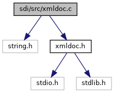

[Macros](#define-members) \| [Functions](#func-members)

`#include <string.h>`
`#include "`<a href="xmldoc_8h_source.md">xmldoc.h</a>`"`

Include dependency graph for xmldoc.c:

|  |  |
|----|----|
| Macros |  |
| #define  | [INDENT](#a502b06aa5ad25116c775d201326bad52)   2 |
| #define  | [YYCTYPE](#ad44df346a68d07dd2420887508f0818f)   char |
| #define  | [YYCURSOR](#a1fcda04b90493a75641fa6299a7e9529)   cursor |
| #define  | [YYLIMIT](#a66de83134d9447c49f1addf533e357c8)   cursor /\* nicht verwendet: 0-Byte markiert das Ende \*/ |
| #define  | [YYMARKER](#ad27f395c8f1fecfe0e33c02787e6a5e8)   marker |
| #define  | [YYFILL](#a9f6301310226eae6a3234c0e6863f0b5)(n) |
| #define  | [RETURN](#a9a16dd7a920f66fe5d85dee94af8eb02)(x)   do { \_this-\>buffer=cursor; <a href="_v_h_q__vfisyspm__wrapper_8cpp.md#abe95a00f8e60264f7043a99eed75eba0">return</a> x; } while(0) |

|  |  |
|----|----|
| Functions |  |
| enum <a href="xmldoc_8h.md#aa5d1bb6cbd537293ccc23cbe090c4256">XMLTokenizer__Encoding</a>  | [XMLTokenizer\_\_readHeader](#a339f65c4da9757075e594656f2f49830) (struct <a href="struct_x_m_l_tokenizer.md">XMLTokenizer</a> \*\_this) |
| enum <a href="xmldoc_8h.md#af1dad427b690336ae7242fcb821b72b5">XMLTokenizer__Token</a>  | [XMLTokenizer\_\_readToken](#ad48dd9dc8bf13108d1ed5c2d0883dbd4) (struct <a href="struct_x_m_l_tokenizer.md">XMLTokenizer</a> \*\_this) |
| void  | [XMLTokenizer\_\_Constructor](#a9fc3816f7fd0dee395ac512d77a421ad) (struct <a href="struct_x_m_l_tokenizer.md">XMLTokenizer</a> \*\_this) |
| void  | [XMLTokenizer\_\_Destructor](#abaa2d9625980042d73c4cda857c4f69f) (struct <a href="struct_x_m_l_tokenizer.md">XMLTokenizer</a> \*\_this) |
| void  | [XMLTokenizer\_\_init](#a090478d7bdf8be57c2b002a01f89d8a0) (struct <a href="struct_x_m_l_tokenizer.md">XMLTokenizer</a> \*\_this, char \*buf, char \*(\*fill)(void \*fill_data), void \*fill_data) |
| enum <a href="xmldoc_8h.md#af1dad427b690336ae7242fcb821b72b5">XMLTokenizer__Token</a>  | [XMLTokenizer\_\_nextToken](#ae86917930a62c406096333658aa8c5e7) (struct <a href="struct_x_m_l_tokenizer.md">XMLTokenizer</a> \*\_this) |
| int  | [XMLDocument\_\_read](#a026359c5968a228e29f0f15d5eb72685) (struct <a href="xmldoc_8h.md#struct_x_m_l_document">XMLDocument</a> \*\_this, char \*buffer) |
| int  | [XMLDocument\_\_read2](#a03f757e5643923bf33a1da56c9e7ce3a) (struct <a href="xmldoc_8h.md#struct_x_m_l_document">XMLDocument</a> \*\_this, char \*buffer, char \*(\*fill)(void \*fill_data), void \*fill_data) |
| int  | [XMLDocument\_\_write](#a2d3843c7695a5eae4e2b31fec4454839) (const struct <a href="xmldoc_8h.md#struct_x_m_l_document">XMLDocument</a> \*\_this, char \*buffer, int size) |
| void  | [XMLNode\_\_Constructor](#af212c35a17d4de7ff19129804ccdba04) (struct <a href="xmldoc_8h.md#struct_x_m_l_node">XMLNode</a> \*\_this, const char \*\_name, const char \*\_value) |
| void  | [XMLNode\_\_Constructor2](#af3cdcab2bf08c585f7ae89045afd9fd6) (struct <a href="xmldoc_8h.md#struct_x_m_l_node">XMLNode</a> \*\_this, const char \*\_name, const char \*\_value, enum <a href="xmldoc_8h.md#aa5d1bb6cbd537293ccc23cbe090c4256">XMLTokenizer__Encoding</a> source_encoding) |
| struct <a href="xmldoc_8h.md#struct_x_m_l_node">XMLNode</a> \*  | [XMLNode\_\_Create](#acffb256c2a6716451e2935b08cb828bd) (const char \*\_name, const char \*\_value) |
| struct <a href="xmldoc_8h.md#struct_x_m_l_node">XMLNode</a> \*  | [XMLNode\_\_Create2](#a89eccae3da2d18f38f32fb72886a0f06) (const char \*\_name, const char \*\_value, enum <a href="xmldoc_8h.md#aa5d1bb6cbd537293ccc23cbe090c4256">XMLTokenizer__Encoding</a> source_encoding) |
| void  | [XMLNode\_\_Destructor](#aa5449a1862f6814f6100c1d616dc0c79) (struct <a href="xmldoc_8h.md#struct_x_m_l_node">XMLNode</a> \*\_this) |
| void  | [XMLNode\_\_Destroy](#a983e13b392bccbee1021abd6b7876a52) (struct <a href="xmldoc_8h.md#struct_x_m_l_node">XMLNode</a> \*\_this) |
| void  | [XMLNode\_\_setName](#aaa2c23abf0f440cfdf5cdaa4ea3493f0) (struct <a href="xmldoc_8h.md#struct_x_m_l_node">XMLNode</a> \*\_this, const char \*\_name) |
| void  | [XMLNode\_\_setValue](#a13dd3a77a8244ee755d86bbf30c8c86e) (struct <a href="xmldoc_8h.md#struct_x_m_l_node">XMLNode</a> \*\_this, const char \*\_value) |
| struct <a href="xmldoc_8h.md#struct_x_m_l_node">XMLNode</a> \*  | [XMLNode\_\_clone](#af06814fd150b2f9681ee0b182cff5288) (const struct <a href="xmldoc_8h.md#struct_x_m_l_node">XMLNode</a> \*\_this, enum <a href="xmldoc_8h.md#ab74ac56ab687317d89ad37db581f534f">XMLNode__CloneMode</a> cm, int clone_successor) |
| int  | [XMLNode\_\_parse](#abaf4b367b59b52380b54c944ed425f90) (struct <a href="xmldoc_8h.md#struct_x_m_l_node">XMLNode</a> \*\_this, const char \*name, struct <a href="struct_x_m_l_tokenizer.md">XMLTokenizer</a> \*t) |
| int  | [XMLNode\_\_write](#acc01a18d71844b4a9b3f73803f3450ab) (struct <a href="xmldoc_8h.md#struct_x_m_l_node">XMLNode</a> \*\_this, char \*buffer, int size, int level, enum <a href="xmldoc_8h.md#aa5d1bb6cbd537293ccc23cbe090c4256">XMLTokenizer__Encoding</a> dest_encoding) |
| void  | [XMLNode\_\_addToContent](#a32a0039eb81696b03b02792427725bdb) (struct <a href="xmldoc_8h.md#struct_x_m_l_node">XMLNode</a> \*\_this, struct <a href="xmldoc_8h.md#struct_x_m_l_node">XMLNode</a> \*node) |
| struct <a href="xmldoc_8h.md#struct_x_m_l_node">XMLNode</a> \*  | [XMLNode\_\_findNode](#af5c3a0bf4d226ce3388d4ad5049a44ab) (struct <a href="xmldoc_8h.md#struct_x_m_l_node">XMLNode</a> \*\_this, const char \*name) |
| void  | [XMLNode\_\_insertNode](#a8b8d6ce6b677fb884fc2ecf71a0d94fb) (struct <a href="xmldoc_8h.md#struct_x_m_l_node">XMLNode</a> \*\_this, const char \*name, struct <a href="xmldoc_8h.md#struct_x_m_l_node">XMLNode</a> \*node) |
| void  | [XMLNode\_\_reorderContent](#adb969bd1c04750d23691516c0a654bde) (struct <a href="xmldoc_8h.md#struct_x_m_l_node">XMLNode</a> \*\_this, const char \*reference\[\]) |
| enum <a href="xmldoc_8h.md#a77b3a9e89ab3f44418d513e422ab184b">XMLNode__NodeType</a>  | [XMLNode\_\_type](#ab2618028f6ea359110aa6e2b90604bb1) (const struct <a href="xmldoc_8h.md#struct_x_m_l_node">XMLNode</a> \*\_this) |
| const char \*  | [XMLNode\_\_getName](#ac78d3fc316e376c991a82e26f193ea53) (const struct <a href="xmldoc_8h.md#struct_x_m_l_node">XMLNode</a> \*\_this) |
| const char \*  | [XMLNode\_\_getValue](#a9f6ebcd5095ef5c64835bff6c3835287) (const struct <a href="xmldoc_8h.md#struct_x_m_l_node">XMLNode</a> \*\_this) |
| void  | [XMLNode\_\_swap](#a9d9fbd613657c10dfec7a2b27bbbe48c) (struct <a href="xmldoc_8h.md#struct_x_m_l_node">XMLNode</a> \*\_this, struct <a href="xmldoc_8h.md#struct_x_m_l_node">XMLNode</a> \*other) |
| void  | [XMLDocument\_\_Constructor](#ac325416dee38262efa72afa6be5a6d56) (struct <a href="xmldoc_8h.md#struct_x_m_l_document">XMLDocument</a> \*\_this, enum <a href="xmldoc_8h.md#aa5d1bb6cbd537293ccc23cbe090c4256">XMLTokenizer__Encoding</a> enc) |
| void  | [XMLDocument\_\_CopyConstructor](#a070550a0b656048cdaf4b0ead9b9cd05) (struct <a href="xmldoc_8h.md#struct_x_m_l_document">XMLDocument</a> \*\_this, const struct <a href="xmldoc_8h.md#struct_x_m_l_document">XMLDocument</a> \*o) |
| struct <a href="xmldoc_8h.md#struct_x_m_l_document">XMLDocument</a> \*  | [XMLDocument\_\_Assign](#a7aa132bbf1a11dc0e53d438b3e9507a7) (struct <a href="xmldoc_8h.md#struct_x_m_l_document">XMLDocument</a> \*\_this, const struct <a href="xmldoc_8h.md#struct_x_m_l_document">XMLDocument</a> \*o) |
| void  | [XMLDocument\_\_Destructor](#afb55c479565dce251504835744b06941) (struct <a href="xmldoc_8h.md#struct_x_m_l_document">XMLDocument</a> \*\_this) |
| void  | [XMLDocument\_\_clear](#a62b82f2718759b0b298755112f6df440) (struct <a href="xmldoc_8h.md#struct_x_m_l_document">XMLDocument</a> \*\_this) |
| struct <a href="xmldoc_8h.md#struct_x_m_l_node">XMLNode</a> \*  | [XMLDocument\_\_findNode](#a2d915117bc9a01980f01a9cfbff8ff45) (struct <a href="xmldoc_8h.md#struct_x_m_l_document">XMLDocument</a> \*\_this, const char \*name) |
| void  | [XMLDocument\_\_insertNode](#a53e0386e50ce88bd181fd84a28391a2e) (struct <a href="xmldoc_8h.md#struct_x_m_l_document">XMLDocument</a> \*\_this, const char \*name, struct <a href="xmldoc_8h.md#struct_x_m_l_node">XMLNode</a> \*node) |
| void  | [XMLDocument\_\_removeNode](#ac491bd43799ebe30d5f51d905a63f477) (struct <a href="xmldoc_8h.md#struct_x_m_l_document">XMLDocument</a> \*\_this, const char \*name) |

## DetailedDescription {#detailed-description}

## MacroDefinition Documentation {#macro-definition-documentation}

## INDENT 

#define INDENT   2

## RETURN 

#define RETURN

## YYCTYPE 

#define YYCTYPE   char

## YYCURSOR 

#define YYCURSOR   cursor

## YYFILL 

#define YYFILL

## YYLIMIT 

#define YYLIMIT   cursor /\* nicht verwendet: 0-Byte markiert das Ende \*/

## YYMARKER 

#define YYMARKER   marker

## FunctionDocumentation {#function-documentation}

## XMLDocument\_\_Assign() 

struct <a href="xmldoc_8h.md#struct_x_m_l_document">XMLDocument</a>\* XMLDocument\_\_Assign

copy operator, performs deep copy of contained nodes

**Parameters**

\[in,out\] **\_this** this object \[in\] **o** object to be copied

## XMLDocument\_\_clear() 

void XMLDocument\_\_clear

remove all contents from the XML-document

## XMLDocument\_\_Constructor() 

void XMLDocument\_\_Constructor

constructor

**Parameters**

\[in,out\] **\_this** this object \[in\] **enc** encoding that should be used internally

## XMLDocument\_\_CopyConstructor() 

void XMLDocument\_\_CopyConstructor

copy constructor, performs deep copy of contained nodes

**Parameters**

\[in,out\] **\_this** this object \[in\] **o** object to be copied

## XMLDocument\_\_Destructor() 

void XMLDocument\_\_Destructor

destructor

**Parameters**

\[in,out\] **\_this** this object

## XMLDocument\_\_findNode() 

struct <a href="xmldoc_8h.md#struct_x_m_l_node">XMLNode</a>\* XMLDocument\_\_findNode

find node

**Parameters**

\[in,out\] **\_this** this object \[in\] **name** path of the node (see XMLDocument)

### Returns

node if found or NULL

### Seealso {#see-also}

Path description

## XMLDocument\_\_insertNode() 

void XMLDocument\_\_insertNode

Insert a node. If a node already exists that matches the path the node is replaced. Note that the name of the new node is not taken from the path, therefore, `insertNode`(\"a/b\",new <a href="xmldoc_8h.md#struct_x_m_l_node">XMLNode</a>(\"c\",0)) will remove node `b` and insert a node with name `c`! If a node is to be appended to a node, use \...\<path\>/+. If components of the path do not exist, they are created as simple nodes, e.g. inserting with the path a/b/c/+ will create nodes a, b and c if they do not already exist.

**Parameters**

\[in,out\] **\_this** this object \[in\] **name** path of the node (see XMLDocument) \[in\] **node** to be inserted or 0 to remove and delete a node (removeNode())

### Seealso {#see-also-1}

Path description

## XMLDocument\_\_read() 

int XMLDocument\_\_read

read an XML-document from a 0-terminated buffer

**Parameters**

\[in,out\] **\_this** this object \[in\] **buffer** XML-document

### Returns

\[unsupported block\]

## XMLDocument\_\_read2() 

int XMLDocument\_\_read2

read an XML-document from a 0-terminated buffer. Large XML documents may be split after \'\>\' into several parts. When a part is completely read, fill() is called. fill() must return a 0-terminated buffer for the respective next part. It is important that the splitting can only be done after a \'\>\' to not confuse the parser.

**Parameters**

\[in,out\] **\_this** this object \[in\] **buffer** XML-document \[in\] **fill** callback function that is called when the end of the buffer is encountered \[in\] **fill_data** parameter for the callback function

### Returns

\[unsupported block\]

## XMLDocument\_\_removeNode() 

void XMLDocument\_\_removeNode

remove node

**Parameters**

\[in,out\] **\_this** this object \[in\] **name** path of the node

### Seealso {#see-also-2}

Path description

## XMLDocument\_\_write() 

int XMLDocument\_\_write

write an XML-document as 0-terminated string to a buffer.

**Parameters**

\[in,out\] **\_this** this object \[out\] **buffer** buffer \[in\] **size** size of the buffer

### Returns

number of written bytes without the trailing 0 or -1, if the buffer was too small

## XMLNode\_\_addToContent() 

void XMLNode\_\_addToContent

append a node to the content list

**Parameters**

\[in,out\] **\_this** this object \[in\] **node** node to append

## XMLNode\_\_clone() 

struct <a href="xmldoc_8h.md#struct_x_m_l_node">XMLNode</a>\* XMLNode\_\_clone

clone a node including its content

**Parameters**

\[in,out\] **\_this** this object \[in\] **cm** mode: clone all (XMLNode\_\_CLONE_ALL) or clone only the attributes (XMLNode\_\_CLONE_ATTRIBUTE) \[in\] **clone_successor** used for recursion, should be initially set to 0

### Returns

pointer to cloned node

## XMLNode\_\_Constructor() 

void XMLNode\_\_Constructor

constructor

**Parameters**

\[out\] **\_this** this pointer \[in\] **\_name** name of the node \[in\] **\_value** value contained in the node

## XMLNode\_\_Constructor2() 

void XMLNode\_\_Constructor2

constructor, the input value is converted to internal representation

**Parameters**

\[out\] **\_this** this pointer \[in\] **\_name** name of the node \[in\] **\_value** value contained in the node \[in\] **source_encoding** encoding scheme of \_value

## XMLNode\_\_Create() 

struct <a href="xmldoc_8h.md#struct_x_m_l_node">XMLNode</a>\* XMLNode\_\_Create

allocate and initialize a new <a href="xmldoc_8h.md#struct_x_m_l_node">XMLNode</a> (shortcut for malloc + XMLNode\_\_Constructor)

**Parameters**

\[in\] **\_name** name of the node \[in\] **\_value** value contained in the node

### Returns

allocated object or 0 if no memory could be allocated

## XMLNode\_\_Create2() 

struct <a href="xmldoc_8h.md#struct_x_m_l_node">XMLNode</a>\* XMLNode\_\_Create2

allocate and initialize a new <a href="xmldoc_8h.md#struct_x_m_l_node">XMLNode</a> (shortcut for malloc + XMLNode\_\_Constructor2)

**Parameters**

\[in\] **\_name** name of the node \[in\] **\_value** value contained in the node \[in\] **source_encoding** encoding scheme of \_value

### Returns

allocated object or 0 if no memory could be allocated

## XMLNode\_\_Destroy() 

void XMLNode\_\_Destroy

short cut for XMLNode\_\_Destructor + free

**Parameters**

\[in\] **\_this** object to be released

## XMLNode\_\_Destructor() 

void XMLNode\_\_Destructor

destructor

**Parameters**

\[in,out\] **\_this** this object

## XMLNode\_\_findNode() 

struct <a href="xmldoc_8h.md#struct_x_m_l_node">XMLNode</a>\* XMLNode\_\_findNode

search for a node inside this node

**Parameters**

\[in,out\] **\_this** this object \[in\] **name** path of the node relative to this node (see XMLDocument)

### Returns

node if found or NULL

### Seealso {#see-also-3}

Path description

## XMLNode\_\_getName() 

const char\* XMLNode\_\_getName

access name

**Parameters**

\[in,out\] **\_this** this object

### Returns

name

## XMLNode\_\_getValue() 

const char\* XMLNode\_\_getValue

access value (text)

**Parameters**

\[in,out\] **\_this** this object

### Returns

value

## XMLNode\_\_insertNode() 

void XMLNode\_\_insertNode

Insert a node. If a node already exists that matches the path the node is replaced. Note that the name of the new node is not taken from the path, therefore, `insertNode`(\"a/b\",new <a href="xmldoc_8h.md#struct_x_m_l_node">XMLNode</a>(\"c\",0)) will remove node `b` and insert a node with name `c`! If a node is to be appended to a node, use \...\<path\>/+. If components of the path do not exist, they are created as simple nodes, e.g. inserting with the path a/b/c/+ will create nodes a, b and c if they do not already exist.

**Parameters**

\[in,out\] **\_this** this object \[in\] **name** path of the node (see XMLDocument) \[in\] **node** to be inserted or 0 to remove and delete a node (removeNode())

### Seealso {#see-also-4}

Path description

## XMLNode\_\_parse() 

int XMLNode\_\_parse

Parser. The tokens are read from the <a href="struct_x_m_l_tokenizer.md">XMLTokenizer</a>. The parsing stops, if an end-node with name *name* is found.

**Parameters**

\[in,out\] **\_this** this object \[in\] **name** of the current node to be parsed \[in\] **t** tokenizer

### Returns

\[unsupported block\]

## XMLNode\_\_reorderContent() 

void XMLNode\_\_reorderContent

reorder content according to an ordering an a reference table

**Parameters**

\[in,out\] **\_this** this object \[in\] **reference** null-pointer terminated string array with a reference ordering of the nodes


nodes not found in reference are moved to the end


## XMLNode\_\_setName() 

void XMLNode\_\_setName

set name

**Parameters**

\[in,out\] **\_this** this object \[in\] **\_name** name

## XMLNode\_\_setValue() 

void XMLNode\_\_setValue

set value

**Parameters**

\[in,out\] **\_this** this object \[in\] **\_value** value (text)

## XMLNode\_\_swap() 

void XMLNode\_\_swap

swap contents with another node

**Parameters**

\[in,out\] **\_this** this object \[in,out\] **other** other node with which to swapt the content

## XMLNode\_\_type() 

enum <a href="xmldoc_8h.md#a77b3a9e89ab3f44418d513e422ab184b">XMLNode__NodeType</a> XMLNode\_\_type

determine the type of node by the combinations of name and value

**Parameters**

\[in,out\] **\_this** this object

### Returns

type of node, one of <a href="xmldoc_8h.md#a77b3a9e89ab3f44418d513e422ab184babcc735431fa4199b0f7ebe3df45ca99a">XMLNode__ATTRIBUTE</a>, <a href="xmldoc_8h.md#a77b3a9e89ab3f44418d513e422ab184baf4c5a5fa113d0c3cf13e51c07d15534d">XMLNode__NODE</a>, <a href="xmldoc_8h.md#a77b3a9e89ab3f44418d513e422ab184ba4ad21b9cb57b3ce307ad13654c872df3">XMLNode__VALUE</a>, <a href="xmldoc_8h.md#a77b3a9e89ab3f44418d513e422ab184badbfadf399207fd928ca7abd2c64c44bf">XMLNode__ROOT</a>

### Seealso {#see-also-5}

<a href="xmldoc_8h.md#struct_x_m_l_node">XMLNode</a>

## XMLNode\_\_write() 

int XMLNode\_\_write

write XML-code.

**Parameters**

\[in,out\] **\_this** this object \[out\] **buffer** buffer \[in\] **size** size of the buffer \[in\] **level** level used for indentation \[in\] **dest_encoding** destination encoding

### Returns

number of bytes written without trailing 0-byte or -1 if the buffer was too small.

## XMLTokenizer\_\_Constructor() 

void XMLTokenizer\_\_Constructor

constructor. Default encoding is UTF-8

**Parameters**

\[in,out\] **\_this** this object

## XMLTokenizer\_\_Destructor() 

void XMLTokenizer\_\_Destructor

destructor

**Parameters**

\[in,out\] **\_this** this object

## XMLTokenizer\_\_init() 

void XMLTokenizer\_\_init

sets the buffer to be parsed

**Parameters**

\[in,out\] **\_this** this object \[in\] **buf** 0-terminated buffer, it will be modified temporarily \[in\] **fill** callback function that is called when the end of the buffer is encountered \[in\] **fill_data** parameter for the callback function

## XMLTokenizer\_\_nextToken() 

enum <a href="xmldoc_8h.md#af1dad427b690336ae7242fcb821b72b5">XMLTokenizer__Token</a> XMLTokenizer\_\_nextToken

read the next token from the buffer. Temporarily terminate name and value with 0-byte. The next call to nextToken() will revert this modification (and will 0-terminate the next token)

**Parameters**

\[in,out\] **\_this** this object

### Returns

Token object containing name and value of the token

## XMLTokenizer\_\_readHeader() 

enum <a href="xmldoc_8h.md#aa5d1bb6cbd537293ccc23cbe090c4256">XMLTokenizer__Encoding</a> XMLTokenizer\_\_readHeader

read XML-header and extract the encoding. If no encoding is contained ISO-Latin-9 is assumed

**Parameters**

\[in,out\] **\_this** this object

### Returns

encoding

## XMLTokenizer\_\_readToken() 

enum <a href="xmldoc_8h.md#af1dad427b690336ae7242fcb821b72b5">XMLTokenizer__Token</a> XMLTokenizer\_\_readToken

read one token from the XML-buffer and fill in name/name_len and value/value_len

**Parameters**

\[in,out\] **\_this** this object

### Returns

Token
