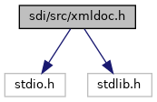
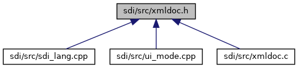
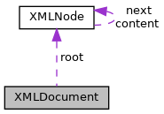

[Data Structures](#nested-classes) \| [Enumerations](#enum-members) \| [Functions](#func-members)

`#include <stdio.h>`
`#include <stdlib.h>`

Include dependency graph for xmldoc.h:



This graph shows which files directly or indirectly include this file:



<a href="xmldoc_8h_source.md">Go to the source code of this file.</a>

|  |  |
|----|----|
| Data Structures |  |
| struct   | <a href="struct_x_m_l_tokenizer.md">XMLTokenizer</a> |
| struct   | [XMLNode](#struct_x_m_l_node) |
| class   | [XMLDocument](#struct_x_m_l_document) |
|   | class for reading/writing/modifying XML documents. [More\...](#struct_x_m_l_document)<br/> |

|  |  |
|----|----|
| Enumerations |  |
| enum   | [XMLTokenizer\_\_Encoding](#aa5d1bb6cbd537293ccc23cbe090c4256) { [XMLTokenizer\_\_UTF8](#aa5d1bb6cbd537293ccc23cbe090c4256ae8756d1bc015e7b229929384786d2407), [XMLTokenizer\_\_ISOLATIN1](#aa5d1bb6cbd537293ccc23cbe090c4256a1c63fd884b88afdfdb4858cc4d9ad965), [XMLTokenizer\_\_ISOLATIN9](#aa5d1bb6cbd537293ccc23cbe090c4256afa6e3f8d10c0132fe07811efae4e9445) } |
| enum   | [XMLTokenizer\_\_Token](#af1dad427b690336ae7242fcb821b72b5) {<br/>  [XMLTokenizer\_\_DONE](#af1dad427b690336ae7242fcb821b72b5ac18fdad4ac373b212707f4e2ebad0edd), [XMLTokenizer\_\_TEXT](#af1dad427b690336ae7242fcb821b72b5a237ed6d77d76eed146e8e527cdbbd227), [XMLTokenizer\_\_START_NODE](#af1dad427b690336ae7242fcb821b72b5a41901fb1bf85ff996b4afcd3207dc28e), [XMLTokenizer\_\_STOP_NODE](#af1dad427b690336ae7242fcb821b72b5ad233690baf215779b4a1800a13b533ee),<br/>  [XMLTokenizer\_\_EMPTY_NODE](#af1dad427b690336ae7242fcb821b72b5a30c2b783533ff30603fd1c6464ab4b2f), [XMLTokenizer\_\_NODE_DONE](#af1dad427b690336ae7242fcb821b72b5afd96bfc4d811b8814771732135dbbddd), [XMLTokenizer\_\_ATTRIBUTE](#af1dad427b690336ae7242fcb821b72b5a166f0758540be626d6ebc6f2c7ab21eb), [XMLTokenizer\_\_SYNTAX_ERROR](#af1dad427b690336ae7242fcb821b72b5acc1d095ce009291394b512df60dacf0e)<br/>} |
| enum   | [XMLNode\_\_NodeType](#a77b3a9e89ab3f44418d513e422ab184b) {<br/>  [XMLNode\_\_ROOT](#a77b3a9e89ab3f44418d513e422ab184badbfadf399207fd928ca7abd2c64c44bf), [XMLNode\_\_NODE](#a77b3a9e89ab3f44418d513e422ab184baf4c5a5fa113d0c3cf13e51c07d15534d), [XMLNode\_\_ATTRIBUTE](#a77b3a9e89ab3f44418d513e422ab184babcc735431fa4199b0f7ebe3df45ca99a), [XMLNode\_\_VALUE](#a77b3a9e89ab3f44418d513e422ab184ba4ad21b9cb57b3ce307ad13654c872df3),<br/>  [XMLNode\_\_ANY](#a77b3a9e89ab3f44418d513e422ab184ba1fc16b58cf3bd861f6ec99a6c462fff8)<br/>} |
| enum   | [XMLNode\_\_CloneMode](#ab74ac56ab687317d89ad37db581f534f) { [XMLNode\_\_CLONE_ALL](#ab74ac56ab687317d89ad37db581f534fa34883e20446154c2734d1a397d4edb60), [XMLNode\_\_CLONE_ATTRIBUTE](#ab74ac56ab687317d89ad37db581f534fadeeec6c46436092330b1acce17a26b7d) } |

|  |  |
|----|----|
| Functions |  |
| enum [XMLTokenizer\_\_Encoding](#aa5d1bb6cbd537293ccc23cbe090c4256)  | [XMLTokenizer\_\_readHeader](#a339f65c4da9757075e594656f2f49830) (struct <a href="struct_x_m_l_tokenizer.md">XMLTokenizer</a> \*\_this) |
| enum [XMLTokenizer\_\_Token](#af1dad427b690336ae7242fcb821b72b5)  | [XMLTokenizer\_\_readToken](#ad48dd9dc8bf13108d1ed5c2d0883dbd4) (struct <a href="struct_x_m_l_tokenizer.md">XMLTokenizer</a> \*\_this) |
| void  | [XMLTokenizer\_\_Constructor](#a9fc3816f7fd0dee395ac512d77a421ad) (struct <a href="struct_x_m_l_tokenizer.md">XMLTokenizer</a> \*\_this) |
| void  | [XMLTokenizer\_\_Destructor](#abaa2d9625980042d73c4cda857c4f69f) (struct <a href="struct_x_m_l_tokenizer.md">XMLTokenizer</a> \*\_this) |
| void  | [XMLTokenizer\_\_init](#a45a5d97dad060d59affa300a2d1474f1) (struct <a href="struct_x_m_l_tokenizer.md">XMLTokenizer</a> \*\_this, char \*buffer, char \*(\*fill)(void \*fill_data), void \*fill_data) |
| enum [XMLTokenizer\_\_Token](#af1dad427b690336ae7242fcb821b72b5)  | [XMLTokenizer\_\_nextToken](#ae86917930a62c406096333658aa8c5e7) (struct <a href="struct_x_m_l_tokenizer.md">XMLTokenizer</a> \*\_this) |
| void  | [XMLNode\_\_Constructor](#af212c35a17d4de7ff19129804ccdba04) (struct [XMLNode](#struct_x_m_l_node) \*\_this, const char \*\_name, const char \*\_value) |
| void  | [XMLNode\_\_Constructor2](#af3cdcab2bf08c585f7ae89045afd9fd6) (struct [XMLNode](#struct_x_m_l_node) \*\_this, const char \*\_name, const char \*\_value, enum [XMLTokenizer\_\_Encoding](#aa5d1bb6cbd537293ccc23cbe090c4256) source_encoding) |
| struct [XMLNode](#struct_x_m_l_node) \*  | [XMLNode\_\_Create](#acffb256c2a6716451e2935b08cb828bd) (const char \*\_name, const char \*\_value) |
| struct [XMLNode](#struct_x_m_l_node) \*  | [XMLNode\_\_Create2](#a89eccae3da2d18f38f32fb72886a0f06) (const char \*\_name, const char \*\_value, enum [XMLTokenizer\_\_Encoding](#aa5d1bb6cbd537293ccc23cbe090c4256) source_encoding) |
| void  | [XMLNode\_\_Destructor](#aa5449a1862f6814f6100c1d616dc0c79) (struct [XMLNode](#struct_x_m_l_node) \*\_this) |
| void  | [XMLNode\_\_Destroy](#a983e13b392bccbee1021abd6b7876a52) (struct [XMLNode](#struct_x_m_l_node) \*\_this) |
| int  | [XMLNode\_\_parse](#abaf4b367b59b52380b54c944ed425f90) (struct [XMLNode](#struct_x_m_l_node) \*\_this, const char \*name, struct <a href="struct_x_m_l_tokenizer.md">XMLTokenizer</a> \*t) |
| int  | [XMLNode\_\_write](#acc01a18d71844b4a9b3f73803f3450ab) (struct [XMLNode](#struct_x_m_l_node) \*\_this, char \*buffer, int size, int level, enum [XMLTokenizer\_\_Encoding](#aa5d1bb6cbd537293ccc23cbe090c4256) dest_encoding) |
| void  | [XMLNode\_\_addToContent](#a32a0039eb81696b03b02792427725bdb) (struct [XMLNode](#struct_x_m_l_node) \*\_this, struct [XMLNode](#struct_x_m_l_node) \*node) |
| void  | [XMLNode\_\_dump](#a33b5a3a7f01824f543efb8a2e7ad98fa) (struct [XMLNode](#struct_x_m_l_node) \*\_this, FILE \*, int level) |
| struct [XMLNode](#struct_x_m_l_node) \*  | [XMLNode\_\_findNode](#af5c3a0bf4d226ce3388d4ad5049a44ab) (struct [XMLNode](#struct_x_m_l_node) \*\_this, const char \*name) |
| void  | [XMLNode\_\_insertNode](#a8b8d6ce6b677fb884fc2ecf71a0d94fb) (struct [XMLNode](#struct_x_m_l_node) \*\_this, const char \*name, struct [XMLNode](#struct_x_m_l_node) \*node) |
| enum [XMLNode\_\_NodeType](#a77b3a9e89ab3f44418d513e422ab184b)  | [XMLNode\_\_type](#ab2618028f6ea359110aa6e2b90604bb1) (const struct [XMLNode](#struct_x_m_l_node) \*\_this) |
| const char \*  | [XMLNode\_\_getName](#ac78d3fc316e376c991a82e26f193ea53) (const struct [XMLNode](#struct_x_m_l_node) \*\_this) |
| const char \*  | [XMLNode\_\_getValue](#a9f6ebcd5095ef5c64835bff6c3835287) (const struct [XMLNode](#struct_x_m_l_node) \*\_this) |
| void  | [XMLNode\_\_setName](#aaa2c23abf0f440cfdf5cdaa4ea3493f0) (struct [XMLNode](#struct_x_m_l_node) \*\_this, const char \*\_name) |
| void  | [XMLNode\_\_setValue](#a13dd3a77a8244ee755d86bbf30c8c86e) (struct [XMLNode](#struct_x_m_l_node) \*\_this, const char \*\_value) |
| struct [XMLNode](#struct_x_m_l_node) \*  | [XMLNode\_\_clone](#af06814fd150b2f9681ee0b182cff5288) (const struct [XMLNode](#struct_x_m_l_node) \*\_this, enum [XMLNode\_\_CloneMode](#ab74ac56ab687317d89ad37db581f534f) cm, int clone_successor) |
| void  | [XMLNode\_\_swap](#a9d9fbd613657c10dfec7a2b27bbbe48c) (struct [XMLNode](#struct_x_m_l_node) \*\_this, struct [XMLNode](#struct_x_m_l_node) \*other) |
| void  | [XMLNode\_\_reorderContent](#adb969bd1c04750d23691516c0a654bde) (struct [XMLNode](#struct_x_m_l_node) \*\_this, const char \*reference\[\]) |
| void  | [XMLDocument\_\_Constructor](#ac325416dee38262efa72afa6be5a6d56) (struct [XMLDocument](#struct_x_m_l_document) \*\_this, enum [XMLTokenizer\_\_Encoding](#aa5d1bb6cbd537293ccc23cbe090c4256) enc) |
| void  | [XMLDocument\_\_CopyConstructor](#a070550a0b656048cdaf4b0ead9b9cd05) (struct [XMLDocument](#struct_x_m_l_document) \*\_this, const struct [XMLDocument](#struct_x_m_l_document) \*o) |
| struct [XMLDocument](#struct_x_m_l_document) \*  | [XMLDocument\_\_Assign](#a7aa132bbf1a11dc0e53d438b3e9507a7) (struct [XMLDocument](#struct_x_m_l_document) \*\_this, const struct [XMLDocument](#struct_x_m_l_document) \*o) |
| void  | [XMLDocument\_\_Destructor](#afb55c479565dce251504835744b06941) (struct [XMLDocument](#struct_x_m_l_document) \*\_this) |
| void  | [XMLDocument\_\_clear](#a62b82f2718759b0b298755112f6df440) (struct [XMLDocument](#struct_x_m_l_document) \*\_this) |
| int  | [XMLDocument\_\_read](#adf71fa00428d0e3c1a17089dcdae8da8) (struct [XMLDocument](#struct_x_m_l_document) \*\_this, char \*) |
| int  | [XMLDocument\_\_write](#a46709e880aa6e241ba09961ee0be2879) (const struct [XMLDocument](#struct_x_m_l_document) \*\_this, char \*, int size) |
| void  | [XMLDocument\_\_dump](#a019432e1050f439aa4897b1744713789) (struct [XMLDocument](#struct_x_m_l_document) \*\_this, FILE \*) |
| struct [XMLNode](#struct_x_m_l_node) \*  | [XMLDocument\_\_findNode](#a2d915117bc9a01980f01a9cfbff8ff45) (struct [XMLDocument](#struct_x_m_l_document) \*\_this, const char \*name) |
| void  | [XMLDocument\_\_insertNode](#a53e0386e50ce88bd181fd84a28391a2e) (struct [XMLDocument](#struct_x_m_l_document) \*\_this, const char \*name, struct [XMLNode](#struct_x_m_l_node) \*node) |
| void  | [XMLDocument\_\_removeNode](#ac491bd43799ebe30d5f51d905a63f477) (struct [XMLDocument](#struct_x_m_l_document) \*\_this, const char \*name) |

------------------------------------------------------------------------

## DataStructure Documentation {#data-structure-documentation}

## XMLNode <a href="#struct_x_m_l_node" id="struct_x_m_l_node"></a>

<p>struct XMLNode</p>

node for storing XML information. The different types of nodes are represented by the different combinations of set and unset name and value pointer:

- **name==0 value==0:** root node

- **name!=0 value==0:** node

- **name!=0 value!=0:** attribute

- **name==0 value!=0:** text

  ### Seealso {#see-also}

  <a href="xmldoc_8c.md#ab2618028f6ea359110aa6e2b90604bb1">XMLNode__type()</a>

Collaboration diagram for XMLNode:


\[<a href="graph_legend.md">legend</a>\]

| Data Fields |  |  |
|----|----|----|
| struct [XMLNode](#struct_x_m_l_node) \* | content | <p>pointer to the sub nodes that belong to the content of this node</p> |
| char \* | name | <p>name of the node</p> |
| struct [XMLNode](#struct_x_m_l_node) \* | next | <p>pointer to the next node of the same level, used for chaining nodes</p> |
| char \* | value | <p>value of the node (attribute value or node content)</p> |

## XMLDocument <a href="#struct_x_m_l_document" id="struct_x_m_l_document"></a>

<p>class XMLDocument</p>

class for reading/writing/modifying XML documents.

[XMLDocument](#struct_x_m_l_document "class for reading/writing/modifying XML documents.") is a class for reading/writing/modifying XML documents. The document is internally stored as a tree. Path names are used to access nodes within this tree. the path names have one of the following forms:

` <node-name>/<node-name>/<node-name>/...`

node-name may be one of:

- `node-name`: refers to the first node with the given name
- `node-name#n:` refers to the (n+1)-th node with the given name, i.e. `node-name` is equivalent to `node-name#0`
- `*`: refers to the first node with any name
- `*#n:` refers to the (n+1)-th node with any name
- `#n:` refers to the (n+1)-th node with an empty name, i.e. a text node

Note that when using `*#n` no matching with backtracking is performed. For example take the following XML-fragment:

``` fragment
<a/>
<b>text</b>
```

`*``/#0` does not match any nodes, since \* matches `a` and `a` has no child nodes.

Collaboration diagram for XMLDocument:



\[<a href="graph_legend.md">legend</a>\]

| Data Fields |  |  |
|----|----|----|
| enum [XMLTokenizer\_\_Encoding](#aa5d1bb6cbd537293ccc23cbe090c4256) | encoding |  |
| struct [XMLNode](#struct_x_m_l_node) \* | root |  |

## EnumerationType Documentation {#enumeration-type-documentation}

## XMLNode\_\_CloneMode <a href="#ab74ac56ab687317d89ad37db581f534f" id="ab74ac56ab687317d89ad37db581f534f"></a>

<p>enum [XMLNode\_\_CloneMode](#ab74ac56ab687317d89ad37db581f534f)</p>

| Enumerator                  |     |
|-----------------------------|-----|
| XMLNode\_\_CLONE_ALL        |     |
| XMLNode\_\_CLONE_ATTRIBUTE  |     |

## XMLNode\_\_NodeType <a href="#a77b3a9e89ab3f44418d513e422ab184b" id="a77b3a9e89ab3f44418d513e422ab184b"></a>

<p>enum [XMLNode\_\_NodeType](#a77b3a9e89ab3f44418d513e422ab184b)</p>

type of a node

| Enumerator            |                                                     |
|-----------------------|-----------------------------------------------------|
| XMLNode\_\_ROOT       | <p>root node</p>                  |
| XMLNode\_\_NODE       | <p>plain node, e.g. \<foo\></p>   |
| XMLNode\_\_ATTRIBUTE  | <p>attribute e.g. foo=\"bar\"</p> |
| XMLNode\_\_VALUE      | <p>content text</p>               |
| XMLNode\_\_ANY        |                                                     |

## XMLTokenizer\_\_Encoding <a href="#aa5d1bb6cbd537293ccc23cbe090c4256" id="aa5d1bb6cbd537293ccc23cbe090c4256"></a>

<p>enum [XMLTokenizer\_\_Encoding](#aa5d1bb6cbd537293ccc23cbe090c4256)</p>

| Enumerator                 |     |
|----------------------------|-----|
| XMLTokenizer\_\_UTF8       |     |
| XMLTokenizer\_\_ISOLATIN1  |     |
| XMLTokenizer\_\_ISOLATIN9  |     |

## XMLTokenizer\_\_Token <a href="#af1dad427b690336ae7242fcb821b72b5" id="af1dad427b690336ae7242fcb821b72b5"></a>

<p>enum [XMLTokenizer\_\_Token](#af1dad427b690336ae7242fcb821b72b5)</p>

tokens recognized by <a href="struct_x_m_l_tokenizer.md">XMLTokenizer</a>

| Enumerator |  |
|----|----|
| XMLTokenizer\_\_DONE  | <p>end of buffer</p> |
| XMLTokenizer\_\_TEXT  | <p>text node</p> |
| XMLTokenizer\_\_START_NODE  | <p>begin of start node, e.g. \<name</p> |
| XMLTokenizer\_\_STOP_NODE  | <p>end node, e.g. \</name\></p> |
| XMLTokenizer\_\_EMPTY_NODE  | <p>node was empty, e.g. \<name/\></p> |
| XMLTokenizer\_\_NODE_DONE  | <p>\> of the start node has been reached</p> |
| XMLTokenizer\_\_ATTRIBUTE  | <p>attribute name-value pair</p> |
| XMLTokenizer\_\_SYNTAX_ERROR  | <p>syntax error</p> |

## FunctionDocumentation {#function-documentation}

## XMLDocument\_\_Assign() <a href="#a7aa132bbf1a11dc0e53d438b3e9507a7" id="a7aa132bbf1a11dc0e53d438b3e9507a7"></a>

<p>struct [XMLDocument](#struct_x_m_l_document)\* XMLDocument\_\_Assign</p>

copy operator, performs deep copy of contained nodes

**Parameters**

\[in,out\] **\_this** this object \[in\] **o** object to be copied

## XMLDocument\_\_clear() <a href="#a62b82f2718759b0b298755112f6df440" id="a62b82f2718759b0b298755112f6df440"></a>

<p>void XMLDocument\_\_clear</p>

remove all contents from the XML-document

## XMLDocument\_\_Constructor() <a href="#ac325416dee38262efa72afa6be5a6d56" id="ac325416dee38262efa72afa6be5a6d56"></a>

<p>void XMLDocument\_\_Constructor</p>

constructor

**Parameters**

\[in,out\] **\_this** this object \[in\] **enc** encoding that should be used internally

## XMLDocument\_\_CopyConstructor() <a href="#a070550a0b656048cdaf4b0ead9b9cd05" id="a070550a0b656048cdaf4b0ead9b9cd05"></a>

<p>void XMLDocument\_\_CopyConstructor</p>

copy constructor, performs deep copy of contained nodes

**Parameters**

\[in,out\] **\_this** this object \[in\] **o** object to be copied

## XMLDocument\_\_Destructor() <a href="#afb55c479565dce251504835744b06941" id="afb55c479565dce251504835744b06941"></a>

<p>void XMLDocument\_\_Destructor</p>

destructor

**Parameters**

\[in,out\] **\_this** this object

## XMLDocument\_\_dump() <a href="#a019432e1050f439aa4897b1744713789" id="a019432e1050f439aa4897b1744713789"></a>

<p>void XMLDocument\_\_dump</p>

## XMLDocument\_\_findNode() <a href="#a2d915117bc9a01980f01a9cfbff8ff45" id="a2d915117bc9a01980f01a9cfbff8ff45"></a>

<p>struct [XMLNode](#struct_x_m_l_node)\* XMLDocument\_\_findNode</p>

find node

**Parameters**

\[in,out\] **\_this** this object \[in\] **name** path of the node (see XMLDocument)

### Returns

node if found or NULL

### Seealso {#see-also-1}

Path description

## XMLDocument\_\_insertNode() <a href="#a53e0386e50ce88bd181fd84a28391a2e" id="a53e0386e50ce88bd181fd84a28391a2e"></a>

<p>void XMLDocument\_\_insertNode</p>

Insert a node. If a node already exists that matches the path the node is replaced. Note that the name of the new node is not taken from the path, therefore, `insertNode`(\"a/b\",new [XMLNode](#struct_x_m_l_node)(\"c\",0)) will remove node `b` and insert a node with name `c`! If a node is to be appended to a node, use \...\<path\>/+. If components of the path do not exist, they are created as simple nodes, e.g. inserting with the path a/b/c/+ will create nodes a, b and c if they do not already exist.

**Parameters**

\[in,out\] **\_this** this object \[in\] **name** path of the node (see XMLDocument) \[in\] **node** to be inserted or 0 to remove and delete a node (removeNode())

### Seealso {#see-also-2}

Path description

## XMLDocument\_\_read() <a href="#adf71fa00428d0e3c1a17089dcdae8da8" id="adf71fa00428d0e3c1a17089dcdae8da8"></a>

<p>int XMLDocument\_\_read</p>

read an XML-document from a 0-terminated buffer

**Parameters**

\[in,out\] **\_this** this object \[in\] **buffer** XML-document

### Returns

\[unsupported block\]

## XMLDocument\_\_removeNode() <a href="#ac491bd43799ebe30d5f51d905a63f477" id="ac491bd43799ebe30d5f51d905a63f477"></a>

<p>void XMLDocument\_\_removeNode</p>

remove node

**Parameters**

\[in,out\] **\_this** this object \[in\] **name** path of the node

### Seealso {#see-also-3}

Path description

## XMLDocument\_\_write() <a href="#a46709e880aa6e241ba09961ee0be2879" id="a46709e880aa6e241ba09961ee0be2879"></a>

<p>int XMLDocument\_\_write</p>

write an XML-document as 0-terminated string to a buffer.

**Parameters**

\[in,out\] **\_this** this object \[out\] **buffer** buffer \[in\] **size** size of the buffer

### Returns

number of written bytes without the trailing 0 or -1, if the buffer was too small

## XMLNode\_\_addToContent() <a href="#a32a0039eb81696b03b02792427725bdb" id="a32a0039eb81696b03b02792427725bdb"></a>

<p>void XMLNode\_\_addToContent</p>

append a node to the content list

**Parameters**

\[in,out\] **\_this** this object \[in\] **node** node to append

## XMLNode\_\_clone() <a href="#af06814fd150b2f9681ee0b182cff5288" id="af06814fd150b2f9681ee0b182cff5288"></a>

<p>struct [XMLNode](#struct_x_m_l_node)\* XMLNode\_\_clone</p>

clone a node including its content

**Parameters**

\[in,out\] **\_this** this object \[in\] **cm** mode: clone all (XMLNode\_\_CLONE_ALL) or clone only the attributes (XMLNode\_\_CLONE_ATTRIBUTE) \[in\] **clone_successor** used for recursion, should be initially set to 0

### Returns

pointer to cloned node

## XMLNode\_\_Constructor() <a href="#af212c35a17d4de7ff19129804ccdba04" id="af212c35a17d4de7ff19129804ccdba04"></a>

<p>void XMLNode\_\_Constructor</p>

constructor

**Parameters**

\[out\] **\_this** this pointer \[in\] **\_name** name of the node \[in\] **\_value** value contained in the node

## XMLNode\_\_Constructor2() <a href="#af3cdcab2bf08c585f7ae89045afd9fd6" id="af3cdcab2bf08c585f7ae89045afd9fd6"></a>

<p>void XMLNode\_\_Constructor2</p>

constructor, the input value is converted to internal representation

**Parameters**

\[out\] **\_this** this pointer \[in\] **\_name** name of the node \[in\] **\_value** value contained in the node \[in\] **source_encoding** encoding scheme of \_value

## XMLNode\_\_Create() <a href="#acffb256c2a6716451e2935b08cb828bd" id="acffb256c2a6716451e2935b08cb828bd"></a>

<p>struct [XMLNode](#struct_x_m_l_node)\* XMLNode\_\_Create</p>

allocate and initialize a new [XMLNode](#struct_x_m_l_node) (shortcut for malloc + XMLNode\_\_Constructor)

**Parameters**

\[in\] **\_name** name of the node \[in\] **\_value** value contained in the node

### Returns

allocated object or 0 if no memory could be allocated

## XMLNode\_\_Create2() <a href="#a89eccae3da2d18f38f32fb72886a0f06" id="a89eccae3da2d18f38f32fb72886a0f06"></a>

<p>struct [XMLNode](#struct_x_m_l_node)\* XMLNode\_\_Create2</p>

allocate and initialize a new [XMLNode](#struct_x_m_l_node) (shortcut for malloc + XMLNode\_\_Constructor2)

**Parameters**

\[in\] **\_name** name of the node \[in\] **\_value** value contained in the node \[in\] **source_encoding** encoding scheme of \_value

### Returns

allocated object or 0 if no memory could be allocated

## XMLNode\_\_Destroy() <a href="#a983e13b392bccbee1021abd6b7876a52" id="a983e13b392bccbee1021abd6b7876a52"></a>

<p>void XMLNode\_\_Destroy</p>

short cut for XMLNode\_\_Destructor + free

**Parameters**

\[in\] **\_this** object to be released

## XMLNode\_\_Destructor() <a href="#aa5449a1862f6814f6100c1d616dc0c79" id="aa5449a1862f6814f6100c1d616dc0c79"></a>

<p>void XMLNode\_\_Destructor</p>

destructor

**Parameters**

\[in,out\] **\_this** this object

## XMLNode\_\_dump() <a href="#a33b5a3a7f01824f543efb8a2e7ad98fa" id="a33b5a3a7f01824f543efb8a2e7ad98fa"></a>

<p>void XMLNode\_\_dump</p>

## XMLNode\_\_findNode() <a href="#af5c3a0bf4d226ce3388d4ad5049a44ab" id="af5c3a0bf4d226ce3388d4ad5049a44ab"></a>

<p>struct [XMLNode](#struct_x_m_l_node)\* XMLNode\_\_findNode</p>

search for a node inside this node

**Parameters**

\[in,out\] **\_this** this object \[in\] **name** path of the node relative to this node (see XMLDocument)

### Returns

node if found or NULL

### Seealso {#see-also-4}

Path description

## XMLNode\_\_getName() <a href="#ac78d3fc316e376c991a82e26f193ea53" id="ac78d3fc316e376c991a82e26f193ea53"></a>

<p>const char\* XMLNode\_\_getName</p>

access name

**Parameters**

\[in,out\] **\_this** this object

### Returns

name

## XMLNode\_\_getValue() <a href="#a9f6ebcd5095ef5c64835bff6c3835287" id="a9f6ebcd5095ef5c64835bff6c3835287"></a>

<p>const char\* XMLNode\_\_getValue</p>

access value (text)

**Parameters**

\[in,out\] **\_this** this object

### Returns

value

## XMLNode\_\_insertNode() <a href="#a8b8d6ce6b677fb884fc2ecf71a0d94fb" id="a8b8d6ce6b677fb884fc2ecf71a0d94fb"></a>

<p>void XMLNode\_\_insertNode</p>

Insert a node. If a node already exists that matches the path the node is replaced. Note that the name of the new node is not taken from the path, therefore, `insertNode`(\"a/b\",new [XMLNode](#struct_x_m_l_node)(\"c\",0)) will remove node `b` and insert a node with name `c`! If a node is to be appended to a node, use \...\<path\>/+. If components of the path do not exist, they are created as simple nodes, e.g. inserting with the path a/b/c/+ will create nodes a, b and c if they do not already exist.

**Parameters**

\[in,out\] **\_this** this object \[in\] **name** path of the node (see XMLDocument) \[in\] **node** to be inserted or 0 to remove and delete a node (removeNode())

### Seealso {#see-also-5}

Path description

## XMLNode\_\_parse() <a href="#abaf4b367b59b52380b54c944ed425f90" id="abaf4b367b59b52380b54c944ed425f90"></a>

<p>int XMLNode\_\_parse</p>

Parser. The tokens are read from the <a href="struct_x_m_l_tokenizer.md">XMLTokenizer</a>. The parsing stops, if an end-node with name *name* is found.

**Parameters**

\[in,out\] **\_this** this object \[in\] **name** of the current node to be parsed \[in\] **t** tokenizer

### Returns

\[unsupported block\]

## XMLNode\_\_reorderContent() <a href="#adb969bd1c04750d23691516c0a654bde" id="adb969bd1c04750d23691516c0a654bde"></a>

<p>void XMLNode\_\_reorderContent</p>

reorder content according to an ordering an a reference table

**Parameters**

\[in,out\] **\_this** this object \[in\] **reference** null-pointer terminated string array with a reference ordering of the nodes



nodes not found in reference are moved to the end


## XMLNode\_\_setName() <a href="#aaa2c23abf0f440cfdf5cdaa4ea3493f0" id="aaa2c23abf0f440cfdf5cdaa4ea3493f0"></a>

<p>void XMLNode\_\_setName</p>

set name

**Parameters**

\[in,out\] **\_this** this object \[in\] **\_name** name

## XMLNode\_\_setValue() <a href="#a13dd3a77a8244ee755d86bbf30c8c86e" id="a13dd3a77a8244ee755d86bbf30c8c86e"></a>

<p>void XMLNode\_\_setValue</p>

set value

**Parameters**

\[in,out\] **\_this** this object \[in\] **\_value** value (text)

## XMLNode\_\_swap() <a href="#a9d9fbd613657c10dfec7a2b27bbbe48c" id="a9d9fbd613657c10dfec7a2b27bbbe48c"></a>

<p>void XMLNode\_\_swap</p>

swap contents with another node

**Parameters**

\[in,out\] **\_this** this object \[in,out\] **other** other node with which to swapt the content

## XMLNode\_\_type() <a href="#ab2618028f6ea359110aa6e2b90604bb1" id="ab2618028f6ea359110aa6e2b90604bb1"></a>

<p>enum [XMLNode\_\_NodeType](#a77b3a9e89ab3f44418d513e422ab184b) XMLNode\_\_type</p>

determine the type of node by the combinations of name and value

**Parameters**

\[in,out\] **\_this** this object

### Returns

type of node, one of [XMLNode\_\_ATTRIBUTE](#a77b3a9e89ab3f44418d513e422ab184babcc735431fa4199b0f7ebe3df45ca99a), [XMLNode\_\_NODE](#a77b3a9e89ab3f44418d513e422ab184baf4c5a5fa113d0c3cf13e51c07d15534d), [XMLNode\_\_VALUE](#a77b3a9e89ab3f44418d513e422ab184ba4ad21b9cb57b3ce307ad13654c872df3), [XMLNode\_\_ROOT](#a77b3a9e89ab3f44418d513e422ab184badbfadf399207fd928ca7abd2c64c44bf)

### Seealso {#see-also-6}

[XMLNode](#struct_x_m_l_node)

## XMLNode\_\_write() <a href="#acc01a18d71844b4a9b3f73803f3450ab" id="acc01a18d71844b4a9b3f73803f3450ab"></a>

<p>int XMLNode\_\_write</p>

write XML-code.

**Parameters**

\[in,out\] **\_this** this object \[out\] **buffer** buffer \[in\] **size** size of the buffer \[in\] **level** level used for indentation \[in\] **dest_encoding** destination encoding

### Returns

number of bytes written without trailing 0-byte or -1 if the buffer was too small.

## XMLTokenizer\_\_Constructor() <a href="#a9fc3816f7fd0dee395ac512d77a421ad" id="a9fc3816f7fd0dee395ac512d77a421ad"></a>

<p>void XMLTokenizer\_\_Constructor</p>

constructor. Default encoding is UTF-8

**Parameters**

\[in,out\] **\_this** this object

## XMLTokenizer\_\_Destructor() <a href="#abaa2d9625980042d73c4cda857c4f69f" id="abaa2d9625980042d73c4cda857c4f69f"></a>

<p>void XMLTokenizer\_\_Destructor</p>

destructor

**Parameters**

\[in,out\] **\_this** this object

## XMLTokenizer\_\_init() <a href="#a45a5d97dad060d59affa300a2d1474f1" id="a45a5d97dad060d59affa300a2d1474f1"></a>

<p>void XMLTokenizer\_\_init</p>

sets the buffer to be parsed

**Parameters**

\[in,out\] **\_this** this object \[in\] **buf** 0-terminated buffer, it will be modified temporarily \[in\] **fill** callback function that is called when the end of the buffer is encountered \[in\] **fill_data** parameter for the callback function

## XMLTokenizer\_\_nextToken() <a href="#ae86917930a62c406096333658aa8c5e7" id="ae86917930a62c406096333658aa8c5e7"></a>

<p>enum [XMLTokenizer\_\_Token](#af1dad427b690336ae7242fcb821b72b5) XMLTokenizer\_\_nextToken</p>

read the next token from the buffer. Temporarily terminate name and value with 0-byte. The next call to nextToken() will revert this modification (and will 0-terminate the next token)

**Parameters**

\[in,out\] **\_this** this object

### Returns

Token object containing name and value of the token

## XMLTokenizer\_\_readHeader() <a href="#a339f65c4da9757075e594656f2f49830" id="a339f65c4da9757075e594656f2f49830"></a>

<p>enum [XMLTokenizer\_\_Encoding](#aa5d1bb6cbd537293ccc23cbe090c4256) XMLTokenizer\_\_readHeader</p>

read XML-header and extract the encoding. If no encoding is contained ISO-Latin-9 is assumed

**Parameters**

\[in,out\] **\_this** this object

### Returns

encoding

## XMLTokenizer\_\_readToken() <a href="#ad48dd9dc8bf13108d1ed5c2d0883dbd4" id="ad48dd9dc8bf13108d1ed5c2d0883dbd4"></a>

<p>enum [XMLTokenizer\_\_Token](#af1dad427b690336ae7242fcb821b72b5) XMLTokenizer\_\_readToken</p>

read one token from the XML-buffer and fill in name/name_len and value/value_len

**Parameters**

\[in,out\] **\_this** this object

### Returns

Token
